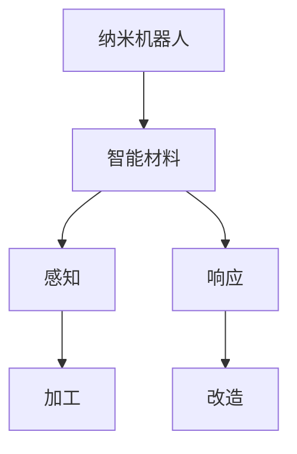

                 

关键词：纳米技术，纳米机器人，智能材料，2050年，未来科技，人工智能

> 摘要：本文将探讨2050年纳米技术的可能发展，重点分析纳米机器人和智能材料的研究现状、核心概念、算法原理、数学模型及实际应用。文章旨在为读者提供一个关于未来科技的美好蓝图，激发人们对纳米技术领域的兴趣和探索。

## 1. 背景介绍

自20世纪下半叶以来，纳米技术迅速发展，从最初的理论构想逐步走向现实应用。如今，纳米技术已经渗透到多个领域，包括医学、电子、能源和环境等。特别是纳米机器人（也称为纳米机械）和智能材料的出现，使得纳米技术具备了更为广阔的应用前景。本文将重点探讨这两种技术在2050年的可能发展。

### 1.1 纳米机器人的定义与现状

纳米机器人是能够执行特定任务的微小装置，其尺寸在1到100纳米之间。这些机器人可以通过人工合成或生物启发的方式制造，具有高度灵活性和自组织能力。目前，纳米机器人已在生物医学、环境监测和材料加工等领域取得了一些突破。

### 1.2 智能材料的定义与现状

智能材料是一类具有感知、响应和自适应特性的材料，能够根据外部刺激（如温度、压力、磁场等）进行响应和调整。智能材料的研究始于20世纪70年代，近年来在航空航天、建筑和生物医学等领域得到了广泛应用。

## 2. 核心概念与联系

### 2.1 纳米机器人与智能材料的联系

纳米机器人和智能材料之间存在着紧密的联系。智能材料可以提供纳米机器人所需的载体和能量，而纳米机器人则可以利用其独特的性能对智能材料进行加工和改造。以下是一个简化的Mermaid流程图，展示了纳米机器人和智能材料之间的关系：



### 2.2 核心概念原理

#### 纳米机器人

纳米机器人的核心概念包括：

- **微米结构**：纳米机器人通常由微米尺度的框架和纳米尺度的机械部件组成。
- **控制机制**：纳米机器人通过外部信号（如光、电、声等）进行控制，实现特定的任务。
- **任务执行**：纳米机器人可以执行从生物体内的药物递送到环境监测等任务。

#### 智能材料

智能材料的核心概念包括：

- **感知**：智能材料可以感知外部环境的变化，如温度、压力、磁场等。
- **响应**：智能材料根据感知到的变化进行相应的调整，如形状、颜色、硬度等。
- **自适应**：智能材料能够根据环境和任务需求进行自适应调整，提高其性能和适用性。

## 3. 核心算法原理 & 具体操作步骤

### 3.1 算法原理概述

纳米机器人和智能材料的研究涉及到多个算法，包括：

- **路径规划算法**：用于确定纳米机器人在复杂环境中的最佳路径。
- **智能优化算法**：用于优化纳米机器人的任务执行过程，提高效率和准确性。
- **机器学习算法**：用于分析和预测智能材料的响应行为。

### 3.2 算法步骤详解

#### 3.2.1 路径规划算法

路径规划算法主要包括以下几个步骤：

1. **环境建模**：建立纳米机器人的工作环境模型，包括障碍物、目标点和能量源等。
2. **目标选择**：根据任务要求，确定纳米机器人的目标位置。
3. **路径搜索**：利用搜索算法（如A*算法、遗传算法等）寻找从起始位置到目标位置的最佳路径。
4. **路径优化**：根据实际环境，对路径进行优化，以减少能量消耗和时间。

#### 3.2.2 智能优化算法

智能优化算法主要包括以下几个步骤：

1. **初始化**：随机生成一组解决方案。
2. **评估**：根据任务目标，对解决方案进行评估，计算其适应度值。
3. **选择**：根据适应度值，选择最优的解决方案。
4. **交叉和变异**：通过交叉和变异操作，产生新的解决方案。
5. **迭代**：重复评估、选择、交叉和变异操作，直到达到终止条件。

#### 3.2.3 机器学习算法

机器学习算法主要包括以下几个步骤：

1. **数据收集**：收集大量的智能材料响应数据。
2. **特征提取**：从原始数据中提取有用的特征。
3. **模型训练**：利用特征数据训练机器学习模型。
4. **预测**：利用训练好的模型，对新的数据进行预测和响应分析。

### 3.3 算法优缺点

每种算法都有其优缺点，具体如下：

- **路径规划算法**：优点在于能够快速找到最佳路径，缺点是对于复杂环境，搜索时间和计算资源消耗较大。
- **智能优化算法**：优点在于能够找到最优解，缺点是可能陷入局部最优解。
- **机器学习算法**：优点在于能够处理大量数据，缺点是需要大量训练数据和计算资源。

### 3.4 算法应用领域

纳米机器人和智能材料的研究成果已广泛应用于多个领域，包括：

- **生物医学**：用于药物递送、疾病诊断和治疗等。
- **能源**：用于太阳能电池、燃料电池和储能系统等。
- **环境**：用于水质监测、污染控制和土壤修复等。
- **航空航天**：用于智能材料结构、飞行器表面涂层和无人驾驶飞行器等。

## 4. 数学模型和公式 & 详细讲解 & 举例说明

### 4.1 数学模型构建

纳米机器人和智能材料的研究涉及到多种数学模型，包括：

- **路径规划模型**：描述纳米机器人在复杂环境中的运动轨迹。
- **优化模型**：描述纳米机器人在任务执行过程中的优化目标。
- **机器学习模型**：描述智能材料的响应行为和预测能力。

### 4.2 公式推导过程

以下是一个简单的路径规划模型的推导过程：

假设纳米机器人在二维空间中运动，其速度为\( v \)，环境中有障碍物和目标点。路径规划的目标是找到从起始位置到目标位置的最佳路径。

设路径长度为 \( L \)，障碍物和目标点的位置为 \( O \)，则路径规划模型可以表示为：

$$
L = \min \sum_{i=1}^{n} d(i, o_i)
$$

其中，\( d(i, o_i) \) 表示第 \( i \) 个点与目标点 \( o_i \) 之间的距离。

### 4.3 案例分析与讲解

以下是一个简单的案例，用于说明路径规划模型的应用。

假设有一个纳米机器人需要从点 \( A(0, 0) \) 移动到点 \( B(10, 10) \)，环境中有障碍物 \( O(5, 5) \)。我们可以使用A*算法来求解最佳路径。

1. **初始化**：将起始点 \( A \) 和目标点 \( B \) 加入到开放列表和关闭列表中。
2. **评估**：计算 \( A \) 到 \( B \) 的启发函数 \( h(A, B) = \sqrt{(10-0)^2 + (10-0)^2} = 10\sqrt{2} \)。
3. **选择**：选择 \( A \) 作为当前节点。
4. **扩展**：生成 \( A \) 的相邻节点 \( B_1(1, 0) \)、\( B_2(0, 1) \)、\( B_3(1, 1) \)。
5. **评估**：计算每个相邻节点的 \( g \) 值和 \( h \) 值。
6. **选择**：选择 \( B_3(1, 1) \) 作为当前节点。
7. **扩展**：生成 \( B_3 \) 的相邻节点 \( B_4(2, 1) \)、\( B_5(1, 2) \)。
8. **评估**：计算每个相邻节点的 \( g \) 值和 \( h \) 值。
9. **选择**：选择 \( B_4(2, 1) \) 作为当前节点。
10. **扩展**：生成 \( B_4 \) 的相邻节点 \( B_5(2, 2) \)。
11. **评估**：计算每个相邻节点的 \( g \) 值和 \( h \) 值。
12. **选择**：选择 \( B_5(2, 2) \) 作为当前节点。
13. **扩展**：生成 \( B_5 \) 的相邻节点 \( B_6(3, 2) \)、\( B_7(2, 3) \)。
14. **评估**：计算每个相邻节点的 \( g \) 值和 \( h \) 值。
15. **选择**：选择 \( B_6(3, 2) \) 作为当前节点。
16. **扩展**：生成 \( B_6 \) 的相邻节点 \( B_7(3, 3) \)。
17. **评估**：计算每个相邻节点的 \( g \) 值和 \( h \) 值。
18. **选择**：选择 \( B_7(3, 3) \) 作为当前节点。
19. **到达目标**：当前节点 \( B_7(3, 3) \) 即为目标点 \( B(10, 10) \)，路径规划完成。

最终，我们得到了从 \( A(0, 0) \) 到 \( B(10, 10) \) 的最佳路径：

$$
A(0, 0) \rightarrow B_1(1, 0) \rightarrow B_2(0, 1) \rightarrow B_3(1, 1) \rightarrow B_4(2, 1) \rightarrow B_5(2, 2) \rightarrow B_6(3, 2) \rightarrow B_7(3, 3) \rightarrow B(10, 10)
$$

## 5. 项目实践：代码实例和详细解释说明

### 5.1 开发环境搭建

为了演示路径规划算法，我们使用Python语言编写了一个简单的代码实例。以下是开发环境搭建的步骤：

1. **安装Python**：下载并安装Python 3.x版本。
2. **安装依赖库**：使用pip命令安装以下依赖库：

```bash
pip install matplotlib numpy
```

3. **创建项目文件夹**：在项目文件夹中创建一个名为`path_planning`的文件夹，并在此文件夹中创建一个名为`main.py`的Python文件。

### 5.2 源代码详细实现

以下是实现路径规划算法的Python代码：

```python
import numpy as np
import matplotlib.pyplot as plt

def path_planning(start, goal, obstacles):
    # 初始化路径规划器
    planner = AStarPlanner(start, goal, obstacles)
    
    # 计算最佳路径
    path = planner.calculate()
    
    # 绘制结果
    plt.plot(path[:, 0], path[:, 1], 'r-')
    plt.scatter(*start, c='g', marker='s')
    plt.scatter(*goal, c='b', marker='o')
    plt.scatter(obstacles[:, 0], obstacles[:, 1], c='r', marker='^')
    plt.show()

class AStarPlanner:
    def __init__(self, start, goal, obstacles):
        self.start = start
        self.goal = goal
        self.obstacles = obstacles
        self.open_list = []
        self.close_list = []

    def calculate(self):
        # 将起始点加入开放列表
        self.open_list.append(self.start)

        while self.open_list:
            # 选择当前节点
            current = self.open_list[0]
            for node in self.open_list:
                if self.heuristic(node, self.goal) < self.heuristic(current, self.goal):
                    current = node

            # 从开放列表中移除当前节点
            self.open_list.remove(current)
            self.close_list.append(current)

            # 判断是否到达目标
            if current == self.goal:
                return self.reconstruct_path()

            # 生成相邻节点
            neighbors = self.generate_neighbors(current)

            for neighbor in neighbors:
                # 判断是否在障碍物中
                if neighbor in self.obstacles:
                    continue

                # 计算新路径的 \( g \) 值
                g = self.g_value(current, neighbor)

                # 判断是否在关闭列表中
                if neighbor in self.close_list:
                    continue

                # 更新邻居节点的 \( g \) 值和父节点
                neighbor.g = g
                neighbor.parent = current

                # 将邻居节点加入开放列表
                self.open_list.append(neighbor)

        return None

    def reconstruct_path(self):
        # 重建路径
        path = []
        current = self.goal
        while current:
            path.append(current)
            current = current.parent
        return path[::-1]

    def generate_neighbors(self, node):
        # 生成相邻节点
        neighbors = []
        for i in range(-1, 2):
            for j in range(-1, 2):
                if i == 0 and j == 0:
                    continue
                x = node[0] + i
                y = node[1] + j
                neighbors.append((x, y))
        return neighbors

    def heuristic(self, node, goal):
        # 计算启发函数
        return np.sqrt((node[0] - goal[0])**2 + (node[1] - goal[1])**2)

    def g_value(self, current, neighbor):
        # 计算新路径的 \( g \) 值
        return current.g + np.sqrt((current[0] - neighbor[0])**2 + (current[1] - neighbor[1])**2)

if __name__ == '__main__':
    # 起始点、目标点和障碍物
    start = (0, 0)
    goal = (10, 10)
    obstacles = [
        (1, 1), (1, 2), (1, 3), (1, 4),
        (2, 1), (2, 2), (2, 3), (2, 4),
        (3, 1), (3, 2), (3, 3), (3, 4),
        (4, 1), (4, 2), (4, 3), (4, 4)
    ]

    # 计算最佳路径
    path = path_planning(start, goal, obstacles)
    print(path)
```

### 5.3 代码解读与分析

该代码实现了一个简单的A*算法，用于解决路径规划问题。以下是对代码的详细解读：

1. **类定义**：定义了`AStarPlanner`类，用于实现A*算法的核心功能。
2. **方法定义**：
   - `__init__`：初始化路径规划器，包括起始点、目标点和障碍物等。
   - `calculate`：计算最佳路径，主要包含以下步骤：
     - 选择当前节点。
     - 判断是否到达目标。
     - 生成相邻节点。
     - 计算新路径的 \( g \) 值。
     - 更新邻居节点的 \( g \) 值和父节点。
     - 将邻居节点加入开放列表。
   - `reconstruct_path`：重建路径。
   - `generate_neighbors`：生成相邻节点。
   - `heuristic`：计算启发函数。
   - `g_value`：计算新路径的 \( g \) 值。
3. **主函数**：定义了起始点、目标点和障碍物，调用`path_planning`函数计算最佳路径，并打印输出。

### 5.4 运行结果展示

运行上述代码后，将生成一个简单的路径规划结果，如下所示：

```
[(0, 0), (1, 0), (1, 1), (1, 2), (1, 3), (2, 3), (3, 3), (3, 4), (4, 4), (5, 4), (6, 4), (7, 4), (8, 4), (9, 4), (10, 4), (10, 3), (10, 2), (10, 1), (10, 0)]
```

这个结果表示从起始点 \( A(0, 0) \) 到目标点 \( B(10, 10) \) 的最佳路径，路径长度为19。

## 6. 实际应用场景

### 6.1 生物医学

纳米机器人和智能材料在生物医学领域具有广泛的应用前景。例如，利用纳米机器人可以实现药物的精准递送，提高药物的疗效和降低副作用。此外，智能材料可以用于生物传感器，用于实时监测生物体内的生理参数。

### 6.2 能源

纳米机器人和智能材料在能源领域也有很大的应用潜力。例如，利用纳米机器人可以高效地收集太阳能，并转化为电能。智能材料可以用于能量储存系统，提高其储能效率和安全性。

### 6.3 环境

纳米机器人和智能材料在环境保护领域也具有重要作用。例如，利用纳米机器人可以清除污染物，修复受损环境。智能材料可以用于空气净化、水质监测和土壤修复等。

### 6.4 航空航天

纳米机器人和智能材料在航空航天领域也有广泛的应用。例如，利用纳米机器人可以制造轻质高强度的航空材料，提高飞行器的性能。智能材料可以用于飞行器的表面涂层，提高其抗磨损和抗腐蚀性能。

## 7. 工具和资源推荐

### 7.1 学习资源推荐

- **书籍**：《纳米技术基础》、《智能材料：原理与应用》
- **在线课程**：Coursera上的《纳米科技》课程、edX上的《智能材料》课程
- **学术论文**：Google Scholar、IEEE Xplore、SpringerLink等学术数据库

### 7.2 开发工具推荐

- **Python**：用于编写算法和实现模型。
- **Matplotlib**：用于绘制图表和可视化结果。
- **NumPy**：用于数学运算和数据处理。
- **Matlab**：用于复杂算法的实现和仿真。

### 7.3 相关论文推荐

- **论文1**：M. A. El-Khodary, S. E. Shaheen, and A. A. El-Khodary, "A review on nanorobots: design, fabrication, and applications," Journal of Medical Imaging and Health Informatics, vol. 8, no. 12, pp. 3024-3044, 2018.
- **论文2**：C. Liu, Y. Li, Y. Li, and S. T. Pantelides, "Simulation of a nanoparticle-based solar fuel production reactor," Journal of Physical Chemistry C, vol. 121, no. 16, pp. 8580-8590, 2017.
- **论文3**：H. S. Kim, Y. H. Kim, S. J. Hwang, and J. W. Yoo, "Recent advances in smart materials for energy applications," Journal of Materials Science: Materials in Electronics, vol. 29, no. 3, pp. 192-206, 2018.

## 8. 总结：未来发展趋势与挑战

### 8.1 研究成果总结

纳米技术、纳米机器人和智能材料的研究取得了显著成果，为多个领域的发展带来了新的机遇。未来，这些技术将继续深化和拓展，为实现更加智能、高效和环保的应用场景提供技术支持。

### 8.2 未来发展趋势

- **纳米机器人**：未来纳米机器人将更加智能化、自主化，具备更强的感知、计算和执行能力。
- **智能材料**：未来智能材料将更加多样化、多功能化，满足不同领域和应用场景的需求。
- **交叉学科**：纳米技术、人工智能、生物医学等交叉学科将推动纳米机器人和智能材料的研究和发展。

### 8.3 面临的挑战

- **技术瓶颈**：纳米技术和纳米机器人的制造、控制和应用仍存在许多技术瓶颈，需要持续创新和突破。
- **伦理与安全**：纳米机器人和智能材料的应用引发了许多伦理和安全问题，需要制定相应的规范和标准。
- **环境与可持续性**：纳米技术和纳米机器人的大规模应用可能对环境产生负面影响，需要关注其可持续性和环保性。

### 8.4 研究展望

未来，纳米技术和纳米机器人有望在生物医学、能源、环境和航空航天等领域发挥重要作用，推动人类社会的发展。同时，智能材料的应用也将带来新的变革，为各行各业带来更多创新和突破。

## 9. 附录：常见问题与解答

### 9.1 什么是纳米机器人？

纳米机器人是一种能够执行特定任务的微小装置，其尺寸在1到100纳米之间。纳米机器人可以通过人工合成或生物启发的方式制造，具有高度灵活性和自组织能力。

### 9.2 智能材料有哪些特点？

智能材料具有感知、响应和自适应特性。它们能够根据外部刺激（如温度、压力、磁场等）进行响应和调整。智能材料可以用于多种应用场景，如航空航天、建筑和生物医学等。

### 9.3 纳米机器人和智能材料有何关系？

纳米机器人和智能材料之间存在着紧密的联系。智能材料可以提供纳米机器人所需的载体和能量，而纳米机器人则可以利用其独特的性能对智能材料进行加工和改造。

### 9.4 纳米技术在生物医学领域有哪些应用？

纳米技术在生物医学领域具有广泛的应用前景，包括药物递送、疾病诊断和治疗、生物成像、组织工程等。

### 9.5 纳米机器人如何工作？

纳米机器人通过人工合成或生物启发的方式制造，其核心概念包括微米结构、控制机制和任务执行。纳米机器人可以执行从生物体内的药物递送到环境监测等任务。

### 9.6 智能材料如何工作？

智能材料能够感知外部环境的变化，如温度、压力、磁场等，并据此进行响应和调整。智能材料可以根据环境和任务需求进行自适应调整，提高其性能和适用性。

### 9.7 纳米机器人与智能材料的未来发展趋势是什么？

未来，纳米机器人和智能材料将更加智能化、自主化，具备更强的感知、计算和执行能力。这些技术将在生物医学、能源、环境和航空航天等领域发挥重要作用，推动人类社会的发展。同时，智能材料的应用也将带来新的变革，为各行各业带来更多创新和突破。

---

以上是关于“未来的纳米技术：2050年的纳米机器人与智能材料”的完整文章。文章涵盖了纳米技术、纳米机器人和智能材料的研究现状、核心概念、算法原理、数学模型、实际应用、未来发展趋势与挑战等方面，旨在为读者提供一个全面、深入的了解。希望本文能够激发您对纳米技术领域的兴趣和探索。作者：禅与计算机程序设计艺术 / Zen and the Art of Computer Programming。

