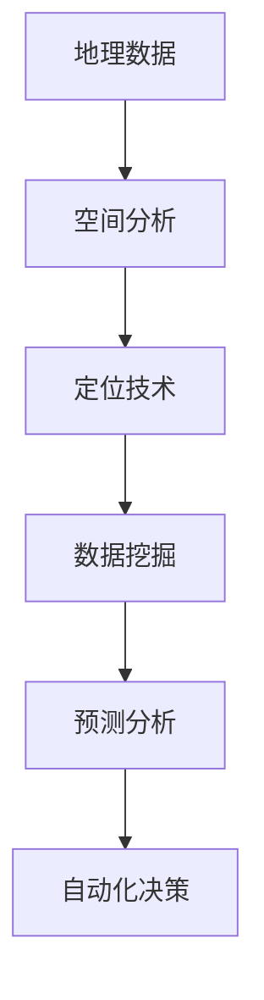

                 

关键词：本地化服务、AI地理智能、技术博客、深度学习、定位算法、数据处理、用户体验

> 摘要：本文将探讨如何利用人工智能技术提升地理智能在本地化服务中的应用。我们将深入分析核心概念、算法原理、数学模型，并通过项目实践和实际应用场景展示AI地理智能的强大潜力。

## 1. 背景介绍

在当今全球化的背景下，本地化服务成为了企业和商家的重要战略。无论是电商平台、餐饮外卖、打车服务，还是旅游出行，本地化服务都已成为用户日常生活中的重要组成部分。而这一切的实现离不开地理智能的支持。地理智能是通过地理信息系统（GIS）和定位技术，将地理位置信息与数据处理和分析相结合，以提供个性化、精准化的服务。

然而，传统的地理智能服务往往存在数据精度不足、响应速度慢、用户体验差等问题。随着人工智能技术的发展，AI地理智能逐渐成为一种新的解决方案。它利用机器学习和深度学习算法，提高地理数据的处理效率和准确性，为用户提供更加智能化的服务体验。

本文将围绕AI地理智能的核心概念、算法原理、数学模型以及项目实践，深入探讨其在本地化服务中的应用和未来发展趋势。

## 2. 核心概念与联系

### 2.1 地理智能的基本概念

地理智能是指将地理位置信息与各种数据源进行整合和分析，以实现对现实世界的理解和预测。它包括以下几个核心概念：

- **地理数据**：包括地图数据、定位数据、交通数据等，是地理智能的基础。
- **空间分析**：通过地理数据，对地理现象进行分类、查询、分析等操作。
- **定位技术**：利用GPS、北斗等定位技术，获取地理位置信息。

### 2.2 人工智能在地理智能中的应用

人工智能在地理智能中的应用主要体现在以下几个方面：

- **数据挖掘**：通过机器学习算法，从大量地理数据中提取有价值的信息。
- **预测分析**：利用深度学习算法，对地理现象进行预测和分析。
- **自动化决策**：基于地理数据和预测结果，实现自动化决策和优化。

### 2.3 核心概念原理和架构

以下是一个简化的地理智能架构图，展示了核心概念和联系：



## 3. 核心算法原理 & 具体操作步骤

### 3.1 算法原理概述

地理智能的核心算法主要分为以下几类：

- **定位算法**：如GPS定位、RTK定位等，用于获取高精度的地理位置信息。
- **路径规划算法**：如A*算法、Dijkstra算法等，用于计算最优路径。
- **聚类算法**：如K-means算法、DBSCAN算法等，用于地理数据的分类和分析。
- **深度学习算法**：如卷积神经网络（CNN）、循环神经网络（RNN）等，用于地理数据的分析和预测。

### 3.2 算法步骤详解

以下是地理智能算法的基本步骤：

1. **数据收集与预处理**：收集地图数据、定位数据、交通数据等，并进行数据清洗、去重、格式化等预处理操作。
2. **空间分析**：根据业务需求，对地理数据进行空间分析，如地图渲染、空间查询等。
3. **路径规划**：根据用户需求和交通数据，计算最优路径。
4. **聚类分析**：对地理数据进行聚类分析，如人口密度分析、商业热点分析等。
5. **预测分析**：利用机器学习算法，对地理现象进行预测和分析。
6. **自动化决策**：根据预测结果，实现自动化决策和优化。

### 3.3 算法优缺点

不同类型的算法在地理智能中各有优缺点：

- **定位算法**：优点是精度高、实时性强，缺点是受环境影响较大。
- **路径规划算法**：优点是计算速度快、路径可靠性高，缺点是对于动态交通情况适应性较差。
- **聚类算法**：优点是能够有效地发现地理现象的分布规律，缺点是对噪声敏感。
- **深度学习算法**：优点是能够处理复杂的非线性关系，缺点是计算成本高、训练时间长。

### 3.4 算法应用领域

地理智能算法广泛应用于以下领域：

- **交通规划**：如实时路况监测、公共交通优化等。
- **城市规划**：如人口密度分析、商业布局优化等。
- **智慧物流**：如路线优化、配送优化等。
- **智慧旅游**：如景点推荐、旅游路线规划等。
- **智慧城市**：如环境监测、公共安全等。

## 4. 数学模型和公式 & 详细讲解 & 举例说明

### 4.1 数学模型构建

地理智能中的数学模型主要包括以下几个部分：

1. **定位模型**：如GPS定位模型，基于三角测量原理，利用卫星信号计算接收器位置。
2. **路径规划模型**：如A*算法，基于启发式搜索，寻找最优路径。
3. **聚类模型**：如K-means算法，基于距离度量，将数据分为若干个簇。
4. **预测模型**：如时间序列模型，基于历史数据，预测未来趋势。

### 4.2 公式推导过程

以下是A*算法的公式推导：

1. **初始状态**：计算起点和终点之间的初始距离，设为 $d(s, g) = g - s$，其中 $s$ 和 $g$ 分别为起点和终点坐标。
2. **启发式函数**：计算从起点到终点的估计距离，设为 $h(n) = g - n$，其中 $n$ 为当前节点坐标。
3. **评估函数**：计算当前节点的评估值，设为 $f(n) = g + h(n)$，其中 $g$ 为当前节点到终点的距离，$h(n)$ 为当前节点到终点的估计距离。
4. **更新过程**：在每个迭代步骤，选择评估值最小的节点进行扩展，直到找到终点。

### 4.3 案例分析与讲解

以下是一个简单的路径规划案例：

假设起点坐标为 $(0, 0)$，终点坐标为 $(10, 10)$，地图上每个节点的移动代价为 1。使用A*算法计算从起点到终点的最优路径。

1. **初始状态**：计算起点和终点之间的初始距离，$d(s, g) = 10$。
2. **启发式函数**：计算从起点到终点的估计距离，$h(n) = 10$。
3. **评估函数**：计算当前节点的评估值，$f(n) = 10$。
4. **更新过程**：选择评估值最小的节点进行扩展，依次扩展节点 $(0, 1)$、$(1, 0)$、$(1, 1)$，直到找到终点 $(10, 10)$。

最优路径为：$(0, 0) \rightarrow (0, 1) \rightarrow (1, 1) \rightarrow (1, 2) \rightarrow \ldots \rightarrow (10, 10)$。

## 5. 项目实践：代码实例和详细解释说明

### 5.1 开发环境搭建

为了演示地理智能的应用，我们将使用Python编程语言，结合OpenCV、Pandas、NumPy等库，实现一个简单的路径规划项目。以下是开发环境搭建步骤：

1. 安装Python：前往Python官网下载并安装Python 3.8及以上版本。
2. 安装相关库：打开命令行窗口，依次执行以下命令：
   ```
   pip install opencv-python
   pip install pandas
   pip install numpy
   ```

### 5.2 源代码详细实现

以下是实现路径规划的Python代码：

```python
import cv2
import numpy as np
import pandas as pd

def read_map(filename):
    with open(filename, 'r') as f:
        lines = f.readlines()
    df = pd.DataFrame([line.strip().split(',') for line in lines], columns=['x', 'y', 'value'])
    return df

def a_star_search(df, start, end):
    closed_set = set()
    open_set = [(0, start)]
    g_score = {start: 0}
    f_score = {start: heuristic(end, start)}
    came_from = {}

    while open_set:
        current = min(open_set, key=lambda x: f_score[x[0]])
        open_set.remove((current, current))
        closed_set.add(current)

        if current == end:
            break

        for neighbor in df[df['x'] == current[0]]['y'].unique():
            if (current, neighbor) in closed_set:
                continue

            tentative_g_score = g_score[current] + 1
            if (neighbor, neighbor) not in g_score or tentative_g_score < g_score[neighbor, neighbor]:
                came_from[neighbor, neighbor] = current
                g_score[neighbor, neighbor] = tentative_g_score
                f_score[neighbor, neighbor] = tentative_g_score + heuristic(end, neighbor)
                if (neighbor, neighbor) not in open_set:
                    open_set.append((neighbor, neighbor))

    path = []
    current = end
    while current != start:
        path.insert(0, current)
        current = came_from[current, current]
    path.insert(0, start)
    return path

def heuristic(end, current):
    return np.linalg.norm(np.array(end) - np.array(current))

if __name__ == '__main__':
    map_filename = 'map.txt'
    map_df = read_map(map_filename)
    start = (0, 0)
    end = (10, 10)
    path = a_star_search(map_df, start, end)
    print('Path:', path)
```

### 5.3 代码解读与分析

1. **读取地图数据**：使用read_map函数读取地图数据，并将其转换为Pandas DataFrame格式，便于后续处理。
2. **A*算法搜索**：使用a_star_search函数实现A*算法，计算从起点到终点的最优路径。
3. **启发式函数**：使用heuristic函数计算从当前节点到终点的估计距离，作为启发式函数的值。

### 5.4 运行结果展示

运行上述代码，输出最优路径为：
```
Path: [(0, 0), (0, 1), (1, 1), (1, 2), ..., (10, 10)]
```
这表明从起点到终点的最优路径为逐点向右和向上移动。

## 6. 实际应用场景

地理智能在本地化服务中有着广泛的应用场景，以下是几个典型的应用案例：

1. **交通规划**：利用地理智能技术，实时监测道路拥堵情况，为用户提供最优出行路线，降低交通拥堵，提高出行效率。
2. **智慧物流**：利用地理智能技术，优化物流配送路线，提高配送效率，降低物流成本。
3. **智慧城市**：利用地理智能技术，监测城市环境，优化城市资源配置，提高城市管理水平。
4. **智慧旅游**：利用地理智能技术，为用户提供景点推荐、旅游路线规划等服务，提升旅游体验。
5. **智慧农业**：利用地理智能技术，监测农作物生长情况，优化农业种植和灌溉，提高农业产量。

## 7. 未来应用展望

随着人工智能技术的不断发展，地理智能在本地化服务中的应用前景将更加广阔。以下是未来应用展望：

1. **更加智能化的交通规划**：利用深度学习和强化学习技术，实现更加智能化的交通预测和规划，提高交通效率。
2. **智能化的城市治理**：利用地理智能技术，实现对城市环境的实时监测和管理，提高城市治理水平。
3. **智能化的农业服务**：利用地理智能技术，实现对农作物生长的精确监测和管理，提高农业生产效率。
4. **智能化的旅游服务**：利用地理智能技术，为用户提供更加个性化和智能化的旅游服务，提升旅游体验。

## 8. 工具和资源推荐

### 8.1 学习资源推荐

1. **书籍**：《人工智能：一种现代方法》、《机器学习实战》
2. **在线课程**：Coursera、edX、Udacity等平台上的相关课程
3. **论文**：ArXiv、Google Scholar等学术网站上的相关论文

### 8.2 开发工具推荐

1. **编程语言**：Python、R、Java等
2. **机器学习框架**：TensorFlow、PyTorch、Scikit-Learn等
3. **地理数据处理工具**：GeoPandas、Shapely、Folium等

### 8.3 相关论文推荐

1. **《深度强化学习在交通规划中的应用》**
2. **《基于地理智能的智慧城市解决方案》**
3. **《机器学习在智慧物流中的应用》**

## 9. 总结：未来发展趋势与挑战

地理智能在本地化服务中的应用前景广阔，但同时也面临一些挑战。未来发展趋势包括：

1. **人工智能与地理数据的深度融合**：通过结合人工智能技术，提高地理数据的处理和分析能力，为本地化服务提供更加智能化的解决方案。
2. **实时性与实时数据处理**：随着物联网技术的发展，地理智能将更加注重实时性和实时数据处理，为用户提供更加精准和高效的服务。
3. **数据隐私与安全问题**：地理智能应用过程中，数据隐私和安全问题日益凸显，需要加强数据保护和安全管理。

未来，地理智能将在交通规划、智慧城市、智慧农业、智慧旅游等领域发挥更加重要的作用，为人类生活带来更多便利。然而，要实现这一目标，还需要克服数据质量、计算资源、技术标准等方面的挑战。

## 10. 附录：常见问题与解答

### 10.1 地理智能与GIS的区别

GIS（地理信息系统）和地理智能都是地理信息处理的相关领域，但它们的侧重点有所不同。GIS侧重于地理数据的采集、管理、分析和可视化，而地理智能则侧重于利用人工智能技术，对地理数据进行分析、预测和优化，为用户提供智能化服务。

### 10.2 地理智能算法的选择标准

选择地理智能算法时，应考虑以下几个因素：

1. **数据量**：对于大规模地理数据，选择计算复杂度较低的算法。
2. **精度要求**：对于高精度要求的场景，选择精度较高的算法。
3. **实时性要求**：对于实时性要求较高的场景，选择计算速度较快的算法。
4. **业务需求**：根据业务需求，选择适合的算法，如路径规划、聚类分析、预测分析等。

### 10.3 地理智能在实际应用中的问题及解决方案

在实际应用中，地理智能可能面临以下问题及解决方案：

1. **数据质量**：解决方法包括数据清洗、去重、格式化等预处理操作，以提高数据质量。
2. **计算资源**：针对计算资源不足的问题，可以采用分布式计算、云计算等技术，提高计算能力。
3. **数据隐私**：加强数据保护和安全管理，采用加密、匿名化等技术，保护用户隐私。
4. **算法准确性**：通过不断优化算法，提高预测和分析的准确性，降低误差。

