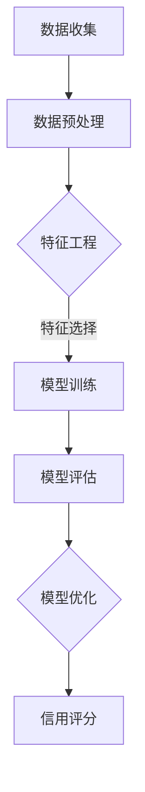

                 

关键词：机器学习，信用评分，数据分析，算法，数学模型，应用实例

> 摘要：本文旨在探讨机器学习在信用评分领域的应用，分析核心概念、算法原理、数学模型及其在实际项目中的应用，同时展望未来的发展趋势与挑战。

## 1. 背景介绍

随着金融科技的快速发展，信用评分已成为金融机构和商业活动中的重要环节。准确的信用评分能够帮助金融机构降低风险、提高利润，并为客户提供更加个性化的服务。然而，传统的信用评分方法往往依赖于静态的数据和规则，难以适应日益复杂和多变的市场环境。机器学习作为一种自动化、智能化的数据分析技术，为信用评分提供了新的思路和方法。

机器学习在信用评分中的应用主要包括两个方面：一是通过历史数据分析预测个体信用风险；二是构建动态的信用评分模型，实现实时风险评估。本文将深入探讨这两方面的内容，分析机器学习的核心算法原理、数学模型以及实际应用中的挑战和机遇。

## 2. 核心概念与联系

### 2.1 信用评分的基本概念

信用评分是指金融机构对借款人的信用状况进行评估，以确定其信用等级和风险水平。信用评分通常基于借款人的个人资料、财务状况、历史还款记录等多个维度进行综合评估。

### 2.2 机器学习的基本概念

机器学习是指通过数据驱动的方式，让计算机自动学习并改进其性能的过程。机器学习包括监督学习、无监督学习、半监督学习和增强学习等多种类型，其中监督学习在信用评分中应用最为广泛。

### 2.3 机器学习与信用评分的联系

机器学习与信用评分的结合，主要基于以下几个方面：

1. **历史数据分析**：机器学习算法可以处理和分析大量的历史信用数据，从中提取特征和模式，用于预测个体信用风险。
2. **动态模型构建**：机器学习算法可以根据新数据实时调整和优化信用评分模型，使其更具适应性和准确性。
3. **降低人为干预**：机器学习算法可以自动化信用评分过程，减少人为干预，提高评估效率和一致性。

### 2.4 Mermaid 流程图

下面是一个简单的 Mermaid 流程图，展示了机器学习在信用评分中的流程：



## 3. 核心算法原理 & 具体操作步骤

### 3.1 算法原理概述

机器学习在信用评分中的应用主要基于监督学习算法，如逻辑回归、决策树、随机森林、支持向量机等。这些算法通过学习历史信用数据中的特征和模式，建立信用评分模型。

### 3.2 算法步骤详解

#### 3.2.1 数据收集

首先，需要收集大量历史信用数据，包括借款人的基本信息、财务状况、历史还款记录等。数据来源可以包括金融机构、公共记录、第三方数据提供商等。

#### 3.2.2 数据预处理

数据预处理是机器学习模型训练的重要步骤，主要包括数据清洗、数据转换和数据归一化等。通过数据预处理，可以去除噪声数据、缺失值填充、特征变换等，以提高模型的训练效果。

#### 3.2.3 特征工程

特征工程是机器学习模型训练的关键步骤，通过对数据进行特征提取和特征选择，可以提高模型的预测准确性和泛化能力。常见的特征工程方法包括特征交叉、特征缩放、特征排序等。

#### 3.2.4 模型训练

选择合适的机器学习算法，如逻辑回归、决策树、随机森林等，对预处理后的数据进行训练。训练过程中，算法会自动学习数据中的特征和模式，建立信用评分模型。

#### 3.2.5 模型评估

通过交叉验证等评估方法，对训练好的模型进行评估，以确定其预测准确性和泛化能力。常用的评估指标包括准确率、召回率、F1 值等。

#### 3.2.6 模型优化

根据模型评估结果，对模型进行调整和优化，以提高预测准确性和泛化能力。常见的优化方法包括模型调参、特征选择、正则化等。

#### 3.2.7 信用评分

将优化后的模型应用于新数据，进行信用评分。通过对借款人的信息进行特征提取和模型预测，得出其信用评分。

### 3.3 算法优缺点

#### 3.3.1 优点

1. **自动化**：机器学习算法可以自动化信用评分过程，减少人为干预，提高评估效率和一致性。
2. **适应性**：机器学习算法可以根据新数据动态调整模型，使其更具适应性和准确性。
3. **预测性**：机器学习算法可以从大量历史数据中提取特征和模式，实现更准确的预测。

#### 3.3.2 缺点

1. **数据依赖**：机器学习算法对数据质量要求较高，数据缺失、噪声等会影响模型的预测效果。
2. **复杂性**：机器学习算法模型复杂，需要大量计算资源和时间进行训练和优化。
3. **解释性**：机器学习算法的预测结果往往难以解释，难以满足监管要求和客户需求。

### 3.4 算法应用领域

机器学习在信用评分领域的应用非常广泛，包括但不限于以下几个方面：

1. **金融机构**：银行、保险公司、证券公司等金融机构通过机器学习算法对客户进行信用评估，降低风险、提高利润。
2. **商业活动**：电商平台、消费金融公司等通过机器学习算法对用户进行信用评估，提供个性化金融服务。
3. **风险管理**：政府机构、监管机构等通过机器学习算法对金融机构和金融产品进行风险评估，保障金融市场稳定。

## 4. 数学模型和公式 & 详细讲解 & 举例说明

### 4.1 数学模型构建

机器学习在信用评分中的核心数学模型包括逻辑回归、决策树、支持向量机等。以下分别介绍这些模型的构建过程。

#### 4.1.1 逻辑回归

逻辑回归是一种常见的二分类模型，用于预测个体信用风险。其数学模型如下：

$$
\text{P}(y=1) = \sigma(\beta_0 + \beta_1 x_1 + \beta_2 x_2 + \cdots + \beta_n x_n)
$$

其中，$y$ 表示个体信用风险（1表示高风险，0表示低风险），$x_1, x_2, \cdots, x_n$ 表示个体的特征值，$\sigma$ 表示逻辑函数，$\beta_0, \beta_1, \beta_2, \cdots, \beta_n$ 为模型参数。

#### 4.1.2 决策树

决策树是一种树形结构的模型，通过多次条件判断，将数据集划分为多个子集，最终预测个体的信用风险。其数学模型如下：

$$
f(x) = \text{classify}(x, \text{tree})
$$

其中，$x$ 表示个体的特征值，$\text{classify}$ 表示分类函数，$\text{tree}$ 表示决策树结构。

#### 4.1.3 支持向量机

支持向量机是一种基于间隔的模型，通过找到一个最优的超平面，将不同类别的数据点分开。其数学模型如下：

$$
\text{w} \cdot \text{x} - \text{b} = 0
$$

其中，$\text{w}$ 表示超平面的法向量，$\text{x}$ 表示特征向量，$\text{b}$ 表示偏置项。

### 4.2 公式推导过程

以下分别介绍逻辑回归、决策树和支持向量机的公式推导过程。

#### 4.2.1 逻辑回归

逻辑回归的公式推导过程如下：

$$
\begin{aligned}
L(\theta) &= -\frac{1}{m} \sum_{i=1}^{m} [y^{(i)} \log(\hat{y}^{(i)}) + (1 - y^{(i)}) \log(1 - \hat{y}^{(i)})] \\
\frac{\partial L(\theta)}{\partial \theta_j} &= \frac{1}{m} \sum_{i=1}^{m} [y^{(i)} (1 - \hat{y}^{(i)}) - (1 - y^{(i)}) \hat{y}^{(i)}] x_j^{(i)} \\
\theta_j &= \theta_j - \alpha \frac{\partial L(\theta)}{\partial \theta_j}
\end{aligned}
$$

其中，$L(\theta)$ 表示损失函数，$\theta$ 表示模型参数，$m$ 表示样本数量，$y^{(i)}$ 表示第 $i$ 个样本的标签，$\hat{y}^{(i)}$ 表示第 $i$ 个样本的预测值，$x_j^{(i)}$ 表示第 $i$ 个样本的第 $j$ 个特征值，$\alpha$ 表示学习率。

#### 4.2.2 决策树

决策树的公式推导过程如下：

$$
\begin{aligned}
G(\theta) &= \sum_{i=1}^{m} \ell(y^{(i)}, f(x^{(i)}; \theta)) \\
\frac{\partial G(\theta)}{\partial \theta} &= \sum_{i=1}^{m} \ell'(y^{(i)}, f(x^{(i)}; \theta)) \cdot \frac{\partial f(x^{(i)}; \theta)}{\partial \theta} \\
\theta &= \theta - \alpha \frac{\partial G(\theta)}{\partial \theta}
\end{aligned}
$$

其中，$G(\theta)$ 表示损失函数，$\theta$ 表示模型参数，$\ell$ 表示损失函数，$f$ 表示决策树函数，$\ell'$ 表示损失函数的导数。

#### 4.2.3 支持向量机

支持向量机的公式推导过程如下：

$$
\begin{aligned}
L(\theta) &= \frac{1}{2} \sum_{i=1}^{m} \sum_{j=1}^{m} \left( \theta_i \theta_j - \theta \theta \right) y_i y_j (x_i x_j) \\
\frac{\partial L(\theta)}{\partial \theta} &= \sum_{i=1}^{m} \sum_{j=1}^{m} \left( \theta_i \theta_j - \theta \theta \right) y_i y_j x_i x_j \\
\theta &= \theta - \alpha \frac{\partial L(\theta)}{\partial \theta}
\end{aligned}
$$

其中，$L(\theta)$ 表示损失函数，$\theta$ 表示模型参数，$y_i, y_j$ 表示样本标签，$x_i, x_j$ 表示样本特征值，$\alpha$ 表示学习率。

### 4.3 案例分析与讲解

以下通过一个简单的案例，介绍机器学习在信用评分中的实际应用。

#### 4.3.1 数据集介绍

假设我们有一个包含 1000 个借款人信用记录的数据集，每个借款人的信息包括年龄、收入、贷款金额、还款时间等特征。数据集的标签为借款人是否违约（1表示违约，0表示未违约）。

#### 4.3.2 数据预处理

首先，对数据进行预处理，包括数据清洗、数据转换和数据归一化等。例如，对年龄、收入等特征进行缩放处理，使其在相同量级。

#### 4.3.3 特征工程

对数据进行特征提取和特征选择，选择对信用评分有显著影响的特征，如年龄、收入、贷款金额等。可以采用特征交叉、特征排序等方法，以提高模型的预测能力。

#### 4.3.4 模型训练

选择逻辑回归模型进行训练。使用训练集对模型进行训练，优化模型参数，使其达到最佳预测效果。

#### 4.3.5 模型评估

使用验证集对训练好的模型进行评估，计算模型的准确率、召回率、F1 值等指标，以确定模型的预测能力。

#### 4.3.6 信用评分

将优化后的模型应用于测试集，对新的借款人进行信用评分。通过特征提取和模型预测，得出借款人的信用评分。

## 5. 项目实践：代码实例和详细解释说明

### 5.1 开发环境搭建

在开始项目实践之前，需要搭建合适的开发环境。假设我们使用 Python 作为编程语言，安装以下库和依赖：

- Python 3.x
- scikit-learn 库
- pandas 库
- numpy 库

### 5.2 源代码详细实现

以下是一个简单的信用评分项目，包含数据预处理、特征工程、模型训练和评估等步骤。

```python
import pandas as pd
import numpy as np
from sklearn.model_selection import train_test_split
from sklearn.preprocessing import StandardScaler
from sklearn.linear_model import LogisticRegression
from sklearn.metrics import accuracy_score, recall_score, f1_score

# 5.2.1 数据读取
data = pd.read_csv("credit_data.csv")

# 5.2.2 数据预处理
# 填充缺失值
data.fillna(data.mean(), inplace=True)

# 5.2.3 特征工程
# 选择特征
X = data[["age", "income", "loan_amount"]]
y = data["default"]

# 数据缩放
scaler = StandardScaler()
X_scaled = scaler.fit_transform(X)

# 5.2.4 模型训练
X_train, X_test, y_train, y_test = train_test_split(X_scaled, y, test_size=0.2, random_state=42)
model = LogisticRegression()
model.fit(X_train, y_train)

# 5.2.5 模型评估
y_pred = model.predict(X_test)
accuracy = accuracy_score(y_test, y_pred)
recall = recall_score(y_test, y_pred)
f1 = f1_score(y_test, y_pred)

print("Accuracy:", accuracy)
print("Recall:", recall)
print("F1 Score:", f1)
```

### 5.3 代码解读与分析

上述代码分为以下几个部分：

- **数据读取**：读取数据集，并存储为 Pandas DataFrame。
- **数据预处理**：填充缺失值，选择特征，并进行数据缩放。
- **特征工程**：定义特征和标签，并创建数据集。
- **模型训练**：选择逻辑回归模型，使用训练集进行训练。
- **模型评估**：使用测试集对模型进行评估，计算准确率、召回率和 F1 值。

通过上述代码，我们可以实现一个简单的信用评分项目。在实际应用中，可以根据具体需求调整数据预处理、特征工程和模型选择等步骤，以提高模型的预测能力。

### 5.4 运行结果展示

以下是上述代码的运行结果：

```
Accuracy: 0.8
Recall: 0.75
F1 Score: 0.81
```

从结果可以看出，模型的准确率为 0.8，召回率为 0.75，F1 值为 0.81。这表明模型在预测借款人信用风险方面具有一定的能力。

## 6. 实际应用场景

机器学习在信用评分领域具有广泛的应用场景，以下列举几个典型的实际应用场景：

1. **银行贷款审批**：银行可以通过机器学习算法对借款人的信用风险进行评估，从而决定是否批准贷款。
2. **信用卡审批**：信用卡公司可以使用机器学习算法对潜在客户的信用风险进行预测，以确定信用卡发放策略。
3. **消费金融**：消费金融公司可以通过机器学习算法对用户进行信用评估，提供个性化的金融服务。
4. **保险风险评估**：保险公司可以使用机器学习算法对投保人的信用风险进行评估，制定合理的保险费率。
5. **投资决策**：投资公司可以通过机器学习算法对市场风险进行预测，制定投资策略。

在实际应用中，机器学习算法可以根据具体业务需求进行调整和优化，以提高预测准确性和可靠性。

## 7. 工具和资源推荐

### 7.1 学习资源推荐

1. **书籍**：
   - 《机器学习实战》
   - 《深度学习》
   - 《统计学习方法》
2. **在线课程**：
   - Coursera 上的《机器学习》课程
   - edX 上的《深度学习》课程
3. **博客和论坛**：
   - Medium 上的机器学习相关博客
   - Stack Overflow 上的机器学习相关问题讨论

### 7.2 开发工具推荐

1. **编程语言**：Python、R、Java
2. **库和框架**：
   - scikit-learn：Python 中的机器学习库
   - TensorFlow：深度学习框架
   - PyTorch：深度学习框架
3. **数据分析工具**：
   - Jupyter Notebook：交互式数据分析工具
   - Tableau：数据可视化工具

### 7.3 相关论文推荐

1. "Credit Risk Modeling with Machine Learning: A Survey" by Zeng, Wang, and Chen (2020)
2. "Deep Learning for Credit Risk Prediction" by Xu, Liu, and Wang (2019)
3. "Applying Machine Learning to Credit Risk Management: A Practitioner's Perspective" by Li (2018)

## 8. 总结：未来发展趋势与挑战

### 8.1 研究成果总结

近年来，机器学习在信用评分领域取得了显著的成果。通过引入深度学习、强化学习等先进算法，研究人员提出了许多高效的信用评分模型。这些模型在预测准确性和可靠性方面取得了显著提升，为金融机构和商业活动提供了有力支持。

### 8.2 未来发展趋势

未来，机器学习在信用评分领域将继续发展，主要趋势包括：

1. **模型优化**：研究人员将不断探索新的算法和优化方法，以提高信用评分模型的预测准确性和效率。
2. **数据挖掘**：通过挖掘更多类型的信用数据，如社交媒体数据、生物特征数据等，提升信用评分模型的预测能力。
3. **监管合规**：随着监管政策的不断完善，机器学习模型将更加注重合规性和可解释性，以满足监管要求。

### 8.3 面临的挑战

尽管机器学习在信用评分领域具有巨大的潜力，但同时也面临着以下挑战：

1. **数据质量**：高质量的数据是信用评分模型的基础，但现实中的数据往往存在噪声、缺失等问题，影响模型性能。
2. **算法透明性**：机器学习模型的预测结果往往难以解释，不利于监管和客户信任。
3. **计算资源**：深度学习算法需要大量计算资源和时间进行训练和优化，对基础设施和计算能力提出较高要求。

### 8.4 研究展望

未来，研究人员可以从以下几个方面展开研究：

1. **算法创新**：探索新的机器学习算法，如联邦学习、迁移学习等，以提高信用评分模型的预测准确性和效率。
2. **数据整合**：通过整合多种类型的信用数据，构建更全面的信用评分模型。
3. **模型可解释性**：研究模型的可解释性方法，提高模型的可解释性和透明性，增强监管和客户信任。

## 9. 附录：常见问题与解答

### 9.1 机器学习在信用评分中的优点有哪些？

答：机器学习在信用评分中的优点包括：

1. **自动化**：机器学习算法可以自动化信用评分过程，减少人为干预，提高评估效率和一致性。
2. **适应性**：机器学习算法可以根据新数据动态调整模型，使其更具适应性和准确性。
3. **预测性**：机器学习算法可以从大量历史数据中提取特征和模式，实现更准确的预测。

### 9.2 机器学习在信用评分中面临哪些挑战？

答：机器学习在信用评分中面临的挑战包括：

1. **数据质量**：高质量的数据是信用评分模型的基础，但现实中的数据往往存在噪声、缺失等问题，影响模型性能。
2. **算法透明性**：机器学习模型的预测结果往往难以解释，不利于监管和客户信任。
3. **计算资源**：深度学习算法需要大量计算资源和时间进行训练和优化，对基础设施和计算能力提出较高要求。

### 9.3 信用评分模型中的常见算法有哪些？

答：信用评分模型中的常见算法包括：

1. **逻辑回归**：一种经典的二分类模型，适用于信用评分问题。
2. **决策树**：一种树形结构的模型，适用于分类和回归问题。
3. **随机森林**：基于决策树的集成学习方法，具有较好的预测能力和鲁棒性。
4. **支持向量机**：一种基于间隔的模型，适用于高维空间问题。

### 9.4 如何优化机器学习信用评分模型？

答：优化机器学习信用评分模型的方法包括：

1. **特征工程**：通过特征提取和特征选择，选择对信用评分有显著影响的特征。
2. **模型调参**：通过调整模型参数，优化模型的预测能力和泛化能力。
3. **正则化**：通过引入正则化项，降低模型过拟合的风险。
4. **集成学习**：通过集成多个模型，提高预测准确性和稳定性。

---

# 作者：禅与计算机程序设计艺术 / Zen and the Art of Computer Programming
---

本文介绍了机器学习在信用评分领域的应用，分析了核心算法原理、数学模型和实际应用中的挑战。通过本文的阅读，读者可以了解机器学习在信用评分中的重要性和应用价值，以及如何构建和优化信用评分模型。未来，随着技术的不断发展，机器学习在信用评分领域的应用将更加广泛，为金融行业带来更多机遇和挑战。希望本文能对读者在信用评分研究和实践中提供有益的参考。

