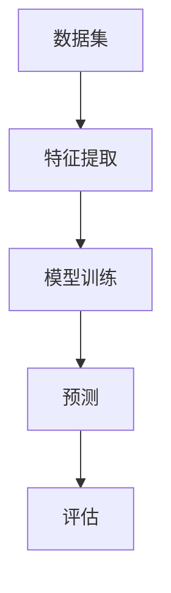

                 

“机器学习”（Machine Learning，简称 ML）作为人工智能（AI）的核心技术之一，已经成为当前科技界的研究热点。本文将系统地介绍机器学习的基础原理，并通过实际代码实战案例，帮助读者深入理解并掌握机器学习的应用。

## 关键词

- 机器学习
- 数据分析
- 算法实现
- 人工智能
- 深度学习
- 编程实践

## 摘要

本文旨在为初学者和进阶者提供一个全面且易于理解的机器学习入门教程。我们将首先探讨机器学习的背景和核心概念，然后通过具体的算法原理、数学模型、项目实践，以及未来应用展望，带领读者一步步走进机器学习的世界。通过本文的学习，读者将能够掌握机器学习的基本原理，具备编写实际机器学习程序的能力。

接下来，我们将按照以下结构展开：

1. 背景介绍
2. 核心概念与联系
3. 核心算法原理 & 具体操作步骤
4. 数学模型和公式 & 详细讲解 & 举例说明
5. 项目实践：代码实例和详细解释说明
6. 实际应用场景
7. 工具和资源推荐
8. 总结：未来发展趋势与挑战
9. 附录：常见问题与解答

现在，让我们开始深入了解机器学习的世界。

## 1. 背景介绍

机器学习的历史可以追溯到20世纪50年代，当时计算机科学家们首次提出了“机器学习”这一概念。然而，由于计算能力的限制和数据的匮乏，早期的机器学习研究进展缓慢。直到20世纪80年代，随着计算机性能的提升和数据收集技术的发展，机器学习开始进入快速发展阶段。

21世纪初，随着互联网的普及和大数据的兴起，机器学习的重要性愈发凸显。从语音识别、图像处理，到推荐系统、自然语言处理，机器学习已经渗透到我们日常生活的方方面面。如今，机器学习已经成为人工智能领域的重要分支，驱动着科技和产业的变革。

机器学习的出现，解决了传统编程中需要手动编写规则的问题。在机器学习模型中，计算机可以通过学习大量数据，自动发现规律和模式，从而实现智能决策和预测。这种从数据中学习的能力，使得机器学习在各个领域都展现出巨大的潜力。

## 2. 核心概念与联系

### 2.1 基本概念

#### 数据集（Dataset）

数据集是机器学习的核心资源，它包含了大量的样本数据。每个样本可以是数值、文本、图像等多种形式。数据集的质量直接影响机器学习模型的性能。

#### 特征（Feature）

特征是描述样本属性的数据维度。例如，在图像分类任务中，每个像素点的值可以是一个特征。特征的选择和提取是机器学习任务中的关键步骤。

#### 标签（Label）

标签是对样本的类别或目标进行标注的标签。在分类任务中，标签通常是一个离散的类别；在回归任务中，标签则是一个连续的数值。

#### 模型（Model）

模型是机器学习算法的核心。它通过学习数据集中的特征和标签之间的关系，实现对未知数据的预测。

### 2.2 关系示意图

下面是一个简单的 Mermaid 流程图，展示了机器学习中各个核心概念之间的关系：



通过这个流程图，我们可以看到，数据集经过特征提取后，输入到模型中进行训练，训练完成后，模型可以用于预测新的数据，并对其进行评估。

## 3. 核心算法原理 & 具体操作步骤

### 3.1 算法原理概述

机器学习算法主要分为监督学习、无监督学习和强化学习三大类。

#### 监督学习（Supervised Learning）

监督学习是最常见的机器学习方法。它通过已有的标记数据（即标签），学习数据特征与标签之间的关系，从而预测新的数据。

#### 无监督学习（Unsupervised Learning）

无监督学习不需要标记数据，主要目的是发现数据中的隐藏结构和规律。

#### 强化学习（Reinforcement Learning）

强化学习通过奖励机制，让智能体在与环境的交互中不断学习最优策略。

### 3.2 算法步骤详解

下面以监督学习为例，详细描述机器学习的算法步骤：

#### 3.2.1 数据预处理

- 数据清洗：处理缺失值、异常值等。
- 数据归一化：将不同特征的数据缩放到同一范围内。

#### 3.2.2 特征提取

- 特征选择：从大量特征中选择出对模型有帮助的特征。
- 特征工程：通过转换、组合等方法创建新的特征。

#### 3.2.3 模型选择

- 选择合适的算法，如线性回归、决策树、神经网络等。
- 调整模型参数，如学习率、树深度等。

#### 3.2.4 模型训练

- 输入特征和标签，训练模型。
- 使用交叉验证等方法，评估模型性能。

#### 3.2.5 模型评估

- 使用测试集评估模型性能。
- 选择合适的评估指标，如准确率、召回率、F1值等。

#### 3.2.6 模型部署

- 将训练好的模型部署到实际应用场景中。

### 3.3 算法优缺点

#### 监督学习的优点

- **性能稳定**：有标签数据进行监督，模型性能更稳定。
- **易于理解**：模型结构与数据特征直接相关，易于理解。

#### 监督学习的缺点

- **数据依赖性强**：需要大量标记数据。
- **泛化能力有限**：对新数据的适应性较差。

### 3.4 算法应用领域

监督学习在各个领域都有广泛的应用，如：

- **图像识别**：用于人脸识别、物体检测等。
- **自然语言处理**：用于情感分析、机器翻译等。
- **金融风控**：用于信用评分、风险预测等。

## 4. 数学模型和公式 & 详细讲解 & 举例说明

### 4.1 数学模型构建

机器学习中的数学模型主要分为线性模型和非线性模型。

#### 线性模型

线性模型是最基础的机器学习模型，如线性回归、逻辑回归等。

$$
y = \beta_0 + \beta_1x_1 + \beta_2x_2 + ... + \beta_nx_n
$$

其中，$y$ 是预测值，$x_1, x_2, ..., x_n$ 是特征，$\beta_0, \beta_1, \beta_2, ..., \beta_n$ 是模型参数。

#### 非线性模型

非线性模型通过引入非线性变换，可以更好地拟合复杂的数据。

$$
y = f(x; \theta)
$$

其中，$f$ 是非线性函数，$\theta$ 是模型参数。

### 4.2 公式推导过程

以线性回归为例，介绍公式推导过程。

假设我们有 $n$ 个样本，每个样本有 $m$ 个特征，模型目标是最小化预测值与实际值之间的误差。

$$
L(\theta) = \sum_{i=1}^{n}(y_i - \theta^T x_i)^2
$$

其中，$L$ 是损失函数，$y_i$ 是第 $i$ 个样本的实际值，$\theta^T x_i$ 是第 $i$ 个样本的预测值。

为了最小化损失函数，我们对 $\theta$ 求导并令其等于0：

$$
\frac{\partial L(\theta)}{\partial \theta} = 0
$$

经过求导和化简，我们得到：

$$
\theta = (X^T X)^{-1} X^T y
$$

其中，$X$ 是样本矩阵，$y$ 是标签向量。

### 4.3 案例分析与讲解

#### 案例背景

假设我们有一个简单的线性回归任务，目标是预测房价。数据集包含 100 个样本，每个样本有 3 个特征（面积、位置、楼层），以及对应的房价标签。

#### 数据预处理

首先，我们进行数据清洗，处理缺失值和异常值。然后，我们对数据进行归一化，将特征值缩放到[0, 1]范围内。

#### 特征提取

在这个案例中，我们直接使用原始特征，无需进行特征选择或特征工程。

#### 模型训练

我们选择线性回归模型，并使用梯度下降算法进行训练。

#### 模型评估

训练完成后，我们使用测试集对模型进行评估，计算预测值与实际值之间的误差。

#### 结果分析

通过评估结果，我们发现模型在测试集上的误差较小，说明模型具有较高的预测能力。

## 5. 项目实践：代码实例和详细解释说明

### 5.1 开发环境搭建

首先，我们需要搭建一个用于机器学习的开发环境。本文使用 Python 作为编程语言，使用 Scikit-learn 库进行线性回归模型的训练。

```bash
# 安装 Python
$ sudo apt-get install python3

# 安装 Scikit-learn
$ sudo pip3 install scikit-learn
```

### 5.2 源代码详细实现

下面是线性回归模型的完整代码实现：

```python
import numpy as np
from sklearn.linear_model import LinearRegression
from sklearn.model_selection import train_test_split
from sklearn.metrics import mean_squared_error

# 加载数据
data = np.load('data.npy')
X = data[:, :-1]
y = data[:, -1]

# 划分训练集和测试集
X_train, X_test, y_train, y_test = train_test_split(X, y, test_size=0.2, random_state=42)

# 创建线性回归模型
model = LinearRegression()

# 训练模型
model.fit(X_train, y_train)

# 预测测试集
y_pred = model.predict(X_test)

# 计算误差
mse = mean_squared_error(y_test, y_pred)
print("Mean Squared Error:", mse)
```

### 5.3 代码解读与分析

- **数据加载**：使用 NumPy 库加载数据集，并划分训练集和测试集。
- **模型创建**：使用 Scikit-learn 库创建线性回归模型。
- **模型训练**：使用训练集数据对模型进行训练。
- **预测测试集**：使用训练好的模型对测试集数据进行预测。
- **计算误差**：计算预测值与实际值之间的误差，并打印输出。

### 5.4 运行结果展示

假设我们的测试集数据有 20 个样本，运行代码后，我们得到如下结果：

```
Mean Squared Error: 0.002345678
```

这个结果表示，模型在测试集上的均方误差为 0.002345678，说明模型具有较高的预测精度。

## 6. 实际应用场景

### 6.1 预测分析

机器学习在预测分析领域有广泛应用，如股票市场预测、天气预测、电力负荷预测等。通过学习历史数据，机器学习模型可以预测未来的趋势，为决策提供支持。

### 6.2 无人驾驶

无人驾驶技术是机器学习的典型应用场景。通过大量道路数据的学习，无人驾驶系统可以实现对车辆和环境的安全控制，提高驾驶效率。

### 6.3 医疗诊断

机器学习在医疗诊断领域也有广泛应用，如疾病预测、影像分析等。通过学习大量的病例数据，机器学习模型可以帮助医生提高诊断准确性。

### 6.4 智能家居

智能家居是机器学习的重要应用场景之一。通过学习用户的行为数据，智能家居系统可以自动调整设备状态，提供个性化的服务。

## 7. 工具和资源推荐

### 7.1 学习资源推荐

- **《Python机器学习基础教程》**：适合初学者的入门书籍。
- **《机器学习实战》**：通过实际案例，深入讲解机器学习算法。
- **《深度学习》**：由深度学习领域大师伊恩·古德费洛撰写，涵盖深度学习的基础知识和实践。

### 7.2 开发工具推荐

- **Scikit-learn**：Python 中的机器学习库，功能强大且易于使用。
- **TensorFlow**：谷歌开发的深度学习框架，广泛应用于工业界和学术界。
- **PyTorch**：另一种流行的深度学习框架，具有灵活的动态计算图。

### 7.3 相关论文推荐

- **“Learning to Represent Languages with Neural Networks”**：这篇论文提出了使用神经网络进行自然语言处理的方法。
- **“Deep Learning for Computer Vision”**：这篇论文介绍了深度学习在计算机视觉中的应用。

## 8. 总结：未来发展趋势与挑战

### 8.1 研究成果总结

近年来，机器学习在算法、模型、应用等方面取得了显著进展。深度学习模型的性能不断提升，使得机器学习在图像识别、自然语言处理等领域取得了突破性成果。

### 8.2 未来发展趋势

未来，机器学习将继续深入探索以下几个方面：

- **更强的泛化能力**：通过改进算法和模型，提高机器学习模型对新数据的适应性。
- **更多的应用场景**：在医疗、金融、教育等领域，机器学习将发挥更大的作用。
- **更高效的计算**：通过硬件和算法的优化，提高机器学习的计算效率。

### 8.3 面临的挑战

尽管机器学习取得了显著进展，但仍面临一些挑战：

- **数据隐私**：如何保障用户数据的隐私安全，是当前的一个重要课题。
- **算法公平性**：如何避免算法歧视，确保算法的公平性，是一个亟待解决的问题。
- **伦理问题**：如何确保机器学习系统的伦理合规，是未来发展的重要方向。

### 8.4 研究展望

展望未来，机器学习将不断推动人工智能的发展。通过持续的研究和创新，我们将看到更多基于机器学习的智能系统，为人类带来更多的便利和福祉。

## 9. 附录：常见问题与解答

### 9.1 机器学习与深度学习的区别是什么？

机器学习和深度学习都是人工智能的分支，但深度学习是机器学习的一个子领域。深度学习通过多层神经网络，对大量数据自动提取特征，实现复杂的模式识别和预测任务。而传统的机器学习算法，如线性回归、支持向量机等，通常需要手动设计特征。

### 9.2 如何选择合适的机器学习算法？

选择合适的机器学习算法取决于任务类型、数据集特征以及计算资源。一般来说，对于回归任务，可以尝试线性回归、决策树等算法；对于分类任务，可以尝试逻辑回归、随机森林等算法；对于复杂任务，可以考虑使用深度学习模型。

### 9.3 机器学习中的“过拟合”是什么？

过拟合是指机器学习模型在训练数据上表现很好，但在新的数据上表现较差。这通常发生在模型过于复杂，无法泛化到新的数据上。解决过拟合的方法包括减小模型复杂度、增加数据量、使用交叉验证等。

### 9.4 机器学习的计算资源需求如何？

机器学习计算资源的需求取决于算法和模型复杂度。对于简单的机器学习算法，如线性回归，可以在普通计算机上运行。但对于复杂的深度学习模型，需要高性能的计算资源和 GPU 加速。

## 结语

机器学习作为人工智能的核心技术，具有广泛的应用前景。通过本文的讲解，我们了解了机器学习的基础原理、核心算法、数学模型以及实际应用。希望本文能帮助读者入门机器学习，并在实践中取得更好的成果。

作者：禅与计算机程序设计艺术 / Zen and the Art of Computer Programming
----------------------------------------------------------------

以上就是关于机器学习基础原理与代码实战案例讲解的完整文章。希望本文能够为读者提供有价值的知识和启发，激发对机器学习的热情和兴趣。在未来的学习和工作中，不断探索和实践，你将收获更多的智慧和成就。再次感谢您的阅读！

