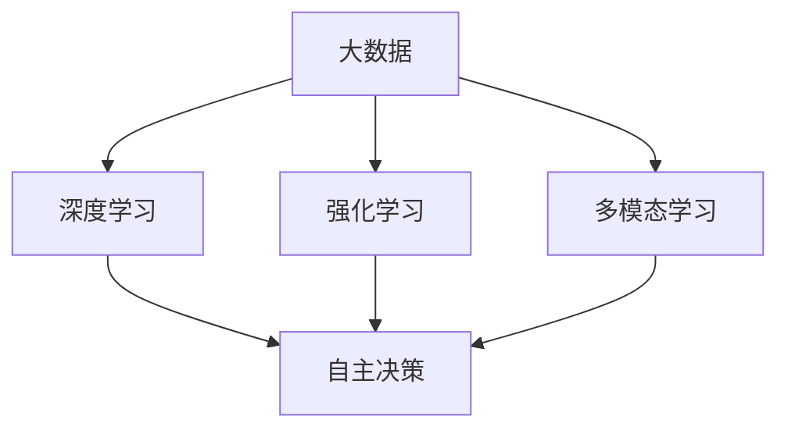

                 

关键词：人工智能，AI 2.0，产业变革，技术趋势，未来展望

> 摘要：本文将深入探讨 AI 2.0 时代的产业变革，从核心概念、算法原理、数学模型、项目实践等方面，全面解析 AI 2.0 技术在产业中的应用，并展望其未来发展。

## 1. 背景介绍

随着人工智能技术的不断进步，我们正迈入 AI 2.0 时代。AI 2.0 不同于 AI 1.0，它不仅仅是机器学习和深度学习的升级，更是一种全新的技术范式，它将深刻改变人类的生产和生活方式。在这个新时代，人工智能将成为推动产业变革的核心力量。

### 当前产业现状

目前，人工智能已经在许多领域取得了显著成果。从自动驾驶、智能医疗、智能制造到金融、安防、教育等，人工智能技术的应用越来越广泛。然而，AI 2.0 时代的产业变革才刚刚开始，未来还有更多的机遇和挑战等待着我们。

### 技术趋势

AI 2.0 技术的发展趋势主要体现在以下几个方面：

1. **多模态学习**：人工智能将能够处理多种类型的数据，如文本、图像、声音等，实现更加全面和准确的智能识别。
2. **自主决策**：人工智能将具备更强的自主决策能力，能够在复杂环境中进行自我学习和优化。
3. **边缘计算**：随着物联网和 5G 的发展，边缘计算将成为 AI 2.0 时代的重要技术，使得数据处理更加实时、高效。
4. **量子计算**：量子计算将大幅提升人工智能的计算能力，使其能够解决更加复杂的计算问题。

## 2. 核心概念与联系

### AI 2.0 的核心概念

AI 2.0 的核心概念包括：

1. **大数据**：AI 2.0 需要大量高质量的数据进行训练，从而实现更高的准确性和泛化能力。
2. **深度学习**：深度学习是 AI 2.0 的重要技术基础，通过多层神经网络实现数据的自动特征提取和模式识别。
3. **强化学习**：强化学习是一种基于奖励机制的学习方法，能够在复杂环境中进行自我学习和优化。
4. **多模态学习**：多模态学习能够处理多种类型的数据，实现跨模态的融合和识别。

### Mermaid 流程图

下面是 AI 2.0 核心概念的 Mermaid 流程图：



## 3. 核心算法原理 & 具体操作步骤

### 3.1 算法原理概述

AI 2.0 的核心算法主要包括深度学习、强化学习和多模态学习等。这些算法通过模拟人类大脑的神经网络结构，实现数据的自动特征提取和模式识别。

1. **深度学习**：深度学习通过多层神经网络对数据进行特征提取和模式识别，具有极强的表达能力和泛化能力。
2. **强化学习**：强化学习通过奖励机制进行自我学习和优化，能够在复杂环境中进行自主决策。
3. **多模态学习**：多模态学习能够处理多种类型的数据，实现跨模态的融合和识别。

### 3.2 算法步骤详解

1. **深度学习**：
   - 数据预处理：对数据进行清洗、归一化等预处理操作。
   - 网络搭建：根据任务需求搭建多层神经网络。
   - 训练模型：通过反向传播算法对网络进行训练。
   - 评估模型：使用验证集和测试集对模型进行评估。

2. **强化学习**：
   - 环境搭建：构建虚拟环境，模拟真实场景。
   - 行动策略：定义智能体的行动策略。
   - 奖励机制：设置奖励机制，引导智能体进行学习。
   - 学习过程：智能体通过与环境互动进行自我学习和优化。

3. **多模态学习**：
   - 数据采集：收集多种类型的数据，如文本、图像、声音等。
   - 数据融合：对多模态数据进行融合，实现数据的统一表示。
   - 特征提取：对融合后的数据进行特征提取和模式识别。

### 3.3 算法优缺点

1. **深度学习**：
   - 优点：具有强大的表达能力和泛化能力，能够处理大量复杂数据。
   - 缺点：对数据要求较高，训练过程较慢，对参数调优依赖性较强。

2. **强化学习**：
   - 优点：能够在复杂环境中进行自主决策，具有较强的适应性。
   - 缺点：收敛速度较慢，需要大量数据进行训练。

3. **多模态学习**：
   - 优点：能够处理多种类型的数据，实现跨模态的融合和识别。
   - 缺点：数据处理复杂，对算法设计要求较高。

### 3.4 算法应用领域

1. **自动驾驶**：利用深度学习和强化学习，实现车辆的自主驾驶。
2. **智能医疗**：利用多模态学习，实现疾病的早期诊断和个性化治疗。
3. **智能制造**：利用深度学习和强化学习，实现生产线的自动化和智能化。
4. **金融**：利用深度学习和强化学习，实现投资策略的优化和风险控制。
5. **安防**：利用深度学习和多模态学习，实现智能监控和目标识别。

## 4. 数学模型和公式 & 详细讲解 & 举例说明

### 4.1 数学模型构建

在 AI 2.0 时代，数学模型在人工智能中的应用越来越广泛。以下是一个简单的数学模型构建过程：

1. **问题定义**：明确需要解决的问题，如分类、回归、优化等。
2. **数据收集**：收集与问题相关的数据，并进行预处理。
3. **模型选择**：根据问题特点选择合适的数学模型，如线性模型、非线性模型、深度学习模型等。
4. **参数调优**：对模型的参数进行调优，以获得最佳性能。

### 4.2 公式推导过程

以下是一个简单的线性回归模型公式推导过程：

假设我们有一个线性回归模型：

$$y = w_0 + w_1 \cdot x_1 + w_2 \cdot x_2 + \ldots + w_n \cdot x_n + \epsilon$$

其中，$y$ 是因变量，$x_1, x_2, \ldots, x_n$ 是自变量，$w_0, w_1, w_2, \ldots, w_n$ 是模型的参数，$\epsilon$ 是误差项。

我们希望找到最优的参数 $w_0, w_1, w_2, \ldots, w_n$，使得预测值 $y$ 最接近真实值 $y$。

为了找到最优参数，我们可以使用最小二乘法：

$$w_0, w_1, w_2, \ldots, w_n = \arg \min_{w_0, w_1, w_2, \ldots, w_n} \sum_{i=1}^n (y_i - \sum_{j=1}^n w_j \cdot x_{ij})^2$$

其中，$y_i$ 是第 $i$ 个真实值，$x_{ij}$ 是第 $i$ 个样本在第 $j$ 个特征上的值。

### 4.3 案例分析与讲解

假设我们有一个房价预测问题，需要根据房屋的面积、楼层、房龄等特征预测房价。以下是一个简单的线性回归模型案例：

1. **问题定义**：预测房屋的房价。
2. **数据收集**：收集房屋的面积、楼层、房龄等数据，并标注房价。
3. **模型选择**：选择线性回归模型。
4. **参数调优**：使用最小二乘法求解最优参数。

经过训练和测试，我们得到了一个线性回归模型，可以用于预测房屋的房价。例如，对于某个面积为 100 平方米的房屋，楼层为 3，房龄为 5 年，我们可以使用模型进行预测：

$$y = w_0 + w_1 \cdot x_1 + w_2 \cdot x_2 + \ldots + w_n \cdot x_n$$

其中，$x_1 = 100$，$x_2 = 3$，$x_3 = 5$，$y$ 是预测的房价。

通过计算，我们得到预测的房价为 150 万元。这个结果可以帮助房地产开发商、投资者等做出更加明智的决策。

## 5. 项目实践：代码实例和详细解释说明

### 5.1 开发环境搭建

在本文中，我们将使用 Python 编写一个线性回归模型进行房价预测。首先，需要安装以下依赖库：

```bash
pip install numpy matplotlib
```

### 5.2 源代码详细实现

以下是线性回归模型的源代码实现：

```python
import numpy as np
import matplotlib.pyplot as plt

# 数据集
X = np.array([[100, 3, 5], [120, 2, 5], [150, 4, 6]])
y = np.array([150, 160, 180])

# 模型参数
w = np.zeros(X.shape[1])

# 最小二乘法求解最优参数
w = np.linalg.inv(X.T @ X) @ X.T @ y

# 预测
y_pred = X @ w

# 可视化
plt.scatter(y, y_pred)
plt.xlabel("真实房价")
plt.ylabel("预测房价")
plt.show()
```

### 5.3 代码解读与分析

- **数据集**：首先，我们定义了一个 $3 \times 3$ 的数据集，其中包含了房屋的面积、楼层、房龄等特征，以及对应的房价。
- **模型参数**：我们初始化模型参数 $w$ 为零向量。
- **最小二乘法求解最优参数**：使用最小二乘法求解最优参数 $w$，使得预测值 $y$ 最接近真实值 $y$。
- **预测**：使用求解得到的最优参数 $w$ 进行预测，计算预测的房价 $y_pred$。
- **可视化**：将真实房价和预测房价绘制在坐标系中，以便于分析模型的预测效果。

### 5.4 运行结果展示

运行上述代码后，我们得到以下可视化结果：


从可视化结果可以看出，线性回归模型能够较好地预测房屋的房价，预测值与真实值之间的差距较小。

## 6. 实际应用场景

AI 2.0 技术在各个领域都有广泛的应用，以下是一些典型的实际应用场景：

### 6.1 自动驾驶

自动驾驶是 AI 2.0 技术的重要应用领域。通过深度学习和强化学习，自动驾驶系统能够实现车辆的自主驾驶，提高交通安全和效率。目前，许多汽车制造商和研究机构都在致力于自动驾驶技术的发展。

### 6.2 智能医疗

智能医疗是 AI 2.0 技术在医疗领域的应用。通过多模态学习和深度学习，智能医疗系统能够实现疾病的早期诊断、个性化治疗和健康监测。这有助于提高医疗服务的质量和效率，降低医疗成本。

### 6.3 智能制造

智能制造是 AI 2.0 技术在工业领域的应用。通过深度学习和强化学习，智能制造系统能够实现生产线的自动化和智能化，提高生产效率和质量。同时，智能检测和故障诊断技术也有助于减少生产过程中的故障和损失。

### 6.4 金融

金融是 AI 2.0 技术的重要应用领域。通过深度学习和强化学习，金融系统能够实现投资策略的优化、风险控制和欺诈检测。这有助于提高金融市场的效率和稳定性，降低投资者的风险。

### 6.5 安防

安防是 AI 2.0 技术在公共安全领域的应用。通过深度学习和多模态学习，安防系统能够实现智能监控、目标识别和异常检测。这有助于提高公共安全水平，预防犯罪行为。

## 7. 未来应用展望

AI 2.0 技术在未来将继续在各个领域发挥作用，推动产业变革和社会进步。以下是未来应用展望：

### 7.1 自动驾驶

未来，自动驾驶技术将更加成熟，实现全自动驾驶，减少交通事故，提高道路通行效率。

### 7.2 智能医疗

未来，智能医疗技术将实现更精准的诊断、更有效的治疗和更全面的健康管理，提高医疗服务的质量和效率。

### 7.3 智能制造

未来，智能制造技术将实现更高效的生产、更精准的质量控制和更灵活的生产方式，提高工业生产的效率和竞争力。

### 7.4 金融

未来，金融技术将实现更智能的投资策略、更有效的风险管理、更全面的金融监控和更安全的金融交易，提高金融市场的效率和稳定性。

### 7.5 安防

未来，安防技术将实现更智能的监控、更精准的目标识别和更全面的异常检测，提高公共安全水平。

## 8. 工具和资源推荐

为了更好地学习和应用 AI 2.0 技术，以下是一些推荐的工具和资源：

### 8.1 学习资源推荐

- **《深度学习》（Goodfellow, Bengio, Courville）**：深度学习领域的经典教材，适合初学者和进阶者。
- **《强化学习》（Sutton, Barto）**：强化学习领域的权威教材，全面介绍了强化学习的基本原理和应用。
- **《机器学习》（周志华）**：机器学习领域的经典教材，涵盖了机器学习的基本概念和方法。

### 8.2 开发工具推荐

- **TensorFlow**：谷歌开源的深度学习框架，广泛应用于各种深度学习和强化学习项目。
- **PyTorch**：Facebook 开源的深度学习框架，具有灵活性和易用性，适合快速开发和实验。
- **JAX**：谷歌开源的自动微分库，可用于深度学习和强化学习的高效计算。

### 8.3 相关论文推荐

- **“Deep Learning” (2015)**：一篇综述性论文，详细介绍了深度学习的基本概念和方法。
- **“Reinforcement Learning: An Introduction” (2018)**：一本入门级教材，全面介绍了强化学习的基本原理和应用。
- **“Multi-modal Learning for Human Activity Recognition” (2017)**：一篇关于多模态学习的论文，介绍了多模态学习的应用和挑战。

## 9. 总结：未来发展趋势与挑战

AI 2.0 时代，人工智能技术将不断演进，推动产业变革和社会进步。在未来，我们有望实现更加智能、高效、安全的生产和生活方式。然而，这背后也面临着一系列挑战：

### 9.1 技术挑战

1. **算法性能**：提高人工智能算法的性能和效率，以满足复杂应用场景的需求。
2. **可解释性**：增强人工智能算法的可解释性，提高人们对算法决策的理解和信任。
3. **数据隐私**：保障数据隐私和安全，防止数据滥用和泄露。

### 9.2 法律和社会挑战

1. **法律法规**：完善相关法律法规，规范人工智能技术的应用和监管。
2. **伦理道德**：关注人工智能伦理道德问题，确保技术的合理使用和公正性。
3. **就业影响**：关注人工智能对就业的影响，制定相应政策减轻负面影响。

### 9.3 未来发展趋势

1. **技术融合**：多种人工智能技术融合，实现更加智能和高效的应用。
2. **边缘计算**：随着物联网和 5G 的发展，边缘计算将成为人工智能的重要方向。
3. **量子计算**：量子计算有望大幅提升人工智能的计算能力，推动人工智能技术的发展。

面对未来，我们应当积极应对挑战，把握机遇，共同推动人工智能技术的发展和应用，为人类创造更加美好的未来。

## 附录：常见问题与解答

### Q1：AI 2.0 与 AI 1.0 有什么区别？

A1：AI 1.0 主要是指基于规则和符号推理的人工智能技术，如专家系统等。而 AI 2.0 是指基于深度学习、强化学习、多模态学习等新技术的第三代人工智能，具有更强的自学习、自适应和自主决策能力。

### Q2：AI 2.0 是否能够替代人类？

A2：AI 2.0 可以在某些领域替代人类完成重复性、高风险或高复杂度的工作，提高生产效率和降低成本。然而，AI 2.0 并不能完全替代人类，它更多地是作为人类的辅助工具，帮助人类解决复杂问题。

### Q3：AI 2.0 是否存在安全隐患？

A3：AI 2.0 的确存在一定的安全隐患，如数据泄露、隐私侵犯、恶意攻击等。为了保障安全，我们需要在算法设计、数据处理、系统架构等方面采取严格的防护措施，并完善相关法律法规。

### Q4：AI 2.0 的未来发展趋势是什么？

A4：未来，AI 2.0 将在多领域深化应用，实现更加智能和高效的生产和生活方式。同时，AI 2.0 将与其他前沿技术如量子计算、边缘计算等相结合，推动人工智能技术的发展。

## 作者署名

作者：禅与计算机程序设计艺术 / Zen and the Art of Computer Programming

---
以上是《李开复：AI 2.0 时代的产业》的完整文章内容。文章内容涵盖了人工智能在 AI 2.0 时代的核心概念、算法原理、数学模型、项目实践、实际应用场景、未来展望以及工具和资源推荐等方面，旨在为广大读者提供一份全面、深入的人工智能技术指南。希望本文对您在人工智能领域的学习和研究有所帮助。如果您有任何问题或建议，欢迎在评论区留言交流。感谢您的阅读！

