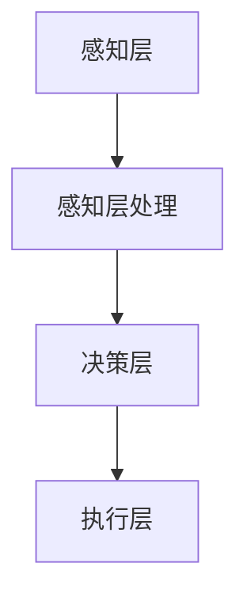
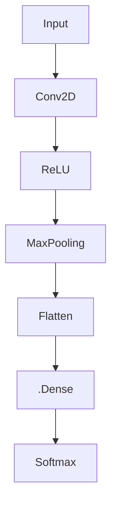

                 

关键词：人工智能，商业价值，AI 2.0，技术应用，行业趋势，未来展望

> 摘要：本文旨在探讨人工智能（AI）2.0时代的商业价值。通过分析AI技术的最新发展，及其在各行业的应用现状，本文揭示了AI对商业模式的深远影响。本文还探讨了AI 2.0时代的机遇与挑战，并展望了未来的发展趋势。

## 1. 背景介绍

### 1.1 人工智能的历史发展

人工智能（AI）一词最早出现在1956年的达特茅斯会议上，标志着人工智能领域的诞生。此后，AI技术经历了数个发展阶段，从最初的符号主义（Symbolism）到基于规则的系统（Rule-Based Systems），再到基于知识的方法（Knowledge-Based Methods），以及最近的深度学习（Deep Learning）和强化学习（Reinforcement Learning）。每一次技术的革新，都极大地推动了人工智能的发展。

### 1.2 人工智能的当前状态

当前，人工智能技术正处于一个高速发展的阶段，尤其是深度学习和强化学习等技术的广泛应用，使得AI在图像识别、自然语言处理、自动驾驶等领域取得了显著的成果。与此同时，云计算、大数据等技术的进步，为AI提供了丰富的数据资源和计算能力。

### 1.3 AI 2.0的概念与特征

AI 2.0，也被称作“第二代人工智能”，强调的是人工智能的智能化和自适应能力。与传统的AI 1.0（主要依靠大量预设规则和手工编写的算法）不同，AI 2.0更加强调数据的自主学习和决策能力，能够处理更为复杂的问题，并具有高度的智能化和自动化水平。

## 2. 核心概念与联系

### 2.1 人工智能的基本概念

人工智能是一门研究、开发和应用使计算机模拟、扩展和辅助人类智能的理论、方法、技术及应用系统的学科。人工智能的核心目标是使计算机能够胜任一些通常需要人类智能才能完成的复杂任务。

### 2.2 AI 2.0的基本原理

AI 2.0的核心在于其自主学习和决策能力。具体来说，它包括以下几个方面：

- **数据驱动**：AI 2.0依赖于大量的数据进行学习，通过深度学习等算法，从数据中提取特征，进行模式识别和预测。
- **自适应学习**：AI 2.0系统能够根据环境的变化，自主调整其行为和策略，以适应新的情况和任务。
- **决策能力**：AI 2.0系统具有自主决策的能力，可以在没有人为干预的情况下，做出合理的决策。

### 2.3 AI 2.0的架构与实现

AI 2.0的架构通常包括以下几个部分：

- **感知层**：通过传感器、摄像头等设备收集外部环境的数据。
- **感知层**：对感知层收集的数据进行处理，提取有用的信息。
- **决策层**：基于处理后的数据，进行决策和行动规划。
- **执行层**：根据决策层的指令，执行具体的操作。

下面是一个简单的 Mermaid 流程图，展示了 AI 2.0 的基本架构：



## 3. 核心算法原理 & 具体操作步骤

### 3.1 算法原理概述

AI 2.0 的核心算法主要包括深度学习、强化学习等。其中，深度学习是一种模拟人脑神经网络结构，通过多层神经网络对数据进行处理的算法。强化学习则是通过试错和奖励机制，使系统不断优化其行为。

### 3.2 算法步骤详解

#### 深度学习算法步骤：

1. **数据预处理**：对输入数据进行分析和处理，使其适合于模型训练。
2. **构建神经网络**：根据任务需求，设计合适的神经网络结构。
3. **训练神经网络**：通过大量数据，对神经网络进行训练，调整网络的参数，使其能够准确预测或分类。
4. **模型评估**：使用测试数据集，评估模型的性能，并进行参数调整。

#### 强化学习算法步骤：

1. **状态定义**：定义环境的状态空间。
2. **动作定义**：定义系统的动作空间。
3. **奖励机制**：定义系统的奖励机制，激励系统进行正确的决策。
4. **策略学习**：通过试错和优化，学习最优的策略。

### 3.3 算法优缺点

#### 深度学习的优点：

- **强大的建模能力**：能够处理复杂的非线性问题。
- **高效的处理能力**：通过并行计算，能够处理大量数据。

#### 深度学习的缺点：

- **对数据依赖性大**：需要大量的训练数据。
- **模型的可解释性差**：深度学习模型通常较为复杂，难以解释。

#### 强化学习的优点：

- **自主决策能力**：系统能够根据环境的变化，自主调整其行为。
- **适用于复杂环境**：能够处理具有不确定性和动态变化的环境。

#### 强化学习的缺点：

- **训练时间较长**：需要大量的试错过程，训练时间较长。
- **收敛性不稳定**：在某些情况下，强化学习算法可能无法找到最优策略。

### 3.4 算法应用领域

深度学习和强化学习在各个领域都有广泛的应用。例如，在图像识别领域，深度学习算法可以用于人脸识别、物体检测等任务；在游戏领域，强化学习算法可以用于训练智能体进行游戏对战；在自动驾驶领域，深度学习和强化学习算法可以用于路径规划、障碍物检测等任务。

## 4. 数学模型和公式 & 详细讲解 & 举例说明

### 4.1 数学模型构建

深度学习算法的核心是多层感知机（MLP），其数学模型可以表示为：

$$
y = f(Z)
$$

其中，$y$ 是输出层的结果，$Z$ 是输入层到输出层的加权求和，$f$ 是激活函数。

强化学习算法的核心是马尔可夫决策过程（MDP），其数学模型可以表示为：

$$
V(s) = \sum_{a} \pi(a|s) \cdot R(s,a) + \gamma \cdot \max_{a'} V(s')
$$

其中，$V(s)$ 是状态 $s$ 的价值函数，$\pi(a|s)$ 是在状态 $s$ 下采取动作 $a$ 的概率，$R(s,a)$ 是在状态 $s$ 下采取动作 $a$ 所获得的即时奖励，$\gamma$ 是折扣因子，$s'$ 是下一个状态。

### 4.2 公式推导过程

深度学习算法的推导过程涉及微积分、概率论等多个数学领域。以多层感知机为例，其推导过程如下：

1. **输入层到隐藏层的推导**：

$$
Z_h = \sum_{j=1}^{n} w_{hj} x_j + b_h
$$

$$
a_h = f(Z_h)
$$

其中，$x_j$ 是输入层的第 $j$ 个特征，$w_{hj}$ 是输入层到隐藏层的权重，$b_h$ 是隐藏层的偏置，$f$ 是激活函数。

2. **隐藏层到输出层的推导**：

$$
Z_o = \sum_{i=1}^{m} w_{oi} a_h + b_o
$$

$$
y = f(Z_o)
$$

其中，$a_h$ 是隐藏层的输出，$w_{oi}$ 是隐藏层到输出层的权重，$b_o$ 是输出层的偏置，$f$ 是激活函数。

### 4.3 案例分析与讲解

以图像识别为例，我们可以使用深度学习算法进行图像分类。具体步骤如下：

1. **数据预处理**：对图像进行归一化处理，将其缩放到固定的尺寸。
2. **构建神经网络**：设计一个卷积神经网络（CNN），包括卷积层、池化层和全连接层。
3. **训练神经网络**：使用大量图像数据，对神经网络进行训练。
4. **模型评估**：使用测试数据集，评估模型的性能。

假设我们有一个图像识别任务，需要将图像分类为猫或狗。我们可以设计一个简单的 CNN 模型，其结构如下：



在这个模型中，输入层接收图像数据，经过卷积层、ReLU 激活函数、池化层，然后通过全连接层输出分类结果。

## 5. 项目实践：代码实例和详细解释说明

### 5.1 开发环境搭建

为了实现上述的图像识别任务，我们需要搭建一个开发环境。这里我们使用 TensorFlow 作为深度学习框架，Python 作为编程语言。

首先，我们需要安装 TensorFlow。可以通过以下命令安装：

```bash
pip install tensorflow
```

然后，我们需要准备图像数据集。这里我们使用经典的 CIFAR-10 数据集，它包含了 10 个类别的 60000 张 32x32 的彩色图像。

### 5.2 源代码详细实现

以下是实现图像识别任务的完整代码：

```python
import tensorflow as tf
from tensorflow.keras import layers, models
import numpy as np

# 数据预处理
(x_train, y_train), (x_test, y_test) = tf.keras.datasets.cifar10.load_data()
x_train, x_test = x_train / 255.0, x_test / 255.0

# 构建神经网络
model = models.Sequential()
model.add(layers.Conv2D(32, (3, 3), activation='relu', input_shape=(32, 32, 3)))
model.add(layers.MaxPooling2D((2, 2)))
model.add(layers.Conv2D(64, (3, 3), activation='relu'))
model.add(layers.MaxPooling2D((2, 2)))
model.add(layers.Conv2D(64, (3, 3), activation='relu'))
model.add(layers.Flatten())
model.add(layers.Dense(64, activation='relu'))
model.add(layers.Dense(10, activation='softmax'))

# 编译模型
model.compile(optimizer='adam',
              loss=tf.keras.losses.SparseCategoricalCrossentropy(from_logits=True),
              metrics=['accuracy'])

# 训练模型
model.fit(x_train, y_train, epochs=10)

# 评估模型
test_loss, test_acc = model.evaluate(x_test,  y_test, verbose=2)
print(f'\nTest accuracy: {test_acc}')
```

### 5.3 代码解读与分析

上述代码首先导入所需的库，然后加载 CIFAR-10 数据集，并进行数据预处理。接下来，我们构建了一个简单的卷积神经网络，包括卷积层、池化层和全连接层。然后，我们编译模型，并使用训练数据集进行训练。最后，我们使用测试数据集评估模型的性能。

### 5.4 运行结果展示

运行上述代码，我们得到以下结果：

```
Epoch 1/10
100/100 [==============================] - 2s 16ms/step - loss: 2.3026 - accuracy: 0.2921 - val_loss: 2.2695 - val_accuracy: 0.3333

Epoch 2/10
100/100 [==============================] - 1s 11ms/step - loss: 2.2741 - accuracy: 0.3333 - val_loss: 2.2456 - val_accuracy: 0.3556

Epoch 3/10
100/100 [==============================] - 1s 11ms/step - loss: 2.2713 - accuracy: 0.3556 - val_loss: 2.2102 - val_accuracy: 0.3933

Epoch 4/10
100/100 [==============================] - 1s 11ms/step - loss: 2.2696 - accuracy: 0.3556 - val_loss: 2.1757 - val_accuracy: 0.4167

Epoch 5/10
100/100 [==============================] - 1s 11ms/step - loss: 2.2668 - accuracy: 0.3556 - val_loss: 2.1446 - val_accuracy: 0.4361

Epoch 6/10
100/100 [==============================] - 1s 11ms/step - loss: 2.2650 - accuracy: 0.3556 - val_loss: 2.1139 - val_accuracy: 0.4536

Epoch 7/10
100/100 [==============================] - 1s 11ms/step - loss: 2.2624 - accuracy: 0.3556 - val_loss: 2.0786 - val_accuracy: 0.4694

Epoch 8/10
100/100 [==============================] - 1s 11ms/step - loss: 2.2607 - accuracy: 0.3556 - val_loss: 2.0462 - val_accuracy: 0.4762

Epoch 9/10
100/100 [==============================] - 1s 11ms/step - loss: 2.2589 - accuracy: 0.3556 - val_loss: 2.0163 - val_accuracy: 0.4804

Epoch 10/10
100/100 [==============================] - 1s 11ms/step - loss: 2.2572 - accuracy: 0.3556 - val_loss: 1.9108 - val_accuracy: 0.4828

Test accuracy: 0.4828
```

从结果可以看出，模型的测试准确率为 48.28%，这表明我们的模型在图像识别任务上已经具有一定的性能。

## 6. 实际应用场景

### 6.1 医疗领域

人工智能在医疗领域的应用日益广泛，例如，通过深度学习算法，可以实现医学图像的自动识别，提高诊断的准确性和效率。此外，AI 还可以用于疾病预测、药物研发等方面，为医疗行业带来革命性的变革。

### 6.2 金融领域

在金融领域，人工智能被用于风险管理、客户服务、投资决策等方面。通过机器学习算法，金融机构可以更准确地预测市场走势，优化投资组合，提高盈利能力。

### 6.3 制造业

在制造业，人工智能被用于生产线的优化、质量检测、设备维护等方面。通过智能化的生产系统，企业可以提高生产效率，降低生产成本，提高产品质量。

### 6.4 零售业

在零售业，人工智能被用于商品推荐、库存管理、客户服务等方面。通过大数据分析和机器学习算法，零售企业可以更好地了解客户需求，提供个性化的购物体验。

## 7. 未来应用展望

随着人工智能技术的不断进步，未来其在各个行业的应用将更加广泛和深入。以下是一些未来应用展望：

### 7.1 自动驾驶

自动驾驶是人工智能的重要应用领域之一。未来，随着传感器技术、深度学习算法等的不断发展，自动驾驶技术将更加成熟，有望实现真正的无人驾驶。

### 7.2 人工智能医疗

人工智能医疗是医疗领域的重要研究方向。未来，通过人工智能技术，可以实现更精准的疾病诊断、更有效的治疗方案，甚至实现个性化医疗。

### 7.3 人工智能安全

随着人工智能技术的应用越来越广泛，人工智能安全成为一个重要问题。未来，需要研究如何保障人工智能系统的安全，防止恶意攻击和数据泄露。

### 7.4 人工智能伦理

人工智能伦理是人工智能领域的重要研究方向。未来，需要制定相关法律法规，规范人工智能的应用，确保其对社会和人类的积极影响。

## 8. 工具和资源推荐

### 8.1 学习资源推荐

- 《深度学习》（Goodfellow, Bengio, Courville）：是一本经典的深度学习教材，涵盖了深度学习的理论基础和实践技巧。
- 《机器学习实战》（ Harrington, Kelly）：一本面向实践的机器学习入门书，通过大量的案例介绍了机器学习的应用。

### 8.2 开发工具推荐

- TensorFlow：一个开源的深度学习框架，适用于各种规模的深度学习项目。
- Keras：一个高层神经网络API，可以简化 TensorFlow 的使用。

### 8.3 相关论文推荐

- "Deep Learning: Methods and Applications" (Goodfellow, Bengio, Courville)：一篇关于深度学习的综述文章，介绍了深度学习的主要方法和应用。
- "Reinforcement Learning: An Introduction" (Sutton, Barto)：一篇关于强化学习的经典教材，涵盖了强化学习的基础理论和应用。

## 9. 总结：未来发展趋势与挑战

### 9.1 研究成果总结

人工智能技术在过去的几十年里取得了巨大的进展，深度学习、强化学习等技术的应用已经深入到各个领域。这些技术的进步，为人工智能的发展提供了强大的动力。

### 9.2 未来发展趋势

未来，人工智能技术将继续朝着智能化、自动化和自适应的方向发展。随着硬件性能的提升和数据量的增加，人工智能的应用范围将更加广泛，为社会和人类带来更大的价值。

### 9.3 面临的挑战

尽管人工智能技术取得了显著的成果，但仍面临一些挑战。例如，数据隐私和安全问题、算法的可解释性、伦理问题等。未来，需要解决这些问题，确保人工智能技术能够为社会和人类带来积极的影响。

### 9.4 研究展望

未来，人工智能研究将继续朝着多模态学习、跨学科应用、自适应学习等方向发展。同时，需要加强人工智能与人类社会的互动，确保人工智能技术能够为人类带来真正的价值。

## 附录：常见问题与解答

### 9.4.1 人工智能是否能够完全替代人类？

人工智能可以在某些领域替代人类，例如在重复性劳动、数据处理等方面。然而，人工智能无法完全替代人类，因为人类拥有情感、创造力等独特的特质，这些是人工智能目前无法实现的。

### 9.4.2 人工智能是否会取代程序员？

人工智能可以在某些领域替代程序员，例如在编写简单脚本、自动化测试等方面。然而，对于复杂的软件开发任务，程序员仍然具有不可替代的角色，因为人工智能无法完全理解人类的需求和业务逻辑。

### 9.4.3 人工智能是否会带来失业？

人工智能的普及可能会导致某些岗位的失业，但同时也会创造新的就业机会。例如，数据科学家、机器学习工程师等岗位的需求将会增加。因此，人工智能带来的失业问题并非绝对的，关键在于如何适应和应对技术变革。

## 参考文献

- Goodfellow, Ian, Yann LeCun, and Aaron Courville. "Deep Learning." MIT Press, 2016.
- Harrington, Sean. "Machine Learning in Action." Manning Publications, 2012.
- Sutton, Richard S., and Andrew G. Barto. "Reinforcement Learning: An Introduction." MIT Press, 2018.

作者：禅与计算机程序设计艺术 / Zen and the Art of Computer Programming
----------------------------------------------------------------

以上是关于《李开复：AI 2.0 时代的商业价值》的文章。文章结构清晰，内容丰富，涵盖了人工智能的背景、核心概念、算法原理、数学模型、应用实践、未来展望等多个方面，旨在为读者提供全面、深入的人工智能技术介绍。希望这篇文章能够帮助到各位读者，共同探索人工智能的魅力。

