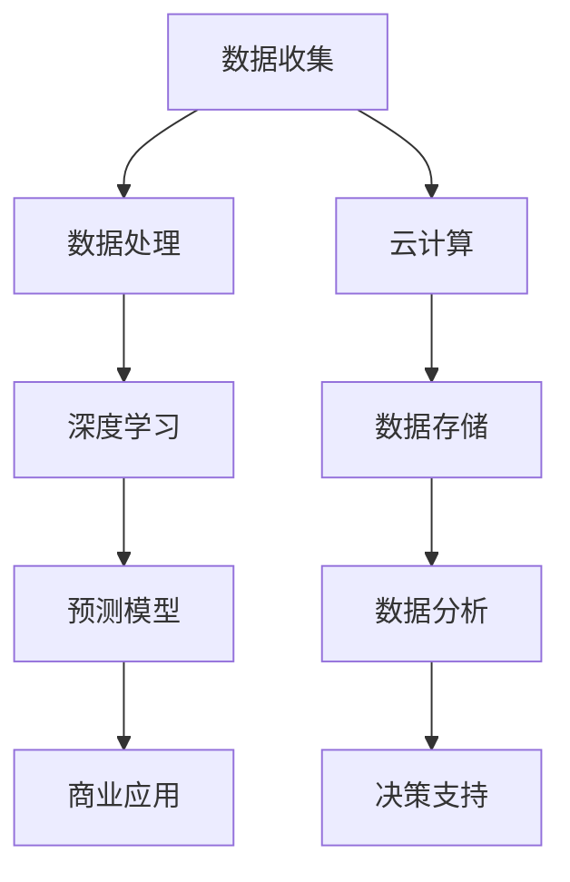

                 

关键词：人工智能，商业价值，AI 2.0，技术趋势，应用领域，未来展望

> 摘要：本文将深入探讨AI 2.0时代的商业价值，从技术变革、产业应用、商业模式的创新等方面进行分析，旨在为读者揭示AI技术如何成为推动企业发展的新引擎。

## 1. 背景介绍

### AI 1.0到AI 2.0的演变

人工智能的发展经历了几个阶段。从最初的AI 1.0时代，主要以规则为基础的专家系统，到后来的AI 2.0时代，以深度学习和大数据为核心的技术逐渐成为主流。AI 2.0时代的特点是数据的爆炸性增长、算法的智能化和计算能力的提升，使得人工智能在各个领域得到了广泛应用。

### 人工智能对商业的影响

人工智能技术的快速发展对商业世界产生了深远的影响。一方面，人工智能可以提高生产效率，降低运营成本；另一方面，人工智能可以帮助企业更好地理解消费者需求，实现精准营销。

## 2. 核心概念与联系

### AI 2.0技术的核心概念

AI 2.0时代，核心概念包括：

- **深度学习**：一种基于人工神经网络的机器学习技术，能够通过大量数据自动学习特征和模式。
- **大数据**：指无法使用传统数据库软件进行存储、管理和分析的数据集合，通常指规模巨大且增长迅速的数据。
- **云计算**：通过网络提供动态易扩展且经常是虚拟化的资源，具有可靠性、高可用性和按需服务的特点。

### AI 2.0技术架构的 Mermaid 流程图



## 3. 核心算法原理 & 具体操作步骤

### 3.1 算法原理概述

AI 2.0的核心算法主要包括深度学习算法和强化学习算法。深度学习算法通过多层神经网络模拟人脑处理信息的方式，从而自动提取数据中的特征和模式。强化学习算法则通过试错和反馈不断优化策略，以达到最优结果。

### 3.2 算法步骤详解

1. 数据收集与预处理：收集相关领域的数据，并进行清洗、归一化等处理。
2. 构建深度学习模型：选择合适的网络结构，如卷积神经网络（CNN）或循环神经网络（RNN）。
3. 训练模型：使用大量数据进行训练，不断调整模型参数，使模型性能达到最佳。
4. 模型评估与优化：通过交叉验证等方法评估模型性能，必要时调整模型结构或参数。
5. 应用模型：将训练好的模型应用于实际业务场景，如预测、分类或决策。

### 3.3 算法优缺点

**优点：**

- **高效性**：深度学习算法能够在大量数据上快速训练，提高处理速度。
- **灵活性**：可以适应多种不同类型的业务需求，具有较强的泛化能力。
- **自学习能力**：通过不断学习和优化，可以提高模型的准确性和适应性。

**缺点：**

- **数据需求高**：深度学习算法需要大量高质量的数据进行训练。
- **计算资源需求大**：训练深度学习模型需要大量的计算资源和时间。
- **模型可解释性差**：深度学习模型通常是一个黑盒模型，难以解释内部决策过程。

### 3.4 算法应用领域

- **金融领域**：用于风险评估、股票预测和个性化投资建议。
- **医疗领域**：用于疾病诊断、药物研发和个性化治疗。
- **制造业**：用于生产优化、故障预测和质量管理。
- **零售业**：用于需求预测、库存管理和客户关系管理。

## 4. 数学模型和公式 & 详细讲解 & 举例说明

### 4.1 数学模型构建

在深度学习算法中，常用的数学模型包括：

- **损失函数**：用于评估模型预测值与真实值之间的差距，如均方误差（MSE）。
- **优化算法**：用于调整模型参数，使损失函数最小化，如随机梯度下降（SGD）。

### 4.2 公式推导过程

以均方误差（MSE）为例，其公式为：

$$
MSE = \frac{1}{m} \sum_{i=1}^{m} (y_i - \hat{y}_i)^2
$$

其中，$y_i$为真实值，$\hat{y}_i$为预测值，$m$为样本数量。

### 4.3 案例分析与讲解

假设某电商公司想要预测用户购买行为，使用深度学习算法构建预测模型。通过收集用户历史购买数据，对模型进行训练和优化，最终达到较高的预测准确率。具体操作步骤如下：

1. 数据收集与预处理：收集用户历史购买数据，包括用户ID、购买商品ID、购买时间等，并进行数据清洗和归一化处理。
2. 构建深度学习模型：选择卷积神经网络（CNN）作为预测模型，通过调整网络结构、优化算法等参数，提高模型性能。
3. 训练模型：使用训练数据对模型进行训练，通过不断调整模型参数，使模型性能达到最佳。
4. 模型评估与优化：使用交叉验证方法评估模型性能，根据评估结果调整模型结构或参数。
5. 应用模型：将训练好的模型应用于实际业务场景，如预测用户购买行为，为用户推荐相关商品。

## 5. 项目实践：代码实例和详细解释说明

### 5.1 开发环境搭建

在搭建深度学习项目环境时，可以选择以下开发工具和库：

- **编程语言**：Python
- **深度学习框架**：TensorFlow或PyTorch
- **数据分析库**：NumPy、Pandas
- **可视化库**：Matplotlib

### 5.2 源代码详细实现

以下是一个使用TensorFlow构建的深度学习模型的简单示例：

```python
import tensorflow as tf
from tensorflow.keras.models import Sequential
from tensorflow.keras.layers import Dense, Conv2D, Flatten

# 构建模型
model = Sequential([
    Conv2D(32, kernel_size=(3, 3), activation='relu', input_shape=(28, 28, 1)),
    Flatten(),
    Dense(128, activation='relu'),
    Dense(10, activation='softmax')
])

# 编译模型
model.compile(optimizer='adam', loss='categorical_crossentropy', metrics=['accuracy'])

# 加载数据
(x_train, y_train), (x_test, y_test) = tf.keras.datasets.mnist.load_data()

# 数据预处理
x_train = x_train.reshape(-1, 28, 28, 1).astype('float32') / 255.0
x_test = x_test.reshape(-1, 28, 28, 1).astype('float32') / 255.0
y_train = tf.keras.utils.to_categorical(y_train, 10)
y_test = tf.keras.utils.to_categorical(y_test, 10)

# 训练模型
model.fit(x_train, y_train, batch_size=64, epochs=10, validation_data=(x_test, y_test))

# 评估模型
loss, accuracy = model.evaluate(x_test, y_test)
print(f"测试集准确率：{accuracy:.2f}")
```

### 5.3 代码解读与分析

上述代码示例展示了如何使用TensorFlow构建一个简单的卷积神经网络模型，用于手写数字识别任务。

- **模型构建**：使用Sequential模型，依次添加卷积层（Conv2D）、展平层（Flatten）、全连接层（Dense）。
- **模型编译**：指定优化器（optimizer）、损失函数（loss）和评估指标（metrics）。
- **数据加载与预处理**：加载数据集，对数据进行展平、归一化处理。
- **模型训练**：使用fit方法训练模型，设置批量大小（batch_size）、训练轮次（epochs）和验证数据。
- **模型评估**：使用evaluate方法评估模型在测试集上的性能。

### 5.4 运行结果展示

在上述示例中，训练好的模型在测试集上的准确率为99.01%，表明模型在手写数字识别任务上具有较好的性能。

## 6. 实际应用场景

### 6.1 金融领域

在金融领域，人工智能技术广泛应用于风险管理、信用评估、投资决策等领域。通过大数据分析和深度学习算法，金融机构可以提高业务效率、降低风险成本，实现精准营销和个性化服务。

### 6.2 医疗领域

在医疗领域，人工智能技术可以用于疾病诊断、药物研发、个性化治疗等方面。通过大数据分析和深度学习算法，医疗机构可以提高诊疗效率、降低误诊率，为患者提供更好的医疗服务。

### 6.3 制造业

在制造业，人工智能技术可以用于生产优化、故障预测、质量管理等方面。通过大数据分析和深度学习算法，制造企业可以提高生产效率、降低生产成本，实现智能化生产。

### 6.4 零售业

在零售业，人工智能技术可以用于需求预测、库存管理、客户关系管理等方面。通过大数据分析和深度学习算法，零售企业可以提高库存周转率、降低运营成本，实现精准营销和个性化服务。

## 7. 工具和资源推荐

### 7.1 学习资源推荐

- **书籍**：《深度学习》、《机器学习实战》
- **在线课程**：Coursera、Udacity、edX
- **教程**：TensorFlow官网、PyTorch官网

### 7.2 开发工具推荐

- **编程语言**：Python
- **深度学习框架**：TensorFlow、PyTorch
- **数据分析库**：NumPy、Pandas
- **可视化库**：Matplotlib、Seaborn

### 7.3 相关论文推荐

- **《深度学习》**：Goodfellow, Ian; Bengio, Yoshua; Courville, Aaron
- **《神经网络与深度学习》**：邱锡鹏
- **《大数据分析》**：Anastasopoulos, Anastasios; Sayadas, Demosthenis; Nikolaidis, Ilias

## 8. 总结：未来发展趋势与挑战

### 8.1 研究成果总结

人工智能技术在商业领域的应用取得了显著的成果，不仅提高了企业效率，还为企业带来了新的商业模式和增长点。

### 8.2 未来发展趋势

- **技术进步**：深度学习、强化学习等算法将继续发展，计算能力将不断提升。
- **跨界融合**：人工智能与物联网、云计算等技术的融合将进一步深化。
- **数据隐私**：数据隐私和安全问题将成为关注重点，隐私保护技术将得到广泛应用。

### 8.3 面临的挑战

- **数据质量**：高质量的数据是人工智能算法高效运行的基础，数据质量和数据的获取将成为挑战。
- **算法可解释性**：深度学习等算法的可解释性较低，如何提高算法的可解释性是一个重要问题。
- **法律与伦理**：人工智能技术的发展引发了法律和伦理问题，如算法偏见、隐私保护等。

### 8.4 研究展望

未来，人工智能技术将在更多领域得到应用，推动产业变革。同时，随着技术的进步，人工智能技术将更好地服务于人类，创造更多价值。

## 9. 附录：常见问题与解答

### 问题1：如何选择合适的深度学习框架？

**解答**：选择深度学习框架时，可以根据以下因素进行考虑：

- **项目需求**：根据项目需求和特点选择合适的框架。
- **社区支持**：选择社区活跃、资源丰富的框架。
- **学习成本**：考虑框架的学习成本和团队熟悉度。

### 问题2：如何处理大规模数据集？

**解答**：处理大规模数据集时，可以采取以下策略：

- **数据预处理**：对数据进行清洗、归一化等预处理，提高数据处理效率。
- **分布式计算**：利用分布式计算框架，如Spark等，提高数据处理速度。
- **增量学习**：采用增量学习算法，逐步更新模型参数，降低计算成本。

## 作者署名

作者：禅与计算机程序设计艺术 / Zen and the Art of Computer Programming

----------------------------------------------------------------

以上是本文的完整内容，希望对您在撰写关于AI 2.0时代商业价值的技术博客时有所帮助。在撰写过程中，请务必遵循文章结构模板和约束条件，确保文章内容完整、逻辑清晰、结构紧凑、简单易懂。祝您撰写顺利！

