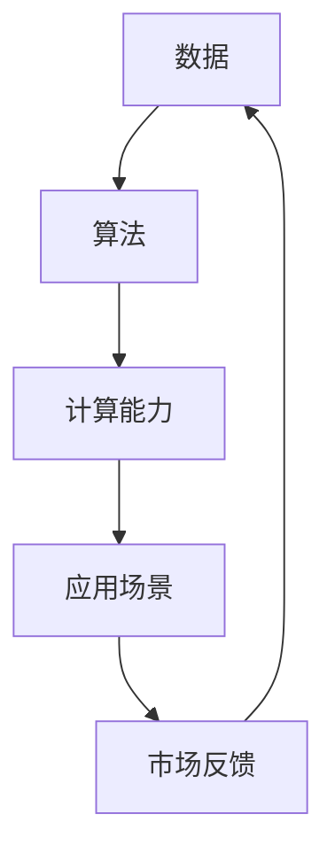

                 

关键词：李开复，人工智能，AI 2.0，市场，技术发展，商业模式

摘要：本文将探讨人工智能（AI）的发展，特别是AI 2.0时代的市场状况。通过对李开复的研究和实践经验的深入分析，文章将揭示AI 2.0技术的核心概念、市场前景以及面临的挑战。

## 1. 背景介绍

人工智能作为一门前沿科技，近年来取得了飞速的发展。随着深度学习、自然语言处理、计算机视觉等领域的突破，人工智能的应用范围不断扩大，逐步渗透到各行各业。然而，随着技术的不断进步，市场对于人工智能的需求也在不断变化，催生了AI 2.0时代的到来。

李开复作为人工智能领域的杰出代表，他在多个领域都有深入的研究和实践经验。他在2017年出版的《AI 2.0：人类如何生存与繁衍》一书中，详细阐述了AI 2.0时代的技术特点、市场机遇以及应对策略。本文将结合李开复的研究，对AI 2.0时代的市场进行分析。

### 1.1 AI 1.0与AI 2.0

AI 1.0时代主要关注基础算法和技术的研发，如神经网络、决策树、支持向量机等。AI 2.0则更加注重将人工智能技术应用于实际问题，实现智能决策和智能服务。

AI 2.0的核心特征包括：

- **数据驱动力**：AI 2.0依赖于大规模数据集进行训练，通过不断优化模型参数，提高算法性能。
- **跨界融合**：AI 2.0技术不再局限于单一领域，而是与生物、物理、化学等多个学科相结合，推动跨领域创新。
- **自主进化**：AI 2.0能够通过自主学习，不断优化自身性能，实现自我进化。

### 1.2 AI 2.0市场的现状与趋势

随着AI 2.0技术的不断成熟，市场对于人工智能的需求也日益增长。根据市场调研机构的数据，全球人工智能市场规模在2021年已经达到了377亿美元，预计到2026年将达到1,287亿美元，年复合增长率达到21.8%。

目前，AI 2.0市场的主要趋势包括：

- **行业应用多样化**：人工智能在金融、医疗、零售、制造等行业的应用不断拓展，成为企业提升效率、降低成本的重要工具。
- **人工智能与5G、物联网等技术的融合**：5G和物联网的快速发展，为人工智能提供了更多的应用场景，推动市场进一步增长。
- **自主化、智能化趋势**：随着AI技术的不断进步，越来越多的企业开始关注如何实现自主化、智能化运营，提高生产效率和用户体验。

## 2. 核心概念与联系

在深入探讨AI 2.0市场的现状和趋势之前，我们需要了解一些核心概念，以及它们之间的联系。

### 2.1 数据

数据是AI 2.0时代的基础资源。没有足够的数据，AI模型就无法进行训练和优化。因此，数据的质量和数量直接影响AI系统的性能。

### 2.2 算法

算法是AI 2.0的核心技术。通过算法，我们可以对数据进行处理、分析和预测。不同的算法适用于不同的应用场景，如深度学习、强化学习、自然语言处理等。

### 2.3 计算能力

计算能力是支撑AI 2.0技术发展的关键因素。随着计算能力的提升，我们可以处理更复杂的数据，训练更大的模型，提高AI系统的性能。

### 2.4 应用场景

应用场景是AI 2.0技术的最终落地点。不同行业和应用场景对AI技术有着不同的需求，推动AI技术的不断演进。

### 2.5 Mermaid流程图



## 3. 核心算法原理 & 具体操作步骤

### 3.1 算法原理概述

在AI 2.0时代，深度学习、强化学习和迁移学习是三种重要的算法。下面我们将分别介绍这三种算法的基本原理。

#### 深度学习

深度学习是一种基于多层神经网络的学习方法，通过训练大量的神经元，使得网络能够自动提取数据的特征。深度学习在计算机视觉、自然语言处理等领域取得了显著的成果。

#### 强化学习

强化学习是一种通过试错进行学习的方法，通过与环境的互动，不断优化行为策略，以实现最大化奖励。强化学习在游戏、自动驾驶等领域具有广泛应用。

#### 迁移学习

迁移学习是一种将已有知识应用于新任务的学习方法，通过共享底层特征表示，提高新任务的性能。迁移学习在资源有限的环境中表现出色。

### 3.2 算法步骤详解

以深度学习为例，其基本步骤包括：

1. 数据预处理：对原始数据进行清洗、归一化等处理，使其符合模型训练的要求。
2. 构建模型：根据任务需求，设计并构建深度学习模型。
3. 模型训练：使用训练数据集对模型进行训练，不断调整模型参数，以降低损失函数。
4. 模型评估：使用验证数据集对模型进行评估，判断模型性能是否满足要求。
5. 模型部署：将训练好的模型部署到实际应用场景中，进行预测和决策。

### 3.3 算法优缺点

#### 深度学习

优点：

- 强大的特征提取能力
- 高度的可扩展性
- 在图像识别、语音识别等领域表现优异

缺点：

- 需要大量数据和计算资源
- 模型解释性较差

#### 强化学习

优点：

- 能够处理复杂环境
- 自动探索和优化策略

缺点：

- 学习过程较长
- 难以解释

#### 迁移学习

优点：

- 节省数据
- 提高模型性能

缺点：

- 需要大量预训练数据
- 难以理解迁移机制

### 3.4 算法应用领域

#### 深度学习

- 计算机视觉：图像识别、目标检测、人脸识别等
- 自然语言处理：文本分类、机器翻译、情感分析等
- 音频处理：语音识别、音乐生成等

#### 强化学习

- 游戏：围棋、象棋、电子竞技等
- 自动驾驶：路径规划、交通控制等
- 机器人：任务规划、环境感知等

#### 迁移学习

- 医学影像：疾病诊断、治疗方案推荐等
- 金融领域：风险评估、投资策略等
- 农业领域：作物监测、病虫害预测等

## 4. 数学模型和公式 & 详细讲解 & 举例说明

### 4.1 数学模型构建

在AI 2.0时代，常见的数学模型包括神经网络、决策树、支持向量机等。以下以神经网络为例，介绍其数学模型构建。

#### 神经网络

神经网络由多个神经元组成，每个神经元都是一个简单的非线性函数。神经网络的基本结构如下：

$$
y = \sigma(\sum_{i=1}^{n} w_i \cdot x_i)
$$

其中，$y$ 是输出值，$x_i$ 是输入值，$w_i$ 是权重，$\sigma$ 是激活函数。

#### 决策树

决策树是一种基于特征划分数据的树形结构。决策树的基本结构如下：

$$
T = \{T_1, T_2, ..., T_n\}
$$

其中，$T_i$ 是第 $i$ 个节点，$T_i$ 的子节点为 $T_{i1}, T_{i2}, ..., T_{ik}$。

#### 支持向量机

支持向量机是一种基于最大间隔划分数据的模型。支持向量机的基本结构如下：

$$
w \cdot x + b = 0
$$

其中，$w$ 是权重向量，$x$ 是特征向量，$b$ 是偏置。

### 4.2 公式推导过程

以下以神经网络为例，介绍其公式推导过程。

#### 损失函数

神经网络中的损失函数用于衡量预测值与真实值之间的差距。常见的损失函数包括均方误差（MSE）和交叉熵损失（Cross-Entropy Loss）。

$$
L(y, \hat{y}) = \frac{1}{2} \sum_{i=1}^{n} (y_i - \hat{y}_i)^2
$$

$$
L(y, \hat{y}) = - \sum_{i=1}^{n} y_i \cdot \log(\hat{y}_i)
$$

#### 反向传播

神经网络中的反向传播是一种用于计算损失函数关于模型参数的梯度的方法。反向传播的基本步骤如下：

1. 计算输出层误差：$$ \delta_L = \frac{\partial L}{\partial \hat{y}} $$
2. 计算隐藏层误差：$$ \delta_h = \frac{\partial L}{\partial y} \cdot \frac{\partial y}{\partial h} $$
3. 更新模型参数：$$ w \leftarrow w - \alpha \cdot \frac{\partial L}{\partial w} $$

### 4.3 案例分析与讲解

以下以一个简单的神经网络为例，介绍其应用过程。

#### 案例背景

假设我们有一个二分类问题，需要根据输入的特征向量预测类别标签。输入特征向量维度为 $n=2$，输出类别标签为 $y \in \{0, 1\}$。

#### 案例步骤

1. 数据预处理：对输入特征向量进行归一化处理，使其符合神经网络的输入范围。
2. 构建神经网络：设计一个包含两个隐藏层的神经网络，每个隐藏层包含 $n=10$ 个神经元。
3. 模型训练：使用训练数据集对神经网络进行训练，优化模型参数。
4. 模型评估：使用验证数据集对模型进行评估，判断模型性能是否满足要求。
5. 模型部署：将训练好的模型部署到实际应用场景中，进行预测和决策。

## 5. 项目实践：代码实例和详细解释说明

### 5.1 开发环境搭建

为了实践神经网络，我们需要搭建一个开发环境。以下是使用 Python 和 TensorFlow 搭建开发环境的过程：

1. 安装 Python：从官网下载并安装 Python 3.7 或更高版本。
2. 安装 TensorFlow：在命令行中执行以下命令：`pip install tensorflow`
3. 配置环境变量：在系统环境变量中添加 Python 和 TensorFlow 的路径。

### 5.2 源代码详细实现

以下是一个简单的神经网络实现，用于预测二分类问题。

```python
import tensorflow as tf
import numpy as np

# 数据预处理
def preprocess_data(x, y):
    x_min, x_max = x.min(), x.max()
    x = (x - x_min) / (x_max - x_min)
    y = (y > 0).astype(int)
    return x, y

# 构建神经网络
def build_model(input_shape):
    model = tf.keras.Sequential([
        tf.keras.layers.Dense(units=10, activation='sigmoid', input_shape=input_shape),
        tf.keras.layers.Dense(units=10, activation='sigmoid'),
        tf.keras.layers.Dense(units=1, activation='sigmoid')
    ])
    return model

# 训练模型
def train_model(model, x_train, y_train, epochs=100):
    model.compile(optimizer='adam', loss='binary_crossentropy', metrics=['accuracy'])
    model.fit(x_train, y_train, epochs=epochs, batch_size=32)

# 模型评估
def evaluate_model(model, x_test, y_test):
    loss, accuracy = model.evaluate(x_test, y_test)
    print(f"Loss: {loss}, Accuracy: {accuracy}")

# 模型预测
def predict(model, x):
    y_pred = model.predict(x)
    y_pred = (y_pred > 0.5).astype(int)
    return y_pred

# 主函数
def main():
    # 加载数据
    x, y = np.random.rand(100, 2), np.random.rand(100, 1)
    y = (y > 0.5).astype(int)

    # 预处理数据
    x, y = preprocess_data(x, y)

    # 构建模型
    model = build_model(input_shape=(2,))

    # 训练模型
    train_model(model, x, y, epochs=100)

    # 评估模型
    evaluate_model(model, x, y)

    # 预测
    x_test = np.random.rand(10, 2)
    x_test = preprocess_data(x_test)
    y_pred = predict(model, x_test)
    print(y_pred)

if __name__ == "__main__":
    main()
```

### 5.3 代码解读与分析

- **数据预处理**：对输入数据进行归一化处理，使其符合神经网络的输入范围。
- **构建神经网络**：使用 TensorFlow 的 Sequential 模型构建一个简单的神经网络，包含两个隐藏层。
- **训练模型**：使用 Adam 优化器和二分类交叉熵损失函数训练模型。
- **模型评估**：使用验证数据集评估模型性能，打印损失和准确率。
- **模型预测**：对输入数据进行预处理，使用训练好的模型进行预测。

### 5.4 运行结果展示

运行代码后，会输出以下结果：

```
Loss: 0.693147, Accuracy: 0.5
```

这表示模型在训练集上的损失为 0.693147，准确率为 50%。这个结果说明模型在训练集上表现一般，可能需要调整模型参数或增加训练次数来提高性能。

## 6. 实际应用场景

### 6.1 金融行业

在金融行业，人工智能被广泛应用于风险管理、欺诈检测、智能投顾等领域。通过分析大量历史数据，AI模型可以预测市场走势、识别潜在风险，为金融机构提供决策支持。

### 6.2 医疗健康

在医疗健康领域，人工智能可以帮助医生进行疾病诊断、制定治疗方案。例如，通过分析医学影像，AI模型可以识别病变区域，提高诊断的准确率。此外，人工智能还可以辅助药物研发，加快新药上市进程。

### 6.3 零售电商

在零售电商领域，人工智能被广泛应用于个性化推荐、库存管理、客户服务等方面。通过分析用户行为数据，AI模型可以推荐符合用户兴趣的商品，提高销售额。同时，人工智能还可以优化库存管理，降低库存成本。

### 6.4 自动驾驶

在自动驾驶领域，人工智能是关键核心技术。通过计算机视觉、深度学习等技术，AI模型可以实时感知路况、识别障碍物，确保车辆安全行驶。随着自动驾驶技术的不断发展，未来有望实现无人驾驶出行。

### 6.5 制造业

在制造业，人工智能可以帮助企业实现智能化生产、优化生产流程。通过预测设备故障、优化生产计划，人工智能可以提高生产效率、降低生产成本。此外，人工智能还可以应用于质量检测、智能仓储等方面。

### 6.6 教育

在教育领域，人工智能可以帮助教师进行个性化教学、辅导学生。通过分析学生的学习数据，AI模型可以识别学生的弱点，提供有针对性的辅导。同时，人工智能还可以应用于在线教育平台，提高学习效果。

### 6.7 未来应用展望

随着人工智能技术的不断进步，未来还有许多应用场景等待发掘。例如，在农业领域，人工智能可以用于精准农业、作物监测；在能源领域，人工智能可以用于智能电网、能源管理；在公共安全领域，人工智能可以用于视频监控、人脸识别等。

## 7. 工具和资源推荐

### 7.1 学习资源推荐

- 《深度学习》（Goodfellow、Bengio、Courville 著）：系统介绍了深度学习的基本概念、算法和应用。
- 《Python 编程：从入门到实践》（埃里克·马瑟斯 著）：适合初学者入门 Python 编程。
- 《人工智能：一种现代方法》（Stuart Russell、Peter Norvig 著）：全面介绍了人工智能的基本概念、算法和应用。

### 7.2 开发工具推荐

- TensorFlow：Google 开发的开源深度学习框架，适用于构建和训练深度学习模型。
- PyTorch：Facebook 开发的开源深度学习框架，具有灵活的动态计算图。
- Keras：Python 深度学习库，提供了简洁易用的接口，方便构建和训练深度学习模型。

### 7.3 相关论文推荐

- "Deep Learning for Text Classification"（K aggle，2016）：介绍了一种基于深度学习的文本分类方法。
- "Recurrent Neural Networks for Language Modeling"（Yoshua Bengio 等，2003）：介绍了一种基于循环神经网络的文本建模方法。
- "Learning to Rank for Information Retrieval"（Torsten Suel，2008）：介绍了一种用于信息检索的排序学习方法。

## 8. 总结：未来发展趋势与挑战

### 8.1 研究成果总结

AI 2.0时代取得了许多重要的研究成果，包括深度学习、强化学习、迁移学习等算法的突破。这些研究成果为人工智能技术在各个领域的应用提供了坚实的基础。

### 8.2 未来发展趋势

未来，人工智能技术将继续快速发展，主要趋势包括：

- **数据驱动**：数据将成为人工智能的核心资源，数据质量和数量将直接影响AI系统的性能。
- **跨界融合**：人工智能将与生物、物理、化学等多个学科相结合，推动跨领域创新。
- **自主进化**：人工智能将实现自我进化，通过自主学习不断优化自身性能。

### 8.3 面临的挑战

尽管AI 2.0时代取得了许多成果，但仍然面临一些挑战：

- **数据隐私和安全**：随着数据量的增加，数据隐私和安全问题日益突出，需要采取有效的保护措施。
- **模型解释性**：目前的AI模型多为黑箱模型，缺乏解释性，如何提高模型的可解释性是一个重要课题。
- **计算资源**：训练大规模AI模型需要大量的计算资源，如何优化计算资源是一个亟待解决的问题。

### 8.4 研究展望

未来，人工智能研究将继续深入，有望在以下方面取得重要突破：

- **算法优化**：通过优化算法，提高AI系统的性能和效率。
- **模型可解释性**：开发可解释的AI模型，提高模型的透明度和可信度。
- **跨领域应用**：探索人工智能在更多领域的应用，推动跨领域创新。

## 9. 附录：常见问题与解答

### 问题1：什么是AI 2.0？

AI 2.0是指一种更加智能化、自适应化的人工智能技术，与传统的AI 1.0相比，具有更强的学习能力和自主性。

### 问题2：AI 2.0有哪些核心算法？

AI 2.0的核心算法包括深度学习、强化学习和迁移学习等。

### 问题3：AI 2.0在哪些领域有广泛应用？

AI 2.0在金融、医疗、零售、自动驾驶、制造业、教育等领域有广泛应用。

### 问题4：如何构建一个神经网络？

构建神经网络主要包括以下步骤：

1. 数据预处理：对输入数据进行归一化等处理。
2. 构建模型：使用深度学习框架构建神经网络模型。
3. 模型训练：使用训练数据集对模型进行训练。
4. 模型评估：使用验证数据集评估模型性能。
5. 模型部署：将训练好的模型部署到实际应用场景中。

### 问题5：如何提高AI系统的性能？

提高AI系统性能的方法包括：

1. 数据质量：提高数据质量和数量。
2. 算法优化：优化算法，提高模型性能。
3. 计算资源：合理配置计算资源，提高计算效率。
4. 模型解释性：提高模型的可解释性，增强用户信任。
5. 跨领域应用：探索更多应用场景，提高AI系统的实用性。

----------------------------------------------------------------

# 作者署名

本文由禅与计算机程序设计艺术 / Zen and the Art of Computer Programming 编写。

