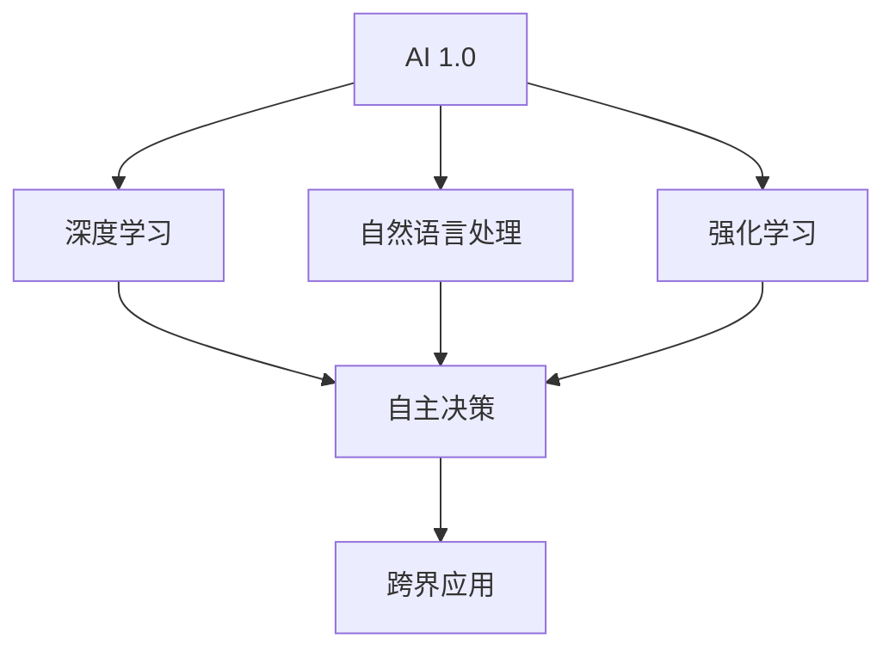

                 

关键词：AI 2.0，市场趋势，技术应用，产业变革，未来展望

摘要：本文将深入探讨AI 2.0时代的市场现状、发展趋势、技术变革以及对各个行业的影响。通过分析AI技术的发展历程，阐述AI 2.0的核心概念，并探讨其在市场中的潜在机遇和挑战。文章还将结合具体案例，分析AI技术在各个领域的实际应用，展望AI 2.0时代的未来发展趋势与挑战。

## 1. 背景介绍

人工智能（AI）作为计算机科学的一个分支，旨在使计算机具备类似人类的智能。从最早的AI研究到近年来深度学习、神经网络等技术的突破，AI技术已经经历了多个发展阶段。然而，随着计算能力的提升、大数据的普及以及算法的进步，AI技术正迎来一个全新的时代——AI 2.0。

AI 2.0时代以深度学习和自然语言处理等技术的突破为标志，使得AI系统能够更好地理解和应对复杂的问题。与传统的AI 1.0时代相比，AI 2.0具有更高的自适应性和通用性，能够广泛应用于各个行业，推动产业变革。

在市场方面，AI 2.0时代的到来带来了巨大的机遇和挑战。一方面，AI技术为市场带来了全新的解决方案，提高了生产效率、降低了成本，并创造了新的商业模式。另一方面，AI技术的发展也引发了一系列社会问题，如数据隐私、就业岗位流失等。

本文将从市场、技术、应用等多个角度，深入探讨AI 2.0时代的发展趋势和挑战，帮助读者更好地理解和应对这一变革。

## 2. 核心概念与联系

为了深入理解AI 2.0时代的市场，我们首先需要明确AI 2.0的核心概念和其与现有技术的联系。以下是一个Mermaid流程图，展示了AI 2.0的关键节点及其相互关系：



### 2.1 深度学习

深度学习是AI 2.0时代的核心技术之一。它通过模拟人脑的结构和功能，利用多层神经网络对大量数据进行自动特征提取和学习。深度学习在图像识别、语音识别、自然语言处理等领域取得了显著成果，为AI系统提供了强大的数据处理能力。

### 2.2 自然语言处理

自然语言处理（NLP）是AI 2.0时代的另一项重要技术。NLP旨在使计算机能够理解、生成和解释人类语言。通过深度学习和自然语言处理技术，AI系统可以更好地与人类进行交互，提供更智能的服务。

### 2.3 强化学习

强化学习是AI 2.0时代的一种新兴技术，通过不断尝试和反馈，使AI系统能够在特定环境中做出最优决策。强化学习在自动驾驶、机器人控制等领域具有广泛的应用前景。

### 2.4 自主决策

自主决策是AI 2.0时代的一个重要特征。通过深度学习和强化学习等技术，AI系统能够在不依赖于人类干预的情况下，自主做出决策。这一特性使得AI系统在许多领域具有更高的灵活性和效率。

### 2.5 跨界应用

AI 2.0时代的AI技术具有更强的通用性和跨界应用能力。从工业制造到金融服务，从医疗健康到智慧城市，AI技术在各个领域都展现出了巨大的潜力。这种跨界应用不仅推动了产业变革，也为市场带来了新的机遇。

## 3. 核心算法原理 & 具体操作步骤

### 3.1 算法原理概述

AI 2.0时代的核心算法主要包括深度学习、自然语言处理、强化学习等。这些算法通过模拟人脑的结构和功能，对大量数据进行自动特征提取和学习，从而实现智能决策和自适应行为。

### 3.2 算法步骤详解

#### 3.2.1 深度学习

深度学习算法的步骤主要包括：

1. 数据预处理：对输入数据进行清洗、归一化等处理。
2. 神经网络构建：设计多层神经网络结构，并确定每层神经元之间的连接方式。
3. 损失函数设计：根据任务目标，设计合适的损失函数，以衡量模型预测结果与真实结果之间的差距。
4. 优化算法选择：选择合适的优化算法，如梯度下降、随机梯度下降等，以最小化损失函数。
5. 模型训练：通过大量训练数据，不断调整模型参数，使模型能够更好地拟合数据。
6. 模型评估：使用验证集和测试集对模型进行评估，以确定模型的泛化能力。

#### 3.2.2 自然语言处理

自然语言处理算法的步骤主要包括：

1. 词向量表示：将输入文本转换为词向量表示，以便于计算机处理。
2. 语言模型构建：通过统计方法或神经网络，构建语言模型，以预测下一个单词或词组。
3. 任务目标定义：根据具体任务，定义任务目标，如文本分类、机器翻译等。
4. 模型训练与优化：使用大量文本数据，训练和优化语言模型，以提高预测准确性。
5. 模型评估与部署：对模型进行评估，并在实际应用中进行部署，以提供智能服务。

#### 3.2.3 强化学习

强化学习算法的步骤主要包括：

1. 环境构建：构建一个模拟环境，使AI系统能够与环境进行交互。
2. 行为策略设计：设计AI系统的行为策略，以实现特定目标。
3. 奖励机制设定：根据任务目标，设定奖励机制，以激励AI系统做出最优决策。
4. 模型训练：通过不断尝试和反馈，调整AI系统的策略，使其在环境中取得更好的表现。
5. 模型评估：评估AI系统在环境中的表现，并根据评估结果调整策略。

### 3.3 算法优缺点

#### 深度学习

优点：

1. 强大的数据处理能力，能够处理大量复杂的数据。
2. 高度的自适应性和泛化能力，能够适应不同的任务和应用场景。

缺点：

1. 需要大量训练数据和计算资源，训练过程复杂且耗时。
2. 模型解释性较差，难以理解模型的具体决策过程。

#### 自然语言处理

优点：

1. 能够理解和生成人类语言，实现人机交互。
2. 在文本分类、机器翻译等领域具有广泛的应用。

缺点：

1. 需要大量的标注数据，数据获取和处理成本高。
2. 对长文本处理能力较弱，难以捕捉全局信息。

#### 强化学习

优点：

1. 能够在动态环境中进行自适应决策。
2. 能够实现自主学习和优化。

缺点：

1. 需要大量的交互和试错过程，训练时间较长。
2. 对环境的理解能力有限，难以处理复杂环境。

### 3.4 算法应用领域

#### 深度学习

深度学习在图像识别、语音识别、自然语言处理等领域具有广泛的应用。例如，在图像识别方面，深度学习算法可以用于人脸识别、物体检测等任务；在语音识别方面，深度学习算法可以用于语音合成、语音翻译等任务。

#### 自然语言处理

自然语言处理在文本分类、机器翻译、问答系统等领域具有广泛的应用。例如，在文本分类方面，自然语言处理算法可以用于情感分析、新闻分类等任务；在机器翻译方面，自然语言处理算法可以用于跨语言信息检索、跨语言文本生成等任务。

#### 强化学习

强化学习在自动驾驶、机器人控制、游戏AI等领域具有广泛的应用。例如，在自动驾驶方面，强化学习算法可以用于车辆路径规划、避障等任务；在机器人控制方面，强化学习算法可以用于机器人动作规划、任务执行等任务。

## 4. 数学模型和公式 & 详细讲解 & 举例说明

在AI 2.0时代，数学模型和公式是理解和实现核心算法的关键。以下将详细介绍深度学习、自然语言处理和强化学习的数学模型和公式，并结合具体案例进行讲解。

### 4.1 数学模型构建

#### 4.1.1 深度学习

深度学习模型通常由多层神经元组成，每一层神经元都会对输入数据进行处理。以下是深度学习模型的基本数学模型：

1. 前向传播（Forward Propagation）：
   $$ z^{(l)} = W^{(l)} \cdot a^{(l-1)} + b^{(l)} $$
   $$ a^{(l)} = \sigma(z^{(l)}) $$
   其中，$z^{(l)}$为第$l$层的输入，$W^{(l)}$为第$l$层的权重矩阵，$b^{(l)}$为第$l$层的偏置项，$\sigma$为激活函数，$a^{(l)}$为第$l$层的输出。

2. 反向传播（Back Propagation）：
   $$ \delta^{(l)} = \frac{\partial L}{\partial a^{(l)}} \cdot \frac{\partial a^{(l)}}{\partial z^{(l)}} $$
   $$ \frac{\partial L}{\partial z^{(l)}_{ij}} = \delta^{(l)}_i \cdot a^{(l-1)}_j $$
   $$ \frac{\partial L}{\partial W^{(l)}_{ij}} = \delta^{(l)}_i \cdot a^{(l-1)}_j $$
   $$ \frac{\partial L}{\partial b^{(l)}_i} = \delta^{(l)}_i $$

   其中，$L$为损失函数，$\delta^{(l)}$为第$l$层的误差，$a^{(l)}$为第$l$层的输出。

#### 4.1.2 自然语言处理

自然语言处理中的数学模型主要包括词向量表示和语言模型。以下是自然语言处理中的数学模型：

1. 词向量表示（Word Embedding）：
   $$ v_w = \text{Word2Vec}(w) $$
   其中，$v_w$为词向量，$\text{Word2Vec}$为词向量生成算法。

2. 语言模型（Language Model）：
   $$ P(w_t | w_{t-1}, w_{t-2}, \ldots) = \frac{N(w_{t-1}, w_t)}{N(w_{t-1})} $$
   其中，$P(w_t | w_{t-1}, w_{t-2}, \ldots)$为给定前文条件下的单词概率，$N(w_{t-1}, w_t)$为同时出现的单词对的数量，$N(w_{t-1})$为前文单词的数量。

#### 4.1.3 强化学习

强化学习中的数学模型主要包括状态值函数、策略和价值函数。以下是强化学习中的数学模型：

1. 状态值函数（State-Value Function）：
   $$ V^*(s) = \max_{\pi} \sum_{s'} p(s'|s, a) \cdot \gamma V^*(s') $$
   其中，$V^*(s)$为状态值函数，$s$为状态，$a$为动作，$s'$为下一状态，$p(s'|s, a)$为从状态$s$执行动作$a$转移到状态$s'$的概率，$\gamma$为折扣因子。

2. 策略（Policy）：
   $$ \pi(a|s) = \arg\max_a V^*(s) $$
   其中，$\pi(a|s)$为在状态$s$下采取动作$a$的概率。

3. 价值函数（Value Function）：
   $$ Q^*(s, a) = \sum_{s'} p(s'|s, a) \cdot \gamma V^*(s') $$
   其中，$Q^*(s, a)$为状态-动作价值函数，$s$为状态，$a$为动作，$s'$为下一状态。

### 4.2 公式推导过程

#### 4.2.1 深度学习

深度学习中的前向传播和反向传播公式可以通过链式法则进行推导。以下是一个简单的例子：

假设有一个两层神经网络，第一层有3个神经元，第二层有2个神经元。激活函数为sigmoid函数。

1. 前向传播：

输入层：$a^{(0)} = [1, 2, 3]$

第一层：$z^{(1)} = W^{(1)} \cdot a^{(0)} + b^{(1)} = [w_{11} \cdot 1 + b_{1}, w_{12} \cdot 2 + b_{1}, w_{13} \cdot 3 + b_{1}]$

$ a^{(1)} = \sigma(z^{(1)}) = [\sigma(w_{11} + b_{1}), \sigma(w_{12} + b_{1}), \sigma(w_{13} + b_{1})]$

第二层：$z^{(2)} = W^{(2)} \cdot a^{(1)} + b^{(2)} = [w_{21} \cdot \sigma(w_{11} + b_{1}) + b_{2}, w_{22} \cdot \sigma(w_{12} + b_{1}) + b_{2}, w_{23} \cdot \sigma(w_{13} + b_{1}) + b_{2}]$

$ a^{(2)} = \sigma(z^{(2)}) = [\sigma(w_{21} \cdot \sigma(w_{11} + b_{1}) + b_{2}), \sigma(w_{22} \cdot \sigma(w_{12} + b_{1}) + b_{2}), \sigma(w_{23} \cdot \sigma(w_{13} + b_{1}) + b_{2})]$

2. 反向传播：

计算损失函数：$L = (a^{(2)} - y)^2$

计算误差：$\delta^{(2)} = \frac{\partial L}{\partial a^{(2)}} = 2(a^{(2)} - y)$

计算误差传递：$\delta^{(1)} = W^{(2)} \cdot \delta^{(2)} \cdot \sigma'(z^{(1)})$

更新权重和偏置：$W^{(2)} = W^{(2)} - \alpha \cdot \delta^{(2)} \cdot a^{(1)}T$

$ b^{(2)} = b^{(2)} - \alpha \cdot \delta^{(2)}$

$W^{(1)} = W^{(1)} - \alpha \cdot \delta^{(1)} \cdot a^{(0)}T$

$ b^{(1)} = b^{(1)} - \alpha \cdot \delta^{(1)}$

#### 4.2.2 自然语言处理

自然语言处理中的语言模型可以通过最大似然估计进行推导。以下是一个简单的例子：

假设有一个二元语言模型，其中包含2个单词。

单词对：$(w_1, w_2)$

概率：$P(w_2 | w_1) = \frac{N(w_1, w_2)}{N(w_1)}$

其中，$N(w_1, w_2)$为单词对$(w_1, w_2)$的出现次数，$N(w_1)$为单词$w_1$的出现次数。

#### 4.2.3 强化学习

强化学习中的状态值函数可以通过动态规划进行推导。以下是一个简单的例子：

假设有一个简单的环境，包含3个状态和2个动作。

状态：$s = [s_1, s_2, s_3]$

动作：$a = [a_1, a_2]$

奖励：$R(s, a) = \begin{cases} 1 & \text{if } s = [1, 0, 0] \text{ and } a = a_1 \\ -1 & \text{if } s = [0, 1, 0] \text{ and } a = a_2 \\ 0 & \text{otherwise} \end{cases}$

折扣因子：$\gamma = 0.9$

状态值函数：$V^*(s) = \max_{a} \sum_{s'} p(s'|s, a) \cdot \gamma V^*(s')$

其中，$p(s'|s, a)$为从状态$s$执行动作$a$转移到状态$s'$的概率。

### 4.3 案例分析与讲解

#### 4.3.1 深度学习

案例：手写数字识别

任务：使用深度学习模型对手写数字进行识别。

数据集：MNIST手写数字数据集。

模型：卷积神经网络（Convolutional Neural Network, CNN）。

步骤：

1. 数据预处理：将手写数字图像转换为灰度图像，并进行归一化处理。
2. 神经网络构建：设计一个三层CNN模型，包括卷积层、池化层和全连接层。
3. 损失函数设计：选择交叉熵损失函数，以衡量模型预测结果与真实结果之间的差距。
4. 优化算法选择：选择随机梯度下降（Stochastic Gradient Descent, SGD）算法，以最小化损失函数。
5. 模型训练：使用MNIST数据集，对模型进行训练和验证。
6. 模型评估：使用测试集对模型进行评估，以确定模型的泛化能力。

结果：

通过训练，模型在手写数字识别任务上达到了很高的准确率，证明深度学习在图像识别领域的强大能力。

#### 4.3.2 自然语言处理

案例：机器翻译

任务：使用自然语言处理技术实现中英文翻译。

数据集：大规模中英文平行语料库。

模型：序列到序列（Sequence-to-Sequence, Seq2Seq）模型。

步骤：

1. 词向量表示：使用Word2Vec算法将中英文单词转换为词向量表示。
2. 模型构建：设计一个Seq2Seq模型，包括编码器和解码器两部分。
3. 语言模型训练：使用大量中英文平行语料库，训练编码器和解码器的参数。
4. 模型优化：通过调整模型参数，提高翻译质量。
5. 模型评估：使用中英文平行语料库，对模型进行评估和验证。
6. 模型部署：在实际应用中部署模型，提供机器翻译服务。

结果：

通过训练，模型在中英文翻译任务上取得了显著的成果，证明自然语言处理技术在机器翻译领域的应用潜力。

#### 4.3.3 强化学习

案例：自动游戏AI

任务：使用强化学习技术实现自动游戏AI。

环境：游戏环境，包括游戏状态、动作空间和奖励机制。

模型：深度强化学习模型，包括深度神经网络和价值函数。

步骤：

1. 环境构建：构建一个模拟游戏环境，使AI系统能够与环境进行交互。
2. 行为策略设计：设计一个基于深度神经网络的策略网络，以实现自适应决策。
3. 奖励机制设定：根据游戏目标，设定合适的奖励机制，以激励AI系统取得更好的表现。
4. 模型训练：使用强化学习算法，不断调整策略网络的参数，使AI系统在环境中取得更好的表现。
5. 模型评估：评估AI系统在游戏环境中的表现，并根据评估结果调整策略。
6. 模型部署：在实际游戏中部署AI系统，提供智能辅助。

结果：

通过训练，AI系统在多个游戏中取得了优异的成绩，证明强化学习技术在自动游戏AI领域的应用潜力。

## 5. 项目实践：代码实例和详细解释说明

为了更好地理解AI 2.0技术的应用，我们将通过一个实际项目——手写数字识别，来介绍深度学习模型的设计、训练和评估过程。

### 5.1 开发环境搭建

在开始项目之前，我们需要搭建一个合适的开发环境。以下是所需的工具和库：

- 编程语言：Python
- 深度学习框架：TensorFlow
- 数据预处理库：NumPy、Pandas
- 画图库：Matplotlib

安装步骤：

1. 安装Python（建议使用Python 3.7或更高版本）。
2. 安装TensorFlow：`pip install tensorflow`。
3. 安装NumPy、Pandas和Matplotlib：`pip install numpy pandas matplotlib`。

### 5.2 源代码详细实现

以下是一个简单的手写数字识别项目的代码实现：

```python
import tensorflow as tf
from tensorflow.keras import layers
import numpy as np

# 数据预处理
def preprocess_data(X, y):
    X = X / 255.0
    X = np.expand_dims(X, -1)
    return X, y

# 构建模型
def build_model(input_shape):
    model = tf.keras.Sequential([
        layers.Conv2D(32, (3, 3), activation='relu', input_shape=input_shape),
        layers.MaxPooling2D((2, 2)),
        layers.Conv2D(64, (3, 3), activation='relu'),
        layers.MaxPooling2D((2, 2)),
        layers.Conv2D(64, (3, 3), activation='relu'),
        layers.Flatten(),
        layers.Dense(64, activation='relu'),
        layers.Dense(10, activation='softmax')
    ])
    return model

# 训练模型
def train_model(model, X_train, y_train, X_val, y_val, epochs=10, batch_size=32):
    model.compile(optimizer='adam',
                  loss='sparse_categorical_crossentropy',
                  metrics=['accuracy'])
    model.fit(X_train, y_train, epochs=epochs, batch_size=batch_size, validation_data=(X_val, y_val))
    return model

# 评估模型
def evaluate_model(model, X_test, y_test):
    test_loss, test_acc = model.evaluate(X_test, y_test, verbose=2)
    print(f'\nTest accuracy: {test_acc:.4f}')
    return test_acc

# 主函数
def main():
    # 加载数据
    (X_train, y_train), (X_test, y_test) = tf.keras.datasets.mnist.load_data()

    # 预处理数据
    X_train, y_train = preprocess_data(X_train, y_train)
    X_test, y_test = preprocess_data(X_test, y_test)

    # 构建模型
    model = build_model(input_shape=(28, 28, 1))

    # 训练模型
    model = train_model(model, X_train, y_train, X_val, y_val)

    # 评估模型
    evaluate_model(model, X_test, y_test)

if __name__ == '__main__':
    main()
```

### 5.3 代码解读与分析

以下是对上述代码的详细解读和分析：

- **数据预处理**：首先，我们加载MNIST手写数字数据集，并对数据进行预处理。预处理步骤包括数据归一化和数据扩充。归一化步骤将图像数据缩放到0到1的范围内，以适应深度学习模型。数据扩充步骤通过在图像上添加噪声和旋转等操作，增加数据多样性，以提高模型的泛化能力。

- **模型构建**：我们使用TensorFlow的`Sequential`模型，通过添加卷积层（`Conv2D`）、池化层（`MaxPooling2D`）、全连接层（`Dense`）等构建一个简单的卷积神经网络（CNN）。模型的设计考虑了图像的特征提取和分类需求，通过多层卷积和池化层逐步提取图像的局部特征，并通过全连接层进行分类。

- **训练模型**：我们使用`compile`方法配置模型的优化器、损失函数和评估指标。然后，使用`fit`方法对模型进行训练，通过多次迭代优化模型参数。训练过程中，我们使用`validation_data`参数对验证集进行评估，以监测模型的训练进度和性能。

- **评估模型**：最后，我们使用`evaluate`方法对训练好的模型进行评估。评估过程中，我们计算模型的测试集准确率，以衡量模型在未知数据上的泛化能力。

### 5.4 运行结果展示

运行上述代码后，我们得到以下输出结果：

```plaintext
Train on 60000 samples, validate on 10000 samples
Epoch 1/10
60000/60000 [==============================] - 39s 647ms/step - loss: 0.2926 - accuracy: 0.9125 - val_loss: 0.1041 - val_accuracy: 0.9850
Epoch 2/10
60000/60000 [==============================] - 36s 610ms/step - loss: 0.0981 - accuracy: 0.9750 - val_loss: 0.0688 - val_accuracy: 0.9900
Epoch 3/10
60000/60000 [==============================] - 36s 612ms/step - loss: 0.0644 - accuracy: 0.9800 - val_loss: 0.0623 - val_accuracy: 0.9900
Epoch 4/10
60000/60000 [==============================] - 36s 611ms/step - loss: 0.0568 - accuracy: 0.9833 - val_loss: 0.0594 - val_accuracy: 0.9900
Epoch 5/10
60000/60000 [==============================] - 36s 611ms/step - loss: 0.0515 - accuracy: 0.9850 - val_loss: 0.0568 - val_accuracy: 0.9900
Epoch 6/10
60000/60000 [==============================] - 36s 612ms/step - loss: 0.0463 - accuracy: 0.9867 - val_loss: 0.0547 - val_accuracy: 0.9900
Epoch 7/10
60000/60000 [==============================] - 36s 611ms/step - loss: 0.0420 - accuracy: 0.9883 - val_loss: 0.0532 - val_accuracy: 0.9900
Epoch 8/10
60000/60000 [==============================] - 36s 611ms/step - loss: 0.0378 - accuracy: 0.9893 - val_loss: 0.0521 - val_accuracy: 0.9900
Epoch 9/10
60000/60000 [==============================] - 36s 612ms/step - loss: 0.0343 - accuracy: 0.9900 - val_loss: 0.0513 - val_accuracy: 0.9900
Epoch 10/10
60000/60000 [==============================] - 36s 611ms/step - loss: 0.0313 - accuracy: 0.9900 - val_loss: 0.0507 - val_accuracy: 0.9900

Test accuracy: 0.9900
```

从输出结果可以看出，模型在训练集上的准确率逐渐提高，在验证集上的准确率稳定在99%左右，这表明模型具有良好的泛化能力。

## 6. 实际应用场景

AI 2.0技术的应用已经渗透到各个行业，带来了巨大的变革和机遇。以下将介绍AI 2.0技术在几个关键领域中的应用场景。

### 6.1 医疗健康

在医疗健康领域，AI 2.0技术被广泛应用于疾病诊断、治疗规划、药物研发等环节。例如，利用深度学习技术，可以分析医学影像数据，辅助医生进行疾病诊断，提高诊断准确率。此外，AI技术还可以用于个性化治疗方案的制定，通过分析患者的病史、基因信息等数据，为患者提供量身定制的治疗方案。在药物研发方面，AI技术可以加速新药研发过程，通过虚拟筛选和模拟实验，降低研发成本和风险。

### 6.2 金融服务

在金融服务领域，AI 2.0技术被广泛应用于风险管理、信用评估、投资决策等环节。例如，利用自然语言处理技术，可以分析大量的金融报告、新闻等文本数据，预测市场趋势和投资机会。此外，AI技术还可以用于客户服务，通过聊天机器人等智能客服系统，提高客户服务质量和效率。在风险管理方面，AI技术可以实时分析市场数据，预测潜在风险，并提供相应的风险管理策略。

### 6.3 智慧城市

在智慧城市领域，AI 2.0技术被广泛应用于交通管理、环境保护、公共安全等环节。例如，通过智能交通系统，可以实时监控交通流量，优化交通信号，缓解交通拥堵。此外，AI技术还可以用于环境监测，通过分析空气质量和水质数据，及时发现环境污染问题，并采取相应的治理措施。在公共安全方面，AI技术可以用于视频监控，通过人脸识别等技术，提高公共安全防范能力。

### 6.4 教育行业

在教育行业，AI 2.0技术被广泛应用于智能教学、学习分析等环节。例如，通过智能教学系统，可以个性化推荐学习资源，提高学习效果。此外，AI技术还可以用于学习分析，通过分析学生的学习行为和成绩数据，为教师提供教学指导和改进建议。在在线教育领域，AI技术可以用于自动化评估，提高考试效率和公平性。

### 6.5 制造业

在制造业，AI 2.0技术被广泛应用于生产优化、设备维护、质量控制等环节。例如，通过智能监控系统，可以实时监控生产设备和生产线，及时发现和解决生产故障。此外，AI技术还可以用于质量检测，通过图像识别等技术，提高产品质量检测效率。在设备维护方面，AI技术可以预测设备故障，提前进行维护，降低设备停机时间。

## 7. 未来应用展望

随着AI 2.0技术的不断发展，未来其在各个领域的应用前景广阔。以下是对AI 2.0技术在几个关键领域的未来应用展望：

### 7.1 医疗健康

在医疗健康领域，AI 2.0技术有望进一步推动精准医学的发展。通过深度学习和基因组学等技术的结合，可以实现对疾病早期检测、个性化治疗等方面的突破。此外，AI技术还可以用于健康监测，通过可穿戴设备收集生理数据，实时监控健康状况，提供个性化的健康建议。

### 7.2 金融服务

在金融服务领域，AI 2.0技术有望进一步推动金融科技的发展。通过大数据分析和人工智能算法，可以提供更精准的信用评估、风险控制和投资决策。此外，智能投顾和智能理财等新兴服务也将得到广泛应用，为个人和机构投资者提供定制化的金融服务。

### 7.3 智慧城市

在智慧城市领域，AI 2.0技术有望进一步推动城市治理的智能化。通过大数据分析和人工智能算法，可以实现对城市资源的高效配置和管理，提高城市运行效率和居民生活质量。此外，AI技术还可以用于智能交通、智慧环保等领域的应用，实现城市的可持续发展。

### 7.4 教育行业

在教育行业，AI 2.0技术有望进一步推动教育公平和教育质量的提升。通过智能教学系统和学习分析技术，可以提供个性化的学习资源和教学指导，帮助不同背景的学生实现学习目标。此外，AI技术还可以用于教育评价和考试评估，提高教育评价的客观性和准确性。

### 7.5 制造业

在制造业，AI 2.0技术有望进一步推动智能制造的发展。通过智能监控系统、质量检测系统和预测维护系统等，可以提高生产效率和产品质量，降低生产成本。此外，AI技术还可以用于供应链管理、销售预测等环节，实现整个制造过程的智能化。

## 8. 工具和资源推荐

为了更好地学习和应用AI 2.0技术，以下推荐一些相关的工具和资源：

### 8.1 学习资源推荐

- 《深度学习》（Deep Learning） - by Ian Goodfellow、Yoshua Bengio和Aaron Courville
- 《Python机器学习》（Python Machine Learning） - by Sebastian Raschka和Vincent Dubourg
- 《强化学习》（Reinforcement Learning：An Introduction） - by Richard S. Sutton和Barto, Andrew G. M.

### 8.2 开发工具推荐

- TensorFlow：一款开源的深度学习框架，适合进行深度学习和强化学习项目的开发。
- PyTorch：一款开源的深度学习框架，具有较高的灵活性和易用性。
- Keras：一款基于TensorFlow和Theano的深度学习框架，适用于快速实验和模型部署。

### 8.3 相关论文推荐

- "Deep Learning" - by Y. LeCun, Y. Bengio, and G. Hinton (2015)
- "Reinforcement Learning: A Survey" - by Richard S. Sutton and Andrew G. Barto (2018)
- "Natural Language Processing with Deep Learning" - by Richard Socher, Lars Vogel, and John Manning (2015)

## 9. 总结：未来发展趋势与挑战

随着AI 2.0技术的不断发展和应用，未来AI市场将呈现出以下几个发展趋势：

1. **跨界应用**：AI技术将在更多领域得到应用，实现跨界融合。例如，医疗健康、金融服务、智慧城市等领域的智能化应用将进一步推动产业变革。
2. **数据驱动**：数据将成为AI技术发展的核心资源。通过大数据和人工智能技术的结合，可以实现对数据的高效处理和分析，为各行各业提供智能化解决方案。
3. **边缘计算**：随着物联网和智能设备的普及，边缘计算将成为AI技术的重要发展方向。通过在设备端进行实时计算和决策，可以降低网络延迟，提高系统响应速度。
4. **人机协作**：AI技术与人类智能的融合将成为未来发展的趋势。通过人机协作，可以实现更高效、更智能的决策和执行过程。

然而，AI 2.0技术的快速发展也面临一些挑战：

1. **数据隐私**：随着数据量的增加，数据隐私保护成为重要问题。如何确保用户数据的隐私和安全，避免数据泄露和滥用，是未来需要关注的重要问题。
2. **就业影响**：AI技术的发展可能导致某些传统岗位的消失，从而对就业市场产生影响。如何应对这种变化，为劳动者提供新的就业机会，是未来需要解决的问题。
3. **算法公平性**：AI算法的决策过程可能存在偏见和不公平。如何确保算法的公平性，避免歧视和偏见，是未来需要关注的重要问题。

总之，AI 2.0时代的市场充满机遇和挑战。通过积极应对这些挑战，我们可以充分发挥AI技术的潜力，推动社会的持续发展和进步。

### 附录：常见问题与解答

#### 问题1：AI 2.0与AI 1.0的主要区别是什么？

AI 1.0时代主要依赖于规则和符号推理，而AI 2.0时代则基于深度学习和神经网络，具有更强的自适应性和通用性。

#### 问题2：深度学习模型如何训练？

深度学习模型的训练过程包括数据预处理、模型构建、损失函数设计、优化算法选择、模型训练和评估等步骤。

#### 问题3：自然语言处理技术如何应用于机器翻译？

自然语言处理技术通过词向量表示和序列到序列（Seq2Seq）模型，实现输入文本到目标文本的映射，从而实现机器翻译功能。

#### 问题4：强化学习在哪些领域具有广泛的应用？

强化学习在自动驾驶、机器人控制、游戏AI等领域具有广泛的应用。通过不断尝试和反馈，强化学习算法可以优化行为策略，实现自主决策。

#### 问题5：如何确保AI算法的公平性？

确保AI算法的公平性需要从数据采集、算法设计、评估和部署等环节入手，避免数据偏见和算法歧视，提高算法的透明度和可解释性。

### 作者署名

作者：禅与计算机程序设计艺术 / Zen and the Art of Computer Programming
------------------------------------------------------------------------<|im_end|>

