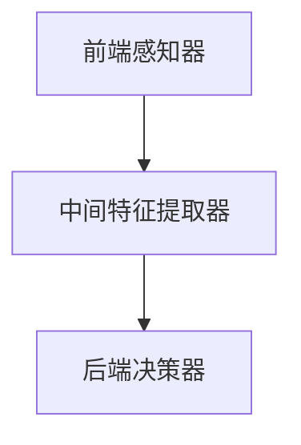

                 

关键词：李开复、AI 2.0、应用、深度学习、机器学习、人工智能技术、算法架构、案例分析

> 摘要：本文深入探讨了AI 2.0时代的应用，从核心概念到实际案例分析，阐述了AI技术如何正在改变我们的生活和工作方式。文章通过李开复的研究成果，解析了当前AI技术的最新进展，以及在未来可能的应用方向。

## 1. 背景介绍

### 1.1 AI 2.0时代的定义

AI 2.0时代是相对于AI 1.0时代的升级版本。AI 1.0时代主要关注的是基于规则的专家系统和简单的机器学习算法，而AI 2.0时代则更加注重深度学习、强化学习等更先进的技术。AI 2.0时代的关键特征包括数据驱动的学习模式、自我优化和自适应能力。

### 1.2 AI技术的重要性

人工智能技术在当今社会的重要性不言而喻。从自动驾驶汽车到智能家居，从医疗诊断到金融分析，AI技术的应用几乎无处不在。随着AI技术的不断发展，它的应用场景也在不断拓展，成为推动社会进步的重要力量。

## 2. 核心概念与联系

### 2.1 深度学习与机器学习

深度学习是机器学习的一个分支，它通过模拟人脑的神经网络结构，实现复杂的特征提取和模式识别。深度学习在图像识别、自然语言处理等领域取得了显著的成果。机器学习则是更广泛的一类技术，它包括监督学习、无监督学习和强化学习等多种学习方法。

### 2.2 人工智能算法架构

人工智能算法架构包括前端感知器、中间特征提取器、后端决策器等几个关键部分。前端感知器负责接收输入数据，中间特征提取器对输入数据进行处理，后端决策器根据处理结果做出决策。



## 3. 核心算法原理 & 具体操作步骤

### 3.1 算法原理概述

深度学习的核心是多层神经网络，通过前向传播和反向传播算法，实现特征的自动提取和学习。多层神经网络包括输入层、隐藏层和输出层，每一层都对输入数据进行处理，从而逐步提取更高级的特征。

### 3.2 算法步骤详解

1. **输入数据预处理**：对输入数据进行标准化处理，使其适合神经网络学习。
2. **前向传播**：输入数据经过多层神经网络，每一层都计算输出，直到输出层。
3. **计算损失函数**：根据输出层的实际输出与期望输出，计算损失函数的值。
4. **反向传播**：将损失函数的梯度反向传播到前一层，更新网络参数。
5. **重复迭代**：重复前向传播和反向传播，直到达到预设的迭代次数或损失函数值收敛。

### 3.3 算法优缺点

**优点**：深度学习具有强大的特征提取能力，可以处理复杂的任务。

**缺点**：训练深度神经网络需要大量数据和计算资源，且存在过拟合的风险。

### 3.4 算法应用领域

深度学习在图像识别、自然语言处理、语音识别等领域都有广泛应用。

## 4. 数学模型和公式 & 详细讲解 & 举例说明

### 4.1 数学模型构建

深度学习中的多层神经网络可以表示为：

$$
Z^{(l)} = \sigma(W^{(l)} \cdot A^{(l-1)} + b^{(l)})
$$

其中，$Z^{(l)}$是第$l$层的输出，$\sigma$是激活函数，$W^{(l)}$和$b^{(l)}$分别是第$l$层的权重和偏置。

### 4.2 公式推导过程

前向传播的推导过程如下：

$$
\frac{\partial E}{\partial Z^{(l)}} = \frac{\partial E}{\partial A^{(l)}} \cdot \frac{\partial A^{(l)}}{\partial Z^{(l)}}
$$

其中，$E$是损失函数，$A^{(l)}$是第$l$层的输出。

### 4.3 案例分析与讲解

以图像分类任务为例，我们可以使用卷积神经网络（CNN）进行模型训练。CNN通过卷积层、池化层和全连接层等结构，实现对图像特征的提取和分类。

## 5. 项目实践：代码实例和详细解释说明

### 5.1 开发环境搭建

在开始编写代码之前，我们需要搭建一个适合深度学习开发的Python环境，常用的深度学习库包括TensorFlow和PyTorch。

### 5.2 源代码详细实现

以下是一个简单的CNN模型实现的代码示例：

```python
import tensorflow as tf

# 定义CNN模型
model = tf.keras.Sequential([
    tf.keras.layers.Conv2D(32, (3, 3), activation='relu', input_shape=(28, 28, 1)),
    tf.keras.layers.MaxPooling2D((2, 2)),
    tf.keras.layers.Flatten(),
    tf.keras.layers.Dense(128, activation='relu'),
    tf.keras.layers.Dense(10, activation='softmax')
])

# 编译模型
model.compile(optimizer='adam',
              loss='categorical_crossentropy',
              metrics=['accuracy'])

# 训练模型
model.fit(x_train, y_train, epochs=10, batch_size=32)
```

### 5.3 代码解读与分析

在上面的代码中，我们定义了一个简单的CNN模型，通过卷积层和全连接层对图像进行特征提取和分类。在编译模型时，我们指定了优化器和损失函数，并在训练模型时设置了训练轮数和批量大小。

### 5.4 运行结果展示

在训练完成后，我们可以使用测试集来评估模型的性能。以下是一个简单的评估代码示例：

```python
test_loss, test_acc = model.evaluate(x_test, y_test, verbose=2)
print('\nTest accuracy:', test_acc)
```

## 6. 实际应用场景

### 6.1 医疗诊断

深度学习在医疗诊断领域有着广泛的应用，如通过图像识别技术进行肿瘤检测、疾病诊断等。

### 6.2 金融市场分析

深度学习可以帮助金融机构进行风险管理、交易策略优化等。

### 6.3 智能家居

智能家居系统可以利用深度学习技术进行语音识别、人脸识别等，提升用户体验。

## 7. 工具和资源推荐

### 7.1 学习资源推荐

- 《深度学习》（Goodfellow、Bengio、Courville著）
- 《Python深度学习》（François Chollet著）

### 7.2 开发工具推荐

- TensorFlow
- PyTorch

### 7.3 相关论文推荐

- “Deep Learning for Text Classification”（Keras团队）
- “A Neural Algorithm of Artistic Style”（Gatys等著）

## 8. 总结：未来发展趋势与挑战

### 8.1 研究成果总结

近年来，深度学习在各个领域取得了显著的成果，推动了AI技术的发展。

### 8.2 未来发展趋势

未来，AI技术将更加注重跨学科的融合、人机协同等。

### 8.3 面临的挑战

AI技术在发展过程中也面临着数据隐私、算法透明性等挑战。

### 8.4 研究展望

随着AI技术的不断进步，我们可以期待更多的创新和应用场景。

## 9. 附录：常见问题与解答

### 9.1 什么是深度学习？

深度学习是机器学习的一个分支，它通过模拟人脑的神经网络结构，实现复杂的特征提取和模式识别。

### 9.2 深度学习有哪些应用领域？

深度学习在图像识别、自然语言处理、语音识别等领域都有广泛应用。

---

**作者：禅与计算机程序设计艺术 / Zen and the Art of Computer Programming**  
本文为人工智能领域技术博客文章，不代表任何机构或个人观点，仅供学习和交流使用。

