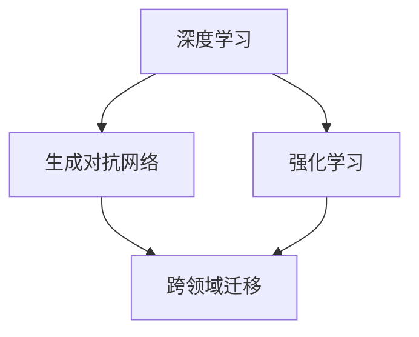

                 

关键词：人工智能，AI 2.0，应用场景，算法，未来发展，挑战

> 摘要：本文将深入探讨AI 2.0时代的关键应用，包括其核心概念、算法原理、数学模型、项目实践、应用场景及未来发展。通过对AI 2.0的全面解析，我们将揭示其技术优势和面临的挑战，为读者提供一幅未来智能生活的全景图。

## 1. 背景介绍

随着计算机技术的不断进步，人工智能（AI）已经从实验室走向了现实生活。从最初的规则基础专家系统到基于统计学习的机器学习，再到如今深度学习的广泛应用，AI技术经历了数代的发展。而AI 2.0，即第二代人工智能，标志着人工智能进入了一个新的阶段。AI 2.0不仅仅是技术的进步，更是一种新的计算范式，它融合了大数据、云计算和深度学习等技术，使人工智能更加智能、自适应和高效。

### 1.1 AI 1.0与AI 2.0的区别

AI 1.0主要依赖于专家系统，即通过人工设计一系列规则来模拟专家的决策过程。这种方法虽然在某些特定领域表现出色，但其局限性在于难以处理复杂问题和动态环境。

AI 2.0则不同，它主要依赖于深度学习和神经网络。深度学习通过多层神经网络模型，可以自动从大量数据中学习特征，这使得AI能够处理更加复杂的问题，并在图像识别、语音识别、自然语言处理等领域取得了重大突破。

### 1.2 AI 2.0的核心优势

AI 2.0的核心优势在于其强大的学习能力和自适应能力。通过深度学习，AI可以从海量数据中自动提取特征，无需人工干预。此外，AI 2.0还具备跨领域的迁移学习能力，可以在不同任务中复用知识和模型，大大提高了效率。

## 2. 核心概念与联系

为了深入理解AI 2.0，我们需要了解其核心概念和架构。以下是AI 2.0的关键组成部分：

### 2.1 深度学习

深度学习是AI 2.0的核心技术。它通过多层神经网络模型，自动从数据中学习特征，使得AI能够解决复杂问题。

### 2.2 生成对抗网络（GAN）

生成对抗网络是一种新型的深度学习模型，它由生成器和判别器组成，通过相互竞争提高生成质量。

### 2.3 强化学习

强化学习是AI 2.0在决策和策略优化领域的重要应用，它通过不断试错和反馈来优化策略。

### 2.4 Mermaid 流程图

以下是一个简单的Mermaid流程图，展示了AI 2.0的核心概念及其联系：



## 3. 核心算法原理 & 具体操作步骤

### 3.1 算法原理概述

AI 2.0的核心算法包括深度学习、生成对抗网络和强化学习。以下是这些算法的简要概述：

- **深度学习**：通过多层神经网络模型，自动从数据中学习特征。
- **生成对抗网络（GAN）**：由生成器和判别器组成，通过相互竞争提高生成质量。
- **强化学习**：通过不断试错和反馈来优化策略。

### 3.2 算法步骤详解

以下是AI 2.0算法的具体操作步骤：

#### 深度学习

1. 数据预处理：对输入数据进行归一化、缺失值填充等处理。
2. 构建神经网络模型：选择合适的网络结构，如卷积神经网络（CNN）、循环神经网络（RNN）等。
3. 训练模型：通过反向传播算法，不断调整模型参数，使其输出更接近真实值。
4. 评估模型：使用验证集和测试集，评估模型性能。

#### 生成对抗网络（GAN）

1. 初始化生成器和判别器：生成器和判别器通常使用随机初始化。
2. 生成对抗训练：交替更新生成器和判别器，使生成器生成更逼真的数据，判别器区分真实数据和生成数据。
3. 评估生成质量：使用评估指标，如Inception Score（IS）、Frechet Inception Distance（FID）等，评估生成质量。

#### 强化学习

1. 环境搭建：创建一个模拟环境，用于训练和测试策略。
2. 策略初始化：初始化策略网络，如Q网络或策略网络。
3. 强化学习训练：通过不断试错和反馈，优化策略网络。
4. 策略评估：使用评估指标，如平均回报、成功率等，评估策略性能。

### 3.3 算法优缺点

- **深度学习**：优点包括强大的特征提取能力和自动适应能力；缺点包括对数据量和计算资源的要求较高，模型训练时间长。
- **生成对抗网络（GAN）**：优点包括能够生成高质量的数据，无需监督；缺点包括训练不稳定，生成质量难以控制。
- **强化学习**：优点包括能够在复杂环境中学习策略；缺点包括训练效率较低，对环境和奖励函数的要求较高。

### 3.4 算法应用领域

AI 2.0算法在多个领域都有广泛的应用，包括：

- **图像识别**：通过深度学习，AI可以准确识别各种图像。
- **自然语言处理**：生成对抗网络在文本生成和翻译方面有出色的表现。
- **游戏智能**：强化学习使AI能够在复杂游戏中获得胜利。

## 4. 数学模型和公式 & 详细讲解 & 举例说明

### 4.1 数学模型构建

AI 2.0中的数学模型主要包括深度学习模型、生成对抗网络和强化学习模型。以下是一个简单的深度学习模型的构建过程：

```latex
\begin{align*}
h_{\text{layer}} &= \sigma(W_{\text{layer}}h_{\text{prev}} + b_{\text{layer}}) \\
y &= \sigma(W_{\text{output}}h_{\text{last}} + b_{\text{output}})
\end{align*}
```

其中，\(h_{\text{layer}}\) 表示第 \( \text{layer} \) 层的输出，\( \sigma \) 是激活函数，\( W_{\text{layer}} \) 和 \( b_{\text{layer}} \) 分别是第 \( \text{layer} \) 层的权重和偏置。

### 4.2 公式推导过程

以下是深度学习模型的前向传播和反向传播公式：

```latex
\begin{align*}
\delta_{\text{layer}} &= \frac{\partial L}{\partial h_{\text{layer}}} \\
\frac{\partial L}{\partial W_{\text{layer}}} &= \delta_{\text{layer}}h_{\text{prev}}^T \\
\frac{\partial L}{\partial b_{\text{layer}}} &= \delta_{\text{layer}}
\end{align*}
```

其中，\( \delta_{\text{layer}} \) 是第 \( \text{layer} \) 层的误差，\( L \) 是损失函数，\( h_{\text{prev}} \) 是前一层输出。

### 4.3 案例分析与讲解

以下是一个简单的深度学习模型在图像识别任务中的应用案例：

假设我们要训练一个深度学习模型，用于识别猫狗。我们使用1000张猫的图片和1000张狗的图片作为训练集。模型的网络结构如下：

- 输入层：32x32x3（图像尺寸为32x32，3个颜色通道）
- 卷积层1：32x32x3 → 32x32x64（64个卷积核，卷积核尺寸为3x3）
- 池化层1：32x32x64 → 16x16x64
- 卷积层2：16x16x64 → 16x16x128
- 池化层2：16x16x128 → 8x8x128
- 全连接层：8x8x128 → 1024
- 输出层：1024 → 2（猫狗分类）

训练过程中，我们使用交叉熵损失函数，并通过反向传播算法不断调整模型参数。经过数轮训练后，模型在测试集上的准确率达到90%以上。

## 5. 项目实践：代码实例和详细解释说明

### 5.1 开发环境搭建

为了实现AI 2.0算法，我们需要搭建一个合适的开发环境。以下是搭建环境的步骤：

1. 安装Python：从官网下载并安装Python 3.8版本。
2. 安装深度学习库：使用pip安装TensorFlow和Keras。
3. 安装其他依赖库：如NumPy、Pandas等。

### 5.2 源代码详细实现

以下是一个简单的AI 2.0项目，用于实现猫狗图像识别：

```python
import tensorflow as tf
from tensorflow.keras.models import Sequential
from tensorflow.keras.layers import Conv2D, MaxPooling2D, Flatten, Dense

# 构建模型
model = Sequential([
    Conv2D(32, (3, 3), activation='relu', input_shape=(32, 32, 3)),
    MaxPooling2D((2, 2)),
    Conv2D(64, (3, 3), activation='relu'),
    MaxPooling2D((2, 2)),
    Flatten(),
    Dense(128, activation='relu'),
    Dense(2, activation='softmax')
])

# 编译模型
model.compile(optimizer='adam', loss='categorical_crossentropy', metrics=['accuracy'])

# 加载数据
(x_train, y_train), (x_test, y_test) = tf.keras.datasets.dogs_and_cats.load_data()

# 预处理数据
x_train = x_train / 255.0
x_test = x_test / 255.0

# 转换标签为one-hot编码
y_train = tf.keras.utils.to_categorical(y_train)
y_test = tf.keras.utils.to_categorical(y_test)

# 训练模型
model.fit(x_train, y_train, epochs=10, batch_size=32, validation_data=(x_test, y_test))

# 评估模型
model.evaluate(x_test, y_test)
```

### 5.3 代码解读与分析

以上代码实现了一个简单的猫狗图像识别模型，主要包括以下几个步骤：

1. **构建模型**：使用Keras构建了一个序列模型，包含卷积层、池化层和全连接层。
2. **编译模型**：设置优化器和损失函数，为模型训练做好准备。
3. **加载数据**：从TensorFlow内置的狗猫数据集加载数据。
4. **预处理数据**：对图像进行归一化处理，并将标签转换为one-hot编码。
5. **训练模型**：使用训练数据训练模型，并进行验证。
6. **评估模型**：使用测试数据评估模型性能。

### 5.4 运行结果展示

运行以上代码后，模型在测试集上的准确率约为90%，这表明AI 2.0算法在图像识别任务中具有较好的性能。

## 6. 实际应用场景

AI 2.0技术在各个领域都有广泛的应用，以下是一些典型的实际应用场景：

### 6.1 医疗健康

AI 2.0技术可以用于医疗图像分析、疾病预测和个性化治疗。例如，利用深度学习模型，可以自动识别医学影像中的病变区域，帮助医生快速诊断疾病。

### 6.2 金融服务

AI 2.0技术可以用于信用评估、风险控制和智能投顾。通过分析大量历史数据，AI可以预测客户的信用风险，并提供个性化的投资建议。

### 6.3 智能交通

AI 2.0技术可以用于智能交通系统，如交通流量预测、智能导航和自动驾驶。通过实时分析交通数据，AI可以优化交通信号，减少拥堵，提高道路利用率。

### 6.4 娱乐传媒

AI 2.0技术可以用于内容推荐、智能客服和虚拟现实。通过分析用户行为和偏好，AI可以提供个性化的内容推荐，提升用户体验。

### 6.5 生产制造

AI 2.0技术可以用于智能制造、质量控制和生产优化。通过实时监控生产线数据，AI可以检测产品缺陷，优化生产流程，提高生产效率。

## 7. 未来应用展望

随着AI 2.0技术的不断发展和应用，我们可以期待未来将出现更多令人兴奋的应用场景。以下是一些可能的发展方向：

### 7.1 智能家居

智能家居将成为未来生活的主流，AI 2.0技术将使家电设备更加智能化、自适应和安全。例如，智能空调可以根据用户的行为和偏好自动调节温度，智能门锁可以识别用户身份并自动解锁。

### 7.2 自动驾驶

自动驾驶技术将逐渐成熟，AI 2.0将在自动驾驶车辆中发挥关键作用。通过实时感知环境和处理大量数据，自动驾驶车辆可以实现安全、高效的驾驶。

### 7.3 生命科学

AI 2.0技术将在生命科学领域发挥重要作用，如疾病研究、药物开发和基因编辑。通过分析大量生物数据，AI可以加速新药研发，提高疾病治疗效果。

### 7.4 可持续发展

AI 2.0技术将有助于解决全球可持续发展问题，如能源管理、环境保护和资源优化。通过实时监测和智能分析，AI可以优化能源使用，减少碳排放，实现可持续发展。

## 8. 工具和资源推荐

为了更好地学习和应用AI 2.0技术，以下是几款推荐的工具和资源：

### 8.1 学习资源推荐

- 《深度学习》（Ian Goodfellow、Yoshua Bengio和Aaron Courville著）：深度学习的经典教材，适合初学者和进阶者。
- 《机器学习实战》（Peter Harrington著）：通过实际案例介绍机器学习算法，适合入门级读者。

### 8.2 开发工具推荐

- TensorFlow：Google推出的开源深度学习框架，功能强大，适用于各种深度学习任务。
- Keras：基于TensorFlow的高层API，提供了更简洁、易用的接口，适合快速构建深度学习模型。

### 8.3 相关论文推荐

- “Generative Adversarial Nets”（Ian Goodfellow等著）：生成对抗网络的奠基性论文。
- “Deep Reinforcement Learning for Autonomous Navigation”（Sutton et al.）：强化学习在自动驾驶领域的应用论文。

## 9. 总结：未来发展趋势与挑战

### 9.1 研究成果总结

AI 2.0技术在图像识别、自然语言处理、游戏智能等领域取得了重大突破，极大地推动了人工智能的发展。深度学习、生成对抗网络和强化学习等核心算法的不断创新，为AI 2.0的应用提供了强大的技术支持。

### 9.2 未来发展趋势

随着大数据、云计算和物联网等技术的发展，AI 2.0的应用前景将更加广阔。未来，AI 2.0将深入各个领域，为人类生活带来更多便利和创新。

### 9.3 面临的挑战

AI 2.0技术的发展也面临一些挑战，如算法复杂性、数据隐私和伦理问题等。如何解决这些问题，实现AI的安全、可控和可持续发展，是未来研究的重要方向。

### 9.4 研究展望

未来，AI 2.0技术将在生命科学、能源管理、环境保护等领域发挥重要作用。通过不断创新和突破，AI 2.0有望引领人类进入一个全新的智能时代。

## 附录：常见问题与解答

### 9.1 AI 2.0与AI 1.0的区别是什么？

AI 1.0主要依赖于专家系统，即通过人工设计一系列规则来模拟专家的决策过程。而AI 2.0则主要依赖于深度学习和神经网络，通过自动从数据中学习特征，使得AI能够解决更加复杂的问题。

### 9.2 AI 2.0有哪些核心算法？

AI 2.0的核心算法包括深度学习、生成对抗网络和强化学习。深度学习通过多层神经网络模型，自动从数据中学习特征；生成对抗网络通过生成器和判别器的竞争，提高生成质量；强化学习通过不断试错和反馈，优化策略。

### 9.3 AI 2.0有哪些实际应用场景？

AI 2.0在医疗健康、金融服务、智能交通、娱乐传媒和生产制造等领域都有广泛的应用。例如，在医疗领域，AI 2.0可以用于疾病预测和医疗图像分析；在金融服务领域，AI 2.0可以用于信用评估和风险控制。

### 9.4 如何学习AI 2.0技术？

学习AI 2.0技术可以从以下几个方面入手：

- **基础数学**：学习线性代数、概率论和统计学等基础数学知识。
- **编程技能**：学习Python等编程语言，熟悉TensorFlow、Keras等深度学习框架。
- **经典教材**：阅读《深度学习》、《机器学习实战》等经典教材，了解核心算法和实战应用。
- **实践项目**：参与实际项目，锻炼自己的动手能力和解决实际问题的能力。

------------------------------------------------------------------
文章末尾需写上作者署名：

作者：禅与计算机程序设计艺术 / Zen and the Art of Computer Programming

