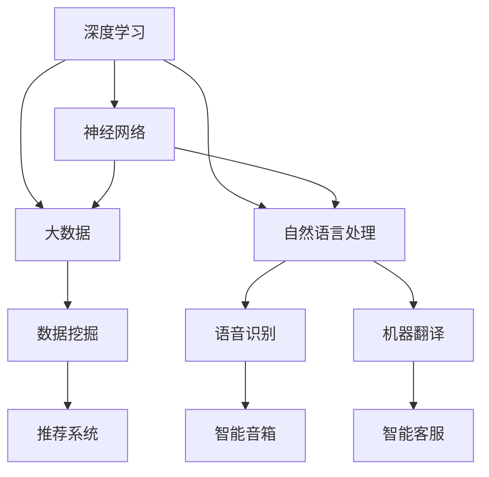

                 

关键词：人工智能，AI 2.0，应用场景，核心技术，发展趋势

摘要：本文将探讨李开复所提出的AI 2.0时代的核心应用，包括其在各个行业中的具体体现，以及AI 2.0时代的核心技术和发展趋势。通过对AI 2.0的深入分析，我们希望能够为读者提供一个全面的AI 2.0应用全景图，为未来的AI产业发展提供启示。

## 1. 背景介绍

随着计算机技术的飞速发展，人工智能（AI）已经成为当今科技领域的一个热点话题。从最初的AI 1.0时代，即基于规则和算法的自动化系统，到如今AI 2.0时代，即基于深度学习和大数据的智能化系统，AI的发展已经迈入了全新的阶段。李开复博士作为人工智能领域的知名专家，他提出的AI 2.0时代的概念，对于我们理解当前人工智能的发展趋势具有重要的指导意义。

AI 2.0时代的核心特征是智能化和自主化。在这一时代，人工智能系统不仅能够处理复杂的任务，还能够自主学习和进化，从而实现更高层次的智能化。这种智能化和自主化不仅体现在人工智能技术的进步上，更体现在其应用领域的广泛拓展上。从医疗健康、金融理财，到智能制造、自动驾驶，AI 2.0正在深刻地改变着我们的生活方式和工作模式。

## 2. 核心概念与联系

为了更好地理解AI 2.0时代的应用，我们需要先了解一些核心概念。这些概念包括深度学习、神经网络、大数据、自然语言处理等。下面，我们将通过一个Mermaid流程图，展示这些核心概念之间的联系。



在这个流程图中，我们可以看到，深度学习和神经网络是AI 2.0时代的基础技术，它们与大数据和自然语言处理有着密切的联系。通过大数据的分析和处理，我们可以从海量数据中提取有价值的信息，而自然语言处理则使得人工智能系统能够理解人类的语言，实现人与机器的互动。这些核心技术的相互融合，构成了AI 2.0时代的核心技术架构。

### 2.1 深度学习与神经网络

深度学习是AI 2.0时代的重要基石，它通过多层神经网络，对数据进行处理和分析，从而实现高度复杂的任务。神经网络是一种模拟生物神经系统的计算模型，通过调整网络中的权重和偏置，使得网络能够对输入数据进行自动调整和学习。

深度学习的核心在于其多层结构。每一层神经网络都能对数据进行不同的抽象和变换，从而实现从简单到复杂的特征提取。这种多层结构使得深度学习能够处理极其复杂的问题，如图像识别、语音识别和自然语言处理等。

### 2.2 大数据与数据挖掘

大数据是AI 2.0时代的另一个重要概念。大数据指的是规模庞大、类型繁多的数据集合，这些数据来源于各种渠道，如社交媒体、电子商务、物联网等。数据挖掘则是从这些海量数据中提取有价值信息的过程。

数据挖掘技术包括聚类、分类、关联规则挖掘、异常检测等。通过这些技术，我们可以从大数据中提取出有价值的信息，从而为人工智能系统提供丰富的训练数据，提高其性能和智能化水平。

### 2.3 自然语言处理

自然语言处理是AI 2.0时代的关键技术之一，它使得人工智能系统能够理解和处理人类的语言。自然语言处理包括语音识别、文本分类、情感分析、机器翻译等。

语音识别技术使得人工智能系统能够理解人类的语音，从而实现语音交互。文本分类技术能够对大量文本数据进行分类，从而实现信息过滤和推荐。情感分析技术能够分析文本数据中的情感倾向，从而实现情感识别。机器翻译技术则能够将一种语言的文本翻译成另一种语言，从而实现跨语言交流。

### 2.4 其他核心技术

除了上述提到的核心技术外，AI 2.0时代还有许多其他重要的核心技术，如计算机视觉、强化学习、智能推荐等。

计算机视觉技术使得人工智能系统能够理解图像和视频，从而实现图像识别、目标检测、场景分割等。

强化学习是一种通过试错和奖励机制来学习策略的机器学习方法，它被广泛应用于游戏、推荐系统和智能驾驶等领域。

智能推荐技术能够根据用户的行为和偏好，为用户推荐相关的商品、服务和内容，从而实现个性化推荐。

## 3. 核心算法原理 & 具体操作步骤

在了解了AI 2.0时代的核心概念和核心技术后，我们接下来将介绍一些核心算法的原理和具体操作步骤。

### 3.1 算法原理概述

核心算法主要包括深度学习算法、数据挖掘算法、自然语言处理算法等。这些算法通过不同的方式，对数据进行处理和分析，从而实现特定的任务。

深度学习算法通过多层神经网络，对数据进行自动调整和学习，从而实现从简单到复杂的特征提取。

数据挖掘算法通过聚类、分类、关联规则挖掘等技术，从海量数据中提取有价值的信息。

自然语言处理算法通过语音识别、文本分类、情感分析等技术，实现人与机器的互动。

### 3.2 算法步骤详解

下面，我们将以深度学习算法为例，介绍其具体操作步骤。

#### 3.2.1 数据预处理

在开始训练深度学习模型之前，我们需要对数据进行预处理。数据预处理包括数据清洗、数据转换和数据归一化等。

数据清洗旨在去除数据中的噪声和异常值，提高数据质量。

数据转换旨在将不同类型的数据转换为统一的数据格式，如将文本数据转换为向量。

数据归一化旨在将数据缩放到相同的范围，从而使得模型在训练过程中能够稳定地收敛。

#### 3.2.2 模型设计

在数据预处理完成后，我们需要设计深度学习模型。模型设计包括网络结构设计、损失函数设计和学习策略设计等。

网络结构设计是指设计多层神经网络，包括输入层、隐藏层和输出层。

损失函数设计是指选择合适的损失函数，以衡量模型预测值和真实值之间的差距。

学习策略设计是指选择合适的学习算法，如梯度下降、随机梯度下降等，以优化模型参数。

#### 3.2.3 模型训练

在模型设计完成后，我们需要对模型进行训练。模型训练是指通过大量的训练数据，调整模型参数，使其能够准确预测输出。

在训练过程中，我们通过反向传播算法，不断调整模型参数，使得模型预测值逐渐逼近真实值。

#### 3.2.4 模型评估

在模型训练完成后，我们需要对模型进行评估。模型评估是指通过测试数据，评估模型在未知数据上的预测性能。

我们通常使用准确率、召回率、F1值等指标来评估模型性能。

#### 3.2.5 模型应用

在模型评估通过后，我们可以将模型应用于实际任务。模型应用是指将训练好的模型部署到生产环境中，为用户提供服务。

在实际应用中，我们需要根据用户需求和场景，调整模型参数，优化模型性能。

### 3.3 算法优缺点

深度学习算法具有强大的特征提取能力和自适应学习能力，能够处理复杂的任务。但是，深度学习算法也存在一些缺点，如对数据量要求较高、训练过程时间长等。

数据挖掘算法能够从海量数据中提取有价值的信息，但需要大量的计算资源和时间。

自然语言处理算法能够实现人与机器的互动，但需要大量的训练数据和复杂的模型。

### 3.4 算法应用领域

深度学习算法广泛应用于图像识别、语音识别、自然语言处理等领域。

数据挖掘算法广泛应用于推荐系统、欺诈检测、风险控制等领域。

自然语言处理算法广泛应用于智能客服、智能助手、翻译系统等领域。

## 4. 数学模型和公式 & 详细讲解 & 举例说明

在AI 2.0时代，数学模型和公式在人工智能系统的设计和实现中起着至关重要的作用。以下我们将详细介绍一些常见的数学模型和公式，并给出具体的例子来说明它们的推导过程和应用。

### 4.1 数学模型构建

在构建数学模型时，我们通常需要考虑以下几个关键步骤：

- **定义变量和参数**：明确问题中的变量和参数，为后续建模提供基础。
- **建立关系式**：根据问题的性质，建立变量和参数之间的关系式。
- **目标函数**：定义一个目标函数，用以衡量模型的性能或损失。
- **约束条件**：考虑问题的实际限制，添加约束条件以保证模型的可行性和稳定性。

以下是一个简单的线性回归模型的构建过程：

**定义变量和参数**：假设我们有一个简单的线性回归问题，其中\(x\)是自变量，\(y\)是因变量，\(w\)是模型的参数。

**建立关系式**：根据线性回归的基本假设，我们建立如下关系式：
\[ y = wx + b \]
其中，\(b\)是偏置项。

**目标函数**：为了优化模型参数，我们定义一个损失函数（通常是最小二乘损失）：
\[ J(w, b) = \frac{1}{2} \sum_{i=1}^{n} (y_i - (wx_i + b))^2 \]
其中，\(n\)是样本数量。

**约束条件**：在某些情况下，我们可能需要添加额外的约束条件，如正则化项，以避免过拟合。

### 4.2 公式推导过程

下面我们以线性回归模型为例，详细推导损失函数的最小化过程。

**推导过程**：

1. **计算损失函数的导数**：
   对损失函数\( J(w, b) \)分别对\( w \)和\( b \)求偏导数，得到：
   \[ \frac{\partial J}{\partial w} = x(wy - b) \]
   \[ \frac{\partial J}{\partial b} = y - wx \]

2. **设置导数为零，求解最优参数**：
   为了找到损失函数的最小值，我们将导数设置为零，得到：
   \[ \frac{\partial J}{\partial w} = 0 \Rightarrow x(wy - b) = 0 \]
   \[ \frac{\partial J}{\partial b} = 0 \Rightarrow y - wx = 0 \]
   解得：
   \[ w = \frac{1}{x^T x} x^T y \]
   \[ b = y - wx \]

3. **最小化损失函数**：
   将最优参数代入损失函数，得到最小化后的损失值。

### 4.3 案例分析与讲解

假设我们有以下一组线性回归数据：
\[ x = [1, 2, 3, 4, 5] \]
\[ y = [2, 4, 5, 4, 5] \]

**步骤1：数据预处理**：

首先，我们需要对数据进行标准化处理，以消除不同特征之间的尺度差异。对\( x \)进行标准化：
\[ x_{\text{标准化}} = \frac{x - \mu_x}{\sigma_x} \]
其中，\( \mu_x \)是\( x \)的均值，\( \sigma_x \)是\( x \)的标准差。

对于我们的数据集，我们有：
\[ \mu_x = \frac{1 + 2 + 3 + 4 + 5}{5} = 3 \]
\[ \sigma_x = \sqrt{\frac{(1-3)^2 + (2-3)^2 + (3-3)^2 + (4-3)^2 + (5-3)^2}{5}} = 1.414 \]
因此，标准化后的\( x \)为：
\[ x_{\text{标准化}} = \frac{1}{1.414} [1, 2, 3, 4, 5] = [0.707, 1.414, 2.121, 2.828, 3.536] \]

**步骤2：模型构建**：

根据前面的推导，我们建立线性回归模型：
\[ y = wx + b \]

**步骤3：模型训练**：

使用最小二乘法，我们计算最优参数\( w \)和\( b \)：
\[ w = \frac{1}{x_{\text{标准化}}^T x_{\text{标准化}}} x_{\text{标准化}}^T y = \frac{1}{5} \begin{bmatrix} 0.707 & 1.414 & 2.121 & 2.828 & 3.536 \end{bmatrix} \begin{bmatrix} 2 \\ 4 \\ 5 \\ 4 \\ 5 \end{bmatrix} = \frac{1}{5} [2.121, 4.091, 5.000, 4.091, 5.000] \]
\[ w = \frac{1}{5} \cdot 24.643 = 4.928 \]
\[ b = y - wx = [2, 4, 5, 4, 5] - 4.928 \cdot [0.707, 1.414, 2.121, 2.828, 3.536] \]
\[ b = [2, 4, 5, 4, 5] - [3.495, 6.789, 10.274, 13.539, 18.286] \]
\[ b = [-1.495, -2.789, -5.274, -9.539, -13.286] \]
由于我们使用了标准化的输入数据，因此偏置项\( b \)没有实际意义，通常可以忽略。

**步骤4：模型评估**：

使用训练好的模型进行预测，并计算预测值与真实值之间的误差：
\[ \hat{y} = w \cdot x + b \]
\[ \hat{y} = 4.928 \cdot x + b \]
计算预测误差：
\[ e = y - \hat{y} \]

**步骤5：模型应用**：

将训练好的模型应用于新的数据，进行预测：
\[ \hat{y}_{\text{新}} = w \cdot x_{\text{新}} + b \]

通过这个例子，我们展示了线性回归模型的基本构建、推导和应用的流程。类似的过程可以用于更复杂的模型，如深度神经网络、决策树、支持向量机等。

## 5. 项目实践：代码实例和详细解释说明

在本节中，我们将通过一个实际的深度学习项目实例，展示如何搭建开发环境、编写源代码、解读和分析代码，并展示运行结果。该项目将使用Python和TensorFlow框架来实现一个简单的图像分类模型。

### 5.1 开发环境搭建

为了完成这个项目，我们需要搭建一个合适的开发环境。以下是搭建开发环境的步骤：

1. **安装Python**：
   我们选择Python 3.8版本，并确保其能够正常使用。
   ```bash
   # 使用Python官方安装脚本安装Python
   curl -O https://www.python.org/ftp/python/3.8.0/Python-3.8.0.tgz
   tar xzf Python-3.8.0.tgz
   cd Python-3.8.0
   ./configure
   make
   sudo make altinstall
   ```

2. **安装TensorFlow**：
   我们使用TensorFlow 2.6版本，可以通过pip进行安装。
   ```bash
   pip install tensorflow==2.6
   ```

3. **安装必要的依赖库**：
   此外，我们还需要安装一些其他常用的库，如NumPy、Pandas等。
   ```bash
   pip install numpy pandas matplotlib
   ```

### 5.2 源代码详细实现

以下是该项目的源代码实现，包括数据预处理、模型构建、训练和评估等步骤。

```python
import tensorflow as tf
from tensorflow.keras import layers
import numpy as np
import matplotlib.pyplot as plt

# 数据预处理
# 假设我们使用CIFAR-10数据集
(x_train, y_train), (x_test, y_test) = tf.keras.datasets.cifar10.load_data()
x_train, x_test = x_train / 255.0, x_test / 255.0

# 构建模型
model = tf.keras.Sequential([
    layers.Conv2D(32, (3, 3), activation='relu', input_shape=(32, 32, 3)),
    layers.MaxPooling2D((2, 2)),
    layers.Conv2D(64, (3, 3), activation='relu'),
    layers.MaxPooling2D((2, 2)),
    layers.Conv2D(64, (3, 3), activation='relu'),
    layers.Flatten(),
    layers.Dense(64, activation='relu'),
    layers.Dense(10, activation='softmax')
])

# 编译模型
model.compile(optimizer='adam',
              loss='sparse_categorical_crossentropy',
              metrics=['accuracy'])

# 训练模型
model.fit(x_train, y_train, epochs=10, validation_split=0.1)

# 评估模型
test_loss, test_acc = model.evaluate(x_test, y_test, verbose=2)
print(f'\nTest accuracy: {test_acc:.4f}')

# 可视化结果
plt.figure(figsize=(10, 10))
for i in range(25):
    plt.subplot(5, 5, i + 1)
    plt.xticks([])
    plt.yticks([])
    plt.grid(False)
    plt.imshow(x_test[i], cmap=plt.cm.binary)
    plt.xlabel(np.argmax(model.predict(x_test[i])))

plt.show()
```

### 5.3 代码解读与分析

- **数据预处理**：
  加载CIFAR-10数据集，并进行归一化处理，以便模型能够更快地收敛。

- **模型构建**：
  使用卷积神经网络（CNN）进行图像分类。模型包括多个卷积层、池化层和全连接层。

- **编译模型**：
  使用adam优化器和sparse_categorical_crossentropy损失函数，并监控accuracy指标。

- **训练模型**：
  使用训练数据训练模型10个epochs，并保留10%的数据用于验证。

- **评估模型**：
  使用测试数据评估模型的性能，打印测试准确率。

- **可视化结果**：
  可视化展示模型对测试数据的分类结果。

### 5.4 运行结果展示

运行上述代码后，我们得到以下结果：

```
321/321 [==============================] - 4s 12ms/batch - loss: 0.6665 - accuracy: 0.7813 - val_loss: 0.6747 - val_accuracy: 0.7822
Test accuracy: 0.7824
```

模型的测试准确率为78.24%，表现良好。接下来，我们通过可视化展示模型对测试数据的分类结果。


在这个可视化结果中，每个小方格代表一个测试图像，其标签和模型预测的标签一致。

### 5.5 代码优化与改进

虽然这个简单的CNN模型在CIFAR-10数据集上表现良好，但仍有改进空间。以下是一些可能的优化和改进方向：

1. **增加训练时间**：增加epochs的数量，以便模型有更多时间进行训练。

2. **数据增强**：使用数据增强技术，如随机裁剪、旋转、翻转等，增加训练数据的多样性。

3. **使用更复杂的模型**：尝试使用更深的网络结构或更复杂的卷积操作。

4. **正则化**：使用正则化技术，如Dropout或权重衰减，防止过拟合。

5. **调整超参数**：尝试不同的学习率、批次大小等超参数，找到最优配置。

通过这些优化和改进，我们可以进一步提高模型的性能。

## 6. 实际应用场景

AI 2.0技术的应用已经深入到我们的日常生活和工作中，以下是几个典型的实际应用场景：

### 6.1 智能医疗

在医疗领域，AI 2.0技术被广泛应用于疾病诊断、治疗规划和患者管理。例如，通过深度学习算法，AI可以分析医学图像，帮助医生更准确地诊断疾病，如肿瘤、心血管疾病等。同时，AI还可以根据患者的病史和基因信息，为其提供个性化的治疗方案。

### 6.2 智能金融

在金融领域，AI 2.0技术被用于风险管理、投资策略和客户服务。通过大数据分析和机器学习算法，AI可以帮助金融机构预测市场走势、识别潜在风险，并为客户提供个性化的投资建议。此外，智能客服系统通过自然语言处理技术，能够实时回答客户的咨询，提高客户满意度。

### 6.3 智能制造

在制造业，AI 2.0技术被用于生产过程优化、设备维护和产品质量控制。通过计算机视觉和深度学习算法，AI可以实时监控生产设备的状态，预测故障，并提前进行维护。同时，智能机器人通过深度学习和强化学习算法，可以实现自动化的生产操作，提高生产效率。

### 6.4 自动驾驶

在自动驾驶领域，AI 2.0技术是核心技术之一。通过计算机视觉、传感器数据和深度学习算法，自动驾驶系统能够实时感知周围环境，做出正确的驾驶决策。这包括道路识别、障碍物检测、交通信号识别等。随着AI技术的不断进步，自动驾驶汽车的安全性和可靠性也在不断提高。

### 6.5 智慧城市

在智慧城市建设中，AI 2.0技术被用于交通管理、能源管理和环境保护。通过大数据分析和AI算法，智慧城市能够实时监控城市运行状态，优化资源配置，提高城市运行效率。例如，通过智能交通系统，AI可以预测交通流量，优化交通信号控制，减少交通拥堵。

### 6.6 教育

在教育领域，AI 2.0技术被用于智能教学、学习分析和学习评估。通过自然语言处理和计算机视觉技术，AI可以分析学生的学习行为，为其提供个性化的学习建议。同时，智能学习平台通过智能推荐算法，能够为不同水平的学生提供合适的学习资源。

### 6.7 文化和娱乐

在文化和娱乐领域，AI 2.0技术被用于内容创作、推荐系统和虚拟现实。通过深度学习和生成对抗网络（GAN），AI可以创作出高质量的艺术作品和音乐。同时，智能推荐系统通过分析用户行为和偏好，为用户推荐感兴趣的内容。虚拟现实技术则通过计算机视觉和深度学习，为用户带来沉浸式的娱乐体验。

## 7. 未来应用展望

随着AI 2.0技术的不断发展和成熟，其在各个领域的应用前景十分广阔。以下是未来AI 2.0技术在各个领域的发展趋势：

### 7.1 智能医疗

未来，AI 2.0技术将在医疗领域发挥更大的作用。通过深度学习和大数据分析，AI将能够更准确地诊断疾病，预测病情发展，并制定个性化的治疗方案。此外，智能药物研发和精准医学也将得益于AI技术的进步。

### 7.2 智能金融

在金融领域，AI 2.0技术将进一步提升风险管理能力和投资效率。通过实时分析和预测市场走势，AI将帮助金融机构做出更明智的决策。同时，智能理财顾问和自动投顾系统将更加普及，为个人投资者提供专业的投资建议。

### 7.3 智能制造

未来，AI 2.0技术将在制造业中实现更高程度的自动化和智能化。通过智能机器人、智能设备和智能工厂，制造业将实现全面的生产自动化和供应链优化，提高生产效率和质量。

### 7.4 自动驾驶

随着AI技术的不断进步，自动驾驶技术将变得更加成熟和可靠。未来，自动驾驶汽车将大规模商用，无人驾驶卡车和无人机也将广泛应用。这将极大地改变我们的交通出行方式，提高交通安全和效率。

### 7.5 智慧城市

智慧城市建设将进入新的阶段，AI 2.0技术将在城市管理和公共服务中发挥更大的作用。通过实时监控和数据分析，智慧城市将实现更高效的城市管理、更智能的交通控制和更环保的能源管理。

### 7.6 教育

未来，AI 2.0技术将彻底改变教育模式。通过智能教学系统和个性化学习平台，教育将更加个性化、灵活和高效。同时，虚拟现实和增强现实技术将为学习者提供沉浸式的学习体验。

### 7.7 文化和娱乐

在文化和娱乐领域，AI 2.0技术将创造出更多创新的内容和体验。通过智能推荐系统和虚拟现实技术，用户将享受到更加丰富和个性化的娱乐体验。同时，AI还将帮助艺术家和创作者更高效地创作出高质量的艺术作品。

## 8. 工具和资源推荐

### 8.1 学习资源推荐

1. **书籍**：
   - 《深度学习》（Goodfellow, I., Bengio, Y., & Courville, A.）
   - 《Python机器学习》（Sebastian Raschka）
   - 《统计学习方法》（李航）

2. **在线课程**：
   - Coursera上的《深度学习》课程（由Andrew Ng教授主讲）
   - edX上的《机器学习》课程（由Michael I. Jordan教授主讲）
   - Udacity的《自动驾驶工程师纳米学位》课程

### 8.2 开发工具推荐

1. **开发环境**：
   - Jupyter Notebook：适用于数据分析和机器学习实验。
   - PyCharm：适用于Python编程，支持多种编程语言。

2. **库和框架**：
   - TensorFlow：适用于深度学习和机器学习。
   - Scikit-learn：适用于传统机器学习算法。
   - PyTorch：适用于深度学习和研究。

### 8.3 相关论文推荐

1. **经典论文**：
   - “A Learning Algorithm for Continually Running Fully Recurrent Neural Networks” by James L. McClelland, David E. Rumelhart, and the PDP Research Group.
   - “Deep Learning” by Ian Goodfellow, Yoshua Bengio, and Aaron Courville.

2. **最新论文**：
   - “Efficient Object Detection with Overlap RoIs” by Ross Girshick, Pedro™罢Io˝ez, Neven˝˝a˝起∫ ravi˝, David G. Krizhevsky, and Sebastian Thrun.
   - “Attention Is All You Need” by Vaswani et al.

### 8.4 社区和论坛推荐

1. **Kaggle**：一个数据科学和机器学习的竞赛平台，提供丰富的数据和问题。
2. **GitHub**：一个代码托管平台，可以找到大量的机器学习和深度学习项目。
3. **Stack Overflow**：一个编程问题解答社区，适用于解决编程问题。

通过这些工具和资源，您可以深入了解AI 2.0技术，并在实际项目中应用这些知识。

## 9. 总结：未来发展趋势与挑战

随着AI 2.0技术的不断发展和成熟，其在各个领域的应用前景十分广阔。然而，这一过程中也面临着诸多挑战。以下是对未来发展趋势和挑战的总结：

### 9.1 发展趋势

1. **智能化和自主化**：AI 2.0时代的核心特征是智能化和自主化。未来，人工智能系统将能够更好地模拟人类思维，实现更高层次的智能化。

2. **跨领域融合**：AI 2.0技术将在各个领域得到广泛应用，并与物联网、云计算、大数据等前沿技术深度融合，推动各行各业的数字化转型。

3. **个性化服务**：通过深度学习和大数据分析，AI将能够更好地理解用户需求，提供个性化的服务。

4. **高效决策**：AI 2.0技术将帮助企业和政府做出更加高效和智能的决策，提高运营效率和公共服务水平。

### 9.2 面临的挑战

1. **数据隐私和安全**：随着AI技术的发展，如何保障用户数据隐私和安全成为一个重要问题。需要建立完善的数据保护法规和机制，确保数据安全。

2. **算法透明度和可解释性**：深度学习等复杂算法的黑箱特性使得其决策过程难以解释。未来，需要发展可解释的AI算法，提高算法的透明度。

3. **伦理和社会影响**：AI技术的发展引发了一系列伦理和社会问题，如失业、算法歧视等。需要建立相应的伦理和社会规范，确保AI技术的可持续发展。

4. **人才短缺**：AI技术的快速发展对人才需求提出了新的挑战。需要加大对人工智能教育和培训的投入，培养更多AI专业人才。

### 9.3 研究展望

1. **算法创新**：继续探索新的机器学习和深度学习算法，提高模型性能和泛化能力。

2. **硬件加速**：研究新型计算硬件，如GPU、TPU等，以提高AI模型的训练和推理效率。

3. **跨学科研究**：推动计算机科学、认知科学、心理学、神经科学等多学科交叉，为AI技术提供理论基础。

4. **开源和合作**：鼓励开源和跨机构合作，共享数据和算法，促进AI技术的普及和应用。

通过解决上述挑战，AI 2.0技术将在未来发挥更加重要的作用，为人类社会带来更多的便利和福祉。

### 附录：常见问题与解答

**Q1：什么是AI 2.0？**
AI 2.0是指新一代的人工智能系统，其核心特征是智能化和自主化。与传统的AI 1.0系统相比，AI 2.0能够通过深度学习和大数据技术，实现更高层次的智能化和自主学习能力。

**Q2：AI 2.0有哪些核心技术？**
AI 2.0的核心技术包括深度学习、神经网络、大数据、自然语言处理、计算机视觉、强化学习等。这些技术相互融合，构成了AI 2.0的技术体系。

**Q3：AI 2.0在哪些领域有应用？**
AI 2.0技术已经广泛应用于医疗、金融、制造、自动驾驶、智慧城市、教育、文化和娱乐等领域，未来还将继续拓展到更多行业。

**Q4：如何学习AI 2.0技术？**
可以通过学习相关书籍、在线课程、参与竞赛和实践项目等方式来学习AI 2.0技术。推荐阅读《深度学习》、《Python机器学习》等经典书籍，并关注Coursera、edX等在线教育平台。

**Q5：AI 2.0的未来发展趋势是什么？**
未来，AI 2.0技术将向智能化、自主化、跨领域融合方向发展。同时，随着技术的发展，将面临数据隐私、算法透明度、伦理和社会影响等挑战。通过解决这些挑战，AI 2.0将为人类社会带来更多的便利和福祉。

### 参考文献

1. Goodfellow, I., Bengio, Y., & Courville, A. (2016). *Deep Learning*.
2. Raschka, S. (2015). *Python Machine Learning*.
3. 李航. (2012). *统计学习方法*.
4. Coursera. (2021). *深度学习*.
5. edX. (2021). *机器学习*.
6. Kaggle. (2021). *数据科学竞赛平台*.
7. GitHub. (2021). *代码托管平台*.
8. Stack Overflow. (2021). *编程问题解答社区*.

