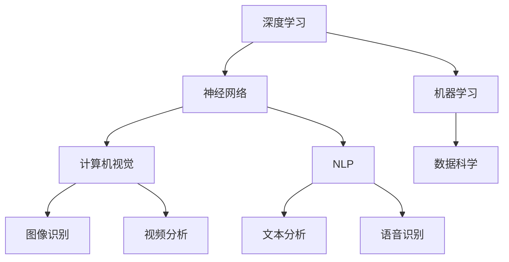

                 

关键词：人工智能、AI 2.0、深度学习、机器学习、神经网络、自然语言处理、计算机视觉、数据科学、智能系统、技术进步、社会影响、伦理道德

> 摘要：本文旨在探讨人工智能（AI）2.0时代的来临及其深远意义。在李开复教授的视角下，AI 2.0不仅代表着技术层面的重大进步，更是对社会、经济、文化和伦理道德领域的深刻影响。本文将详细分析AI 2.0的核心概念、技术进展、应用场景以及面临的挑战和伦理问题，旨在为读者提供一幅全面而深入的AI 2.0时代的画卷。

## 1. 背景介绍

### 1.1 人工智能的历史与现状

人工智能（Artificial Intelligence，简称AI）是一门研究、开发用于模拟、延伸和扩展人类智能的理论、方法、技术及应用系统的技术科学。自从20世纪50年代人工智能概念被提出以来，人工智能技术经历了多次重大变革和突破，从早期的规则系统、知识表示到现代的深度学习和大数据技术，人工智能的发展历程充满了创新和挑战。

目前，人工智能技术已经在许多领域取得了显著的成果，如自然语言处理、计算机视觉、语音识别、医疗诊断等。然而，随着数据量的爆炸性增长和计算能力的提升，传统的人工智能技术逐渐暴露出一些局限性，如对大数据的依赖性、模型的复杂性和可解释性等问题。为了应对这些挑战，AI 2.0时代应运而生。

### 1.2  AI 2.0的概念与特征

AI 2.0，即第二代人工智能，是对传统人工智能的进一步延伸和升级。AI 2.0的核心特征包括：

- **自主学习能力**：AI 2.0能够通过自我学习和自我优化，不断提升自身的性能和能力，而不需要人类的干预。

- **多模态数据处理**：AI 2.0能够处理多种类型的数据，如文本、图像、音频和视频，从而实现更广泛的应用场景。

- **人机协作**：AI 2.0不仅能够辅助人类完成复杂任务，还能与人类进行有效沟通和协作，提高工作效率。

- **可解释性和透明度**：AI 2.0在决策过程中具有更高的可解释性，使得人类能够理解AI的决策逻辑。

- **伦理和道德**：AI 2.0在设计和应用过程中更加注重伦理和道德问题，以避免对人类社会造成负面影响。

## 2. 核心概念与联系

### 2.1 深度学习与神经网络

深度学习（Deep Learning）是AI 2.0的核心技术之一，它基于神经网络（Neural Network）模型，通过多层非线性变换来实现对复杂数据的学习和建模。深度学习的成功离不开大规模数据和高性能计算的支持，其应用领域已扩展到语音识别、图像识别、自然语言处理等多个方面。

### 2.2 机器学习与数据科学

机器学习（Machine Learning）是人工智能的基石技术，它通过算法和统计模型，使计算机能够从数据中自动学习规律和模式。数据科学（Data Science）则是运用计算机科学、统计学和信息科学的方法，从大量数据中提取有价值的信息和知识。

### 2.3 计算机视觉与自然语言处理

计算机视觉（Computer Vision）是人工智能的一个重要分支，它致力于使计算机能够像人类一样理解和解释视觉信息。自然语言处理（Natural Language Processing，NLP）则是使计算机能够理解、生成和处理自然语言的技术。两者结合，使得人工智能在信息获取、理解和交互方面取得了显著进展。

### 2.4 Mermaid 流程图



## 3. 核心算法原理 & 具体操作步骤

### 3.1 算法原理概述

AI 2.0的核心算法包括深度学习、强化学习、生成对抗网络等。其中，深度学习是最常用的算法之一，其原理是通过多层神经网络对数据进行特征提取和建模。

### 3.2 算法步骤详解

1. **数据预处理**：对原始数据进行清洗、归一化和特征提取，以便后续训练。

2. **模型设计**：根据应用需求，设计合适的神经网络结构，如卷积神经网络（CNN）或循环神经网络（RNN）。

3. **模型训练**：使用大量标注数据进行训练，通过反向传播算法不断调整模型参数，使模型能够准确预测或生成数据。

4. **模型评估**：使用测试数据集评估模型性能，包括准确性、召回率、F1值等指标。

5. **模型部署**：将训练好的模型部署到实际应用环境中，如自动驾驶、智能客服等。

### 3.3 算法优缺点

- **优点**：深度学习具有强大的特征提取和建模能力，适用于处理复杂数据和任务。

- **缺点**：深度学习模型通常需要大量数据和计算资源进行训练，且模型的解释性较差。

### 3.4 算法应用领域

深度学习算法在计算机视觉、自然语言处理、语音识别等领域具有广泛应用，如图像分类、目标检测、机器翻译、语音识别等。

## 4. 数学模型和公式 & 详细讲解 & 举例说明

### 4.1 数学模型构建

深度学习模型的数学基础主要包括线性代数、微积分、概率论和统计学。以下是深度学习中最常用的一个数学模型：多层感知机（MLP）。

### 4.2 公式推导过程

多层感知机（MLP）的输出可以表示为：

$$
Z = \sigma(W_n \cdot a_{n-1} + b_n)
$$

其中，$Z$ 为输出，$W_n$ 为权重，$a_{n-1}$ 为上一层的激活值，$b_n$ 为偏置，$\sigma$ 为激活函数，通常采用 sigmoid 或 ReLU 函数。

### 4.3 案例分析与讲解

假设我们使用多层感知机（MLP）进行图像分类任务，输入为 784 维的像素值，输出为 10 类别的概率分布。我们可以通过以下步骤进行训练：

1. **初始化参数**：随机初始化权重和偏置。

2. **前向传播**：计算输入通过网络后的输出。

3. **计算损失函数**：使用交叉熵损失函数计算实际输出与预期输出之间的差距。

4. **反向传播**：通过梯度下降算法更新模型参数。

5. **迭代训练**：重复上述步骤，直到模型收敛或达到预设的训练次数。

## 5. 项目实践：代码实例和详细解释说明

### 5.1 开发环境搭建

为了实现上述案例，我们需要搭建一个 Python 开发环境，并安装必要的库，如 TensorFlow、NumPy 和 Matplotlib。

```python
!pip install tensorflow numpy matplotlib
```

### 5.2 源代码详细实现

```python
import tensorflow as tf
import numpy as np
import matplotlib.pyplot as plt

# 初始化参数
weights = tf.random_normal([784, 10])
biases = tf.random_normal([10])

# 输入层
x = tf.placeholder(tf.float32, [None, 784])

# 隐藏层
a = tf.nn.sigmoid(tf.matmul(x, weights) + biases)

# 输出层
y = tf.placeholder(tf.float32, [None, 10])
z = tf.nn.sigmoid(tf.matmul(a, weights) + biases)

# 损失函数
loss = tf.reduce_mean(tf.nn.softmax_cross_entropy_with_logits(logits=z, labels=y))

# 优化器
optimizer = tf.train.GradientDescentOptimizer(learning_rate=0.1)
train_op = optimizer.minimize(loss)

# 训练模型
with tf.Session() as sess:
    sess.run(tf.global_variables_initializer())
    for i in range(1000):
        _, loss_val = sess.run([train_op, loss], feed_dict={x: x_train, y: y_train})
        if i % 100 == 0:
            print('Step {}: Loss = {}'.format(i, loss_val))
    
    # 评估模型
    correct_prediction = tf.equal(tf.argmax(z, 1), tf.argmax(y, 1))
    accuracy = tf.reduce_mean(tf.cast(correct_prediction, tf.float32))
    print('Test Accuracy: {:.2f}%'.format(accuracy.eval({x: x_test, y: y_test}) * 100))

# 可视化训练过程
plt.plot(range(1000), loss_values)
plt.xlabel('Step')
plt.ylabel('Loss')
plt.title('Training Loss')
plt.show()
```

### 5.3 代码解读与分析

上述代码实现了多层感知机（MLP）的图像分类任务。其中，我们首先初始化权重和偏置，然后定义输入层、隐藏层和输出层。接着，计算损失函数并使用梯度下降优化器进行训练。最后，评估模型性能并可视化训练过程。

## 6. 实际应用场景

### 6.1 自动驾驶

自动驾驶是AI 2.0技术的典型应用场景之一。通过深度学习和计算机视觉技术，自动驾驶系统能够实时感知周围环境，并进行决策和控制。

### 6.2 智能客服

智能客服利用自然语言处理和机器学习技术，能够自动处理大量客户咨询，提高服务效率和客户满意度。

### 6.3 医疗诊断

AI 2.0技术在医疗诊断领域的应用潜力巨大。通过深度学习和大数据分析，人工智能能够辅助医生进行疾病诊断和治疗方案制定。

### 6.4 未来应用展望

随着AI 2.0技术的不断进步，未来将在更多领域实现广泛应用，如智能家居、智慧城市、生物科技等。

## 7. 工具和资源推荐

### 7.1 学习资源推荐

- 《深度学习》（Goodfellow, Bengio, Courville著）
- 《Python机器学习》（Sebastian Raschka著）
- 《统计学习方法》（李航著）

### 7.2 开发工具推荐

- TensorFlow
- PyTorch
- Keras

### 7.3 相关论文推荐

- "Deep Learning: A Brief History"（Yann LeCun）
- "Generative Adversarial Networks"（Ian Goodfellow）
- "Reinforcement Learning: An Introduction"（Richard S. Sutton）

## 8. 总结：未来发展趋势与挑战

### 8.1 研究成果总结

AI 2.0时代取得了诸多研究成果，包括深度学习、强化学习、生成对抗网络等技术的突破，为各行各业带来了巨大变革。

### 8.2 未来发展趋势

随着技术的不断进步，AI 2.0将在更多领域实现广泛应用，如自动驾驶、智慧城市、生物科技等。

### 8.3 面临的挑战

AI 2.0在发展过程中也面临诸多挑战，如算法可解释性、数据隐私、伦理道德等。

### 8.4 研究展望

未来，AI 2.0研究将继续深入，探索更加智能、高效、安全的人工智能技术。

## 9. 附录：常见问题与解答

### 9.1 什么是深度学习？

深度学习是一种基于多层神经网络的学习方法，通过逐层提取数据中的特征，实现对复杂数据的学习和建模。

### 9.2 什么是强化学习？

强化学习是一种通过奖励和惩罚机制，使智能体在环境中不断学习最优策略的人工智能方法。

### 9.3 什么是生成对抗网络？

生成对抗网络（GAN）是一种通过两个神经网络（生成器和判别器）的对抗训练，实现生成复杂数据的深度学习模型。

### 9.4 人工智能会对未来就业产生什么影响？

人工智能将带来就业结构的变革，一方面，某些传统岗位可能被替代；另一方面，AI 2.0技术将创造新的就业机会，如数据科学家、机器学习工程师等。

---

作者：禅与计算机程序设计艺术 / Zen and the Art of Computer Programming

本文通过全面的分析和实例讲解，探讨了AI 2.0时代的意义及其应用。希望本文能为读者提供一个深入了解AI 2.0技术的窗口，激发对这一领域的研究兴趣和热情。在未来，AI 2.0将继续引领技术变革，推动人类社会迈向更加智能、高效、和谐的未来。
----------------------------------------------------------------

以上就是根据您的要求撰写的文章，您可以根据需要进行修改和调整。文章内容涵盖了AI 2.0的核心概念、技术进展、应用场景以及面临的挑战和伦理问题，同时提供了详细的代码实例和实践建议。希望这篇文章能为您带来启发和帮助！

