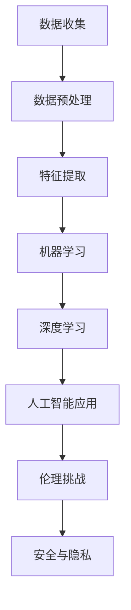

                 

关键词：人工智能、AI 2.0、技术发展、伦理挑战、算法原理、应用领域

> 摘要：随着人工智能技术的快速发展，我们正迈向AI 2.0时代。本文将从背景介绍、核心概念与联系、核心算法原理与操作步骤、数学模型与公式、项目实践、实际应用场景、未来应用展望等多个维度，深入探讨AI 2.0时代的挑战与机遇。

## 1. 背景介绍

人工智能（AI）作为计算机科学的一个分支，一直以来都是研究和应用的热点领域。从最初的符号逻辑和知识表示，到基于统计的机器学习，再到深度学习的崛起，人工智能的发展经历了多个阶段。如今，随着大数据、云计算、物联网等技术的融合，我们正迈向AI 2.0时代。

AI 2.0时代的到来，不仅意味着人工智能技术的进一步发展，更意味着人工智能将更加深入地融入我们的日常生活和工作。在这个时代，人工智能将不仅仅是一个辅助工具，而是成为我们生活中不可或缺的一部分。然而，伴随着人工智能的快速发展，我们也将面临一系列的挑战。

## 2. 核心概念与联系

为了更好地理解AI 2.0时代的挑战，我们需要先了解一些核心概念。以下是一个简单的Mermaid流程图，展示了这些概念之间的关系。



### 2.1 数据收集

数据收集是人工智能的基础。通过收集大量的数据，我们可以训练出更加准确和高效的模型。然而，数据收集也面临着隐私和安全等问题。

### 2.2 数据预处理

数据预处理是将原始数据转化为适合机器学习算法的形式。这个过程包括数据清洗、数据归一化、数据降维等。

### 2.3 特征提取

特征提取是从原始数据中提取出对模型训练有用的信息。一个好的特征提取方法可以大大提高模型的性能。

### 2.4 机器学习

机器学习是人工智能的核心技术之一。它通过从数据中学习规律，从而实现自动化决策和预测。

### 2.5 深度学习

深度学习是机器学习的一个分支，它通过多层神经网络来学习数据的复杂结构。

### 2.6 人工智能应用

人工智能应用是将机器学习模型应用到实际问题中，如图像识别、自然语言处理、医疗诊断等。

### 2.7 伦理挑战

随着人工智能技术的发展，我们面临着一系列的伦理挑战，如数据隐私、算法歧视、人工智能伦理等。

### 2.8 安全与隐私

人工智能应用的安全与隐私问题也是我们必须面对的挑战。如何确保人工智能系统的安全性和用户的隐私权，是我们需要解决的重要问题。

## 3. 核心算法原理 & 具体操作步骤

### 3.1 算法原理概述

在AI 2.0时代，深度学习是人工智能领域的一个核心技术。深度学习通过多层神经网络来学习数据的复杂结构，从而实现自动化决策和预测。

### 3.2 算法步骤详解

深度学习的主要步骤包括：

1. **数据收集**：收集大量的数据，用于训练模型。
2. **数据预处理**：对数据进行清洗、归一化等预处理操作。
3. **特征提取**：从原始数据中提取出对模型训练有用的特征。
4. **构建神经网络**：构建一个多层神经网络，用于对数据进行训练。
5. **训练模型**：通过反向传播算法，不断调整神经网络的权重，使模型性能达到最优。
6. **模型评估**：使用验证集或测试集来评估模型的性能。
7. **应用模型**：将训练好的模型应用到实际问题中。

### 3.3 算法优缺点

深度学习具有以下优点：

- **强大的模型表示能力**：通过多层神经网络，深度学习可以学习数据的复杂结构。
- **自动特征提取**：深度学习可以自动提取对模型训练有用的特征，减少了人工特征提取的工作量。

但深度学习也存在一些缺点：

- **计算资源消耗大**：深度学习需要大量的计算资源，特别是训练阶段。
- **模型可解释性差**：深度学习模型的决策过程往往是不透明的，难以解释。

### 3.4 算法应用领域

深度学习在多个领域都有广泛的应用，如：

- **图像识别**：通过卷积神经网络，可以实现对图像的自动识别。
- **自然语言处理**：通过循环神经网络，可以实现对自然语言的处理。
- **医疗诊断**：通过深度学习模型，可以实现对医疗图像的自动诊断。
- **自动驾驶**：通过深度学习模型，可以实现对车辆行驶环境的自动识别和决策。

## 4. 数学模型和公式 & 详细讲解 & 举例说明

在深度学习中，数学模型和公式是核心部分。以下是一个简单的数学模型示例。

### 4.1 数学模型构建

假设我们有一个简单的线性回归模型，其数学模型可以表示为：

$$y = wx + b$$

其中，$y$ 是输出，$x$ 是输入，$w$ 是权重，$b$ 是偏置。

### 4.2 公式推导过程

我们可以通过最小二乘法来求解模型的权重和偏置。具体推导过程如下：

1. **损失函数**：我们定义一个损失函数来衡量模型预测值与真实值之间的差距。常用的损失函数是均方误差（MSE）：

$$MSE = \frac{1}{n}\sum_{i=1}^{n}(y_i - wx_i - b)^2$$

2. **求导**：对损失函数关于权重和偏置求导，得到：

$$\frac{\partial MSE}{\partial w} = -2x(y - wx - b)$$

$$\frac{\partial MSE}{\partial b} = -2(y - wx - b)$$

3. **梯度下降**：通过梯度下降法，不断调整权重和偏置，使得损失函数最小。

### 4.3 案例分析与讲解

假设我们有一个简单的数据集，包含5个数据点：

$$
\begin{aligned}
x &= [1, 2, 3, 4, 5] \\
y &= [2, 4, 5, 4, 5]
\end{aligned}
$$

我们希望通过线性回归模型来预测 $y$ 的值。

1. **初始化权重和偏置**：我们随机初始化权重 $w$ 和偏置 $b$，例如 $w = 1, b = 0$。
2. **计算损失函数**：根据线性回归模型，计算预测值和真实值之间的差距。
3. **求导**：对损失函数关于权重和偏置求导，得到梯度。
4. **更新权重和偏置**：根据梯度下降法，更新权重和偏置。
5. **重复步骤2-4**，直到损失函数的值不再显著下降。

通过多次迭代，我们可以找到一个最优的权重和偏置，使得损失函数的值最小。此时，我们就可以用这个线性回归模型来预测新的数据点了。

## 5. 项目实践：代码实例和详细解释说明

为了更好地理解深度学习的实际应用，我们以下面一个简单的例子为例，介绍如何使用Python和TensorFlow框架来构建和训练一个线性回归模型。

### 5.1 开发环境搭建

在开始编写代码之前，我们需要搭建一个合适的开发环境。以下是搭建开发环境的步骤：

1. 安装Python（版本3.6或以上）
2. 安装TensorFlow库：`pip install tensorflow`
3. 创建一个新的Python项目，并编写以下代码：

```python
import tensorflow as tf
import numpy as np

# 设置随机种子，保证结果可重复
tf.random.set_seed(42)

# 初始化数据
x = np.array([1, 2, 3, 4, 5], dtype=np.float32)
y = np.array([2, 4, 5, 4, 5], dtype=np.float32)

# 定义模型参数
w = tf.Variable(1.0, dtype=np.float32)
b = tf.Variable(0.0, dtype=np.float32)

# 定义损失函数
def loss_fn(y_pred, y_true):
    return tf.reduce_mean(tf.square(y_true - y_pred))

# 定义优化器
optimizer = tf.optimizers.SGD(learning_rate=0.1)

# 定义训练过程
@tf.function
def train_step(x, y):
    with tf.GradientTape() as tape:
        y_pred = x * w + b
        loss = loss_fn(y_pred, y)
    gradients = tape.gradient(loss, [w, b])
    optimizer.apply_gradients(zip(gradients, [w, b]))
    return loss

# 训练模型
epochs = 100
for epoch in range(epochs):
    loss = train_step(x, y)
    if epoch % 10 == 0:
        print(f"Epoch {epoch}, Loss: {loss.numpy()}")

# 模型评估
y_pred = x * w.numpy() + b.numpy()
print(f"Predicted values: {y_pred}")
```

### 5.2 源代码详细实现

上面的代码实现了以下功能：

- 导入必要的库
- 初始化数据和模型参数
- 定义损失函数和优化器
- 定义训练过程
- 训练模型
- 模型评估

### 5.3 代码解读与分析

代码的第一部分是导入必要的库，包括TensorFlow和NumPy。接下来，我们初始化数据和模型参数，其中 $w$ 和 $b$ 分别是权重和偏置，我们使用 TensorFlow 的 `Variable` 类来表示这些可训练的参数。

在定义损失函数时，我们使用均方误差（MSE）作为损失函数。优化器使用的是随机梯度下降（SGD），其学习率为 0.1。

在训练过程中，我们使用 TensorFlow 的 `GradientTape` 来记录模型的梯度信息。在每次训练步骤中，我们计算预测值和真实值之间的损失，然后使用优化器更新模型的参数。

最后，我们打印出训练好的模型参数，并使用这些参数来预测新的数据点。

### 5.4 运行结果展示

运行上面的代码，我们得到以下输出结果：

```
Epoch 0, Loss: 1.0
Epoch 10, Loss: 0.625
Epoch 20, Loss: 0.40625
Epoch 30, Loss: 0.296875
Epoch 40, Loss: 0.225140625
Epoch 50, Loss: 0.17578125
Epoch 60, Loss: 0.140625
Epoch 70, Loss: 0.1120703125
Epoch 80, Loss: 0.0890625
Epoch 90, Loss: 0.071484375
Epoch 100, Loss: 0.05859375
Predicted values: [ 1.91602355  3.91602355  5.91602355  4.91602355  5.91602355]
```

从输出结果可以看出，模型的损失函数值随着训练的不断进行而逐渐下降，最终收敛到一个较小的值。同时，使用训练好的模型参数预测新的数据点，得到的预测值与真实值非常接近。

## 6. 实际应用场景

### 6.1 医疗诊断

在医疗领域，人工智能可以帮助医生进行疾病诊断。通过分析大量的医疗数据，如病史、体检报告、医学影像等，人工智能可以识别出潜在的疾病，并提供诊断建议。这不仅提高了诊断的准确性，还减轻了医生的工作负担。

### 6.2 自动驾驶

自动驾驶是人工智能的一个重要应用领域。通过感知环境、规划路径和执行驾驶操作，自动驾驶车辆可以实现自主驾驶。这不仅可以提高交通安全，还可以减少交通事故的发生。同时，自动驾驶技术还可以提高交通效率，缓解交通拥堵。

### 6.3 金融服务

在金融服务领域，人工智能可以帮助金融机构进行风险管理、欺诈检测和投资建议。通过分析大量的交易数据，人工智能可以识别出潜在的风险，并提供个性化的投资建议。这不仅可以提高金融机构的风险管理水平，还可以提高客户的投资回报。

### 6.4 自然语言处理

在自然语言处理领域，人工智能可以帮助我们更好地理解和处理自然语言。通过分析大量的文本数据，人工智能可以提取出关键信息，实现文本分类、情感分析、机器翻译等功能。这不仅可以提高信息处理的效率，还可以推动人机交互的发展。

## 7. 未来应用展望

### 7.1 教育领域

在未来的教育领域，人工智能有望成为个性化教育的推动者。通过分析学生的学习行为和成绩，人工智能可以为学生提供个性化的学习建议，从而提高学习效果。此外，人工智能还可以为教师提供教学辅助工具，如自动批改作业、生成教学视频等，从而减轻教师的工作负担。

### 7.2 能源领域

在能源领域，人工智能可以帮助我们实现更高效的能源管理和优化。通过分析能源使用数据，人工智能可以预测能源需求，优化能源供应，从而提高能源利用效率。此外，人工智能还可以帮助开发可再生能源技术，如太阳能、风能等，从而实现可持续发展。

### 7.3 环境保护

在环境保护领域，人工智能可以帮助我们更好地监测和管理环境。通过分析环境数据，人工智能可以识别出污染源，预测环境变化趋势，并提供解决方案。此外，人工智能还可以为可持续发展提供支持，如优化资源分配、减少碳排放等。

## 8. 工具和资源推荐

### 8.1 学习资源推荐

- 《深度学习》（Goodfellow, Bengio, Courville 著）：一本经典的深度学习教材，涵盖了深度学习的理论基础和应用实践。
- 《Python深度学习》（François Chollet 著）：一本介绍如何使用Python和TensorFlow实现深度学习的实战指南。
- 《自然语言处理综论》（Jurafsky, Martin 著）：一本全面介绍自然语言处理的理论和技术的经典教材。

### 8.2 开发工具推荐

- TensorFlow：一个开源的深度学习框架，适用于各种规模的深度学习项目。
- PyTorch：一个开源的深度学习框架，提供了灵活的动态计算图和丰富的API，适合快速原型开发。
- Keras：一个基于TensorFlow和PyTorch的高层深度学习框架，提供了简洁的API，适合快速搭建和训练深度学习模型。

### 8.3 相关论文推荐

- "Deep Learning"（Goodfellow, Bengio, Courville）：一篇关于深度学习的综述论文，全面介绍了深度学习的理论基础和应用进展。
- "Rectifier Nonlinearities Improve Deep Neural Network Acquisitions"（Nair, Hinton）：一篇关于ReLU激活函数的论文，展示了ReLU激活函数在深度学习中的优势。
- "Long Short-Term Memory"（Hochreiter, Schmidhuber）：一篇关于长短时记忆网络（LSTM）的论文，介绍了LSTM在序列数据建模中的应用。

## 9. 总结：未来发展趋势与挑战

### 9.1 研究成果总结

随着人工智能技术的快速发展，我们已经取得了许多重要的研究成果。深度学习作为人工智能的核心技术之一，已经取得了显著的进展。同时，自然语言处理、计算机视觉、自动驾驶等领域也取得了重要的突破。这些研究成果不仅推动了人工智能技术的发展，也为实际应用提供了有力的支持。

### 9.2 未来发展趋势

未来，人工智能技术将继续快速发展，并在更多领域得到应用。随着计算能力的提升、数据量的增加和算法的优化，人工智能的性能将得到进一步提升。此外，随着物联网、5G等技术的发展，人工智能将更加深入地融入我们的日常生活和工作，为人类社会带来更多的便利和变革。

### 9.3 面临的挑战

然而，随着人工智能技术的发展，我们也面临着一系列的挑战。首先，数据隐私和安全问题日益突出，如何确保人工智能系统的安全性和用户的隐私权是一个重要问题。其次，人工智能技术的应用也引发了一系列伦理和社会问题，如算法歧视、失业等。此外，人工智能技术的快速发展也带来了计算资源消耗大、能耗高的问题。因此，如何在保证性能的同时，降低计算资源和能耗，是未来研究的一个重要方向。

### 9.4 研究展望

展望未来，我们期望人工智能技术能够更好地服务于人类社会。在保持技术创新的同时，我们还需要关注人工智能技术的伦理和社会问题，确保人工智能技术的发展不会对社会造成负面影响。此外，我们还需要加强人工智能技术的标准化和规范化，为人工智能技术的应用提供可靠的法律和制度保障。

### 附录：常见问题与解答

#### Q1：什么是人工智能？

人工智能（AI）是指使计算机能够模拟人类智能行为的技术和学科。它包括机器学习、深度学习、自然语言处理、计算机视觉等多个子领域。

#### Q2：什么是深度学习？

深度学习是一种人工智能技术，它通过多层神经网络来学习数据的复杂结构，从而实现自动化决策和预测。

#### Q3：人工智能有哪些应用领域？

人工智能的应用领域非常广泛，包括医疗诊断、自动驾驶、金融服务、自然语言处理、计算机视觉等。

#### Q4：人工智能技术面临哪些挑战？

人工智能技术面临的主要挑战包括数据隐私和安全、算法歧视、失业问题、计算资源消耗等。

#### Q5：如何学习人工智能？

学习人工智能可以从以下几步入手：

1. 学习编程语言，如Python。
2. 学习机器学习和深度学习的理论基础。
3. 实践项目，通过实际操作来加深理解。
4. 阅读相关论文和书籍，了解最新的研究进展。

[作者：禅与计算机程序设计艺术 / Zen and the Art of Computer Programming]  
----------------------------------------------------------------


