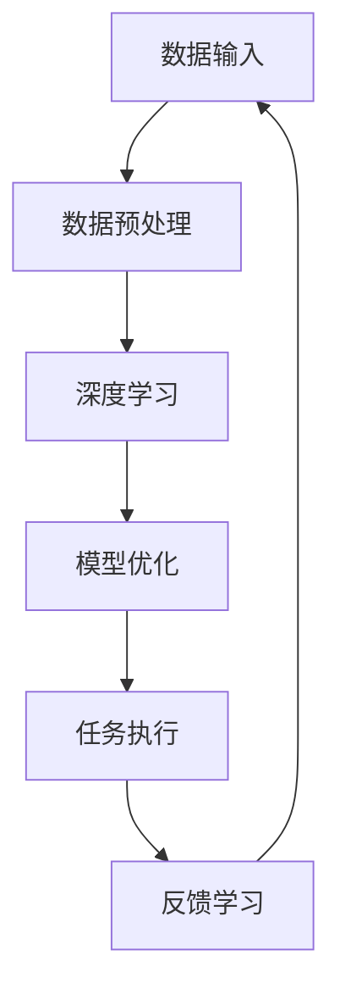
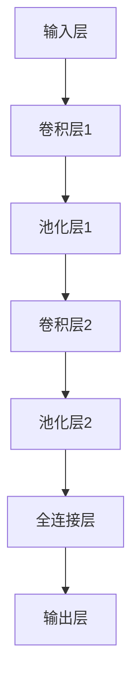

                 

关键词：李开复，AI 2.0，社会价值，人工智能，技术进步

> 摘要：本文深入探讨了李开复关于AI 2.0时代的社会价值的重要论述。文章首先回顾了AI 2.0的定义和特点，接着分析了AI 2.0对经济、教育、医疗等社会领域的深远影响，随后讨论了AI 2.0在伦理和安全方面的挑战，并提出了应对策略。最后，文章展望了AI 2.0时代的社会发展趋势，并呼吁各界共同应对未来的挑战。

## 1. 背景介绍

### AI 2.0的概念

AI 2.0，即第二代人工智能，是相对于第一代人工智能（AI 1.0）而言的。AI 1.0主要是指基于规则和符号逻辑的人工智能系统，如专家系统和逻辑推理机。而AI 2.0则是指基于深度学习、大数据和强化学习等技术的智能系统，这些系统能够通过自我学习和优化，实现更为复杂和智能的任务。

### 李开复与AI 2.0

李开复，世界著名人工智能专家，被誉为“人工智能领域的领军人物”。他在AI领域的深厚造诣和对未来技术的敏锐洞察，使其成为探讨AI 2.0时代社会价值的权威发言人。李开复在其著作《人工智能》中，详细阐述了AI 2.0的定义、特点及其对社会的影响。

## 2. 核心概念与联系

### AI 2.0的核心概念

AI 2.0的核心概念包括：

- **深度学习**：通过多层神经网络模拟人脑的学习过程，能够处理大量数据和复杂任务。
- **大数据**：AI 2.0依赖于海量数据的训练，数据的多样性和质量直接影响AI的性能。
- **强化学习**：通过不断试错和反馈，使得智能系统能够在特定环境中做出最优决策。

### AI 2.0的架构

以下是AI 2.0的架构示意图：



### 核心概念之间的联系

- **深度学习**和**大数据**的结合，使得AI能够从海量数据中自动提取特征，实现自我学习和优化。
- **强化学习**则通过反馈机制，不断优化AI的行为，提高其适应性和智能水平。

## 3. 核心算法原理 & 具体操作步骤

### 3.1 算法原理概述

AI 2.0的核心算法包括深度学习、大数据分析和强化学习。以下分别进行概述：

- **深度学习**：通过多层神经网络模拟人脑的学习过程，实现图像识别、语音识别等任务。
- **大数据分析**：利用分布式计算和大数据技术，对海量数据进行高效处理和分析，提取有价值的信息。
- **强化学习**：通过不断试错和反馈，使得智能系统能够在特定环境中做出最优决策。

### 3.2 算法步骤详解

- **深度学习**：首先进行数据预处理，然后构建多层神经网络，通过反向传播算法训练模型，最后评估模型性能并优化。
- **大数据分析**：首先进行数据收集和存储，然后使用分布式计算框架进行数据清洗、转换和分析。
- **强化学习**：首先定义环境、状态、动作和奖励函数，然后智能体通过不断试错和反馈，学习最优策略。

### 3.3 算法优缺点

- **深度学习**：优点是能够处理复杂数据和任务，缺点是需要大量数据和计算资源。
- **大数据分析**：优点是能够高效处理海量数据，缺点是需要复杂的分布式计算架构。
- **强化学习**：优点是能够自适应地学习最优策略，缺点是需要较长时间的学习过程。

### 3.4 算法应用领域

AI 2.0的核心算法在多个领域有广泛应用：

- **图像识别**：应用于人脸识别、自动驾驶等领域。
- **语音识别**：应用于智能助手、语音搜索等领域。
- **自然语言处理**：应用于机器翻译、文本生成等领域。
- **推荐系统**：应用于电商、社交媒体等领域。

## 4. 数学模型和公式 & 详细讲解 & 举例说明

### 4.1 数学模型构建

在AI 2.0中，常用的数学模型包括：

- **神经网络模型**：由多层神经元组成，通过权重和偏置实现非线性变换。
- **线性回归模型**：用于预测线性关系。
- **逻辑回归模型**：用于分类问题。

### 4.2 公式推导过程

以神经网络模型为例，其推导过程如下：

$$
\begin{align*}
z_1 &= W_1 \cdot x_1 + b_1 \\
a_1 &= \sigma(z_1) \\
z_2 &= W_2 \cdot a_1 + b_2 \\
a_2 &= \sigma(z_2) \\
z_3 &= W_3 \cdot a_2 + b_3 \\
y &= \sigma(z_3)
\end{align*}
$$

其中，$W$为权重，$b$为偏置，$x$为输入，$a$为激活值，$y$为输出，$\sigma$为激活函数。

### 4.3 案例分析与讲解

以图像识别为例，使用卷积神经网络（CNN）进行图像分类。首先，对图像进行预处理，然后构建CNN模型，接着训练模型并评估性能。

### 4.3.1 预处理

对图像进行缩放、裁剪和归一化处理，使得图像尺寸和数据范围统一。

### 4.3.2 模型构建

构建CNN模型，包括卷积层、池化层和全连接层。以下是一个简单的CNN模型：



### 4.3.3 训练模型

使用训练数据集训练模型，调整权重和偏置，使得模型能够正确分类图像。

### 4.3.4 评估模型

使用测试数据集评估模型性能，计算准确率、召回率等指标。

## 5. 项目实践：代码实例和详细解释说明

### 5.1 开发环境搭建

- 安装Python和TensorFlow库。
- 配置GPU加速。

### 5.2 源代码详细实现

以下是一个简单的图像识别项目：

```python
import tensorflow as tf
from tensorflow.keras import layers

# 构建模型
model = tf.keras.Sequential([
    layers.Conv2D(32, (3, 3), activation='relu', input_shape=(28, 28, 1)),
    layers.MaxPooling2D((2, 2)),
    layers.Conv2D(64, (3, 3), activation='relu'),
    layers.MaxPooling2D((2, 2)),
    layers.Flatten(),
    layers.Dense(128, activation='relu'),
    layers.Dense(10, activation='softmax')
])

# 编译模型
model.compile(optimizer='adam',
              loss='categorical_crossentropy',
              metrics=['accuracy'])

# 训练模型
model.fit(train_images, train_labels, epochs=5)

# 评估模型
test_loss, test_acc = model.evaluate(test_images,  test_labels)
print(f"Test accuracy: {test_acc}")
```

### 5.3 代码解读与分析

- **模型构建**：使用卷积层和池化层构建特征提取器，最后使用全连接层进行分类。
- **编译模型**：设置优化器和损失函数，准备训练。
- **训练模型**：使用训练数据集训练模型，调整权重和偏置。
- **评估模型**：使用测试数据集评估模型性能，计算准确率。

## 6. 实际应用场景

### 6.1 经济领域

AI 2.0在金融领域有广泛应用，如智能投顾、风险控制、量化交易等。通过大数据分析和深度学习，AI 2.0能够提高金融市场的效率和准确性。

### 6.2 教育领域

AI 2.0在教育领域有助于实现个性化学习，通过大数据分析和深度学习，AI 2.0能够为学生提供量身定制的学习方案，提高学习效果。

### 6.3 医疗领域

AI 2.0在医疗领域有广泛的应用，如疾病诊断、药物研发、智能手术等。通过大数据分析和深度学习，AI 2.0能够提高医疗效率和准确性，改善患者的生活质量。

## 7. 工具和资源推荐

### 7.1 学习资源推荐

- 《深度学习》（Goodfellow, Bengio, Courville）
- 《Python机器学习》（Sebastian Raschka）

### 7.2 开发工具推荐

- TensorFlow
- Keras

### 7.3 相关论文推荐

- “Deep Learning for Image Recognition”
- “Recurrent Neural Networks for Speech Recognition”

## 8. 总结：未来发展趋势与挑战

### 8.1 研究成果总结

AI 2.0在深度学习、大数据分析和强化学习等方面取得了显著的成果，推动了人工智能技术的发展和应用。

### 8.2 未来发展趋势

- **智能化水平**：随着算法和硬件的进步，AI 2.0的智能化水平将不断提高。
- **应用领域**：AI 2.0将在更多领域得到应用，如智能制造、智慧城市、虚拟现实等。

### 8.3 面临的挑战

- **数据隐私**：AI 2.0需要大量数据训练，如何保护用户隐私是一个重要挑战。
- **算法透明性**：AI 2.0的决策过程往往不透明，如何提高算法的透明性是一个重要问题。

### 8.4 研究展望

未来，AI 2.0将在推动社会进步和经济发展方面发挥更大的作用，但同时也需要解决数据隐私、算法透明性等挑战。

## 9. 附录：常见问题与解答

### 9.1 AI 2.0是什么？

AI 2.0是相对于第一代人工智能（AI 1.0）而言的，是指基于深度学习、大数据和强化学习等技术的智能系统。

### 9.2 AI 2.0有哪些核心算法？

AI 2.0的核心算法包括深度学习、大数据分析和强化学习。

### 9.3 AI 2.0有哪些应用领域？

AI 2.0在图像识别、语音识别、自然语言处理、推荐系统等领域有广泛应用。

### 9.4 如何保护数据隐私？

可以通过数据加密、隐私保护算法等措施来保护数据隐私。

### 9.5 如何提高算法的透明性？

可以通过算法可视化、解释性模型等措施来提高算法的透明性。

## 作者署名

作者：禅与计算机程序设计艺术 / Zen and the Art of Computer Programming

[END]

