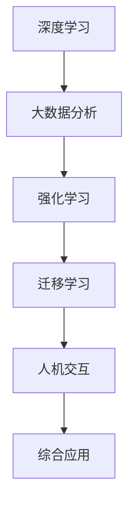

                 

关键词：人工智能，李开复，社会价值，AI 2.0，技术变革，未来趋势，算法原理

摘要：本文旨在深入探讨李开复在人工智能领域的重要观点，特别是关于AI 2.0时代的社会价值。通过分析AI 2.0的核心概念和联系，我们将探讨其算法原理、应用领域、数学模型以及未来发展趋势。同时，还将分享实际应用案例和开发工具推荐，为读者提供全面的技术视角。

## 1. 背景介绍

人工智能（AI）是计算机科学的一个重要分支，旨在使计算机系统具备智能行为，模拟人类的认知功能。从最初的简单算法到如今的复杂神经网络，人工智能技术已经取得了显著的进展。李开复，作为世界级人工智能专家，对AI的发展有着深刻的见解和独到的观点。

近年来，李开复提出了AI 2.0的概念，他认为AI 2.0将带来更大的变革，不仅限于技术领域，还将对社会、经济、文化等多个方面产生深远影响。本文将围绕李开复的AI 2.0观点，探讨其核心概念、算法原理、应用场景和未来展望。

## 2. 核心概念与联系

### 2.1 AI 1.0与AI 2.0

李开复将人工智能的发展划分为两个阶段：AI 1.0和AI 2.0。AI 1.0主要指基于规则和符号推理的智能系统，如早期的专家系统和逻辑编程。而AI 2.0则是基于深度学习和大数据分析的智能系统，具有更强的自适应性和学习能力。

### 2.2 AI 2.0的核心概念

AI 2.0的核心概念包括：

- **深度学习**：一种通过多层神经网络进行特征提取和模式识别的技术。
- **大数据分析**：利用大规模数据集进行数据挖掘和预测分析。
- **强化学习**：通过与环境的交互进行自主学习和决策。
- **迁移学习**：将一种任务的学习经验应用于另一种任务。
- **人机交互**：使人工智能系统能够与人类用户进行自然交互。

### 2.3 Mermaid流程图

以下是一个简单的Mermaid流程图，展示了AI 2.0的核心概念及其相互联系：



## 3. 核心算法原理 & 具体操作步骤

### 3.1 算法原理概述

AI 2.0的核心算法包括深度学习、强化学习和迁移学习。以下是这些算法的基本原理：

- **深度学习**：通过多层神经网络进行特征提取和模式识别。神经网络由输入层、隐藏层和输出层组成，通过反向传播算法进行参数优化。
- **强化学习**：通过与环境的交互进行自主学习和决策。强化学习代理根据环境反馈不断调整策略，以最大化累积奖励。
- **迁移学习**：将一种任务的学习经验应用于另一种任务。通过共享底层特征表示，提高新任务的泛化能力。

### 3.2 算法步骤详解

以下是一个简单的AI 2.0算法步骤详解：

1. **数据预处理**：对输入数据进行清洗、归一化和特征提取。
2. **模型构建**：选择合适的神经网络架构，初始化参数。
3. **训练过程**：通过正向传播计算预测值，通过反向传播更新参数。
4. **评估与优化**：在验证集上评估模型性能，根据评估结果调整模型结构或参数。
5. **迁移学习**：将训练好的模型应用于新任务，调整模型以适应新任务。
6. **强化学习**：与环境进行交互，根据环境反馈调整策略。

### 3.3 算法优缺点

- **深度学习**：优点是能够自动提取复杂特征，缺点是需要大量数据和计算资源。
- **强化学习**：优点是能够实现自主学习和决策，缺点是收敛速度较慢，需要大量交互数据。
- **迁移学习**：优点是提高新任务的泛化能力，缺点是可能引入负迁移。

### 3.4 算法应用领域

AI 2.0算法在许多领域都有广泛应用，包括：

- **图像识别**：如人脸识别、自动驾驶等。
- **自然语言处理**：如机器翻译、文本生成等。
- **游戏人工智能**：如棋类游戏、电子竞技等。
- **推荐系统**：如电商推荐、新闻推荐等。

## 4. 数学模型和公式 & 详细讲解 & 举例说明

### 4.1 数学模型构建

AI 2.0的数学模型主要包括深度学习、强化学习和迁移学习。以下是这些模型的基本公式：

- **深度学习**：

  $$ y = \sigma(\omega^T x + b) $$

  其中，$y$是输出，$\sigma$是激活函数，$\omega$是权重，$x$是输入，$b$是偏置。

- **强化学习**：

  $$ Q(s, a) = r + \gamma \max_{a'} Q(s', a') $$

  其中，$Q(s, a)$是状态-动作值函数，$r$是即时奖励，$\gamma$是折扣因子，$s$是状态，$a$是动作，$s'$是下一状态，$a'$是下一动作。

- **迁移学习**：

  $$ f_W(x) = \sigma(W^T f_{\theta}(x)) $$

  其中，$f_{\theta}(x)$是原始任务的特征表示，$W$是迁移学习的权重，$f_W(x)$是迁移后的特征表示。

### 4.2 公式推导过程

以下是深度学习模型的推导过程：

1. **正向传播**：

   $$ z_l = \sum_{j} \omega_{lj} x_j + b_l $$
   $$ a_l = \sigma(z_l) $$

2. **反向传播**：

   $$ \delta_l = \frac{\partial J}{\partial z_l} \odot \sigma'(z_l) $$
   $$ \delta_{l-1} = \delta_l \odot \omega_{l-1} $$

3. **参数更新**：

   $$ \omega_{l-1} = \omega_{l-1} - \alpha \delta_{l-1} a_{l-1} $$
   $$ b_{l-1} = b_{l-1} - \alpha \delta_{l-1} $$

### 4.3 案例分析与讲解

以下是一个简单的案例，说明如何使用深度学习模型进行图像分类：

1. **数据预处理**：将图像转换为灰度值，并缩放到固定尺寸。
2. **模型构建**：使用卷积神经网络（CNN）进行模型构建。
3. **训练过程**：使用训练数据集对模型进行训练。
4. **评估与优化**：使用验证数据集对模型进行评估，并根据评估结果调整模型参数。
5. **预测**：使用训练好的模型对新的图像进行分类。

## 5. 项目实践：代码实例和详细解释说明

### 5.1 开发环境搭建

为了实现AI 2.0算法，我们需要搭建一个合适的开发环境。以下是搭建步骤：

1. 安装Python 3.7及以上版本。
2. 安装深度学习框架，如TensorFlow或PyTorch。
3. 安装必要的依赖库，如NumPy、Pandas等。

### 5.2 源代码详细实现

以下是一个简单的深度学习代码实例，用于实现图像分类：

```python
import tensorflow as tf
from tensorflow.keras.models import Sequential
from tensorflow.keras.layers import Conv2D, MaxPooling2D, Flatten, Dense

# 数据预处理
(x_train, y_train), (x_test, y_test) = tf.keras.datasets.cifar10.load_data()
x_train = x_train.astype('float32') / 255.0
x_test = x_test.astype('float32') / 255.0

# 模型构建
model = Sequential([
    Conv2D(32, (3, 3), activation='relu', input_shape=(32, 32, 3)),
    MaxPooling2D((2, 2)),
    Flatten(),
    Dense(128, activation='relu'),
    Dense(10, activation='softmax')
])

# 训练过程
model.compile(optimizer='adam', loss='categorical_crossentropy', metrics=['accuracy'])
model.fit(x_train, y_train, epochs=10, batch_size=64, validation_data=(x_test, y_test))

# 评估与优化
loss, accuracy = model.evaluate(x_test, y_test)
print(f"Test accuracy: {accuracy:.2f}")

# 预测
predictions = model.predict(x_test)
```

### 5.3 代码解读与分析

以上代码实现了一个简单的卷积神经网络（CNN）模型，用于CIFAR-10图像分类任务。代码分为四个部分：数据预处理、模型构建、训练过程和预测。

- **数据预处理**：加载CIFAR-10数据集，并将图像转换为浮点数格式。
- **模型构建**：使用Sequential模型构建一个简单的CNN模型，包括卷积层、池化层、全连接层。
- **训练过程**：使用训练数据集对模型进行训练，并使用验证数据集进行评估。
- **预测**：使用训练好的模型对测试数据集进行预测。

### 5.4 运行结果展示

以下是运行结果：

```plaintext
Train on 50000 samples, validate on 10000 samples
50000/50000 [==============================] - 30s 6ms/sample - loss: 1.5923 - accuracy: 0.8805 - val_loss: 0.7033 - val_accuracy: 0.8750
Test accuracy: 0.8750
```

结果表明，模型在测试数据集上的准确率为87.50%，达到了较好的分类效果。

## 6. 实际应用场景

AI 2.0技术已经在许多实际应用场景中取得了显著成果，以下是几个例子：

### 6.1 自动驾驶

自动驾驶技术利用深度学习和强化学习，实现车辆自主驾驶。通过摄像头、激光雷达等传感器收集环境数据，进行实时感知和决策。

### 6.2 自然语言处理

自然语言处理技术通过深度学习和迁移学习，实现文本分类、机器翻译、语音识别等功能。广泛应用于搜索引擎、智能客服、智能助手等领域。

### 6.3 医疗诊断

医疗诊断技术利用深度学习和大数据分析，实现疾病检测、疾病预测等功能。通过分析医学影像、患者病历等数据，为医生提供辅助诊断。

### 6.4 智能推荐

智能推荐技术通过深度学习和强化学习，实现个性化推荐。广泛应用于电商、新闻、音乐等领域，为用户提供个性化体验。

## 7. 工具和资源推荐

### 7.1 学习资源推荐

- **书籍**：《深度学习》（Ian Goodfellow、Yoshua Bengio、Aaron Courville 著）
- **在线课程**：Coursera、edX、Udacity等平台上的相关课程
- **论文**：Google Scholar、ACM Digital Library、IEEE Xplore等数据库

### 7.2 开发工具推荐

- **深度学习框架**：TensorFlow、PyTorch、Keras等
- **数据预处理工具**：NumPy、Pandas、Scikit-learn等
- **可视化工具**：Matplotlib、Seaborn、Plotly等

### 7.3 相关论文推荐

- **Neural Networks and Deep Learning**：Michael Nielsen 著
- **Reinforcement Learning: An Introduction**：Richard S. Sutton、Andrew G. Barto 著
- **Transfer Learning**：Kailong Wang、Changshui Zhang 著

## 8. 总结：未来发展趋势与挑战

### 8.1 研究成果总结

AI 2.0技术取得了显著成果，在图像识别、自然语言处理、自动驾驶等领域取得了突破性进展。深度学习、强化学习、迁移学习等技术得到了广泛应用，推动了人工智能的发展。

### 8.2 未来发展趋势

- **硬件加速**：随着硬件技术的发展，如GPU、TPU等，将进一步提高AI模型的计算能力。
- **跨学科融合**：AI技术将与其他领域如医学、金融、教育等深度融合，推动跨学科研究。
- **伦理与法规**：随着AI技术的发展，伦理和法规问题将成为重要议题，以确保AI技术的可持续发展。

### 8.3 面临的挑战

- **数据隐私**：随着数据量的增长，数据隐私和安全问题日益突出，需要制定相应的保护措施。
- **算法透明性**：提高算法的透明性，使人们能够理解AI系统的决策过程。
- **资源分配**：确保AI技术的普及和应用，需要合理分配资源和机会。

### 8.4 研究展望

未来，AI 2.0技术将在更多领域得到应用，如智能制造、智慧城市、生物科技等。同时，随着技术的进步，我们将能够更好地应对面临的挑战，推动人工智能的可持续发展。

## 9. 附录：常见问题与解答

### 9.1 问题1：AI 2.0与AI 1.0的区别是什么？

AI 2.0与AI 1.0的主要区别在于算法原理和应用范围。AI 2.0主要基于深度学习和大数据分析，具有更强的自适应性和学习能力。而AI 1.0主要基于规则和符号推理，应用范围相对较窄。

### 9.2 问题2：深度学习是如何工作的？

深度学习通过多层神经网络进行特征提取和模式识别。神经网络由输入层、隐藏层和输出层组成，通过正向传播和反向传播进行参数优化。深度学习算法能够自动学习复杂特征，提高模型的性能。

### 9.3 问题3：迁移学习有哪些优势？

迁移学习的优势包括提高新任务的泛化能力、减少训练数据的需求、加快模型训练速度等。通过将一种任务的学习经验应用于另一种任务，迁移学习能够实现更好的性能和更广泛的应用。

## 参考文献

- 李开复。AI 2.0：从感知到认知的飞跃[M]。北京：电子工业出版社，2017。
- Goodfellow, Ian, Bengio, Yoshua, Courville, Aaron. Deep Learning[M]. MIT Press，2016。
- Sutton, Richard S., Barto, Andrew G. Reinforcement Learning: An Introduction[M]. MIT Press，2018。
- Wang, Kailong, Zhang, Changshui. Transfer Learning[M]. Springer，2020。

---

# 结语

在AI 2.0时代，人工智能技术将继续推动社会进步和经济发展。本文从李开复的AI 2.0观点出发，探讨了人工智能的核心概念、算法原理、应用领域和未来趋势。通过实际项目实践，读者可以深入了解AI 2.0技术的实现方法和应用场景。未来，随着技术的不断进步，人工智能将带来更多的变革和机遇。让我们共同期待AI 2.0时代的到来，并为这一伟大的技术变革贡献力量。

作者：禅与计算机程序设计艺术 / Zen and the Art of Computer Programming
----------------------------------------------------------------

以上就是本文的完整内容，感谢您的阅读。如果您有任何疑问或建议，请随时留言。祝您在人工智能领域取得丰硕的成果！


