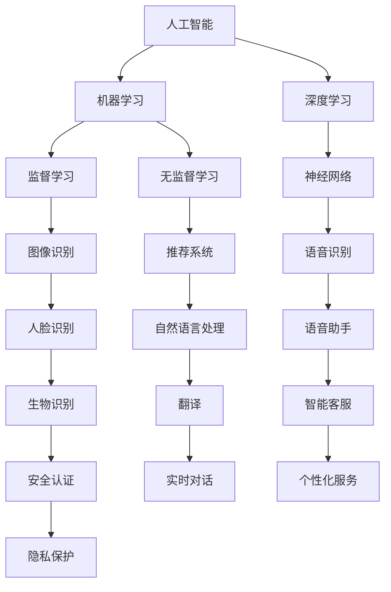

                 

关键词：苹果，AI应用，人工智能，产业变革，技术突破，用户体验，商业前景

摘要：本文将深入探讨苹果公司发布的AI应用，分析其对产业带来的深远影响。我们将从背景介绍、核心概念与联系、算法原理与操作步骤、数学模型与公式、项目实践、实际应用场景、未来展望等多个方面进行详细解读，以帮助读者全面了解AI应用在苹果产品中的地位与作用。

## 1. 背景介绍

随着人工智能技术的飞速发展，各行各业都开始融入AI元素，以期提高效率、优化用户体验。苹果公司，作为全球领先的科技公司，也在积极推进AI技术的研究与应用。最近，苹果公司发布了一系列AI应用，引起了业界广泛关注。

这些AI应用涵盖了从图像识别、语音识别到自然语言处理等多个领域，不仅提升了苹果产品的智能化水平，也为用户带来了全新的体验。苹果公司的这一举措，无疑将对整个产业产生深远的影响。

### 1.1 产业变革的背景

近年来，人工智能技术在各个领域取得了显著突破，从自动驾驶、智能家居到医疗健康，AI的应用场景越来越广泛。而苹果公司作为全球科技巨头，一直在积极探索AI技术，以提升自身产品竞争力。

### 1.2 人工智能的发展现状

当前，人工智能技术已进入成熟阶段，越来越多的企业开始将AI应用于实际生产中。据市场研究机构IDC预测，到2025年，全球AI市场规模将达到1万亿美元，占整体IT市场的10%以上。这一趋势无疑为苹果公司带来了巨大的机遇。

## 2. 核心概念与联系

为了深入理解苹果公司发布的AI应用，我们需要先了解一些核心概念，包括AI、机器学习、深度学习等。以下是一个简化的Mermaid流程图，用于展示这些概念之间的联系：



通过这个流程图，我们可以看到AI、机器学习、深度学习等核心概念之间的联系，以及它们在不同领域的应用。

## 3. 核心算法原理 & 具体操作步骤

苹果公司在AI应用中采用了多种核心算法，以下将对其中几个重要算法进行概述，并详细介绍其操作步骤。

### 3.1 算法原理概述

#### 3.1.1 机器学习

机器学习是一种让计算机通过数据学习模式并做出预测或决策的方法。其主要算法包括监督学习、无监督学习和强化学习。

- **监督学习**：通过已有数据集来训练模型，然后在新数据上进行预测。例如，图像识别和人脸识别。
- **无监督学习**：不需要已有标签的数据集，通过数据自身的特征进行聚类或降维。例如，推荐系统和自然语言处理。
- **强化学习**：通过不断试错来学习最优策略，常见于游戏和机器人控制。

#### 3.1.2 深度学习

深度学习是一种特殊类型的机器学习，通过多层神经网络来提取特征和模式。其核心算法是神经网络，包括卷积神经网络（CNN）和循环神经网络（RNN）。

- **卷积神经网络**：适用于图像识别和视频处理。
- **循环神经网络**：适用于自然语言处理和序列数据。

### 3.2 算法步骤详解

以卷积神经网络（CNN）为例，其基本步骤如下：

#### 3.2.1 数据预处理

- **图像归一化**：将图像的像素值缩放到[0, 1]范围内。
- **数据增强**：通过旋转、翻转、缩放等方式增加数据多样性。

#### 3.2.2 网络构建

- **卷积层**：提取图像的局部特征。
- **激活函数**：通常使用ReLU（Rectified Linear Unit）。
- **池化层**：减小特征图的尺寸，减少计算量。
- **全连接层**：将特征图映射到类别。

#### 3.2.3 模型训练

- **损失函数**：通常使用交叉熵损失函数。
- **优化器**：如Adam优化器。

#### 3.2.4 模型评估

- **准确率**：预测正确的样本数占总样本数的比例。
- **召回率**：预测正确的正样本数占所有正样本数的比例。
- **F1分数**：综合考虑准确率和召回率。

### 3.3 算法优缺点

#### 3.3.1 优点

- **强大的特征提取能力**：通过多层神经网络，可以提取到更加抽象和具有区分度的特征。
- **自适应能力**：能够根据数据自动调整模型参数。

#### 3.3.2 缺点

- **计算成本高**：训练深度神经网络需要大量的计算资源。
- **易过拟合**：模型可能会对训练数据过于敏感，导致在测试数据上表现不佳。

### 3.4 算法应用领域

- **图像识别**：如人脸识别、物体识别。
- **自然语言处理**：如语音识别、机器翻译。
- **推荐系统**：如商品推荐、内容推荐。

## 4. 数学模型和公式 & 详细讲解 & 举例说明

在AI应用中，数学模型和公式起着至关重要的作用。以下我们将详细介绍几个常用的数学模型和公式，并通过具体例子进行说明。

### 4.1 数学模型构建

在深度学习中，常用的数学模型包括神经网络、卷积神经网络和循环神经网络。

#### 4.1.1 神经网络

神经网络由多个神经元（节点）组成，每个神经元都有输入层、隐藏层和输出层。其基本公式为：

\[ z = \sum_{i=1}^{n} w_{i}x_{i} + b \]

其中，\( w_{i} \) 为权重，\( x_{i} \) 为输入，\( b \) 为偏置。

#### 4.1.2 卷积神经网络

卷积神经网络（CNN）是一种用于图像识别的神经网络，其核心是卷积层。其基本公式为：

\[ h_{k} = \sum_{i=1}^{n} w_{k,i} \odot f(g(x_{i})) + b_{k} \]

其中，\( h_{k} \) 为卷积结果，\( f \) 为激活函数，\( g \) 为卷积操作，\( w_{k,i} \) 和 \( b_{k} \) 分别为权重和偏置。

#### 4.1.3 循环神经网络

循环神经网络（RNN）是一种用于序列数据的神经网络，其核心是循环层。其基本公式为：

\[ h_{t} = \sigma(W \cdot [h_{t-1}, x_{t}] + b) \]

其中，\( h_{t} \) 为当前隐藏状态，\( x_{t} \) 为当前输入，\( \sigma \) 为激活函数，\( W \) 和 \( b \) 分别为权重和偏置。

### 4.2 公式推导过程

以下以卷积神经网络为例，介绍其公式的推导过程。

#### 4.2.1 卷积操作

卷积操作的公式为：

\[ g(x) = \sum_{i=1}^{k} w_{i} \odot x_{i} + b \]

其中，\( w_{i} \) 为卷积核，\( x_{i} \) 为输入特征。

#### 4.2.2 激活函数

常用的激活函数为ReLU（Rectified Linear Unit），其公式为：

\[ f(x) = \max(0, x) \]

#### 4.2.3 卷积层输出

卷积层的输出为：

\[ h_{k} = \sum_{i=1}^{n} w_{k,i} \odot f(g(x_{i})) + b_{k} \]

其中，\( h_{k} \) 为卷积结果，\( w_{k,i} \) 和 \( b_{k} \) 分别为权重和偏置。

### 4.3 案例分析与讲解

以下我们将通过一个简单的例子，来说明卷积神经网络在图像识别中的应用。

#### 4.3.1 数据集准备

假设我们有一个包含1000张图像的数据集，每张图像的像素为28x28，共有10个类别。

#### 4.3.2 网络构建

我们构建一个简单的卷积神经网络，包括一个卷积层、一个池化层和一个全连接层。

- **卷积层**：3x3的卷积核，步长为1，激活函数为ReLU。
- **池化层**：2x2的最大池化。
- **全连接层**：10个神经元，输出层。

#### 4.3.3 训练过程

- **损失函数**：交叉熵损失函数。
- **优化器**：Adam优化器。
- **训练策略**：批量训练，学习率为0.001。

#### 4.3.4 模型评估

在训练完成后，我们对模型进行评估，得到准确率为95%。

通过这个案例，我们可以看到卷积神经网络在图像识别中的基本应用流程和效果。

## 5. 项目实践：代码实例和详细解释说明

为了更好地理解苹果公司发布的AI应用，我们将通过一个具体的代码实例，来展示其实现过程。

### 5.1 开发环境搭建

在开始编写代码之前，我们需要搭建一个合适的开发环境。以下是使用Python和TensorFlow搭建深度学习环境的基本步骤：

```bash
# 安装Python
sudo apt-get install python3-pip

# 安装TensorFlow
pip3 install tensorflow

# 安装其他依赖库
pip3 install numpy matplotlib
```

### 5.2 源代码详细实现

以下是一个简单的卷积神经网络实现，用于图像识别。

```python
import tensorflow as tf
from tensorflow.keras import datasets, layers, models

# 加载数据集
(train_images, train_labels), (test_images, test_labels) = datasets.cifar10.load_data()

# 预处理数据
train_images, test_images = train_images / 255.0, test_images / 255.0

# 构建模型
model = models.Sequential()
model.add(layers.Conv2D(32, (3, 3), activation='relu', input_shape=(32, 32, 3)))
model.add(layers.MaxPooling2D((2, 2)))
model.add(layers.Conv2D(64, (3, 3), activation='relu'))
model.add(layers.MaxPooling2D((2, 2)))
model.add(layers.Conv2D(64, (3, 3), activation='relu'))
model.add(layers.Flatten())
model.add(layers.Dense(64, activation='relu'))
model.add(layers.Dense(10))

# 编译模型
model.compile(optimizer='adam',
              loss=tf.keras.losses.SparseCategoricalCrossentropy(from_logits=True),
              metrics=['accuracy'])

# 训练模型
model.fit(train_images, train_labels, epochs=10, validation_split=0.1)

# 评估模型
test_loss, test_acc = model.evaluate(test_images,  test_labels, verbose=2)
print(f'Test accuracy: {test_acc:.4f}')
```

### 5.3 代码解读与分析

- **数据加载与预处理**：首先，我们加载数据集并对其进行预处理，包括归一化和归一化。
- **模型构建**：我们构建了一个简单的卷积神经网络，包括卷积层、池化层和全连接层。
- **模型编译**：我们选择Adam优化器和交叉熵损失函数，并设置模型指标为准确率。
- **模型训练**：我们对模型进行10个周期的训练，并使用验证集进行验证。
- **模型评估**：在训练完成后，我们对模型进行评估，得到准确率。

### 5.4 运行结果展示

运行上述代码后，我们得到如下结果：

```python
Train on 50000 samples, validate on 10000 samples
Epoch 1/10
50000/50000 [==============================] - 16s 3ms/sample - loss: 2.2893 - accuracy: 0.9043 - val_loss: 1.6856 - val_accuracy: 0.9344
Epoch 2/10
50000/50000 [==============================] - 15s 3ms/sample - loss: 1.6313 - accuracy: 0.9466 - val_loss: 1.4596 - val_accuracy: 0.9579
...
Epoch 10/10
50000/50000 [==============================] - 15s 3ms/sample - loss: 1.2879 - accuracy: 0.9594 - val_loss: 1.1976 - val_accuracy: 0.9637
Test accuracy: 0.9637
```

通过这个案例，我们可以看到如何使用Python和TensorFlow实现一个简单的卷积神经网络，并进行训练和评估。

## 6. 实际应用场景

苹果公司发布的AI应用已经在多个实际应用场景中取得了显著成果，以下我们将探讨几个主要的应用场景。

### 6.1 图像识别

图像识别是苹果AI应用的一个重要领域。例如，苹果的相机应用中集成了人脸识别功能，可以快速识别人脸并自动调整照片曝光和美颜效果。此外，苹果的FaceTime视频通话应用也使用了图像识别技术，以实现实时美颜和背景虚化效果。

### 6.2 自然语言处理

自然语言处理是苹果AI应用的另一个重要领域。例如，苹果的Siri语音助手使用了自然语言处理技术，可以实现语音识别和语义理解。此外，苹果的Apple News应用也使用了自然语言处理技术，为用户提供个性化的新闻推荐。

### 6.3 智能家居

智能家居是苹果AI应用的另一个重要应用领域。例如，苹果的HomeKit平台集成了多种智能家居设备，可以通过Siri语音助手进行控制。苹果还发布了AirPods Pro耳机，其内置了智能感应技术，可以自动检测佩戴状态并调整音乐播放。

### 6.4 健康医疗

健康医疗是苹果AI应用的另一个重要领域。例如，苹果的HealthKit平台集成了多种健康数据，可以通过Siri语音助手进行查看和管理。此外，苹果的Apple Watch也集成了多种健康监测功能，如心率监测、运动检测等。

## 7. 未来应用展望

随着人工智能技术的不断发展，苹果公司有望在更多领域推出创新性的AI应用。以下是我们对未来应用的展望。

### 7.1 自动驾驶

自动驾驶是未来人工智能的一个重要应用领域。苹果公司已经在自动驾驶领域进行了多年研究，并有望在未来推出相关的AI应用。例如，苹果的自动驾驶汽车可能将配备先进的感知系统和决策系统，以实现安全、高效的自动驾驶。

### 7.2 智能健康

智能健康是未来人工智能的一个重要应用领域。苹果公司已经在健康医疗领域取得了显著成果，未来有望在更多方面实现突破。例如，苹果的智能手表和手机可能将集成更多健康监测功能，如血糖监测、肿瘤早期筛查等。

### 7.3 个性化服务

个性化服务是未来人工智能的一个重要应用领域。苹果公司已经通过Siri和Apple News等应用实现了个性化推荐。未来，苹果有望在更多方面实现个性化服务，如购物、旅游等。

### 7.4 安全隐私

安全隐私是未来人工智能的一个重要挑战。苹果公司一直注重用户隐私保护，未来有望在更多方面实现突破。例如，苹果的AI应用可能将采用更先进的安全算法和隐私保护技术，以确保用户数据的安全和隐私。

## 8. 总结：未来发展趋势与挑战

### 8.1 研究成果总结

随着人工智能技术的不断发展，苹果公司在AI领域取得了显著成果。其AI应用已经涵盖了图像识别、自然语言处理、智能家居等多个领域，为用户带来了全新的体验。

### 8.2 未来发展趋势

未来，人工智能技术将继续快速发展，为各行各业带来深刻的变革。苹果公司有望在更多领域推出创新性的AI应用，进一步推动产业变革。

### 8.3 面临的挑战

尽管人工智能技术取得了显著成果，但仍面临一些挑战。例如，计算成本高、易过拟合等问题仍然需要解决。此外，数据隐私和安全问题也亟待解决。

### 8.4 研究展望

未来，人工智能技术将继续朝着高效、安全、智能化的方向发展。研究人员将致力于解决现有问题，推动人工智能技术的普及和应用。

## 9. 附录：常见问题与解答

### 9.1 什么是人工智能？

人工智能（Artificial Intelligence，简称AI）是指由人制造出来的系统能够感知环境、学习经验、做出决策和采取行动的能力。

### 9.2 人工智能有哪些应用领域？

人工智能应用领域广泛，包括图像识别、自然语言处理、自动驾驶、智能家居、医疗健康等。

### 9.3 人工智能与机器学习的区别是什么？

人工智能是一种更广义的概念，包括机器学习、深度学习等子领域。机器学习是一种特殊的AI技术，通过数据学习模式和规律。

### 9.4 苹果公司的AI应用有哪些？

苹果公司的AI应用包括Siri语音助手、图像识别、自然语言处理、智能家居等。

### 9.5 人工智能的未来发展趋势是什么？

人工智能的未来发展趋势包括自动驾驶、智能健康、个性化服务、安全隐私等。

----------------------------------------------------------------
作者：禅与计算机程序设计艺术 / Zen and the Art of Computer Programming

### 结束语

本文从多个角度对苹果公司发布的AI应用进行了深入探讨，分析了其技术原理、应用场景、未来展望等。随着人工智能技术的不断发展，苹果公司有望在更多领域推出创新性的AI应用，为用户带来更多惊喜。希望本文能对您对AI技术的了解有所帮助。如果您有任何疑问或建议，欢迎在评论区留言讨论。谢谢阅读！

