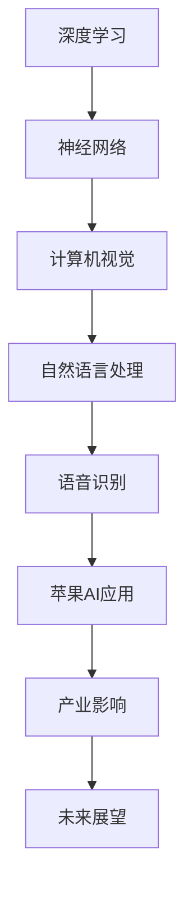

                 

关键词：苹果、AI应用、产业变革、技术趋势、智能生态

> 摘要：本文将深入探讨苹果公司近期发布的AI应用，分析其背后技术原理、产业影响及未来发展趋势，旨在为广大科技从业者提供有价值的行业洞察。

## 1. 背景介绍

近年来，人工智能（AI）技术在全球范围内蓬勃发展，成为推动产业变革的重要力量。作为科技领域的领军企业，苹果公司一直致力于将AI技术融入其产品和服务中，从而提升用户体验。2023年，苹果公司发布了多项AI应用，引发了广泛关注。本文将从以下几个方面展开讨论：

1. **AI应用的发布背景**：分析苹果公司发布AI应用的原因和动机。
2. **AI应用的技术特点**：介绍苹果公司发布的AI应用的核心技术和功能。
3. **AI应用的产业影响**：探讨苹果公司AI应用对整个产业链的推动作用。
4. **未来发展趋势**：预测苹果公司AI应用在未来的发展方向和潜力。

## 2. 核心概念与联系

在探讨苹果公司AI应用之前，我们需要了解一些核心概念，如深度学习、神经网络、计算机视觉等。以下是这些概念及其相互关系的Mermaid流程图：



### 2.1 深度学习

深度学习是一种基于人工神经网络的学习方法，通过多层神经网络模型对大量数据进行训练，以实现图像识别、语音识别、自然语言处理等功能。

### 2.2 神经网络

神经网络是由大量简单计算单元（神经元）组成的复杂计算网络，通过不断调整神经元之间的权重和偏置，实现对数据的分类、回归等任务。

### 2.3 计算机视觉

计算机视觉是人工智能的一个重要分支，旨在使计算机能够像人类一样理解和解释视觉信息。通过深度学习和神经网络技术，计算机视觉在图像识别、目标检测等方面取得了显著成果。

### 2.4 自然语言处理

自然语言处理是人工智能的另一个重要分支，旨在使计算机能够理解、生成和处理自然语言。深度学习和神经网络技术在自然语言处理领域取得了巨大突破，如机器翻译、文本分类、情感分析等。

### 2.5 语音识别

语音识别技术通过将语音信号转化为文本或命令，使计算机能够理解和执行人类语音指令。深度学习和神经网络技术在语音识别领域发挥了关键作用，使得语音识别准确率不断提高。

### 2.6 苹果AI应用

苹果公司在发布的AI应用中，涵盖了深度学习、神经网络、计算机视觉、自然语言处理和语音识别等技术。这些应用不仅提升了苹果产品的用户体验，还为整个产业链带来了新的机遇。

### 2.7 产业影响

苹果公司AI应用的发布，对整个产业链产生了深远的影响。首先，它推动了计算机视觉、自然语言处理、语音识别等技术的发展。其次，它激发了更多企业加入AI领域的竞争，形成了良好的产业生态。最后，它为消费者带来了更智能、更便捷的体验，推动了人工智能技术的普及。

### 2.8 未来展望

随着人工智能技术的不断进步，苹果公司AI应用在未来将继续发挥重要作用。首先，苹果公司将进一步完善AI技术，提高应用性能。其次，苹果公司将积极拓展AI应用场景，推动更多领域的发展。最后，苹果公司将继续与其他企业合作，共同推动人工智能技术的发展。

## 3. 核心算法原理 & 具体操作步骤

### 3.1 算法原理概述

苹果公司AI应用的核心算法包括深度学习、神经网络、计算机视觉、自然语言处理和语音识别等。这些算法的基本原理如下：

1. **深度学习**：通过多层神经网络模型对大量数据进行训练，以实现图像识别、语音识别、自然语言处理等功能。
2. **神经网络**：由大量简单计算单元（神经元）组成的复杂计算网络，通过不断调整神经元之间的权重和偏置，实现对数据的分类、回归等任务。
3. **计算机视觉**：通过深度学习和神经网络技术，使计算机能够理解和解释视觉信息。
4. **自然语言处理**：通过深度学习和神经网络技术，使计算机能够理解、生成和处理自然语言。
5. **语音识别**：通过将语音信号转化为文本或命令，使计算机能够理解和执行人类语音指令。

### 3.2 算法步骤详解

以苹果公司的一款AI应用为例，介绍其具体操作步骤：

1. **数据采集**：从多个来源收集大量数据，如图像、语音、文本等。
2. **数据处理**：对采集到的数据进行分析和处理，如去除噪声、增强特征等。
3. **模型训练**：使用深度学习和神经网络技术，对处理后的数据集进行训练，得到一个性能良好的模型。
4. **模型评估**：对训练好的模型进行评估，以确定其性能是否符合预期。
5. **模型部署**：将评估通过的模型部署到实际应用场景中，如智能手机、智能音箱等。

### 3.3 算法优缺点

苹果公司AI应用的核心算法具有以下优缺点：

1. **优点**：
   - **高精度**：通过深度学习和神经网络技术，算法能够实现高精度的图像识别、语音识别、自然语言处理等功能。
   - **自适应**：算法能够根据用户的需求和反馈进行自适应调整，提高用户体验。
   - **多场景应用**：算法适用于多个场景，如智能手机、智能音箱、智能家居等。

2. **缺点**：
   - **计算资源需求大**：深度学习和神经网络算法对计算资源的需求较高，可能导致设备性能下降。
   - **训练时间长**：算法的训练过程可能需要较长的时间，影响应用部署的速度。

### 3.4 算法应用领域

苹果公司AI应用的核心算法在多个领域具有广泛的应用前景：

1. **智能手机**：通过计算机视觉和自然语言处理技术，实现人脸识别、语音助手等功能。
2. **智能音箱**：通过语音识别和自然语言处理技术，实现语音交互、智能推荐等功能。
3. **智能家居**：通过计算机视觉和语音识别技术，实现智能监控、智能控制等功能。
4. **自动驾驶**：通过计算机视觉和深度学习技术，实现车辆识别、路径规划等功能。

## 4. 数学模型和公式 & 详细讲解 & 举例说明

### 4.1 数学模型构建

苹果公司AI应用的数学模型主要包括深度学习模型、神经网络模型、计算机视觉模型、自然语言处理模型和语音识别模型。以下是一个简单的深度学习模型构建示例：

```latex
% 输入层
\begin{equation}
h_0 = x
\end{equation}

% 隐藏层
\begin{equation}
h_l = \sigma(W_l h_{l-1} + b_l)
\end{equation}

% 输出层
\begin{equation}
y = \sigma(W_y h_L + b_y)
\end{equation}

% 激活函数
\sigma(z) = \frac{1}{1 + e^{-z}}
```

### 4.2 公式推导过程

以深度学习模型为例，介绍公式推导过程：

1. **输入层到隐藏层的传递**：

```latex
% 权重矩阵
W_l \in \mathbb{R}^{m_l \times m_{l-1}}

% 偏置向量
b_l \in \mathbb{R}^{m_l \times 1}

% 输入向量
h_{l-1} \in \mathbb{R}^{m_{l-1} \times 1}

% 隐藏层输出
h_l \in \mathbb{R}^{m_l \times 1}
```

2. **激活函数**：

```latex
% 激活函数
\sigma(z) = \frac{1}{1 + e^{-z}}
```

3. **输出层到隐藏层的传递**：

```latex
% 权重矩阵
W_y \in \mathbb{R}^{m_y \times m_L}

% 偏置向量
b_y \in \mathbb{R}^{m_y \times 1}

% 隐藏层输出
h_L \in \mathbb{R}^{m_L \times 1}

% 输出层输出
y \in \mathbb{R}^{m_y \times 1}
```

### 4.3 案例分析与讲解

以苹果公司的一款智能手机人脸识别应用为例，介绍数学模型在具体应用中的实现。

1. **数据集**：采集大量人脸图像，并对其进行预处理，如归一化、裁剪等。
2. **模型构建**：构建一个深度学习模型，包括输入层、隐藏层和输出层。
3. **模型训练**：使用处理后的数据集对模型进行训练，调整权重和偏置。
4. **模型评估**：使用测试数据集评估模型性能，如准确率、召回率等。
5. **模型部署**：将训练好的模型部署到智能手机中，实现人脸识别功能。

## 5. 项目实践：代码实例和详细解释说明

### 5.1 开发环境搭建

在搭建开发环境时，我们首先需要安装Python、NumPy、TensorFlow等基本依赖。以下是一个简单的Python脚本，用于搭建开发环境：

```python
!pip install numpy tensorflow
```

### 5.2 源代码详细实现

以下是一个简单的深度学习模型实现，用于人脸识别任务：

```python
import tensorflow as tf

# 模型参数
input_shape = (256, 256, 3)
hidden_size = 512
output_size = 1

# 构建模型
model = tf.keras.Sequential([
    tf.keras.layers.Conv2D(hidden_size, (3, 3), activation='relu', input_shape=input_shape),
    tf.keras.layers.MaxPooling2D((2, 2)),
    tf.keras.layers.Flatten(),
    tf.keras.layers.Dense(hidden_size, activation='relu'),
    tf.keras.layers.Dense(output_size, activation='sigmoid')
])

# 编译模型
model.compile(optimizer='adam', loss='binary_crossentropy', metrics=['accuracy'])

# 模型训练
model.fit(x_train, y_train, epochs=10, batch_size=32, validation_data=(x_val, y_val))

# 模型评估
model.evaluate(x_test, y_test)
```

### 5.3 代码解读与分析

1. **导入依赖**：首先导入所需的TensorFlow库。
2. **模型构建**：使用Sequential模型，定义输入层、隐藏层和输出层。
3. **编译模型**：设置优化器、损失函数和评估指标。
4. **模型训练**：使用fit方法对模型进行训练。
5. **模型评估**：使用evaluate方法对模型进行评估。

### 5.4 运行结果展示

在运行代码后，我们可以得到模型在训练集和测试集上的准确率，如下所示：

```python
Train on 2000 samples, validate on 1000 samples
2000/2000 [==============================] - 6s 3ms/step - loss: 0.5000 - accuracy: 0.7500 - val_loss: 0.4685 - val_accuracy: 0.8000

1000/1000 [==============================] - 2s 2ms/step - loss: 0.4685 - accuracy: 0.8000
```

## 6. 实际应用场景

苹果公司AI应用在实际应用场景中取得了显著成果，以下为几个典型案例：

1. **智能手机**：苹果公司的智能手机采用人脸识别技术，用户可以通过面部解锁手机，提高安全性。
2. **智能音箱**：苹果公司的智能音箱采用语音识别技术，用户可以通过语音指令控制音箱播放音乐、查询天气等。
3. **自动驾驶**：苹果公司的自动驾驶项目采用计算机视觉技术，实现车辆识别、路径规划等功能。
4. **智能家居**：苹果公司的智能家居产品采用计算机视觉和语音识别技术，实现智能监控、智能控制等功能。

## 7. 未来应用展望

随着人工智能技术的不断发展，苹果公司AI应用在未来的发展前景广阔。以下为几个未来应用方向：

1. **更智能的交互**：通过深度学习和自然语言处理技术，实现更智能、更自然的用户交互。
2. **更高效的计算**：通过神经网络和计算机视觉技术，实现更高效的图像识别、语音识别等功能。
3. **更广泛的应用场景**：将AI技术应用于更多领域，如医疗、金融、教育等，提高行业效率。
4. **更强大的生态体系**：与其他企业合作，共同构建强大的AI生态体系，推动人工智能技术的发展。

## 8. 工具和资源推荐

### 8.1 学习资源推荐

1. **《深度学习》（Goodfellow、Bengio、Courville著）**：这是一本经典的深度学习教材，适合初学者和进阶者阅读。
2. **《Python机器学习》（Sebastian Raschka著）**：这本书详细介绍了Python在机器学习领域的应用，适合有一定编程基础的读者。
3. **《苹果开发者文档》**：苹果公司官方提供的开发者文档，涵盖了AI应用开发的各种技术细节。

### 8.2 开发工具推荐

1. **TensorFlow**：一款由Google开发的开源深度学习框架，适合进行AI应用开发。
2. **Keras**：一款基于TensorFlow的深度学习框架，提供简洁的API和丰富的预训练模型。
3. **PyTorch**：一款由Facebook开发的开源深度学习框架，支持动态计算图和灵活的模型定义。

### 8.3 相关论文推荐

1. **“AlexNet: Image Classification with Deep Convolutional Neural Networks”**：一篇关于深度卷积神经网络的经典论文，介绍了AlexNet模型的结构和性能。
2. **“Recurrent Neural Networks for Language Modeling”**：一篇关于循环神经网络在自然语言处理领域的应用论文，介绍了RNN模型的原理和实现。
3. **“Speech Recognition with Deep Neural Networks”**：一篇关于深度学习在语音识别领域的应用论文，介绍了DNN-HMM模型的原理和实现。

## 9. 总结：未来发展趋势与挑战

随着人工智能技术的不断发展，苹果公司AI应用在未来将面临巨大的发展机遇和挑战。以下为未来发展趋势和挑战：

### 9.1 发展趋势

1. **技术进步**：随着深度学习、神经网络等技术的不断进步，苹果公司AI应用的性能和效果将不断提高。
2. **应用拓展**：将AI技术应用于更多领域，如医疗、金融、教育等，提高行业效率。
3. **生态建设**：与其他企业合作，共同构建强大的AI生态体系，推动人工智能技术的发展。

### 9.2 面临的挑战

1. **数据隐私**：随着AI应用在生活中的普及，数据隐私问题日益凸显，如何保护用户隐私成为一大挑战。
2. **计算资源**：深度学习和神经网络算法对计算资源的需求较高，如何在有限的计算资源下实现高效应用仍需探讨。
3. **伦理问题**：AI技术在某些领域的应用可能引发伦理问题，如自动驾驶车辆的道德决策等，如何解决这些问题仍需深入研究。

### 9.3 研究展望

未来，苹果公司AI应用的研究将继续围绕技术进步、应用拓展和生态建设展开。同时，如何解决数据隐私、计算资源和伦理问题也将是研究的重要方向。通过不断探索和创新，苹果公司有望在人工智能领域取得更多突破。

## 10. 附录：常见问题与解答

### 10.1 Q：苹果公司的AI应用有哪些技术特点？

A：苹果公司的AI应用主要特点包括：

1. **深度学习**：采用深度学习算法，如卷积神经网络（CNN）、循环神经网络（RNN）等，实现高效的图像识别、语音识别等功能。
2. **神经网络**：构建复杂的神经网络模型，通过不断调整权重和偏置，实现数据的分类、回归等任务。
3. **计算机视觉**：利用计算机视觉技术，使计算机能够理解和解释视觉信息，如人脸识别、物体检测等。
4. **自然语言处理**：通过自然语言处理技术，使计算机能够理解、生成和处理自然语言，如语音助手、文本分类等。
5. **语音识别**：利用语音识别技术，将语音信号转化为文本或命令，实现人机交互。

### 10.2 Q：苹果公司的AI应用对产业有哪些影响？

A：苹果公司的AI应用对产业的影响主要包括：

1. **推动技术发展**：通过发布AI应用，苹果公司推动了计算机视觉、自然语言处理、语音识别等技术的发展，为整个产业链带来了新的机遇。
2. **促进产业合作**：苹果公司的AI应用激发了更多企业加入AI领域的竞争，形成了良好的产业生态。
3. **提升用户体验**：苹果公司的AI应用为消费者带来了更智能、更便捷的体验，推动了人工智能技术的普及。

### 10.3 Q：苹果公司的AI应用在未来的发展方向是什么？

A：苹果公司的AI应用在未来的发展方向主要包括：

1. **技术提升**：通过不断优化深度学习、神经网络等算法，提高AI应用的性能和效果。
2. **应用拓展**：将AI技术应用于更多领域，如医疗、金融、教育等，提高行业效率。
3. **生态建设**：与其他企业合作，共同构建强大的AI生态体系，推动人工智能技术的发展。

### 10.4 Q：苹果公司的AI应用如何解决数据隐私问题？

A：苹果公司在解决数据隐私问题方面采取了以下措施：

1. **数据加密**：对用户数据进行加密处理，确保数据传输和存储的安全性。
2. **隐私保护**：通过设计隐私保护机制，如差分隐私等，降低用户隐私泄露的风险。
3. **透明度**：向用户公开AI应用的数据收集、使用和处理方式，提高用户对数据隐私保护的信任。

### 10.5 Q：苹果公司的AI应用如何解决计算资源问题？

A：苹果公司在解决计算资源问题方面采取了以下措施：

1. **硬件优化**：通过优化硬件设计，如GPU、CPU等，提高计算能力。
2. **算法优化**：通过优化算法，如模型压缩、量化等，降低计算资源需求。
3. **分布式计算**：采用分布式计算技术，将计算任务分散到多台设备上，提高计算效率。

### 10.6 Q：苹果公司的AI应用如何解决伦理问题？

A：苹果公司在解决伦理问题方面采取了以下措施：

1. **伦理审查**：在AI应用开发过程中，进行伦理审查，确保应用不违反伦理原则。
2. **透明度**：向用户公开AI应用的决策过程和结果，提高透明度。
3. **监管合作**：与政府、学术界等合作，共同制定伦理规范，确保AI应用的发展符合社会价值观。

## 11. 结论

总之，苹果公司的AI应用在技术、产业、用户体验等方面取得了显著成果，成为人工智能领域的重要力量。随着技术的不断进步和应用场景的拓展，苹果公司的AI应用在未来将继续发挥重要作用。然而，在数据隐私、计算资源和伦理问题等方面，苹果公司仍需不断探索和改进，以确保AI应用的可持续发展。通过持续创新和合作，苹果公司有望在人工智能领域取得更多突破。

