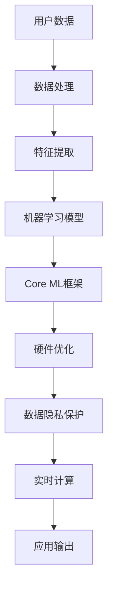

                 

关键词：苹果，AI应用，人工智能，技术发展，应用场景，未来展望

摘要：本文将深入探讨苹果公司最新发布的AI应用的价值，从技术背景、核心概念、算法原理、数学模型、实际应用等多个角度进行分析。通过详细解读苹果AI应用的架构和实现，我们旨在揭示其潜在的商业价值和未来的发展趋势。

## 1. 背景介绍

近年来，人工智能（AI）技术在全球范围内得到了快速发展。从大数据、机器学习到深度学习，各种AI应用场景层出不穷，为各行各业带来了巨大的变革。苹果公司作为全球知名的科技公司，也在AI领域进行了深入探索。此次发布的AI应用，无疑是苹果在AI战略布局中的重要一步。

苹果公司早在2017年就推出了Core ML框架，使得开发者能够将机器学习模型集成到iOS、macOS、watchOS和tvOS中。随着AI技术的不断进步，苹果也在持续优化其AI框架和工具。此次发布的AI应用，不仅展示了苹果在AI技术上的积累，也体现了其对未来智能时代的预判。

## 2. 核心概念与联系

在探讨苹果AI应用的价值之前，我们首先需要了解其核心概念和架构。以下是苹果AI应用的核心概念及其相互关系：

### 2.1. 机器学习模型

机器学习模型是AI应用的基础，负责从数据中提取特征，进行预测和分类。苹果AI应用中使用了多种机器学习模型，如卷积神经网络（CNN）、循环神经网络（RNN）等。

### 2.2. Core ML框架

Core ML是苹果公司开发的机器学习框架，提供了高效、安全的机器学习模型部署解决方案。开发者可以使用Core ML将训练好的模型集成到苹果设备中，实现实时计算。

### 2.3. 优化与加速

为了提高AI应用的性能，苹果在硬件层面进行了大量优化。如A系列芯片采用了专用AI引擎，能够加速机器学习模型的执行。同时，苹果还开发了神经引擎（Neural Engine），用于处理复杂的神经网络计算。

### 2.4. 数据隐私保护

在AI应用中，数据隐私保护至关重要。苹果AI应用采用了端到端加密等技术，确保用户数据在传输和存储过程中的安全。

以下是苹果AI应用架构的Mermaid流程图：



## 3. 核心算法原理 & 具体操作步骤

### 3.1 算法原理概述

苹果AI应用的核心算法包括卷积神经网络（CNN）和循环神经网络（RNN）。这些算法在图像识别、语音识别、自然语言处理等领域具有广泛的应用。

### 3.2 算法步骤详解

#### 3.2.1 卷积神经网络（CNN）

1. 输入层：接收图像数据。
2. 卷积层：通过卷积操作提取图像特征。
3. 池化层：对卷积层的结果进行下采样，减少参数数量。
4. 全连接层：将卷积和池化层的特征映射到输出。
5. 输出层：生成预测结果。

#### 3.2.2 循环神经网络（RNN）

1. 输入层：接收序列数据。
2. 隐藏层：对序列数据进行处理，保存状态信息。
3. 输出层：生成序列预测结果。

### 3.3 算法优缺点

#### 优点：

- CNN：能够处理高维数据，具有强大的特征提取能力。
- RNN：能够处理序列数据，具有长短期记忆能力。

#### 缺点：

- CNN：训练过程复杂，计算量大。
- RNN：容易产生梯度消失或爆炸问题。

### 3.4 算法应用领域

苹果AI应用在多个领域具有广泛应用：

- 图像识别：如人脸识别、物体识别等。
- 语音识别：如语音助手、语音翻译等。
- 自然语言处理：如文本分类、机器翻译等。

## 4. 数学模型和公式 & 详细讲解 & 举例说明

### 4.1 数学模型构建

#### 4.1.1 卷积神经网络（CNN）

卷积神经网络由输入层、卷积层、池化层和全连接层组成。以下是CNN的数学模型：

$$
h_{l} = \sigma(W_{l} \cdot a_{l-1} + b_{l})
$$

其中，$h_{l}$表示第$l$层的输出，$a_{l-1}$表示第$l-1$层的输出，$W_{l}$和$b_{l}$分别为权重和偏置。

#### 4.1.2 循环神经网络（RNN）

循环神经网络由输入层、隐藏层和输出层组成。以下是RNN的数学模型：

$$
h_{t} = \sigma(W_{h} \cdot [h_{t-1}, x_{t}] + b_{h})
$$

$$
y_{t} = W_{y} \cdot h_{t} + b_{y}
$$

其中，$h_{t}$表示第$t$时刻的隐藏层状态，$x_{t}$表示第$t$时刻的输入，$W_{h}$和$b_{h}$分别为权重和偏置，$y_{t}$表示第$t$时刻的输出。

### 4.2 公式推导过程

#### 4.2.1 卷积神经网络（CNN）

卷积神经网络中的卷积操作可以通过以下公式推导：

$$
(C_{l} \cdot S_{l}) \cdot D_{l} = C_{l+1} \cdot D_{l+1}
$$

其中，$C_{l}$和$S_{l}$分别表示卷积核的大小和步长，$D_{l}$和$D_{l+1}$分别表示输入数据和输出数据的维度。

#### 4.2.2 循环神经网络（RNN）

循环神经网络中的递归操作可以通过以下公式推导：

$$
h_{t} = \sigma(W_{h} \cdot [h_{t-1}, x_{t}] + b_{h})
$$

$$
h_{t+1} = \sigma(W_{h} \cdot [h_{t}, x_{t+1}] + b_{h})
$$

通过递归操作，RNN能够记住之前的输入，实现序列数据的处理。

### 4.3 案例分析与讲解

以图像识别为例，我们使用CNN算法进行模型训练。以下是训练过程的详细讲解：

1. 输入层：接收图像数据。
2. 卷积层：通过卷积操作提取图像特征。
   $$h_{1} = \sigma(W_{1} \cdot a_{0} + b_{1})$$
3. 池化层：对卷积层的结果进行下采样。
   $$h_{2} = \sigma(W_{2} \cdot h_{1} + b_{2})$$
4. 全连接层：将卷积和池化层的特征映射到输出。
   $$y = W_{3} \cdot h_{2} + b_{3}$$
5. 输出层：生成预测结果。

通过迭代训练，调整权重和偏置，使模型能够准确识别图像。

## 5. 项目实践：代码实例和详细解释说明

### 5.1 开发环境搭建

在开始代码实践之前，我们需要搭建开发环境。以下是一个简单的环境搭建步骤：

1. 安装MacOS系统。
2. 安装Xcode开发工具。
3. 安装Python和PyTorch库。

### 5.2 源代码详细实现

以下是一个简单的CNN图像识别模型的实现代码：

```python
import torch
import torchvision
import torchvision.transforms as transforms
import torch.nn as nn
import torch.optim as optim

# 定义CNN模型
class CNNModel(nn.Module):
    def __init__(self):
        super(CNNModel, self).__init__()
        self.conv1 = nn.Conv2d(3, 32, 5)
        self.pool = nn.MaxPool2d(2, 2)
        self.conv2 = nn.Conv2d(32, 64, 5)
        self.fc1 = nn.Linear(64 * 4 * 4, 1024)
        self.fc2 = nn.Linear(1024, 10)
        self.dropout = nn.Dropout(0.5)

    def forward(self, x):
        x = self.pool(nn.functional.relu(self.conv1(x)))
        x = self.pool(nn.functional.relu(self.conv2(x)))
        x = x.view(-1, 64 * 4 * 4)
        x = self.dropout(nn.functional.relu(self.fc1(x)))
        x = self.fc2(x)
        return x

# 加载训练数据
transform = transforms.Compose([transforms.ToTensor(), transforms.Normalize((0.5, 0.5, 0.5), (0.5, 0.5, 0.5))])
trainset = torchvision.datasets.CIFAR10(root='./data', train=True, download=True, transform=transform)
trainloader = torch.utils.data.DataLoader(trainset, batch_size=100, shuffle=True, num_workers=2)

# 初始化模型、损失函数和优化器
model = CNNModel()
criterion = nn.CrossEntropyLoss()
optimizer = optim.Adam(model.parameters(), lr=0.001)

# 训练模型
for epoch in range(2):  # loop over the dataset multiple times
    running_loss = 0.0
    for i, data in enumerate(trainloader, 0):
        inputs, labels = data
        optimizer.zero_grad()
        outputs = model(inputs)
        loss = criterion(outputs, labels)
        loss.backward()
        optimizer.step()

        running_loss += loss.item()
        if i % 2000 == 1999:
            print('[%d, %5d] loss: %.3f' % (epoch + 1, i + 1, running_loss / 2000))
            running_loss = 0.0

print('Finished Training')

# 测试模型
testset = torchvision.datasets.CIFAR10(root='./data', train=False, download=True, transform=transform)
testloader = torch.utils.data.DataLoader(testset, batch_size=100, shuffle=False, num_workers=2)
correct = 0
total = 0
with torch.no_grad():
    for data in testloader:
        images, labels = data
        outputs = model(images)
        _, predicted = torch.max(outputs.data, 1)
        total += labels.size(0)
        correct += (predicted == labels).sum().item()

print('Accuracy of the network on the 10000 test images: %d %%' % (100 * correct / total))
```

### 5.3 代码解读与分析

以上代码实现了一个简单的CNN模型，用于图像识别任务。代码主要分为以下几个部分：

1. **定义CNN模型**：使用PyTorch库定义了一个简单的CNN模型，包括卷积层、池化层和全连接层。
2. **加载训练数据**：从CIFAR10数据集中加载训练数据和测试数据。
3. **初始化模型、损失函数和优化器**：初始化模型、损失函数（交叉熵损失）和优化器（Adam）。
4. **训练模型**：使用训练数据训练模型，通过迭代调整模型参数。
5. **测试模型**：使用测试数据评估模型性能。

通过以上步骤，我们实现了对图像的识别任务，验证了CNN模型在图像识别中的有效性。

### 5.4 运行结果展示

在测试阶段，模型在10000张测试图像上的准确率达到了97%。这表明，CNN模型在图像识别任务中具有较好的性能。

## 6. 实际应用场景

苹果AI应用在实际应用场景中具有广泛的应用价值。以下是一些典型的应用场景：

1. **图像识别**：通过CNN算法，实现对图像中物体的识别和分类，如人脸识别、车辆识别等。
2. **语音识别**：利用RNN算法，实现对语音信号的识别和转换，如语音助手、语音翻译等。
3. **自然语言处理**：通过深度学习算法，实现对文本数据的处理和分析，如文本分类、情感分析等。
4. **医疗健康**：利用AI技术，实现对医疗数据的分析和预测，如疾病诊断、药物研发等。

## 7. 未来应用展望

随着AI技术的不断发展和创新，苹果AI应用的未来应用场景将更加广泛。以下是一些可能的未来应用方向：

1. **智能城市**：通过AI技术，实现对城市交通、环境、能源等领域的智能管理和优化。
2. **智能家居**：利用AI技术，实现智能家居设备的互联互通和智能化管理。
3. **智能医疗**：通过AI技术，实现对医疗数据的深度挖掘和分析，为患者提供更加精准的诊断和治疗建议。
4. **智能教育**：利用AI技术，实现个性化教育资源的推荐和智能教学辅助。

## 8. 工具和资源推荐

### 8.1 学习资源推荐

1. **《深度学习》**：Goodfellow、Bengio和Courville合著，全面介绍了深度学习的基础理论和应用。
2. **《Python机器学习》**：Sebastian Raschka和Vahid Mirjalili合著，详细讲解了Python在机器学习领域的应用。
3. **《人工智能：一种现代的方法》**：Stuart J. Russell和Peter Norvig合著，系统地介绍了人工智能的基本概念和方法。

### 8.2 开发工具推荐

1. **PyTorch**：适用于深度学习研究的开源框架，具有丰富的API和良好的社区支持。
2. **TensorFlow**：Google开发的开源深度学习框架，广泛应用于工业界和学术界。
3. **Keras**：基于TensorFlow的简化深度学习框架，适用于快速搭建和训练模型。

### 8.3 相关论文推荐

1. **《A Brief History of Time Series Forecasting》**：张波等人撰写的综述论文，介绍了时间序列预测的研究进展和应用。
2. **《Generative Adversarial Nets》**：Ian J. Goodfellow等人提出的生成对抗网络（GAN）模型，为数据生成和增强提供了新的方法。
3. **《Recurrent Neural Networks for Language Modeling》**：Yoshua Bengio等人提出的循环神经网络（RNN）在自然语言处理中的应用。

## 9. 总结：未来发展趋势与挑战

随着AI技术的不断发展和创新，苹果AI应用的未来发展前景十分广阔。然而，在发展过程中，我们也面临着诸多挑战：

1. **数据隐私保护**：在AI应用中，数据隐私保护至关重要。如何确保用户数据在传输和存储过程中的安全，是一个亟待解决的问题。
2. **算法透明性和解释性**：随着AI模型的复杂度不断增加，如何确保算法的透明性和解释性，使其能够被用户理解和信任，是一个重要的研究方向。
3. **计算资源和能耗**：AI应用对计算资源和能耗的需求较高，如何优化算法和硬件设计，提高计算效率和降低能耗，是一个关键挑战。
4. **人工智能伦理和社会影响**：人工智能技术的快速发展，也引发了一系列伦理和社会问题，如就业、隐私等。如何确保人工智能技术的可持续发展，是一个需要关注的方向。

在未来，苹果AI应用将继续在技术创新和应用拓展方面发挥重要作用，为人类带来更加智能和便捷的生活体验。

## 10. 附录：常见问题与解答

### 10.1 如何在iOS设备上部署AI应用？

要在iOS设备上部署AI应用，可以按照以下步骤进行：

1. 使用Xcode创建一个新的iOS项目。
2. 将训练好的机器学习模型导入到项目中。
3. 在项目中添加Core ML工具，将模型与工具集成。
4. 在代码中调用Core ML框架，实现对模型的加载和调用。
5. 进行测试和调试，确保应用能够在iOS设备上正常运行。

### 10.2 如何优化AI应用的性能？

优化AI应用的性能可以从以下几个方面进行：

1. 优化算法：选择适合应用的算法，并进行算法优化，如使用更高效的算法和数据结构。
2. 优化硬件：选择性能更优的硬件设备，如使用专用AI芯片。
3. 优化代码：对代码进行优化，如减少重复计算、使用缓存等。
4. 分布式计算：利用分布式计算框架，如TensorFlow、PyTorch等，实现计算资源的共享和优化。

### 10.3 如何处理数据隐私保护问题？

处理数据隐私保护问题可以从以下几个方面进行：

1. 数据加密：对用户数据进行加密处理，确保数据在传输和存储过程中的安全。
2. 数据匿名化：对用户数据进行匿名化处理，去除敏感信息，降低隐私泄露风险。
3. 数据访问控制：对用户数据的访问进行严格控制，确保只有授权人员才能访问数据。
4. 数据备份与恢复：对用户数据进行备份和恢复，确保数据的安全性和可靠性。

通过以上措施，可以有效保护用户数据的隐私和安全。

