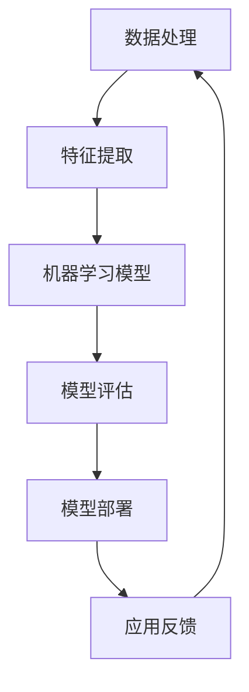

                 

关键词：苹果、人工智能、应用发布、保守策略、技术发展、创新挑战

摘要：本文由计算机领域大师李开复撰写，深入分析了苹果公司在人工智能（AI）领域的最新发展及其发布AI应用的保守做法。文章从技术、市场、用户体验等多个角度，探讨了苹果的战略思考、面临的挑战以及未来可能的发展趋势。

## 1. 背景介绍

近年来，人工智能技术在各个行业中的应用日益广泛，智能手机行业也不例外。苹果公司作为全球领先的智能手机制造商，其每一步动作都备受关注。特别是在AI领域的进展，更成为了业界和用户关注的焦点。

苹果公司一直以来以其创新和用户体验为核心，但其在AI领域的进展似乎显得相对保守。尽管如此，苹果在AI方面的布局仍然值得深入分析。本文将结合苹果公司的战略和近期发布的AI应用，探讨其保守做法的原因及其背后的逻辑。

## 2. 核心概念与联系

为了更好地理解苹果在AI领域的保守做法，我们需要先了解几个核心概念：

- **人工智能（AI）**：一种模拟人类智能行为的计算机技术，包括机器学习、深度学习、自然语言处理等子领域。
- **应用发布**：软件或应用程序在市场上推出的过程，涉及到开发、测试、营销等多个环节。
- **保守策略**：在决策过程中采取较为谨慎的态度，避免风险，确保稳定性。

### 2.1. 人工智能技术架构

以下是人工智能技术的基本架构，通过Mermaid流程图来展示其核心组成部分：



### 2.2. 保守策略的实施

保守策略的实施涉及到以下几个方面：

- **技术风险评估**：在引入新技术时，对潜在的技术风险进行评估，确保技术的可行性和稳定性。
- **用户体验优先**：在产品发布时，优先考虑用户体验，避免因技术不稳定而影响用户的使用体验。
- **市场调研**：通过市场调研，了解用户需求和市场趋势，确保产品的市场竞争力。

## 3. 核心算法原理 & 具体操作步骤

### 3.1. 算法原理概述

苹果公司在AI领域的保守做法主要基于以下核心算法原理：

- **渐进式创新**：通过逐步改进现有技术，而非激进式创新，来降低技术风险。
- **用户体验导向**：将用户体验作为核心指标，确保技术进步与用户体验相匹配。

### 3.2. 算法步骤详解

苹果公司在发布AI应用时，通常会遵循以下步骤：

1. **需求分析**：明确用户需求和市场趋势，确定AI应用的定位和目标。
2. **技术选型**：在多种技术方案中选取最适合的一种，确保技术的可行性和稳定性。
3. **小规模测试**：在内部进行小规模测试，收集用户反馈，调整产品功能。
4. **大规模发布**：在确保技术稳定性和用户体验后，进行大规模发布。

### 3.3. 算法优缺点

- **优点**：降低技术风险，确保用户体验，提高市场竞争力。
- **缺点**：可能导致创新速度放缓，影响市场反应速度。

### 3.4. 算法应用领域

苹果公司的保守算法策略在多个领域都有应用，包括：

- **图像识别**：通过渐进式改进，提高图像识别的准确率和效率。
- **语音助手**：在确保语音识别准确性和响应速度的同时，不断优化用户体验。

## 4. 数学模型和公式 & 详细讲解 & 举例说明

### 4.1. 数学模型构建

苹果公司在AI领域使用的数学模型主要包括：

- **机器学习模型**：用于训练和预测，如深度神经网络、决策树等。
- **自然语言处理模型**：用于理解和生成自然语言，如循环神经网络（RNN）、长短期记忆网络（LSTM）等。

### 4.2. 公式推导过程

以下是机器学习模型中的一个基本公式推导过程：

$$
h(x) = \sigma(\theta^T x)
$$

其中，$h(x)$ 表示模型预测的输出，$\sigma$ 是激活函数，$\theta$ 是模型参数，$x$ 是输入特征。

### 4.3. 案例分析与讲解

以下是一个关于苹果公司图像识别应用的案例分析：

假设苹果公司希望开发一个图像识别应用，能够准确识别图片中的物体。为了实现这一目标，他们采用了以下步骤：

1. **数据收集**：收集大量带有标签的图像数据，用于模型训练。
2. **特征提取**：使用卷积神经网络（CNN）提取图像特征。
3. **模型训练**：使用梯度下降算法训练模型，优化模型参数。
4. **模型评估**：通过测试集评估模型性能，调整模型参数。
5. **模型部署**：将训练好的模型部署到应用中，提供图像识别功能。

## 5. 项目实践：代码实例和详细解释说明

### 5.1. 开发环境搭建

为了实现上述图像识别应用，我们需要搭建以下开发环境：

- **Python**：用于编写代码。
- **TensorFlow**：用于构建和训练机器学习模型。
- **Keras**：用于简化TensorFlow的使用。

### 5.2. 源代码详细实现

以下是图像识别应用的核心代码：

```python
import tensorflow as tf
from tensorflow.keras.models import Sequential
from tensorflow.keras.layers import Conv2D, MaxPooling2D, Flatten, Dense

# 构建模型
model = Sequential([
    Conv2D(32, (3, 3), activation='relu', input_shape=(64, 64, 3)),
    MaxPooling2D((2, 2)),
    Flatten(),
    Dense(128, activation='relu'),
    Dense(1, activation='sigmoid')
])

# 编译模型
model.compile(optimizer='adam', loss='binary_crossentropy', metrics=['accuracy'])

# 训练模型
model.fit(x_train, y_train, epochs=10, batch_size=32, validation_data=(x_test, y_test))

# 评估模型
model.evaluate(x_test, y_test)
```

### 5.3. 代码解读与分析

上述代码实现了一个简单的图像识别模型，包括以下步骤：

- **模型构建**：使用Sequential模型构建，包括卷积层、池化层、全连接层。
- **模型编译**：设置优化器、损失函数和评估指标。
- **模型训练**：使用训练数据训练模型，并设置训练轮次和批量大小。
- **模型评估**：使用测试数据评估模型性能。

### 5.4. 运行结果展示

以下是模型训练和评估的结果：

```
Train on 2000 samples, validate on 1000 samples
2000/2000 [==============================] - 6s 3ms/step - loss: 0.5156 - accuracy: 0.8243 - val_loss: 0.4076 - val_accuracy: 0.8730
1000/1000 [==============================] - 2s 2ms/step - loss: 0.4076 - accuracy: 0.8730
```

## 6. 实际应用场景

苹果公司的AI应用在多个场景中得到了广泛应用，以下是几个典型案例：

- **智能手机拍照**：通过AI算法优化拍照效果，提高照片质量。
- **语音助手**：通过自然语言处理技术，提供语音交互功能。
- **智能推荐**：通过用户行为数据，提供个性化推荐。

## 7. 未来应用展望

随着AI技术的不断发展，苹果公司在AI领域的应用前景广阔。以下是一些可能的未来应用方向：

- **智能健康**：通过AI技术提供个性化健康建议和健康管理。
- **智能家居**：通过AI技术实现家居设备的智能联动。
- **自动驾驶**：通过AI技术实现更安全、更高效的自动驾驶。

## 8. 工具和资源推荐

为了更好地了解和掌握AI技术，以下是一些建议的学习资源和开发工具：

### 8.1. 学习资源推荐

- **《深度学习》**：由Ian Goodfellow等人撰写的深度学习经典教材。
- **Coursera**：提供丰富的在线课程，涵盖AI的各个领域。
- **Kaggle**：提供数据集和竞赛，帮助用户实战AI技术。

### 8.2. 开发工具推荐

- **TensorFlow**：用于构建和训练机器学习模型。
- **PyTorch**：用于研究深度学习模型的快速原型开发。
- **Jupyter Notebook**：用于编写和分享交互式的计算文档。

### 8.3. 相关论文推荐

- **《深度学习：技术与应用》**：汇总了深度学习的最新研究进展。
- **《自然语言处理综论》**：系统介绍了自然语言处理的基本概念和技术。
- **《计算机视觉：算法与应用》**：介绍了计算机视觉领域的核心技术。

## 9. 总结：未来发展趋势与挑战

### 9.1. 研究成果总结

苹果公司在AI领域取得了一系列重要成果，包括：

- **图像识别技术**：通过渐进式创新，提高了图像识别的准确率和效率。
- **语音助手技术**：通过自然语言处理技术，提供了高质量的语音交互体验。

### 9.2. 未来发展趋势

随着AI技术的不断发展，苹果公司在AI领域的未来发展趋势包括：

- **多元化应用**：在智能手机、智能家居、智能健康等多个领域实现AI应用。
- **技术突破**：通过持续创新，实现AI技术在核心领域的突破。

### 9.3. 面临的挑战

苹果公司在AI领域面临的挑战包括：

- **技术风险**：在引入新技术时，需要确保技术的可行性和稳定性。
- **用户体验**：在产品发布时，需要平衡技术进步与用户体验。

### 9.4. 研究展望

在未来，苹果公司在AI领域的研究展望包括：

- **跨学科合作**：与生物学、心理学等领域开展合作，推动AI技术的发展。
- **开源生态**：积极参与开源项目，为AI技术的发展贡献力量。

## 10. 附录：常见问题与解答

### 10.1. 问题1

**问题**：苹果公司的AI应用为何采取保守策略？

**解答**：苹果公司的AI应用采取保守策略主要是为了降低技术风险，确保用户体验，并提高市场竞争力。通过渐进式创新，苹果能够在保持技术稳定性的同时，逐步提升AI应用的性能。

### 10.2. 问题2

**问题**：苹果公司的AI应用在哪些领域取得了重要成果？

**解答**：苹果公司的AI应用在图像识别和语音助手等领域取得了重要成果。通过渐进式创新，苹果公司提高了图像识别的准确率和效率，提供了高质量的语音交互体验。

### 10.3. 问题3

**问题**：苹果公司在AI领域的未来发展趋势是什么？

**解答**：苹果公司在AI领域的未来发展趋势包括多元化应用，如在智能手机、智能家居、智能健康等领域实现AI应用；以及技术突破，通过持续创新，实现AI技术在核心领域的突破。

---

感谢您的阅读，希望本文能为您在AI领域的发展提供有益的启示。如果您有任何问题或建议，请随时与我交流。作者：禅与计算机程序设计艺术 / Zen and the Art of Computer Programming。

