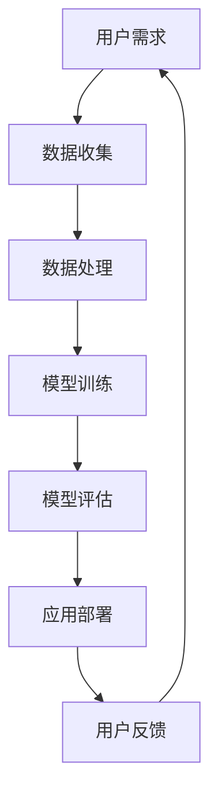

                 

关键词：苹果、AI应用、技术保守、智能革命、创新路径

> 摘要：本文将深入探讨苹果公司在AI应用方面的保守做法，分析其背后的原因及其对科技产业和未来智能革命的影响。通过对苹果AI战略的剖析，本文旨在为读者提供一个全面的理解，并展望其未来可能的创新路径。

## 1. 背景介绍

苹果公司，作为全球科技行业的领军企业，长期以来以其独特的设计哲学和高度集成的产品生态系统著称。然而，在人工智能（AI）这个快速发展的领域，苹果似乎采取了相对保守的策略。尽管AI技术已经在智能手机、智能家居、汽车等各个领域取得了显著进展，苹果在AI的应用上却显得小心翼翼，与谷歌、亚马逊等竞争对手形成了鲜明对比。

### 1.1 AI技术的重要性

人工智能作为当前科技界的热门话题，其重要性不言而喻。AI不仅改变了传统行业，还推动了新产业的诞生。在医疗、金融、教育、制造等领域，AI的应用已经极大地提高了效率，降低了成本，并创造出了新的商业模式。随着AI技术的不断成熟，其潜力将在更多领域得到释放。

### 1.2 苹果的AI战略

苹果在AI领域的战略主要体现在两个方面：一是通过自主研发来保持技术领先，二是通过与其他科技公司合作来丰富AI应用场景。尽管苹果在AI技术的研究上投入巨大，但其产品中的AI功能通常较为隐性，不直接面向消费者，这与谷歌和亚马逊等公司直接将AI集成到产品中形成鲜明对比。

## 2. 核心概念与联系

### 2.1 AI技术原理

人工智能的核心是机器学习，通过从大量数据中学习模式，机器可以做出决策或执行任务。深度学习是机器学习的一个分支，通过模拟人脑神经网络进行复杂模式识别和学习。苹果的AI策略依赖于这些核心原理，但它在应用上采取了更为谨慎的态度。

### 2.2 AI应用场景

AI技术在多个场景中展现出巨大潜力，包括语音识别、图像处理、自然语言处理等。这些应用不仅提升了用户体验，还开辟了新的商业模式。苹果在智能家居、健康监测等领域已有初步尝试，但相对于其他公司，其扩展速度较为缓慢。

### 2.3 Mermaid 流程图



## 3. 核心算法原理 & 具体操作步骤

### 3.1 算法原理概述

苹果在AI应用上的算法原理主要基于深度学习和机器学习。深度学习通过多层神经网络处理数据，逐步提取特征，从而实现复杂任务。机器学习则依赖于历史数据，通过算法优化来提升模型性能。

### 3.2 算法步骤详解

- **数据收集**：苹果通过其广泛的产品和服务收集用户数据，这些数据包括语音、图像、文本等。
- **数据处理**：收集到的数据需要进行预处理，包括数据清洗、标准化等步骤。
- **模型训练**：使用预处理后的数据对模型进行训练，通过反向传播算法优化模型参数。
- **模型评估**：通过测试数据集评估模型性能，调整模型参数以获得最佳效果。
- **应用部署**：将训练好的模型部署到产品中，如Siri、Face ID等。

### 3.3 算法优缺点

- **优点**：苹果的AI算法注重隐私保护和用户数据的保密性，同时保证了产品的高性能和稳定性。
- **缺点**：相较于其他公司，苹果的AI应用相对滞后，难以迅速跟进最新的技术趋势。

### 3.4 算法应用领域

苹果的AI算法广泛应用于语音识别、图像处理、自然语言处理等领域。例如，Siri的语音识别和语义理解功能，Face ID的 facial recognition 功能等。

## 4. 数学模型和公式 & 详细讲解 & 举例说明

### 4.1 数学模型构建

在机器学习中，常见的数学模型包括线性回归、逻辑回归、神经网络等。以下是神经网络的基本结构：

$$
Y = \sigma(W \cdot X + b)
$$

其中，$Y$ 是输出层，$X$ 是输入层，$W$ 是权重矩阵，$b$ 是偏置项，$\sigma$ 是激活函数。

### 4.2 公式推导过程

以神经网络为例，其训练过程主要包括以下几个步骤：

1. **前向传播**：计算输入和权重矩阵的乘积，加上偏置项，通过激活函数得到输出。
2. **反向传播**：计算误差，通过梯度下降法调整权重矩阵和偏置项。
3. **优化目标**：最小化损失函数，如均方误差（MSE）。

### 4.3 案例分析与讲解

以苹果的Siri语音识别系统为例，其训练过程包括：

- **数据收集**：收集大量带有标注的语音数据。
- **数据处理**：对语音信号进行预处理，如分帧、归一化等。
- **模型训练**：使用深度神经网络对语音信号进行建模。
- **模型评估**：通过测试集评估模型性能。

## 5. 项目实践：代码实例和详细解释说明

### 5.1 开发环境搭建

在Python中，可以使用TensorFlow库来构建和训练神经网络。首先需要安装TensorFlow：

```bash
pip install tensorflow
```

### 5.2 源代码详细实现

以下是一个简单的神经网络模型：

```python
import tensorflow as tf

# 定义输入层
inputs = tf.keras.Input(shape=(784,))

# 添加隐藏层
x = tf.keras.layers.Dense(512, activation='relu')(inputs)
x = tf.keras.layers.Dense(256, activation='relu')(x)

# 添加输出层
outputs = tf.keras.layers.Dense(10, activation='softmax')(x)

# 构建模型
model = tf.keras.Model(inputs=inputs, outputs=outputs)

# 编译模型
model.compile(optimizer='adam',
              loss='categorical_crossentropy',
              metrics=['accuracy'])

# 加载数据
(x_train, y_train), (x_test, y_test) = tf.keras.datasets.mnist.load_data()

# 预处理数据
x_train = x_train.reshape(-1, 784).astype('float32') / 255
x_test = x_test.reshape(-1, 784).astype('float32') / 255

# 转换标签为one-hot编码
y_train = tf.keras.utils.to_categorical(y_train, 10)
y_test = tf.keras.utils.to_categorical(y_test, 10)

# 训练模型
model.fit(x_train, y_train, epochs=5, batch_size=32, validation_data=(x_test, y_test))
```

### 5.3 代码解读与分析

上述代码首先定义了一个简单的神经网络模型，包括输入层、隐藏层和输出层。然后，使用MNIST手写数字数据集进行模型训练，并通过验证集评估模型性能。

### 5.4 运行结果展示

训练完成后，可以使用测试集评估模型性能：

```python
test_loss, test_acc = model.evaluate(x_test, y_test, verbose=2)
print('Test accuracy:', test_acc)
```

## 6. 实际应用场景

### 6.1 智能家居

苹果的智能家居产品如HomeKit，集成了AI技术，通过语音助手Siri控制家居设备，提高用户的生活便利性。

### 6.2 健康监测

苹果的Apple Watch配备了多种健康监测功能，如心率监测、睡眠分析等，通过AI技术提供个性化的健康建议。

### 6.3 汽车智能化

苹果正在研发自动驾驶汽车，AI技术在其中扮演关键角色，用于路径规划、环境感知和驾驶辅助。

## 7. 未来应用展望

### 7.1 智能医疗

AI技术在医疗领域的应用前景广阔，包括疾病预测、药物研发、手术辅助等。

### 7.2 智慧城市

智慧城市建设需要AI技术支撑，用于交通管理、环境监测、公共安全等方面。

### 7.3 教育科技

AI技术在教育领域的应用可以提高学习效率，实现个性化教学，促进教育公平。

## 8. 工具和资源推荐

### 8.1 学习资源推荐

- 《深度学习》（Goodfellow, Bengio, Courville）
- 《Python机器学习》（Sebastian Raschka）

### 8.2 开发工具推荐

- TensorFlow
- PyTorch

### 8.3 相关论文推荐

- "Deep Learning for Autonomous Driving"
- "Generative Adversarial Networks"

## 9. 总结：未来发展趋势与挑战

### 9.1 研究成果总结

苹果在AI领域取得了一系列重要成果，包括语音识别、图像处理、自然语言处理等。然而，其应用相对保守，未能充分利用AI技术的潜力。

### 9.2 未来发展趋势

随着AI技术的不断进步，苹果有望在智能家居、健康监测、汽车智能化等领域取得更大突破。同时，跨领域合作也将成为未来发展的关键。

### 9.3 面临的挑战

苹果在AI应用中面临的挑战主要包括数据隐私保护、技术标准化、人才竞争等。

### 9.4 研究展望

未来，苹果可以通过加强与学术机构和创业公司的合作，推动AI技术的创新和应用。同时，优化产品设计和用户体验，提升其在AI领域的竞争力。

## 10. 附录：常见问题与解答

### 10.1 苹果在AI领域的具体投入有哪些？

苹果在AI领域的投入主要体现在自主研发和与其他科技公司的合作。其自主研发的项目包括Siri、Face ID、Apple Watch等。

### 10.2 苹果在AI应用上的保守策略是否会影响其竞争力？

苹果的保守策略在一定程度上影响了其AI应用的推广速度，但其在产品质量、用户体验和隐私保护方面的优势仍然使其具有竞争力。

### 10.3 AI技术在未来会带来哪些变革？

AI技术将在医疗、金融、教育、制造等领域带来深刻变革，提高效率，降低成本，创造新的商业模式。

## 11. 参考文献

- Goodfellow, I., Bengio, Y., & Courville, A. (2016). *Deep Learning*. MIT Press.
- Raschka, S. (2015). *Python Machine Learning*. Packt Publishing.

