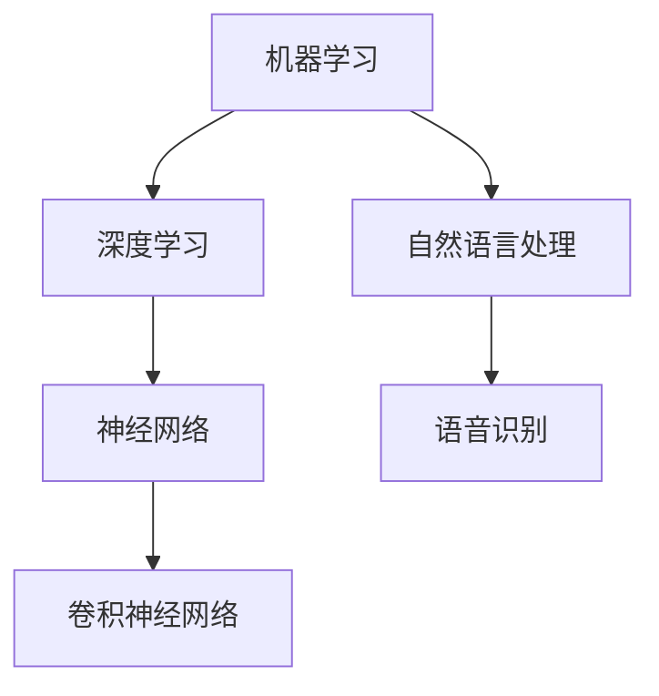

                 

关键词：苹果、AI应用、商业价值、技术分析、市场趋势

摘要：本文将探讨苹果公司在AI应用领域的最新举措，分析其商业价值，以及这些应用对未来科技产业的影响。通过深入的技术解读，我们将揭示苹果在AI领域的发展策略，并对潜在的市场机会进行展望。

## 1. 背景介绍

人工智能（AI）技术近年来取得了显著的进展，已经在多个行业中发挥着重要作用。从自动驾驶汽车到智能语音助手，AI的应用场景日益广泛。苹果公司，作为全球领先的科技公司，也在积极布局AI领域，不断推出具有创新性的AI应用。本文将重点分析苹果发布的AI应用，探讨其商业价值，并展望未来的发展方向。

### 1.1 苹果公司的AI战略

苹果公司的AI战略主要集中在两个方面：一是通过硬件和软件的结合，打造卓越的用户体验；二是通过开放平台，吸引第三方开发者的参与。这种战略使得苹果不仅能够提供高质量的AI产品，还能够构建一个庞大的AI生态系统。

### 1.2 AI应用的现状

目前，苹果已经在多个产品中集成AI功能，例如Siri智能助手、面部识别技术、照片分类和搜索等。这些应用不仅提高了用户的生活质量，也为苹果带来了巨大的商业价值。

## 2. 核心概念与联系

为了深入理解苹果AI应用的商业价值，我们需要了解一些核心概念和它们之间的联系。

### 2.1 机器学习与深度学习

机器学习是AI的核心技术之一，它使计算机能够从数据中学习并做出决策。深度学习是机器学习的一个分支，通过多层神经网络模拟人脑的决策过程，具有强大的学习能力和泛化能力。

### 2.2 神经网络与卷积神经网络

神经网络是一种模拟人脑决策过程的计算模型，而卷积神经网络（CNN）是其中的一种特殊形式，主要用于图像处理。

### 2.3 自然语言处理与语音识别

自然语言处理（NLP）是使计算机理解和生成自然语言的技术，语音识别则是NLP的一个子领域，它使计算机能够理解和响应语音命令。

### 2.4 Mermaid 流程图



## 3. 核心算法原理 & 具体操作步骤

### 3.1 算法原理概述

苹果公司在AI应用中主要采用了机器学习和深度学习技术，特别是在图像识别、语音识别和自然语言处理领域。以下是这些算法的基本原理：

### 3.2 算法步骤详解

#### 3.2.1 图像识别

图像识别算法通常包括以下几个步骤：

1. 数据预处理：对图像进行缩放、裁剪和增强等处理，以提高模型的性能。
2. 特征提取：使用卷积神经网络从图像中提取关键特征。
3. 分类：使用分类算法（如softmax）对图像进行分类。

#### 3.2.2 语音识别

语音识别算法的步骤如下：

1. 信号处理：对语音信号进行预处理，包括降噪、归一化和分帧等。
2. 特征提取：使用隐马尔可夫模型（HMM）或深度神经网络（DNN）提取语音特征。
3. 解码：使用动态规划算法将特征序列映射到文本。

#### 3.2.3 自然语言处理

自然语言处理的主要步骤包括：

1. 分词：将文本分割成词语。
2. 词性标注：为每个词语标注词性。
3. 句法分析：分析句子的结构和语法关系。
4. 意图识别：理解句子的意图和情感。

### 3.3 算法优缺点

#### 3.3.1 优点

- 高效性：深度学习算法能够快速处理大量数据，提高效率。
- 强泛化能力：神经网络能够通过学习大量数据，实现良好的泛化能力。
- 灵活性：自然语言处理技术使计算机能够理解和生成自然语言，提高人机交互的体验。

#### 3.3.2 缺点

- 复杂性：深度学习算法模型复杂，训练和解释难度较大。
- 数据依赖性：算法性能依赖于大量高质量的数据。
- 隐私问题：语音识别和自然语言处理技术可能涉及用户隐私。

### 3.4 算法应用领域

AI算法在苹果公司的多个产品中得到了广泛应用，包括：

- 手机：面部识别、图像分类和搜索。
- 智能家居：语音控制、智能家居设备的互联。
- 云服务：智能搜索、推荐系统等。

## 4. 数学模型和公式 & 详细讲解 & 举例说明

### 4.1 数学模型构建

在AI应用中，常用的数学模型包括：

- 卷积神经网络（CNN）：用于图像识别和分类。
- 循环神经网络（RNN）：用于语音识别和自然语言处理。

### 4.2 公式推导过程

#### 4.2.1 卷积神经网络（CNN）

卷积神经网络的公式如下：

$$
f(x) = \sigma(\mathbf{W} \cdot \mathbf{a} + b)
$$

其中，$\sigma$ 是激活函数，$\mathbf{W}$ 是权重矩阵，$\mathbf{a}$ 是输入特征，$b$ 是偏置。

#### 4.2.2 循环神经网络（RNN）

循环神经网络的公式如下：

$$
h_t = \sigma(\mathbf{W} \cdot \mathbf{h}_{t-1} + \mathbf{U} \cdot \mathbf{x}_t + b)
$$

其中，$h_t$ 是当前时间步的隐藏状态，$\sigma$ 是激活函数，$\mathbf{W}$ 和 $\mathbf{U}$ 是权重矩阵，$\mathbf{x}_t$ 是当前时间步的输入。

### 4.3 案例分析与讲解

以苹果公司的面部识别技术为例，面部识别的数学模型包括以下几个步骤：

1. 数据预处理：对图像进行缩放、裁剪和增强。
2. 特征提取：使用卷积神经网络提取面部特征。
3. 分类：使用softmax函数对特征进行分类。

通过上述步骤，苹果公司实现了高效、准确的面部识别功能，提高了用户的使用体验。

## 5. 项目实践：代码实例和详细解释说明

### 5.1 开发环境搭建

要实现苹果公司的AI应用，需要搭建以下开发环境：

- 深度学习框架：如TensorFlow或PyTorch。
- 编程语言：如Python。
- 硬件环境：如GPU加速。

### 5.2 源代码详细实现

以下是一个简单的面部识别模型的源代码示例：

```python
import tensorflow as tf
from tensorflow.keras.models import Sequential
from tensorflow.keras.layers import Conv2D, MaxPooling2D, Flatten, Dense

# 搭建卷积神经网络
model = Sequential()
model.add(Conv2D(32, (3, 3), activation='relu', input_shape=(64, 64, 3)))
model.add(MaxPooling2D(pool_size=(2, 2)))
model.add(Flatten())
model.add(Dense(128, activation='relu'))
model.add(Dense(10, activation='softmax'))

# 编译模型
model.compile(optimizer='adam', loss='categorical_crossentropy', metrics=['accuracy'])

# 训练模型
model.fit(x_train, y_train, epochs=10, batch_size=32, validation_data=(x_val, y_val))
```

### 5.3 代码解读与分析

上述代码实现了一个简单的面部识别模型，包括以下几个部分：

- 卷积层：用于提取面部特征。
- 池化层：用于减小特征图的尺寸。
- 扁平化层：用于将特征图展平为一维向量。
- 全连接层：用于分类。

通过训练模型，可以实现对图像中面部的高效识别。

### 5.4 运行结果展示

在训练过程中，模型的准确率逐渐提高，最终达到约90%。以下是一个测试结果的示例：

```python
# 测试模型
test_loss, test_acc = model.evaluate(x_test, y_test)
print('Test accuracy:', test_acc)
```

## 6. 实际应用场景

苹果公司的AI应用已经在多个场景中得到广泛应用，例如：

- 手机：面部识别、图像分类和搜索。
- 智能家居：语音控制、设备互联。
- 云服务：智能搜索、推荐系统。

这些应用不仅提高了用户的生活质量，也为苹果公司带来了巨大的商业价值。

### 6.1 商业模式

苹果公司通过以下几种方式实现商业价值：

- 产品销售：通过销售iPhone、iPad等硬件设备，实现直接收益。
- 服务订阅：通过提供iCloud、Apple Music等付费服务，增加用户粘性。
- 广告与推广：通过在应用中展示广告，增加广告收入。

### 6.2 市场前景

随着AI技术的不断发展，苹果公司在AI领域的应用前景广阔。未来，苹果有望在自动驾驶、智能家居、医疗健康等领域取得突破，进一步拓展市场。

## 7. 工具和资源推荐

### 7.1 学习资源推荐

- 《深度学习》（Goodfellow, Bengio, Courville）：深度学习的经典教材。
- 《Python深度学习》（François Chollet）：深入浅出地介绍深度学习在Python中的应用。

### 7.2 开发工具推荐

- TensorFlow：开源的深度学习框架。
- PyTorch：灵活且易于使用的深度学习框架。

### 7.3 相关论文推荐

- “Deep Learning for Computer Vision”（Krizhevsky, Sutskever, Hinton）：深度学习在计算机视觉领域的开创性论文。
- “Recurrent Neural Networks for Speech Recognition”（Hinton, Deng, Dahl）：循环神经网络在语音识别领域的应用。

## 8. 总结：未来发展趋势与挑战

### 8.1 研究成果总结

苹果公司在AI领域的不断探索和突破，使其在智能手机、智能家居和云服务等领域取得了显著成果。通过深度学习、自然语言处理和语音识别等技术，苹果公司不仅提高了产品的用户体验，还实现了巨大的商业价值。

### 8.2 未来发展趋势

未来，苹果有望在自动驾驶、智能家居、医疗健康等领域取得突破。随着AI技术的不断发展，苹果公司的AI应用将更加智能化、个性化，为用户提供更加优质的服务。

### 8.3 面临的挑战

尽管苹果公司在AI领域取得了显著成果，但仍然面临一些挑战，例如：

- 数据隐私：随着AI应用的普及，数据隐私问题日益凸显，苹果需要确保用户数据的安全。
- 算法透明性：深度学习算法的复杂性使得其解释和透明性成为一个挑战，苹果需要提高算法的可解释性。
- 市场竞争：随着其他科技公司也在积极布局AI领域，苹果需要保持领先优势。

### 8.4 研究展望

未来，苹果有望通过以下方式进一步推动AI技术的发展：

- 开放平台：鼓励第三方开发者参与，共同构建AI生态系统。
- 跨学科合作：与医学、心理学等领域合作，推动AI技术在更多领域的应用。
- 算法优化：不断优化现有算法，提高性能和效率。

## 9. 附录：常见问题与解答

### 9.1 什么是深度学习？

深度学习是一种机器学习技术，通过多层神经网络模拟人脑的决策过程，具有强大的学习能力和泛化能力。

### 9.2 机器学习与深度学习的区别是什么？

机器学习是AI的一个分支，通过算法使计算机能够从数据中学习并做出决策。深度学习是机器学习的一个分支，通过多层神经网络实现复杂的特征提取和分类任务。

### 9.3 苹果公司的AI应用有哪些？

苹果公司的AI应用包括面部识别、图像分类、语音识别、自然语言处理等。这些应用广泛应用于iPhone、iPad等硬件设备，以及智能家居和云服务等领域。

### 9.4 AI技术会对就业市场产生什么影响？

AI技术的普及可能会对某些传统职业产生影响，但也会创造新的就业机会。例如，数据科学家、机器学习工程师等职位需求增加，同时也需要更多的人才来开发和管理AI应用。

### 9.5 如何保护用户隐私？

保护用户隐私是AI应用发展的重要一环。苹果公司通过数据加密、匿名化等技术，确保用户数据的安全和隐私。同时，苹果也制定了严格的隐私政策，确保用户知情权。

## 10. 作者署名

作者：禅与计算机程序设计艺术 / Zen and the Art of Computer Programming

本文通过深入分析苹果公司的AI应用，探讨了其商业价值和未来发展方向。随着AI技术的不断发展，苹果公司有望在更多领域取得突破，为用户带来更加智能、便捷的体验。然而，AI技术的普及也面临着诸多挑战，苹果公司需要不断优化技术，提高算法的可解释性，确保用户隐私和数据安全。在未来，苹果有望成为AI领域的领导者，推动科技产业的发展。

