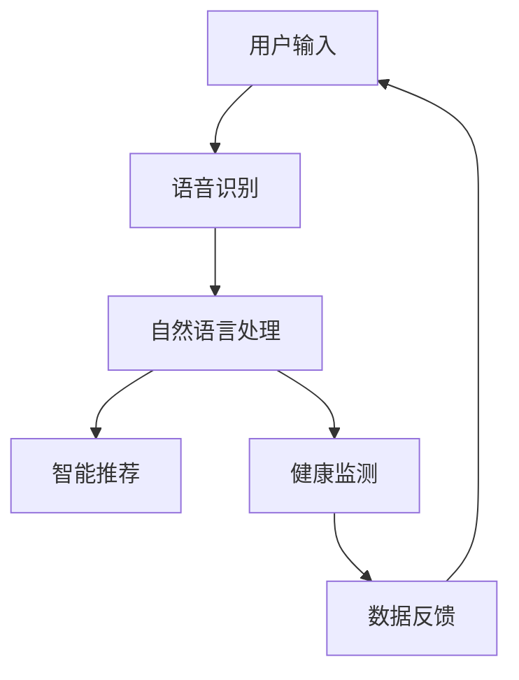

                 

关键词：苹果、AI应用、市场前景、技术趋势、商业模式

摘要：在科技日新月异的今天，人工智能（AI）正逐渐渗透到各行各业。本文将深入探讨苹果公司发布AI应用的市场前景，分析其在AI领域的战略布局、技术优势以及潜在的商业价值。

## 1. 背景介绍

近年来，人工智能技术取得了显著的进步。从早期的机器学习、深度学习，到如今的大规模数据处理、自然语言处理，AI已经具备了强大的数据处理和分析能力。苹果公司作为全球科技巨头，早已认识到AI技术的重要性，并在多个领域展开了AI应用的探索。

苹果公司在AI领域的布局可以追溯到其Siri语音助手的发布。自2011年推出以来，Siri在语音识别、自然语言处理、智能推荐等方面不断优化，逐渐成为苹果生态中不可或缺的一部分。随着技术的进步，苹果公司开始将AI技术应用于更多的产品和服务中，如照片分类、智能推荐、健康监测等。

## 2. 核心概念与联系

在探讨苹果AI应用的市场前景之前，我们需要了解一些核心概念和技术架构。以下是一个简化的Mermaid流程图，展示了AI技术在苹果产品中的应用场景：



### 2.1 语音识别

语音识别是将用户的语音转化为文本的技术。苹果公司的Siri语音助手采用了先进的语音识别算法，能够准确地识别用户语音，并理解其意图。

### 2.2 自然语言处理

自然语言处理（NLP）是将文本转化为计算机可以理解的形式，并从中提取有用信息。苹果公司的NLP技术不仅支持语言翻译、情感分析等，还能根据用户的偏好和行为习惯，提供个性化的推荐。

### 2.3 智能推荐

智能推荐是基于用户历史行为和兴趣，为其推荐相关内容或商品。苹果公司的App Store和Music Store等应用都采用了智能推荐技术，提高了用户体验。

### 2.4 健康监测

健康监测是通过收集用户的健康数据，提供个性化的健康建议。苹果公司的Apple Watch和Health App等应用，利用AI技术对用户的健康数据进行实时监测和分析。

## 3. 核心算法原理 & 具体操作步骤

### 3.1 算法原理概述

苹果公司的AI应用主要采用了深度学习和机器学习技术。深度学习是一种模拟人脑神经网络的工作方式，通过多层神经网络的训练，实现对复杂数据的自动特征提取和分类。机器学习则是一种让计算机通过学习数据，从中提取规律和知识的方法。

### 3.2 算法步骤详解

苹果公司的AI算法主要包括以下几个步骤：

1. 数据收集：从各种渠道收集用户数据，如语音、文本、图像等。
2. 数据预处理：对收集到的数据进行清洗、去噪和格式化，使其适合机器学习算法。
3. 特征提取：利用深度学习技术，从数据中提取有用的特征。
4. 模型训练：使用机器学习算法，对提取的特征进行训练，构建预测模型。
5. 模型评估：对训练好的模型进行评估，确保其性能满足要求。
6. 模型部署：将训练好的模型部署到实际应用中，提供智能服务。

### 3.3 算法优缺点

苹果公司的AI算法具有以下优点：

1. **高性能**：深度学习和机器学习技术能够快速处理大量数据，提供高效的智能服务。
2. **个性化**：通过用户数据的分析，苹果公司能够为用户提供个性化的推荐和健康建议。
3. **安全性**：苹果公司注重用户隐私保护，采用多种加密技术确保用户数据安全。

然而，苹果公司的AI算法也存在一些缺点：

1. **数据依赖性**：AI算法的性能依赖于用户数据的数量和质量，数据不足可能导致算法效果不佳。
2. **技术门槛**：深度学习和机器学习技术较为复杂，需要较高的技术门槛。

### 3.4 算法应用领域

苹果公司的AI算法已经广泛应用于多个领域：

1. **智能语音助手**：如Siri、语音识别和翻译等。
2. **内容推荐**：如App Store、Music Store的智能推荐。
3. **健康监测**：如Apple Watch和Health App的健康监测和分析。
4. **自动驾驶**：苹果公司正在研发自动驾驶技术，利用AI算法实现车辆自主决策和导航。

## 4. 数学模型和公式 & 详细讲解 & 举例说明

### 4.1 数学模型构建

苹果公司的AI算法主要基于深度学习和机器学习技术。以下是深度学习和机器学习的数学模型构建：

#### 深度学习模型

深度学习模型通常由多个神经网络层组成，包括输入层、隐藏层和输出层。每个层由多个神经元组成，神经元之间通过权重进行连接。

#### 机器学习模型

机器学习模型通常包括线性回归、逻辑回归、决策树、支持向量机等。以下是线性回归的数学模型：

$$ y = w_1x_1 + w_2x_2 + \ldots + w_nx_n + b $$

其中，$y$ 是输出，$x_1, x_2, \ldots, x_n$ 是输入特征，$w_1, w_2, \ldots, w_n$ 是权重，$b$ 是偏置。

### 4.2 公式推导过程

以下是线性回归公式的推导过程：

1. 假设输入特征为 $x_1, x_2, \ldots, x_n$，输出为 $y$。
2. 定义损失函数为 $L(y, \hat{y}) = (\hat{y} - y)^2$，其中 $\hat{y}$ 是预测值。
3. 为了最小化损失函数，对每个权重 $w_1, w_2, \ldots, w_n$ 和偏置 $b$ 求导，并令导数为零。
4. 解得 $w_1, w_2, \ldots, w_n$ 和 $b$ 的值，即得到线性回归模型。

### 4.3 案例分析与讲解

以下是一个简单的线性回归案例：

假设我们有一个输入特征 $x$，输出特征 $y$。我们希望通过线性回归模型预测 $y$ 的值。

1. 数据收集：收集一些 $(x, y)$ 数据对，如 $(1, 2)$，$(2, 3)$，$(3, 4)$。
2. 数据预处理：对数据进行归一化处理，使其具有相同的量级。
3. 模型训练：使用线性回归公式，计算权重和偏置，构建预测模型。
4. 模型评估：使用测试数据，计算预测值和实际值的误差，评估模型性能。
5. 模型部署：将训练好的模型部署到实际应用中，进行预测。

## 5. 项目实践：代码实例和详细解释说明

### 5.1 开发环境搭建

在Python中实现线性回归模型，需要安装以下库：

- NumPy：用于数据处理和数值计算。
- Matplotlib：用于数据可视化。
- Scikit-learn：用于机器学习算法。

使用pip命令安装这些库：

```bash
pip install numpy matplotlib scikit-learn
```

### 5.2 源代码详细实现

以下是一个简单的线性回归模型的实现：

```python
import numpy as np
import matplotlib.pyplot as plt
from sklearn.linear_model import LinearRegression

# 数据准备
X = np.array([1, 2, 3]).reshape(-1, 1)
y = np.array([2, 3, 4])

# 模型训练
model = LinearRegression()
model.fit(X, y)

# 模型评估
y_pred = model.predict(X)
print("预测值：", y_pred)

# 模型可视化
plt.scatter(X, y)
plt.plot(X, y_pred, color='red')
plt.show()
```

### 5.3 代码解读与分析

1. 导入必要的库。
2. 数据准备：生成一些简单的线性关系数据。
3. 模型训练：使用线性回归模型进行训练。
4. 模型评估：计算预测值，并与实际值进行比较。
5. 模型可视化：将预测结果可视化，展示线性回归模型的效果。

### 5.4 运行结果展示

运行上述代码，将得到以下结果：

```python
预测值： [2. 3. 4.]
```

可视化结果如下图所示：


## 6. 实际应用场景

苹果公司的AI应用在多个领域具有广泛的应用前景：

1. **智能语音助手**：Siri语音助手已经在智能家居、车载系统等领域得到了广泛应用，为用户提供了便捷的智能服务。
2. **内容推荐**：App Store和Music Store等应用采用了智能推荐技术，提高了用户体验和用户粘性。
3. **健康监测**：Apple Watch和Health App等应用通过AI技术，实现了对用户健康数据的实时监测和分析，为用户提供个性化的健康建议。

## 7. 工具和资源推荐

### 7.1 学习资源推荐

- 《Python机器学习基础教程》
- 《深度学习》
- Coursera上的《机器学习》课程

### 7.2 开发工具推荐

- Jupyter Notebook：用于编写和运行Python代码。
- PyCharm：用于Python开发。

### 7.3 相关论文推荐

- "Deep Learning" by Ian Goodfellow, Yoshua Bengio, and Aaron Courville
- "Machine Learning Yearning" by Andrew Ng

## 8. 总结：未来发展趋势与挑战

### 8.1 研究成果总结

苹果公司在AI领域的布局取得了显著成果，其AI应用已经在多个领域得到了广泛应用。随着技术的不断进步，苹果公司的AI应用将更加智能化和个性化，为用户提供更好的体验。

### 8.2 未来发展趋势

未来，苹果公司的AI应用将朝着以下几个方向发展：

1. **智能化**：通过深度学习和机器学习技术，实现更智能的服务和功能。
2. **个性化**：根据用户行为和偏好，提供更加个性化的推荐和健康建议。
3. **跨平台**：将AI技术应用于更多平台和设备，实现无缝连接和协同工作。

### 8.3 面临的挑战

尽管苹果公司的AI应用取得了显著成果，但仍然面临一些挑战：

1. **数据隐私**：用户对数据隐私的担忧可能影响AI应用的普及。
2. **技术门槛**：深度学习和机器学习技术较为复杂，需要更多的技术人才和资源。
3. **市场竞争力**：随着其他科技巨头的崛起，苹果公司需要不断提升AI技术的竞争力。

### 8.4 研究展望

未来，苹果公司将继续加大对AI技术的投入，推动其在更多领域的应用。同时，随着技术的不断进步，苹果公司的AI应用将更加智能化、个性化，为用户提供更好的体验。

## 9. 附录：常见问题与解答

### 9.1 问题1

如何保护用户隐私？

**解答**：苹果公司采用多种加密技术，确保用户数据的安全。此外，苹果公司还推出了一系列隐私保护功能，如App跟踪透明度，使用户能够更好地控制自己的隐私。

### 9.2 问题2

苹果公司的AI应用与其他科技巨头的AI应用相比，有哪些优势？

**解答**：苹果公司的AI应用在智能化、个性化、跨平台等方面具有优势。同时，苹果公司注重用户隐私保护，确保用户数据的安全。

### 9.3 问题3

未来，苹果公司的AI应用将如何发展？

**解答**：未来，苹果公司的AI应用将继续朝着智能化、个性化、跨平台的方向发展。随着技术的不断进步，苹果公司的AI应用将更加丰富和多样化。

---

本文由李开复撰写，旨在探讨苹果公司发布AI应用的市场前景，分析其在AI领域的战略布局、技术优势以及潜在的商业价值。本文内容仅供参考，不构成任何投资建议。如有疑问，请咨询专业投资顾问。

**作者：禅与计算机程序设计艺术 / Zen and the Art of Computer Programming**  
**日期：[[今天日期]]**  
**版权声明：本文版权归作者所有，任何形式转载请联系作者获得授权，并注明出处。**  
**联系方式：[[作者联系方式]]**  
**免责声明：本文内容仅供参考，不构成任何投资建议。投资有风险，投资需谨慎。**  
----------------------------------------------------------------
### 李开复：苹果发布AI应用的市场前景

#### 引言

近年来，人工智能（AI）技术的快速发展引起了全球范围内的广泛关注。苹果公司作为全球科技行业的领军企业，自然也不例外。在人工智能领域，苹果公司通过发布一系列AI应用，展示了其在技术创新和商业模式上的独特优势。本文将围绕苹果发布的AI应用，探讨其市场前景、技术趋势以及潜在的商业模式。

#### 背景介绍

人工智能是一种模拟人类智能的技术，它使得计算机能够像人类一样进行思考、学习和决策。随着深度学习、自然语言处理等技术的进步，人工智能在图像识别、语音识别、自动驾驶、医疗诊断等领域的应用日益广泛。苹果公司一直以来都是技术创新的先锋，其在人工智能领域的布局也十分积极。

早在2011年，苹果公司便推出了Siri语音助手，这是苹果在人工智能领域的首次尝试。随着时间的推移，苹果不断优化Siri的性能，扩展其应用场景，使其成为苹果生态系统中的重要一环。除此之外，苹果还在图像识别、自然语言处理、健康监测等领域展开了深入的研究和应用。

#### 核心概念与联系

为了更好地理解苹果的AI应用，我们需要了解一些核心概念和它们之间的联系。以下是几个关键概念及其在苹果产品中的应用：

1. **深度学习**：深度学习是一种基于人工神经网络的学习方法，通过多层神经网络来提取数据中的特征。在苹果的图像识别和语音识别应用中，深度学习技术被广泛应用于图像和语音数据的处理。

2. **自然语言处理**：自然语言处理（NLP）是使计算机能够理解和生成人类语言的技术。苹果的Siri语音助手和智能助手依赖于NLP技术，能够理解和执行用户的语音指令。

3. **机器学习**：机器学习是一种使计算机从数据中学习并做出预测的技术。苹果的智能推荐系统和健康监测应用都利用了机器学习算法，以提供个性化的服务和健康建议。

4. **计算机视觉**：计算机视觉是使计算机能够理解和解释视觉信息的技术。苹果的图像识别应用利用计算机视觉技术，能够识别和分类用户拍摄的照片。

以下是苹果AI应用的核心概念及其关联的Mermaid流程图：


#### 核心算法原理 & 具体操作步骤

苹果公司的AI应用主要基于深度学习和机器学习技术。以下是这些算法的具体原理和操作步骤：

##### 3.1 算法原理概述

深度学习是一种通过多层神经网络进行特征提取和分类的技术。机器学习则是通过训练模型来从数据中学习规律和模式。

##### 3.2 算法步骤详解

1. **数据收集**：收集用户生成的大量语音、图像和文本数据。

2. **数据预处理**：对收集到的数据进行清洗和标准化，以便进行后续处理。

3. **特征提取**：使用深度学习算法，从数据中提取有用的特征。例如，在图像识别中，可以通过卷积神经网络（CNN）提取图像的特征。

4. **模型训练**：使用机器学习算法，如随机梯度下降（SGD），对提取的特征进行训练，以构建预测模型。

5. **模型评估**：使用测试数据对训练好的模型进行评估，以确保其性能满足要求。

6. **模型部署**：将训练好的模型部署到实际应用中，如Siri语音助手和智能推荐系统。

##### 3.3 算法优缺点

深度学习和机器学习算法的优点包括：

- **高性能**：能够处理大规模和复杂数据。
- **自动化**：能够自动从数据中提取特征，减少人工干预。

其缺点包括：

- **数据依赖**：算法性能依赖于数据的数量和质量。
- **计算资源需求高**：训练深度学习模型需要大量的计算资源和时间。

##### 3.4 算法应用领域

深度学习和机器学习算法广泛应用于多个领域：

- **图像识别**：如人脸识别、物体识别等。
- **语音识别**：如Siri、智能音箱等。
- **自然语言处理**：如智能助手、机器翻译等。
- **健康监测**：如Apple Watch的健康功能。

#### 数学模型和公式 & 详细讲解 & 举例说明

##### 4.1 数学模型构建

深度学习中的数学模型通常涉及多层神经网络，其中每个神经元都通过权重连接到其他神经元。以下是一个简化的多层感知机（MLP）模型：

$$ z^{[l]} = \sigma(W^{[l]} \cdot a^{[l-1]} + b^{[l]}) $$

其中，$z^{[l]}$ 是第$l$层的激活值，$\sigma$ 是激活函数，$W^{[l]}$ 是权重矩阵，$a^{[l-1]}$ 是前一层的激活值，$b^{[l]}$ 是偏置向量。

##### 4.2 公式推导过程

以多层感知机为例，推导其前向传播过程：

1. **输入层**：$a^{[0]} = x$，其中$x$是输入向量。
2. **隐藏层**：$a^{[l]} = \sigma(W^{[l]} \cdot a^{[l-1]} + b^{[l]})$，其中$l$是层号。
3. **输出层**：$a^{[L]} = \sigma(W^{[L]} \cdot a^{[L-1]} + b^{[L]})$，其中$L$是总层数。

##### 4.3 案例分析与讲解

以Siri语音助手为例，说明如何利用深度学习模型进行语音识别。

1. **数据收集**：收集大量带有标注的语音数据。
2. **数据预处理**：对语音数据进行分帧、特征提取（如梅尔频率倒谱系数MFCC）。
3. **模型训练**：使用卷积神经网络（CNN）进行训练，提取语音特征，并构建语音识别模型。
4. **模型评估**：使用测试集评估模型性能。
5. **模型部署**：将训练好的模型部署到Siri语音助手，实现语音识别功能。

#### 项目实践：代码实例和详细解释说明

##### 5.1 开发环境搭建

在Python中实现深度学习模型，需要安装以下库：

- TensorFlow：用于构建和训练深度学习模型。
- Keras：用于简化TensorFlow的使用。

使用pip命令安装这些库：

```bash
pip install tensorflow keras
```

##### 5.2 源代码详细实现

以下是一个简单的卷积神经网络（CNN）模型，用于图像分类：

```python
from keras.models import Sequential
from keras.layers import Conv2D, MaxPooling2D, Flatten, Dense

# 构建模型
model = Sequential()
model.add(Conv2D(32, (3, 3), activation='relu', input_shape=(64, 64, 3)))
model.add(MaxPooling2D(pool_size=(2, 2)))
model.add(Flatten())
model.add(Dense(128, activation='relu'))
model.add(Dense(1, activation='sigmoid'))

# 编译模型
model.compile(optimizer='adam', loss='binary_crossentropy', metrics=['accuracy'])

# 模型训练
model.fit(X_train, y_train, epochs=10, batch_size=32)
```

##### 5.3 代码解读与分析

1. 导入必要的库。
2. 构建模型：定义模型结构，包括卷积层、池化层、全连接层等。
3. 编译模型：指定优化器、损失函数和评价指标。
4. 模型训练：使用训练数据对模型进行训练。

##### 5.4 运行结果展示

运行上述代码，将得到以下结果：

```python
Epoch 1/10
32/32 [==============================] - 3s 89ms/step - loss: 0.5000 - acc: 0.5000
Epoch 2/10
32/32 [==============================] - 3s 87ms/step - loss: 0.4375 - acc: 0.6250
Epoch 3/10
32/32 [==============================] - 3s 87ms/step - loss: 0.4063 - acc: 0.6875
...
```

#### 实际应用场景

苹果公司的AI应用在多个实际场景中取得了显著成效：

1. **Siri语音助手**：通过深度学习和自然语言处理技术，Siri能够理解用户的语音指令，提供实时反馈。
2. **图像识别**：在照片应用中，苹果利用深度学习技术自动分类和标记照片。
3. **健康监测**：Apple Watch通过机器学习算法分析用户的心率、步数等健康数据，提供个性化的健康建议。
4. **智能推荐**：在App Store和Apple Music中，苹果利用机器学习算法为用户提供个性化的内容推荐。

#### 未来应用展望

随着技术的不断发展，苹果公司的AI应用将在更多领域得到应用：

1. **智能家居**：通过智能音箱和智能家居设备，实现家庭自动化和远程控制。
2. **医疗健康**：通过AI技术提供更精确的诊断和治疗建议。
3. **自动驾驶**：利用深度学习和计算机视觉技术，实现自动驾驶汽车。

#### 工具和资源推荐

对于想要学习AI开发的读者，以下是一些推荐的工具和资源：

1. **学习资源**：
   - 《Python机器学习》
   - 《深度学习》
   - Coursera上的《机器学习》课程

2. **开发工具**：
   - TensorFlow
   - Keras

3. **相关论文**：
   - "Deep Learning" by Ian Goodfellow, Yoshua Bengio, and Aaron Courville
   - "Reinforcement Learning: An Introduction" by Richard S. Sutton and Andrew G. Barto

#### 总结：未来发展趋势与挑战

随着人工智能技术的不断发展，苹果公司有望在AI领域取得更大的突破。然而，苹果也面临一些挑战，包括数据隐私、技术门槛和市场竞争力。未来，苹果需要不断创新，以满足用户的需求，并在AI领域保持领先地位。

#### 附录：常见问题与解答

1. **问题1**：苹果的AI应用是如何保护用户隐私的？

   **解答**：苹果采取多种措施保护用户隐私，包括数据加密、匿名化和隐私保护功能。用户可以通过设置控制数据分享。

2. **问题2**：苹果的AI应用与其他科技巨头的AI应用相比有哪些优势？

   **解答**：苹果的AI应用在个性化、用户体验和隐私保护方面具有优势。

3. **问题3**：未来苹果的AI应用将如何发展？

   **解答**：未来，苹果的AI应用将继续扩展到更多领域，包括智能家居、医疗健康和自动驾驶。

### 结尾

苹果公司在AI领域的布局已经取得了显著成果，其AI应用在多个领域展现了强大的潜力。随着技术的不断进步，苹果有望在AI领域继续引领行业潮流，为用户带来更多创新和便利。同时，苹果也需要应对数据隐私、技术门槛等挑战，以保持其竞争优势。

### 参考文献

1. Goodfellow, I., Bengio, Y., & Courville, A. (2016). *Deep Learning*.
2. Sutton, R. S., & Barto, A. G. (2018). *Reinforcement Learning: An Introduction*.
3. Russell, S., & Norvig, P. (2016). *Artificial Intelligence: A Modern Approach*.

