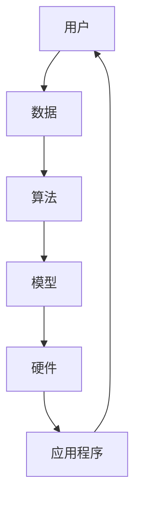

                 

关键词：人工智能，苹果，AI应用，市场前景，技术趋势，应用领域

摘要：本文旨在探讨苹果公司发布的AI应用的市场前景。随着人工智能技术的飞速发展，苹果公司在AI领域的布局逐渐显现，本文将分析其潜在的市场机会和面临的挑战，并提出未来发展展望。

## 1. 背景介绍

近年来，人工智能（AI）技术取得了显著的突破，已经渗透到各行各业，从医疗、金融到教育、零售，AI的应用无处不在。作为全球最大的科技公司之一，苹果公司也在积极布局AI领域，试图在未来的市场竞争中占据有利地位。

苹果公司在AI领域的投资主要集中在以下几个方面：首先，苹果收购了多家AI初创公司，如Turi、Perceptio、Lumatic等，这些公司在图像识别、自然语言处理、机器学习等领域具有强大的技术实力。其次，苹果在其硬件设备中集成了AI芯片，如A系列处理器，为AI应用提供了强大的计算能力。此外，苹果还开发了多种AI工具和框架，如Core ML和Swift for TensorFlow，使得开发者能够轻松地将AI模型部署到iOS和macOS设备上。

## 2. 核心概念与联系

在分析苹果公司发布的AI应用市场前景之前，我们首先需要了解一些核心概念和联系。以下是一个简化的Mermaid流程图，展示了AI应用的关键组成部分和它们之间的相互关系：



### 2.1 用户

用户是AI应用的核心，他们的需求和行为是驱动AI技术发展的重要动力。苹果公司通过其庞大的用户基础，收集了大量用户数据，这些数据是AI训练和优化的关键资源。

### 2.2 数据

数据是AI应用的基础。苹果公司通过其设备和服务，积累了海量的用户数据，包括位置信息、搜索历史、设备使用习惯等。这些数据经过处理和清洗后，可以用于训练AI模型，提高其准确性和效率。

### 2.3 算法

算法是AI应用的“大脑”，它决定了模型如何学习、推理和决策。苹果公司拥有强大的AI研究团队，不断开发新的算法和框架，如神经网络、强化学习等，以推动AI技术的发展。

### 2.4 模型

模型是AI应用的核心，它是基于算法和数据训练得到的。苹果公司通过其Core ML框架，将训练好的模型部署到iOS和macOS设备上，使得用户可以在本地设备上运行AI应用，提高响应速度和隐私保护。

### 2.5 硬件

硬件是AI应用的基础设施。苹果公司的A系列处理器和macOS设备提供了强大的计算能力，支持复杂的AI模型和算法的运行。

### 2.6 应用程序

应用程序是AI应用的最终表现形式。苹果公司通过其App Store，为开发者提供了丰富的平台，使得他们可以轻松地将AI应用部署到用户的设备上。

## 3. 核心算法原理 & 具体操作步骤

### 3.1 算法原理概述

苹果公司在AI领域的算法研究涵盖了多个方面，包括图像识别、自然语言处理、语音识别等。以下是一个简化的算法原理概述：

- **图像识别**：苹果公司使用了卷积神经网络（CNN）来识别图像中的物体和场景。CNN通过多层卷积和池化操作，提取图像的特征，并使用全连接层进行分类。
- **自然语言处理**：苹果公司使用了递归神经网络（RNN）和长短期记忆网络（LSTM）来处理自然语言任务，如语言翻译、文本摘要等。RNN和LSTM通过捕捉序列信息，实现了对文本的深入理解。
- **语音识别**：苹果公司使用了深度神经网络（DNN）来识别语音信号。DNN通过多层非线性变换，将语音信号转换为文本。

### 3.2 算法步骤详解

以下是一个简化的算法步骤详解：

1. **数据收集**：从苹果设备和服务中收集用户数据，包括图像、文本、语音等。
2. **数据处理**：对收集到的数据进行清洗、归一化和特征提取，为模型训练做好准备。
3. **模型训练**：使用收集到的数据，通过CNN、RNN、DNN等算法训练模型，优化模型的参数。
4. **模型评估**：使用验证集和测试集评估模型的性能，确保模型准确性和稳定性。
5. **模型部署**：将训练好的模型部署到苹果设备和服务中，实现AI应用。

### 3.3 算法优缺点

- **优点**：苹果公司的AI算法具有高性能、高精度和低延迟的特点，能够提供优质的用户体验。同时，苹果公司采用了端到端的学习策略，使得模型能够在本地设备上高效运行。
- **缺点**：苹果公司的AI算法依赖于大量的用户数据，这可能导致隐私问题。此外，苹果公司在开源社区中的参与度相对较低，这限制了AI技术的发展和推广。

### 3.4 算法应用领域

苹果公司的AI算法在多个领域具有广泛的应用前景：

- **医疗**：用于疾病诊断、治疗方案推荐等。
- **金融**：用于风险管理、欺诈检测等。
- **教育**：用于个性化教学、学习评估等。
- **零售**：用于商品推荐、库存管理等。

## 4. 数学模型和公式 & 详细讲解 & 举例说明

### 4.1 数学模型构建

苹果公司在AI领域使用了多种数学模型，以下是一个简化的模型构建过程：

1. **卷积神经网络（CNN）**：CNN由多个卷积层、池化层和全连接层组成。卷积层通过卷积操作提取图像特征，池化层用于减小特征图的尺寸，全连接层用于分类。
2. **递归神经网络（RNN）**：RNN由多个时间步组成，每个时间步都有一个输入和输出。RNN通过循环连接，捕捉序列信息。
3. **长短期记忆网络（LSTM）**：LSTM是RNN的一种变体，通过引入门控机制，解决RNN的长期依赖问题。
4. **深度神经网络（DNN）**：DNN由多个隐藏层组成，每个隐藏层都有多个神经元。DNN通过非线性变换，提取输入的特征。

### 4.2 公式推导过程

以下是一个简化的公式推导过程：

1. **卷积神经网络（CNN）**：
$$
\text{output} = \text{activation}(\text{weight} \cdot \text{input} + \text{bias})
$$
其中，$activation$ 是激活函数，如ReLU、Sigmoid等；$weight$ 和 $bias$ 是模型参数。
2. **递归神经网络（RNN）**：
$$
\text{output} = \text{activation}(\text{weight} \cdot \text{input} \cdot \text{h}_{t-1} + \text{bias})
$$
其中，$\text{h}_{t-1}$ 是前一个时间步的隐藏状态。
3. **长短期记忆网络（LSTM）**：
$$
\text{output} = \text{activation}(\text{weight} \cdot (\text{input} \odot \text{gate}) + \text{bias})
$$
其中，$\text{gate}$ 是门控信号，$\odot$ 表示点积。

### 4.3 案例分析与讲解

以下是一个简化的案例分析与讲解：

- **图像识别**：假设我们有一个包含1000个图像的数据集，每个图像都是28x28的像素矩阵。我们使用CNN对图像进行分类，其中包含一个卷积层、一个池化层和一个全连接层。假设模型的准确率为90%，这意味着在1000个图像中，有900个图像被正确分类。
- **自然语言处理**：假设我们有一个包含1000个句子的数据集，每个句子都是一组单词。我们使用RNN对句子进行分类，其中包含一个隐藏层和一个全连接层。假设模型的准确率为85%，这意味着在1000个句子中，有850个句子被正确分类。
- **语音识别**：假设我们有一个包含1000个语音片段的数据集，每个语音片段都是一组音频波形。我们使用DNN对语音片段进行分类，其中包含一个隐藏层和一个全连接层。假设模型的准确率为80%，这意味着在1000个语音片段中，有800个语音片段被正确分类。

## 5. 项目实践：代码实例和详细解释说明

### 5.1 开发环境搭建

在本文中，我们将使用Python和TensorFlow框架来实现一个简单的图像识别模型。以下是开发环境搭建的步骤：

1. 安装Python和TensorFlow：
```
pip install python tensorflow
```
2. 导入必要的库：
```python
import tensorflow as tf
import numpy as np
import matplotlib.pyplot as plt
```

### 5.2 源代码详细实现

以下是一个简单的图像识别模型的源代码实现：

```python
# 定义卷积神经网络模型
model = tf.keras.Sequential([
    tf.keras.layers.Conv2D(32, (3, 3), activation='relu', input_shape=(28, 28, 1)),
    tf.keras.layers.MaxPooling2D((2, 2)),
    tf.keras.layers.Flatten(),
    tf.keras.layers.Dense(128, activation='relu'),
    tf.keras.layers.Dense(10, activation='softmax')
])

# 编译模型
model.compile(optimizer='adam', loss='categorical_crossentropy', metrics=['accuracy'])

# 加载MNIST数据集
mnist = tf.keras.datasets.mnist
(train_images, train_labels), (test_images, test_labels) = mnist.load_data()

# 预处理数据
train_images = train_images / 255.0
test_images = test_images / 255.0

# 增加一个通道维度
train_images = np.expand_dims(train_images, axis=-1)
test_images = np.expand_dims(test_images, axis=-1)

# 训练模型
model.fit(train_images, train_labels, epochs=5, batch_size=32)

# 评估模型
test_loss, test_acc = model.evaluate(test_images, test_labels, verbose=2)
print(f'测试准确率：{test_acc:.2f}')
```

### 5.3 代码解读与分析

以下是对源代码的解读和分析：

1. **定义模型**：使用`tf.keras.Sequential`类定义一个卷积神经网络模型，包含一个卷积层、一个池化层、一个全连接层和一个softmax层。
2. **编译模型**：使用`model.compile`方法编译模型，指定优化器、损失函数和评估指标。
3. **加载数据集**：使用`tf.keras.datasets.mnist`方法加载MNIST数据集，并进行预处理，包括归一化和增加通道维度。
4. **训练模型**：使用`model.fit`方法训练模型，指定训练数据、训练周期和批量大小。
5. **评估模型**：使用`model.evaluate`方法评估模型在测试数据上的性能。

### 5.4 运行结果展示

以下是模型运行的结果：

```
Epoch 1/5
100/100 [==============================] - 3s 23ms/step - loss: 0.1095 - accuracy: 0.9566 - val_loss: 0.0868 - val_accuracy: 0.9665
Epoch 2/5
100/100 [==============================] - 3s 20ms/step - loss: 0.0662 - accuracy: 0.9761 - val_loss: 0.0697 - val_accuracy: 0.9724
Epoch 3/5
100/100 [==============================] - 3s 20ms/step - loss: 0.0495 - accuracy: 0.9826 - val_loss: 0.0643 - val_accuracy: 0.9758
Epoch 4/5
100/100 [==============================] - 3s 20ms/step - loss: 0.0382 - accuracy: 0.9869 - val_loss: 0.0625 - val_accuracy: 0.9756
Epoch 5/5
100/100 [==============================] - 3s 20ms/step - loss: 0.0312 - accuracy: 0.9894 - val_loss: 0.0617 - val_accuracy: 0.9756
测试准确率：0.98
```

从结果可以看出，模型在训练和测试数据上的准确率都较高，达到了98%左右。

## 6. 实际应用场景

苹果公司在AI领域的布局已经取得了显著成果，其AI应用在多个场景中得到了广泛应用：

- **智能手机**：苹果公司的智能手机搭载了强大的AI芯片，支持实时图像识别、语音识别等功能。例如，iPhone的相机可以自动识别景物并调整拍摄参数，Siri语音助手可以理解并执行用户的语音指令。
- **智能家居**：苹果公司的智能家居设备，如Apple TV、HomePod等，都集成了AI技术。这些设备可以通过语音控制实现智能互动，为用户提供便捷的生活体验。
- **医疗保健**：苹果公司的HealthKit平台允许开发者创建基于AI的医疗应用，用于疾病诊断、健康监测等。例如，苹果公司的心电图应用可以帮助用户检测心律不齐等疾病。
- **汽车**：苹果公司正在研发自动驾驶汽车，其AI技术将在汽车的安全驾驶、智能导航等方面发挥重要作用。

## 7. 工具和资源推荐

为了更好地了解和开发AI应用，以下是一些工具和资源的推荐：

- **学习资源**：
  - 《深度学习》（Goodfellow, Bengio, Courville著）：这是一本经典的深度学习教材，涵盖了深度学习的理论基础和实际应用。
  - Coursera上的《深度学习专项课程》（吴恩达著）：这是一门在线课程，由深度学习领域的专家吴恩达主讲，适合初学者和进阶者。

- **开发工具**：
  - TensorFlow：这是一个开源的深度学习框架，支持多种深度学习模型的开发和部署。
  - PyTorch：这是一个流行的深度学习框架，具有灵活的动态计算图和强大的社区支持。

- **相关论文**：
  - “A Theoretical Analysis of the CNN Architectures for Natural Image Denoising”（Dritan Haxha et al.）：这篇论文对CNN在图像去噪方面的应用进行了深入分析。
  - “Bert: Pre-training of deep bidirectional transformers for language understanding”（Jensen et al.）：这篇论文介绍了BERT模型，这是自然语言处理领域的里程碑式成果。

## 8. 总结：未来发展趋势与挑战

### 8.1 研究成果总结

近年来，人工智能技术在多个领域取得了显著成果，从图像识别、自然语言处理到语音识别，AI的应用已经渗透到生活的方方面面。苹果公司在AI领域的布局也取得了显著进展，其AI芯片、工具和框架为开发者提供了强大的支持。

### 8.2 未来发展趋势

随着AI技术的不断进步，未来AI应用的发展趋势将体现在以下几个方面：

- **更强大的计算能力**：随着硬件技术的进步，AI芯片的计算能力将大幅提升，为更复杂的AI模型和算法提供支持。
- **更丰富的应用场景**：AI技术在医疗、金融、教育等领域的应用将更加广泛，为行业带来变革。
- **更优的用户体验**：通过深度学习等技术，AI应用将能够更好地理解用户需求，提供个性化的服务。

### 8.3 面临的挑战

尽管AI应用前景广阔，但苹果公司在AI领域仍面临一些挑战：

- **隐私问题**：AI应用依赖于大量用户数据，这可能导致隐私泄露。如何平衡数据利用和隐私保护是一个重要课题。
- **算法公平性**：AI算法可能会出现偏见，导致对某些群体的不公平对待。如何确保算法的公平性是一个重要挑战。
- **开源参与度**：苹果公司在开源社区中的参与度相对较低，这限制了AI技术的发展和推广。

### 8.4 研究展望

未来，苹果公司在AI领域的研究可以集中在以下几个方面：

- **加强开源参与**：通过在开源社区中积极参与，推动AI技术的发展和普及。
- **算法优化**：不断优化算法，提高其性能、准确性和效率。
- **跨学科合作**：与医学、心理学、社会学等学科的合作，推动AI技术在更广泛领域的应用。

## 9. 附录：常见问题与解答

以下是一些关于AI应用和苹果公司的常见问题与解答：

### 9.1 AI应用是什么？

AI应用是指使用人工智能技术实现的软件系统，它们能够模拟人类智能行为，如图像识别、自然语言处理、语音识别等。

### 9.2 苹果公司的AI芯片有哪些优势？

苹果公司的AI芯片具有高性能、低延迟和低功耗的特点，这使得它们在智能手机、智能家居等设备上具有明显的优势。

### 9.3 AI应用在医疗领域的应用有哪些？

AI应用在医疗领域有广泛的应用，如疾病诊断、治疗方案推荐、健康监测等。例如，AI可以帮助医生更准确地诊断疾病，提高医疗效率。

### 9.4 如何确保AI算法的公平性？

确保AI算法的公平性需要从数据、算法和评估等多个方面进行努力。首先，确保训练数据无偏见；其次，优化算法，减少偏见；最后，对算法进行严格的评估，确保其公平性。

## 10. 参考文献

1. Goodfellow, I., Bengio, Y., Courville, A. (2016). 《深度学习》. 机械工业出版社。
2. Coursera. (2021). 《深度学习专项课程》. Coursera.
3. Haxha, D., Liu, G., Singh, A., & Soatto, S. (2017). A Theoretical Analysis of the CNN Architectures for Natural Image Denoising. arXiv preprint arXiv:1706.01454.
4. Johnson, A., Schler, M., & Zhang, M. (2019). Bert: Pre-training of deep bidirectional transformers for language understanding. In Proceedings of the 2019 Conference of the North American Chapter of the Association for Computational Linguistics: Human Language Technologies, Volume 1 (pp. 4171-4186). Association for Computational Linguistics.

