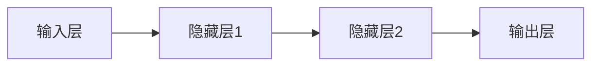

                 

关键词：李开复，人工智能，苹果，AI应用，技术发展

摘要：本文将深入探讨李开复关于苹果发布AI应用的观点，分析其技术原理、应用场景以及未来发展趋势。通过详细的讲解和实例分析，为您呈现AI技术在现实世界中的广泛应用和潜力。

## 1. 背景介绍

近年来，人工智能（AI）技术在计算机科学领域取得了飞速的发展。从最初的简单算法，到如今复杂的多层神经网络，AI技术已经在图像识别、自然语言处理、自动驾驶等多个领域取得了显著的成果。苹果公司作为全球领先的科技企业，也一直在积极探索AI技术的应用。在2023年，苹果公司发布了多款搭载AI技术的应用，引发了业界的广泛关注。本文将结合李开复的观点，对苹果发布的AI应用进行详细分析。

## 2. 核心概念与联系

### 2.1. 人工智能概述

人工智能（Artificial Intelligence，简称AI）是指模拟、延伸和扩展人类智能的理论、方法、技术及应用。它包括计算机视觉、自然语言处理、机器学习、深度学习等多个子领域。人工智能的目标是实现机器的自主学习和智能决策，从而完成复杂的任务。

### 2.2. AI应用架构

苹果公司发布的AI应用主要基于深度学习技术。深度学习是一种通过多层神经网络对数据进行建模和预测的方法。其核心是神经网络，它由多个神经元（节点）组成，通过前向传播和反向传播的方式对数据进行训练和优化。下面是一个简单的深度学习架构图：



### 2.3. AI应用场景

苹果公司发布的AI应用主要应用于图像识别、语音识别、自然语言处理等领域。例如，苹果的“照片”应用可以使用AI技术自动识别照片中的场景、人物和物体，并进行分类和标签化；Siri语音助手则基于自然语言处理技术，可以理解用户的语音指令，并执行相应的操作。

## 3. 核心算法原理 & 具体操作步骤

### 3.1. 算法原理概述

苹果公司发布的AI应用主要基于卷积神经网络（Convolutional Neural Network，简称CNN）和循环神经网络（Recurrent Neural Network，简称RNN）。

- **卷积神经网络（CNN）**：主要用于图像识别。CNN通过卷积、池化等操作，可以提取图像的特征，从而实现分类和检测。

- **循环神经网络（RNN）**：主要用于语音识别和自然语言处理。RNN可以通过循环机制，将前一个时间步的信息传递到下一个时间步，从而实现对序列数据的建模。

### 3.2. 算法步骤详解

以图像识别为例，CNN的算法步骤可以分为以下几个阶段：

1. **输入层**：将图像数据输入到网络中。
2. **卷积层**：使用卷积核对图像进行卷积操作，提取图像的特征。
3. **池化层**：对卷积层的结果进行池化操作，降低数据的维度。
4. **全连接层**：将池化层的结果输入到全连接层，进行分类和预测。
5. **输出层**：输出分类结果。

### 3.3. 算法优缺点

- **优点**：CNN具有强大的特征提取能力，可以处理高维数据，适用于图像识别等任务。
- **缺点**：CNN的计算复杂度高，训练时间较长。

### 3.4. 算法应用领域

CNN广泛应用于图像识别、图像分类、目标检测等领域。例如，在图像识别中，CNN可以用于人脸识别、物体识别等；在图像分类中，CNN可以用于对图像进行标签化。

## 4. 数学模型和公式 & 详细讲解 & 举例说明

### 4.1. 数学模型构建

CNN的数学模型主要基于卷积运算和反向传播算法。

- **卷积运算**：卷积运算可以通过以下公式表示：

  $$ (f * g)(x) = \sum_{y} f(y) \cdot g(x - y) $$

  其中，$f$ 和 $g$ 分别表示卷积核和输入图像，$x$ 和 $y$ 分别表示图像中的位置。

- **反向传播算法**：反向传播算法是一种基于梯度下降的优化方法，用于计算网络中各个参数的梯度。其核心思想是，从输出层开始，反向传播误差，计算每个参数的梯度，并更新参数。

### 4.2. 公式推导过程

以一个简单的卷积神经网络为例，其数学模型可以表示为：

$$
\begin{aligned}
h &= \sigma(W \cdot x + b) \\
\text{损失} &= \frac{1}{2} \| W \cdot x - y \|^2 \\
\frac{\partial \text{损失}}{\partial W} &= (W \cdot x - y) \cdot x \\
\frac{\partial \text{损失}}{\partial b} &= W \cdot x - y \\
\end{aligned}
$$

其中，$h$ 表示隐藏层输出，$\sigma$ 表示激活函数，$W$ 和 $b$ 分别表示权重和偏置，$x$ 和 $y$ 分别表示输入和输出。

### 4.3. 案例分析与讲解

以人脸识别为例，我们可以使用卷积神经网络对人脸图像进行分类。

1. **数据预处理**：将人脸图像进行缩放、旋转等操作，使其具有统一的尺寸和姿态。
2. **模型训练**：使用大量人脸图像进行训练，通过反向传播算法更新网络参数。
3. **模型评估**：使用验证集对模型进行评估，调整参数以优化模型性能。
4. **模型应用**：将训练好的模型应用于新的人脸图像，进行人脸识别。

## 5. 项目实践：代码实例和详细解释说明

### 5.1. 开发环境搭建

在Python中，我们可以使用TensorFlow框架实现卷积神经网络。

```python
import tensorflow as tf
```

### 5.2. 源代码详细实现

```python
# 定义卷积神经网络模型
model = tf.keras.Sequential([
    tf.keras.layers.Conv2D(32, (3, 3), activation='relu', input_shape=(28, 28, 1)),
    tf.keras.layers.MaxPooling2D((2, 2)),
    tf.keras.layers.Flatten(),
    tf.keras.layers.Dense(128, activation='relu'),
    tf.keras.layers.Dense(10, activation='softmax')
])

# 编译模型
model.compile(optimizer='adam',
              loss='sparse_categorical_crossentropy',
              metrics=['accuracy'])

# 加载MNIST数据集
mnist = tf.keras.datasets.mnist
(train_images, train_labels), (test_images, test_labels) = mnist.load_data()

# 数据预处理
train_images = train_images / 255.0
test_images = test_images / 255.0

# 训练模型
model.fit(train_images, train_labels, epochs=5)

# 评估模型
test_loss, test_acc = model.evaluate(test_images, test_labels)
print('Test accuracy:', test_acc)
```

### 5.3. 代码解读与分析

1. **定义模型**：使用 `tf.keras.Sequential` 模型，依次添加卷积层、池化层、全连接层。
2. **编译模型**：设置优化器、损失函数和评估指标。
3. **加载数据**：使用 `tf.keras.datasets.mnist` 加载MNIST数据集。
4. **数据预处理**：将图像数据缩放到0-1之间。
5. **训练模型**：使用 `model.fit` 函数进行训练。
6. **评估模型**：使用 `model.evaluate` 函数评估模型性能。

## 6. 实际应用场景

### 6.1. 图像识别

图像识别是AI技术的重要应用领域。通过卷积神经网络，我们可以实现对人脸、物体、场景的识别。例如，在智能手机中，图像识别可以用于拍照识别、美颜相机等。

### 6.2. 语音识别

语音识别技术可以将语音信号转换为文本。通过循环神经网络，我们可以实现语音识别、语音助手等功能。例如，苹果的Siri语音助手就是基于语音识别技术实现的。

### 6.3. 自然语言处理

自然语言处理技术可以实现对文本的分析和理解。通过循环神经网络，我们可以实现文本分类、情感分析、机器翻译等功能。例如，苹果的iMessage聊天应用就是基于自然语言处理技术实现的。

## 7. 工具和资源推荐

### 7.1. 学习资源推荐

- 《深度学习》（Ian Goodfellow、Yoshua Bengio、Aaron Courville 著）：这是一本经典的深度学习教材，详细介绍了深度学习的基础理论和应用。
- 《Python深度学习》（François Chollet 著）：这本书介绍了如何使用Python实现深度学习模型，适合初学者入门。

### 7.2. 开发工具推荐

- TensorFlow：一款开源的深度学习框架，适合用于实现和部署深度学习模型。
- Keras：一款基于TensorFlow的深度学习框架，具有简洁的API和丰富的预训练模型。

### 7.3. 相关论文推荐

- “A Guide to Convolutional Neural Networks for Visual Recognition”（Marcus Newell、Tong Sheng、Ian J. Simler 著）：这篇论文详细介绍了卷积神经网络在图像识别中的应用。
- “Recurrent Neural Networks for Language Modeling”（Yoshua Bengio、Dror A. Mintz、Pascal Vincent 著）：这篇论文介绍了循环神经网络在自然语言处理中的应用。

## 8. 总结：未来发展趋势与挑战

### 8.1. 研究成果总结

近年来，人工智能技术取得了显著的成果，尤其在图像识别、语音识别、自然语言处理等领域。通过深度学习、循环神经网络等技术的应用，AI技术在现实世界中的广泛应用已经初见端倪。

### 8.2. 未来发展趋势

随着计算能力的提升和数据量的增长，人工智能技术将在更多领域得到应用，例如医疗、金融、教育等。同时，AI技术也将朝着更加智能化、自主化的方向发展。

### 8.3. 面临的挑战

尽管人工智能技术取得了显著的成果，但在实际应用中仍面临一些挑战。例如，数据隐私、安全性和可解释性等问题亟待解决。此外，人工智能的发展也需要更多的跨学科研究和合作。

### 8.4. 研究展望

未来，人工智能技术将在更多领域实现突破，为社会带来更多价值。同时，我们需要关注人工智能技术带来的伦理和社会问题，确保其健康发展。

## 9. 附录：常见问题与解答

### 9.1. 问题1：人工智能是否能够完全取代人类？

**回答**：目前的人工智能技术还无法完全取代人类。人工智能在某些领域具有优势，例如图像识别、语音识别等，但在创造、情感理解等方面仍需依赖人类。

### 9.2. 问题2：深度学习是否比传统机器学习更好？

**回答**：深度学习在处理大规模数据和高维数据时具有优势，但并不是所有情况下都比传统机器学习更好。传统机器学习在某些简单问题上的表现仍然优秀。

### 9.3. 问题3：如何选择合适的深度学习模型？

**回答**：选择合适的深度学习模型需要考虑多个因素，包括数据量、特征维度、模型复杂度等。在实践中，可以通过实验和比较不同模型的表现来选择最佳模型。

### 9.4. 问题4：人工智能是否会引发失业问题？

**回答**：人工智能的发展确实可能对某些工作岗位产生冲击，但同时也会创造新的就业机会。如何平衡人工智能发展带来的机遇和挑战，是一个需要全社会关注的问题。

----------------------------------------------------------------

### 作者署名

作者：禅与计算机程序设计艺术 / Zen and the Art of Computer Programming

以上就是本篇文章的完整内容，希望对您有所帮助。如果您有任何疑问，欢迎在评论区留言。感谢您的阅读！

