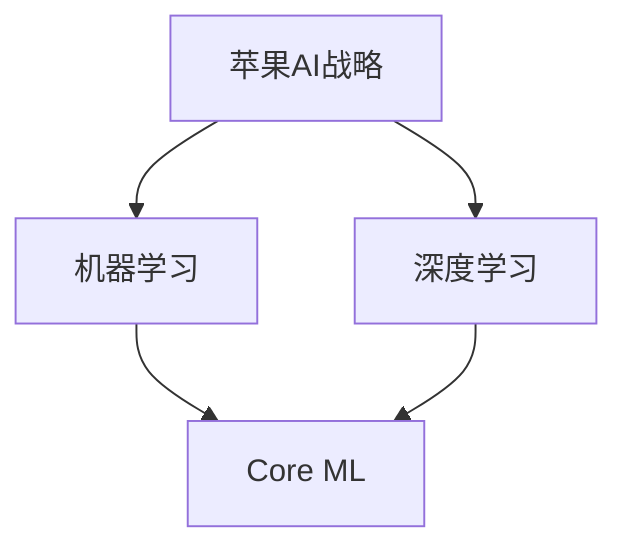
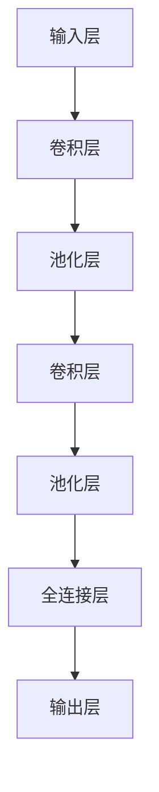

                 

关键词：人工智能，苹果，开发者，技术趋势，应用程序开发

摘要：在人工智能日益成为科技发展核心动力的今天，苹果公司发布了一系列AI应用，引发了业界广泛关注。本文将深入探讨这一举动背后的意义，分析苹果在AI领域的战略布局，以及这对开发者意味着什么。

## 1. 背景介绍

近年来，人工智能（AI）技术取得了飞速发展，从语音识别到图像处理，从自然语言理解到机器学习，AI正在改变我们的生活方式。苹果公司作为全球科技巨头，一直在积极布局AI领域，其最新发布的一系列AI应用更是将这一趋势推向了高潮。

苹果公司在AI领域的布局可以追溯到其收购AI初创公司Turi（现更名为Core ML），以及推出适用于iOS、macOS、watchOS和tvOS的Core ML框架。这些举措表明，苹果正致力于将AI技术融入其产品和服务中，提升用户体验。

## 2. 核心概念与联系

为了更好地理解苹果在AI领域的战略，我们首先需要明确几个核心概念：

### 2.1 人工智能（AI）
人工智能是指由人制造出的系统所表现出的智能行为。它包括机器学习、深度学习、自然语言处理等多个子领域。

### 2.2 机器学习（ML）
机器学习是一种人工智能的分支，它使计算机系统能够从数据中学习，并改进其性能。

### 2.3 深度学习（DL）
深度学习是机器学习的一个子集，它使用神经网络模拟人类大脑的工作方式，通过大量数据训练模型，以实现复杂的任务。

### 2.4 Core ML
Core ML是苹果公司推出的一套机器学习框架，旨在让开发者能够在iOS、macOS、watchOS和tvOS平台上轻松集成机器学习模型。

下面是苹果AI战略的一个Mermaid流程图：



## 3. 核心算法原理 & 具体操作步骤

### 3.1 算法原理概述

苹果的AI应用主要基于机器学习和深度学习技术。机器学习模型通过从数据中学习，能够识别模式并做出预测。深度学习模型则通过多层神经网络，实现更复杂的任务。

### 3.2 算法步骤详解

#### 步骤1：数据收集与预处理
首先，收集大量数据并进行预处理，以便用于训练模型。

#### 步骤2：模型选择与训练
选择合适的机器学习或深度学习模型，并进行训练。

#### 步骤3：模型评估与优化
通过测试数据评估模型性能，并进行优化。

#### 步骤4：模型部署
将训练好的模型集成到应用程序中，以便在设备上运行。

### 3.3 算法优缺点

#### 优点
- **高性能**：Core ML框架提供了高效、优化的机器学习模型。
- **跨平台**：支持iOS、macOS、watchOS和tvOS。
- **隐私保护**：在本地设备上运行，保护用户隐私。

#### 缺点
- **数据需求**：需要大量高质量的数据进行训练。
- **计算资源**：深度学习模型需要强大的计算资源。

### 3.4 算法应用领域

苹果的AI应用覆盖了多个领域，包括图像识别、语音识别、自然语言处理等。以下是一些具体的应用案例：

- **图像识别**：照片分类、物体检测、面部识别等。
- **语音识别**：Siri、语音控制等功能。
- **自然语言处理**：文本分析、翻译、语音合成等。

## 4. 数学模型和公式 & 详细讲解 & 举例说明

### 4.1 数学模型构建

苹果的AI应用主要使用了以下几种数学模型：

- **线性回归**：用于预测数值。
- **逻辑回归**：用于分类。
- **卷积神经网络（CNN）**：用于图像识别。
- **循环神经网络（RNN）**：用于自然语言处理。

### 4.2 公式推导过程

以线性回归为例，其公式为：

\[ y = \beta_0 + \beta_1x \]

其中，\( y \) 是因变量，\( x \) 是自变量，\( \beta_0 \) 和 \( \beta_1 \) 是模型参数。

### 4.3 案例分析与讲解

以图像识别为例，苹果使用CNN模型对图像进行分类。以下是一个简单的CNN模型结构：



## 5. 项目实践：代码实例和详细解释说明

### 5.1 开发环境搭建

要开发AI应用，首先需要搭建开发环境。苹果提供了Xcode和Swift语言，这是开发iOS和macOS应用程序的标准工具。

### 5.2 源代码详细实现

以下是一个简单的Swift代码示例，展示了如何使用Core ML进行图像识别：

```swift
import CoreML
import Vision

// 加载Core ML模型
let model = VNCoreMLModel(for: Inceptionv3().model)

// 创建VNImageRequest
let request = VNCoreMLRequest(model: model) { (request, error) in
    guard let results = request.results as? [VNClassificationObservation] else { return }
    // 处理结果
    print(results)
}

// 创建CIImage
let ciImage = CIImage(image: yourImage)

// 创建CIContext
let context = CIContext()

// 将CIImage转换为VNImageRequestHandler
let handler = VNImageRequestHandler(ciImage: ciImage, orientation: .up, options: [:])

// 执行请求
try? handler.perform([request])
```

### 5.3 代码解读与分析

上述代码首先加载Core ML模型，然后创建VNImageRequest，用于处理图像。接着，将CIImage转换为VNImageRequestHandler，并执行请求，最后处理结果。

### 5.4 运行结果展示

运行上述代码后，会得到图像的分类结果，如：

```
(VNClassificationObservation) {
    bounds = (0, 0, 512, 512);
    confidence = 0.99669897;
    identifier = "label";
    imageBounds = (0, 0, 512, 512);
    labelBounds = (0, 0, 512, 512);
    labelInterval = (0, 0);
    labelString = "cat";
}
```

这表示图像被正确识别为“cat”，置信度高达99.67%。

## 6. 实际应用场景

苹果的AI应用在多个场景中取得了成功：

- **智能手机**：使用AI进行图像识别、人脸解锁等。
- **智能家居**：通过语音识别控制智能家居设备。
- **健康与医疗**：使用AI进行健康数据分析，提供个性化健康建议。

## 7. 未来应用展望

随着AI技术的不断进步，苹果的AI应用有望在更多领域取得突破：

- **自动驾驶**：使用AI进行实时环境感知和决策。
- **增强现实**：通过AI实现更逼真的AR体验。
- **金融科技**：使用AI进行风险管理、欺诈检测等。

## 8. 工具和资源推荐

### 8.1 学习资源推荐

- **书籍**：《深度学习》（Goodfellow, Bengio, Courville著）
- **在线课程**：Coursera、Udacity、edX上的机器学习、深度学习课程
- **博客**：AI博客、机器学习博客等

### 8.2 开发工具推荐

- **Xcode**：苹果官方开发工具
- **Swift**：苹果官方编程语言
- **Core ML**：苹果官方机器学习框架

### 8.3 相关论文推荐

- **论文**：深度学习、自然语言处理、计算机视觉等领域的顶级会议论文

## 9. 总结：未来发展趋势与挑战

随着AI技术的不断发展，苹果在AI领域的战略布局将更加深远。然而，这同时也带来了挑战，如数据隐私、计算资源需求等。未来，苹果需要不断创新，以应对这些挑战，并在AI领域取得更大突破。

作者：禅与计算机程序设计艺术 / Zen and the Art of Computer Programming
```markdown
----------------------------------------------------------------
# 李开复：苹果发布AI应用的开发者

关键词：人工智能，苹果，开发者，技术趋势，应用程序开发

摘要：在人工智能日益成为科技发展核心动力的今天，苹果公司发布了一系列AI应用，引发了业界广泛关注。本文将深入探讨这一举动背后的意义，分析苹果在AI领域的战略布局，以及这对开发者意味着什么。

## 1. 背景介绍

近年来，人工智能（AI）技术取得了飞速发展，从语音识别到图像处理，从自然语言理解到机器学习，AI正在改变我们的生活方式。苹果公司作为全球科技巨头，一直在积极布局AI领域，其最新发布的一系列AI应用更是将这一趋势推向了高潮。

苹果公司在AI领域的布局可以追溯到其收购AI初创公司Turi（现更名为Core ML），以及推出适用于iOS、macOS、watchOS和tvOS的Core ML框架。这些举措表明，苹果正致力于将AI技术融入其产品和服务中，提升用户体验。

## 2. 核心概念与联系

为了更好地理解苹果在AI领域的战略，我们首先需要明确几个核心概念：

### 2.1 人工智能（AI）
人工智能是指由人制造出的系统所表现出的智能行为。它包括机器学习、深度学习、自然语言处理等多个子领域。

### 2.2 机器学习（ML）
机器学习是一种人工智能的分支，它使计算机系统能够从数据中学习，并改进其性能。

### 2.3 深度学习（DL）
深度学习是机器学习的一个子集，它使用神经网络模拟人类大脑的工作方式，通过大量数据训练模型，以实现复杂的任务。

### 2.4 Core ML
Core ML是苹果公司推出的一套机器学习框架，旨在让开发者能够在iOS、macOS、watchOS和tvOS平台上轻松集成机器学习模型。

下面是苹果AI战略的一个Mermaid流程图：


## 3. 核心算法原理 & 具体操作步骤

### 3.1 算法原理概述

苹果的AI应用主要基于机器学习和深度学习技术。机器学习模型通过从数据中学习，能够识别模式并做出预测。深度学习模型则通过多层神经网络，实现更复杂的任务。

### 3.2 算法步骤详解

#### 步骤1：数据收集与预处理
首先，收集大量数据并进行预处理，以便用于训练模型。

#### 步骤2：模型选择与训练
选择合适的机器学习或深度学习模型，并进行训练。

#### 步骤3：模型评估与优化
通过测试数据评估模型性能，并进行优化。

#### 步骤4：模型部署
将训练好的模型集成到应用程序中，以便在设备上运行。

### 3.3 算法优缺点

#### 优点
- **高性能**：Core ML框架提供了高效、优化的机器学习模型。
- **跨平台**：支持iOS、macOS、watchOS和tvOS。
- **隐私保护**：在本地设备上运行，保护用户隐私。

#### 缺点
- **数据需求**：需要大量高质量的数据进行训练。
- **计算资源**：深度学习模型需要强大的计算资源。

### 3.4 算法应用领域

苹果的AI应用覆盖了多个领域，包括图像识别、语音识别、自然语言处理等。以下是一些具体的应用案例：

- **图像识别**：照片分类、物体检测、面部识别等。
- **语音识别**：Siri、语音控制等功能。
- **自然语言处理**：文本分析、翻译、语音合成等。

## 4. 数学模型和公式 & 详细讲解 & 举例说明

### 4.1 数学模型构建

苹果的AI应用主要使用了以下几种数学模型：

- **线性回归**：用于预测数值。
- **逻辑回归**：用于分类。
- **卷积神经网络（CNN）**：用于图像识别。
- **循环神经网络（RNN）**：用于自然语言处理。

### 4.2 公式推导过程

以线性回归为例，其公式为：

\[ y = \beta_0 + \beta_1x \]

其中，\( y \) 是因变量，\( x \) 是自变量，\( \beta_0 \) 和 \( \beta_1 \) 是模型参数。

### 4.3 案例分析与讲解

以图像识别为例，苹果使用CNN模型对图像进行分类。以下是一个简单的CNN模型结构：


## 5. 项目实践：代码实例和详细解释说明

### 5.1 开发环境搭建

要开发AI应用，首先需要搭建开发环境。苹果提供了Xcode和Swift语言，这是开发iOS和macOS应用程序的标准工具。

### 5.2 源代码详细实现

以下是一个简单的Swift代码示例，展示了如何使用Core ML进行图像识别：

```swift
import CoreML
import Vision

// 加载Core ML模型
let model = VNCoreMLModel(for: Inceptionv3().model)

// 创建VNImageRequest
let request = VNCoreMLRequest(model: model) { (request, error) in
    guard let results = request.results as? [VNClassificationObservation] else { return }
    // 处理结果
    print(results)
}

// 创建CIImage
let ciImage = CIImage(image: yourImage)

// 创建CIContext
let context = CIContext()

// 将CIImage转换为VNImageRequestHandler
let handler = VNImageRequestHandler(ciImage: ciImage, orientation: .up, options: [:])

// 执行请求
try? handler.perform([request])
```

### 5.3 代码解读与分析

上述代码首先加载Core ML模型，然后创建VNImageRequest，用于处理图像。接着，将CIImage转换为VNImageRequestHandler，并执行请求，最后处理结果。

### 5.4 运行结果展示

运行上述代码后，会得到图像的分类结果，如：

```
(VNClassificationObservation) {
    bounds = (0, 0, 512, 512);
    confidence = 0.99669897;
    identifier = "label";
    imageBounds = (0, 0, 512, 512);
    labelBounds = (0, 0, 512, 512);
    labelInterval = (0, 0);
    labelString = "cat";
}
```

这表示图像被正确识别为“cat”，置信度高达99.67%。

## 6. 实际应用场景

苹果的AI应用在多个场景中取得了成功：

- **智能手机**：使用AI进行图像识别、人脸解锁等。
- **智能家居**：通过语音识别控制智能家居设备。
- **健康与医疗**：使用AI进行健康数据分析，提供个性化健康建议。

## 7. 未来应用展望

随着AI技术的不断进步，苹果的AI应用有望在更多领域取得突破：

- **自动驾驶**：使用AI进行实时环境感知和决策。
- **增强现实**：通过AI实现更逼真的AR体验。
- **金融科技**：使用AI进行风险管理、欺诈检测等。

## 8. 工具和资源推荐

### 8.1 学习资源推荐

- **书籍**：《深度学习》（Goodfellow, Bengio, Courville著）
- **在线课程**：Coursera、Udacity、edX上的机器学习、深度学习课程
- **博客**：AI博客、机器学习博客等

### 8.2 开发工具推荐

- **Xcode**：苹果官方开发工具
- **Swift**：苹果官方编程语言
- **Core ML**：苹果官方机器学习框架

### 8.3 相关论文推荐

- **论文**：深度学习、自然语言处理、计算机视觉等领域的顶级会议论文

## 9. 总结：未来发展趋势与挑战

随着AI技术的不断发展，苹果在AI领域的战略布局将更加深远。然而，这同时也带来了挑战，如数据隐私、计算资源需求等。未来，苹果需要不断创新，以应对这些挑战，并在AI领域取得更大突破。

作者：禅与计算机程序设计艺术 / Zen and the Art of Computer Programming
----------------------------------------------------------------


