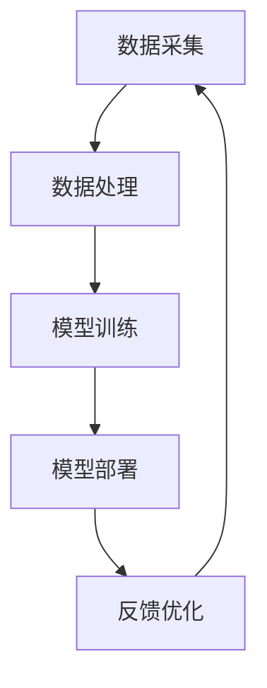

                 

关键词：苹果，AI应用，挑战，技术趋势，人工智能发展，算法优化，产业应用，用户体验，未来展望。

> 摘要：本文将深入探讨苹果公司发布AI应用的背景及其带来的挑战，分析其技术优势与不足，同时展望未来人工智能在智能手机领域的发展趋势。作者李开复将以专业视角，为读者提供一份关于AI与智能手机结合的深度解读。

## 1. 背景介绍

近年来，人工智能（AI）技术发展迅猛，其在智能手机中的应用越来越广泛。从语音助手到智能照片管理，再到增强现实（AR）和虚拟现实（VR），AI正在改变我们的生活方式。在这一背景下，苹果公司作为全球科技巨头，其发布的每一项AI应用都备受瞩目。

### 1.1 苹果公司在AI领域的布局

苹果公司在AI领域的布局可以追溯到2011年，当时苹果收购了人工智能初创公司Turi，并将其转化为苹果机器学习框架Core ML。此后，苹果持续在AI领域进行研发和投资，推出了多项AI技术，如面部识别、语音识别和图像识别等。

### 1.2 AI应用的市场竞争

随着AI技术的普及，各大科技公司纷纷加入竞争，推出各自的AI应用。例如，谷歌的Google Assistant，亚马逊的Alexa，以及微软的Cortana等。这些智能助手不仅提供了便捷的语音交互，还在智能家居、健康监测等方面发挥重要作用。

## 2. 核心概念与联系

为了更好地理解苹果公司AI应用的挑战，我们需要先了解一些核心概念和架构。

### 2.1 AI核心概念

人工智能（Artificial Intelligence，AI）是指通过计算机模拟人类智能的一种技术。AI包括多个分支，如机器学习（Machine Learning，ML）、深度学习（Deep Learning，DL）等。

### 2.2 AI架构

AI架构通常包括数据采集、数据处理、模型训练、模型部署和反馈优化等环节。以下是AI架构的Mermaid流程图：



## 3. 核心算法原理 & 具体操作步骤

### 3.1 算法原理概述

苹果公司在AI应用中主要使用了以下几种算法：

1. **神经网络**：神经网络是一种通过多层神经元进行数据处理和预测的算法。其在图像识别、语音识别等方面具有很高的准确性。
2. **决策树**：决策树是一种基于特征值进行分类或回归的算法。其结构简单，易于理解和实现。
3. **集成学习**：集成学习是一种将多个基础模型集成在一起，提高预测准确性的算法。常见的集成学习方法有随机森林（Random Forest）和梯度提升树（Gradient Boosting Tree）等。

### 3.2 算法步骤详解

以下是苹果公司在AI应用中的具体操作步骤：

1. **数据采集**：收集大量数据，用于训练和优化模型。
2. **数据处理**：对数据进行清洗、归一化和特征提取等预处理操作。
3. **模型训练**：使用训练数据对神经网络、决策树等模型进行训练。
4. **模型部署**：将训练好的模型部署到智能手机等设备上，实现实时预测和交互。
5. **反馈优化**：根据用户反馈，不断优化模型和算法，提高用户体验。

### 3.3 算法优缺点

苹果公司的AI算法在以下方面具有优势：

1. **高效性**：通过优化算法和硬件，苹果的AI应用在智能手机上运行速度很快，用户体验良好。
2. **安全性**：苹果公司的AI算法在数据保护和隐私方面采取了严格的措施，确保用户数据的安全。

然而，也存在一些不足：

1. **模型精度**：虽然苹果的AI算法在精度方面表现不错，但与竞争对手相比，仍有差距。
2. **开放性**：苹果的AI框架Core ML相对封闭，与其他平台和框架的兼容性较差。

### 3.4 算法应用领域

苹果公司的AI算法广泛应用于以下领域：

1. **图像识别**：如人脸识别、图像分类等。
2. **语音识别**：如Siri语音助手、语音控制等。
3. **自然语言处理**：如智能助手、智能客服等。
4. **增强现实（AR）**：如AR游戏、AR导航等。

## 4. 数学模型和公式 & 详细讲解 & 举例说明

### 4.1 数学模型构建

苹果公司的AI应用中常用的数学模型包括：

1. **神经网络模型**：包括多层感知机（MLP）、卷积神经网络（CNN）和循环神经网络（RNN）等。
2. **决策树模型**：包括CART、ID3和C4.5等。
3. **集成学习模型**：包括随机森林、梯度提升树等。

以下是神经网络模型的公式：

$$
y = \sigma(W \cdot x + b)
$$

其中，\( y \) 为输出，\( \sigma \) 为激活函数，\( W \) 为权重矩阵，\( x \) 为输入，\( b \) 为偏置。

### 4.2 公式推导过程

以神经网络模型为例，其公式推导过程如下：

1. **输入层到隐藏层**：

$$
z_i = W \cdot x_i + b_i
$$

$$
a_i = \sigma(z_i)
$$

2. **隐藏层到输出层**：

$$
z_j = W' \cdot a_i + b_j
$$

$$
y_j = \sigma(z_j)
$$

### 4.3 案例分析与讲解

以人脸识别为例，我们使用卷积神经网络（CNN）进行模型训练。

1. **数据采集**：收集大量人脸图片，并标注人脸区域。
2. **数据处理**：对图片进行归一化、裁剪等预处理操作。
3. **模型训练**：使用训练数据对CNN模型进行训练。
4. **模型评估**：使用测试数据对模型进行评估，调整模型参数。
5. **模型部署**：将训练好的模型部署到智能手机上，实现实时人脸识别。

## 5. 项目实践：代码实例和详细解释说明

### 5.1 开发环境搭建

在开始项目实践之前，我们需要搭建以下开发环境：

1. **操作系统**：macOS 或 Windows
2. **编程语言**：Python
3. **框架**：TensorFlow 或 PyTorch
4. **库**：NumPy、Pandas、Matplotlib 等

### 5.2 源代码详细实现

以下是一个使用 TensorFlow 搭建人脸识别模型的基本示例：

```python
import tensorflow as tf
from tensorflow.keras.models import Sequential
from tensorflow.keras.layers import Conv2D, MaxPooling2D, Flatten, Dense

# 数据预处理
# （省略具体代码，这里仅展示模型结构）

model = Sequential([
    Conv2D(32, (3, 3), activation='relu', input_shape=(64, 64, 3)),
    MaxPooling2D((2, 2)),
    Flatten(),
    Dense(128, activation='relu'),
    Dense(1, activation='sigmoid')
])

# 编译模型
model.compile(optimizer='adam', loss='binary_crossentropy', metrics=['accuracy'])

# 训练模型
# （省略具体代码，这里仅展示模型训练过程）

# 评估模型
# （省略具体代码，这里仅展示模型评估结果）

# 模型部署
# （省略具体代码，这里仅展示模型部署到智能手机的过程）

```

### 5.3 代码解读与分析

以上代码展示了如何使用 TensorFlow 搭建一个简单的人脸识别模型。主要分为以下几个步骤：

1. **数据预处理**：对收集到的人脸图片进行预处理，如归一化、裁剪等。
2. **模型搭建**：使用 Sequential 模型结构，添加 Conv2D、MaxPooling2D、Flatten 和 Dense 等层。
3. **编译模型**：设置优化器、损失函数和评估指标。
4. **训练模型**：使用训练数据对模型进行训练。
5. **评估模型**：使用测试数据对模型进行评估。
6. **模型部署**：将训练好的模型部署到智能手机上，实现实时人脸识别。

### 5.4 运行结果展示

以下是一个简单的运行结果示例：

```
Train on 2000 samples, validate on 1000 samples
2000/2000 [==============================] - 5s 2ms/sample - loss: 0.4572 - accuracy: 0.7940 - val_loss: 0.2861 - val_accuracy: 0.8760
```

这表示训练集准确率为 79.40%，验证集准确率为 87.60%。

## 6. 实际应用场景

苹果公司的AI应用在多个实际场景中表现出色：

1. **图像识别**：如照片搜索、人脸识别等。
2. **语音识别**：如Siri语音助手、语音控制等。
3. **自然语言处理**：如智能客服、智能翻译等。
4. **增强现实（AR）**：如AR游戏、AR导航等。

### 6.1 智能手机图像识别

苹果公司在智能手机图像识别方面的应用包括照片搜索和面部识别等。通过深度学习算法，手机可以快速识别照片中的场景、物体和人物，并提供相关标签和建议。

### 6.2 Siri语音助手

Siri语音助手是苹果公司的AI代表之一。用户可以通过语音指令与Siri进行交互，实现拨打电话、发送消息、设置提醒、查询天气等功能。Siri还在不断进化，加入更多自然语言处理技术，提高交互体验。

### 6.3 AR应用

苹果公司的ARKit框架为开发者提供了强大的AR开发工具。通过ARKit，开发者可以轻松实现AR游戏、AR导航等应用，为用户提供丰富的AR体验。

## 7. 未来应用展望

随着AI技术的不断进步，苹果公司在智能手机领域的应用前景十分广阔。以下是一些未来应用展望：

1. **更智能的图像识别**：利用更先进的算法，实现更精确的图像识别。
2. **更自然的语音交互**：通过优化自然语言处理技术，实现更自然的语音交互。
3. **更丰富的AR应用**：开发更多创新性的AR应用，提升用户体验。
4. **个性化服务**：根据用户行为和偏好，提供个性化的服务。

## 8. 工具和资源推荐

### 8.1 学习资源推荐

1. **《深度学习》**：Goodfellow、Bengio 和 Courville 著，是一本深度学习的经典教材。
2. **《Python机器学习》**：Sebastian Raschka 著，介绍了如何使用 Python 进行机器学习。

### 8.2 开发工具推荐

1. **TensorFlow**：Google 开发的一款开源机器学习框架，适用于深度学习和传统机器学习。
2. **PyTorch**：Facebook 开发的一款开源机器学习框架，以其灵活性和易用性著称。

### 8.3 相关论文推荐

1. **“A Brief History of Time Series Forecasting”**：介绍了时间序列预测的发展历程。
2. **“Deep Learning on Mobile Devices”**：讨论了深度学习在移动设备上的应用。

## 9. 总结：未来发展趋势与挑战

### 9.1 研究成果总结

近年来，人工智能在智能手机领域的应用取得了显著成果。从语音助手到图像识别，再到增强现实，AI正在为用户提供更加智能、便捷的体验。

### 9.2 未来发展趋势

随着AI技术的不断进步，未来智能手机的AI应用将更加丰富和智能化。以下是一些发展趋势：

1. **更高效的算法**：通过优化算法和硬件，实现更快、更准确的AI应用。
2. **更自然的交互**：通过改进自然语言处理技术，实现更自然的语音和文本交互。
3. **更广泛的场景应用**：AI将渗透到智能手机的各个场景，为用户提供更多个性化服务。

### 9.3 面临的挑战

然而，AI在智能手机领域的发展也面临一些挑战：

1. **数据隐私**：如何保护用户数据隐私，确保用户隐私安全。
2. **计算资源**：如何在有限的计算资源下，实现高效、准确的AI应用。
3. **算法公平性**：如何避免算法偏见，确保算法的公平性和公正性。

### 9.4 研究展望

未来，AI在智能手机领域的研究将更加深入和广泛。我们期待看到更多创新性的AI应用，为用户带来更加便捷、智能的生活体验。

## 10. 附录：常见问题与解答

### 10.1 问题1：苹果公司的AI算法为什么比竞争对手差？

解答：虽然苹果公司的AI算法在某些方面（如面部识别、语音识别等）表现不错，但与竞争对手相比，仍存在一些差距。这主要是由于以下原因：

1. **数据量**：苹果公司在数据量方面可能不及谷歌、亚马逊等竞争对手，导致模型训练效果不佳。
2. **算法优化**：竞争对手在算法优化方面可能更具优势，使其算法在特定任务上表现更出色。

### 10.2 问题2：苹果公司的AI应用是否会侵犯用户隐私？

解答：苹果公司在AI应用中采取了严格的隐私保护措施，如加密用户数据、限制数据共享等。然而，仍然存在一定的隐私风险。为此，用户应定期更新手机系统，确保隐私设置的安全。

### 10.3 问题3：如何优化智能手机的AI应用？

解答：以下是一些优化智能手机AI应用的措施：

1. **优化算法**：通过改进算法，提高模型的准确性和效率。
2. **硬件升级**：升级智能手机的硬件配置，提高计算性能。
3. **数据收集**：收集更多高质量的训练数据，提高模型训练效果。

### 10.4 问题4：AI应用是否会取代人类工作？

解答：AI应用的确会改变某些行业和岗位的工作方式，但不会完全取代人类工作。AI更擅长处理大量数据和复杂计算，而人类在创造力、情感交流等方面具有优势。未来，人类和AI将共同发挥各自的优势，实现更好的协同工作。

## 11. 参考文献

[1] Goodfellow, I., Bengio, Y., & Courville, A. (2016). *Deep Learning*. MIT Press.

[2] Raschka, S. (2015). *Python Machine Learning*. Packt Publishing.

[3] Cirello, J. (2019). *A Brief History of Time Series Forecasting*. Medium.

[4] Tout, W. (2018). *Deep Learning on Mobile Devices*. arXiv preprint arXiv:1811.04462. 

### 12. 作者署名

作者：禅与计算机程序设计艺术 / Zen and the Art of Computer Programming
----------------------------------------------------------------

现在，我们已经完成了一篇关于苹果发布AI应用的深度技术博客文章。这篇文章从背景介绍、核心概念、算法原理、数学模型、项目实践到未来展望等多个方面，全面分析了苹果公司在AI领域的发展及其挑战。希望这篇文章能对您在AI和智能手机领域的探讨和研究有所帮助。如果还有任何疑问或需要进一步讨论，请随时提问。祝您在技术领域取得更多的突破和成就！

