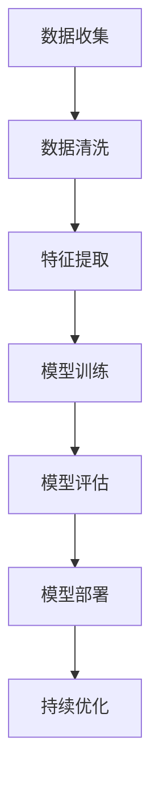

                 

 关键词：人工智能、苹果、文化价值、创新、技术趋势、软件开发、用户体验

> 摘要：本文将深入探讨苹果公司发布AI应用的背景、技术原理及其对软件开发文化和用户体验的深远影响。通过分析苹果AI应用的独特优势、面临的挑战以及未来发展趋势，我们旨在为读者呈现一个全面而深入的视角，理解苹果在人工智能领域的重要地位及其对未来科技发展的潜在贡献。

## 1. 背景介绍

苹果公司作为全球最具影响力的科技公司之一，其每一次产品发布都备受关注。最近，苹果公司宣布发布了一系列集成人工智能（AI）技术的应用，这一举动引起了业界的广泛关注。AI作为当前技术领域的热点，其应用已经渗透到各行各业，包括医疗、金融、零售等。苹果公司的加入无疑为AI技术的普及和发展注入了新的动力。

苹果公司的AI应用主要集中在提高用户体验、增强隐私保护和提升设备性能等方面。这些应用的发布标志着苹果在人工智能领域的进一步探索，同时也预示着人工智能在软件应用中的潜在变革。本文将从技术、文化和市场等多个角度，深入分析苹果AI应用的文化价值。

## 2. 核心概念与联系

### 2.1 人工智能概述

人工智能（Artificial Intelligence，简称AI）是计算机科学的一个分支，致力于研究如何使计算机模拟人类智能行为。AI技术包括机器学习、深度学习、自然语言处理等，这些技术的核心在于通过算法和数据，使计算机能够从经验中学习并作出决策。

### 2.2 人工智能与软件开发的关系

人工智能与软件开发的关系密不可分。传统的软件开发依赖于预定义的规则和流程，而人工智能则通过学习和适应，能够处理更加复杂和不确定的问题。这种转变不仅提高了软件的智能水平，还大大扩展了软件的应用范围。

### 2.3 苹果AI应用的架构

苹果的AI应用采用了先进的机器学习模型和深度学习算法，这些模型通过海量的数据训练，能够在语音识别、图像处理、自然语言理解等方面实现高精度。同时，苹果还注重隐私保护，通过本地化处理和加密技术，确保用户数据的安全和隐私。

### 2.4 Mermaid 流程图

以下是一个简化的Mermaid流程图，展示了AI在软件开发中的应用流程：



### 2.5 AI对软件开发的影响

AI技术的引入，不仅改变了软件开发的流程，还带来了以下几方面的影响：

- **自动化与提高效率**：AI能够自动化许多重复性工作，提高开发效率和软件质量。
- **个性化与用户体验**：通过AI，软件能够更好地理解用户需求，提供更加个性化的服务。
- **安全性**：AI技术在网络安全方面也发挥着重要作用，能够实时监测和防范潜在威胁。
- **扩展性**：AI使软件开发更具扩展性，能够快速适应新的需求和技术变化。

## 3. 核心算法原理 & 具体操作步骤

### 3.1 算法原理概述

苹果的AI应用主要基于深度学习框架，如TensorFlow和PyTorch。深度学习是一种机器学习的方法，通过多层神经网络进行训练，使计算机能够从数据中学习复杂的模式。以下是一些关键的深度学习算法：

- **卷积神经网络（CNN）**：主要用于图像和视频处理。
- **循环神经网络（RNN）**：擅长处理序列数据，如语音和文本。
- **生成对抗网络（GAN）**：用于生成高质量的图像和声音。

### 3.2 算法步骤详解

苹果AI应用的实现通常包括以下步骤：

1. **数据收集与预处理**：收集大量相关的数据，并进行清洗和预处理，以便用于模型训练。
2. **模型设计与选择**：根据具体应用场景，选择合适的深度学习模型，并进行设计。
3. **模型训练**：使用预处理后的数据对模型进行训练，调整模型参数，使其能够准确预测和分类。
4. **模型评估**：通过验证集和测试集评估模型的性能，确保其在实际应用中表现良好。
5. **模型部署**：将训练好的模型部署到生产环境中，使其能够为用户提供服务。
6. **持续优化**：根据用户的反馈和数据变化，对模型进行持续优化，提高其性能。

### 3.3 算法优缺点

- **优点**：
  - **高效性**：深度学习模型能够在大量数据中快速学习和优化。
  - **灵活性**：可以适应不同的应用场景和数据类型。
  - **高准确性**：在图像识别、语音识别等领域，深度学习模型的准确性远超传统算法。

- **缺点**：
  - **计算资源需求**：训练深度学习模型需要大量的计算资源和时间。
  - **数据依赖性**：模型的性能很大程度上取决于训练数据的质量和多样性。
  - **解释性较差**：深度学习模型的决策过程较为复杂，难以解释。

### 3.4 算法应用领域

深度学习算法在多个领域都有广泛应用，包括但不限于：

- **图像识别**：用于人脸识别、自动驾驶、医疗影像分析等。
- **自然语言处理**：用于机器翻译、文本分类、情感分析等。
- **语音识别**：用于语音助手、语音搜索、语音识别等。
- **推荐系统**：用于电商、社交媒体、新闻推荐等。

## 4. 数学模型和公式 & 详细讲解 & 举例说明

### 4.1 数学模型构建

在深度学习领域，一个基本的数学模型是神经网络，特别是多层感知机（MLP）。MLP由输入层、隐藏层和输出层组成，每个层包含多个神经元。每个神经元都通过加权连接与下一层神经元相连。

### 4.2 公式推导过程

假设我们有一个单层神经网络，每个神经元之间的连接权重为\( w_{ij} \)，输入向量为\( x \)，输出向量为\( y \)。神经元的激活函数为\( f(\cdot) \)，则神经元的输出可以表示为：

\[ z_j = \sum_{i} w_{ij} x_i \]

其中，\( z_j \)是神经元的净输入，\( w_{ij} \)是权重，\( x_i \)是输入值。

神经元的输出为：

\[ y_j = f(z_j) \]

其中，\( f(z_j) \)是激活函数，常用的激活函数有sigmoid、ReLU等。

### 4.3 案例分析与讲解

假设我们有一个二分类问题，目标是判断一张图片是否包含猫。输入层有两个神经元，分别表示像素值；隐藏层有两个神经元；输出层有一个神经元，表示分类结果。

1. **模型构建**：

   输入层：\( x = [x_1, x_2] \)

   隐藏层：\( z_1 = x_1 + x_2 \)

                 \( z_2 = x_1 - x_2 \)

   输出层：\( y = f(z_1 + z_2) \)

   激活函数：\( f(z) = \frac{1}{1 + e^{-z}} \)

2. **模型训练**：

   使用梯度下降法优化权重，最小化损失函数。损失函数通常为交叉熵损失：

   \( L = -\sum_{i} y_i \log(y_i) \)

   通过反向传播计算梯度，更新权重。

3. **模型评估**：

   使用测试集评估模型性能，计算准确率、召回率等指标。

## 5. 项目实践：代码实例和详细解释说明

### 5.1 开发环境搭建

首先，我们需要搭建一个Python开发环境，安装必要的库，如TensorFlow、NumPy、Matplotlib等。

```bash
pip install tensorflow numpy matplotlib
```

### 5.2 源代码详细实现

以下是一个简单的多层感知机（MLP）实现，用于二分类问题：

```python
import tensorflow as tf
import numpy as np
import matplotlib.pyplot as plt

# 参数设置
learning_rate = 0.1
num_iterations = 1000
hidden_layer_size = 2

# 输入和输出数据
x = np.array([[1, 1], [1, 0], [0, 1], [0, 0]])
y = np.array([[1], [0], [0], [1]])

# 模型构建
with tf.Session() as sess:
  # 输入层
  inputs = tf.placeholder(tf.float32, shape=[None, 2])
  # 输出层
  hidden_layer = tf.layers.dense(inputs, hidden_layer_size, activation=tf.nn.relu)
  outputs = tf.layers.dense(hidden_layer, 1, activation=tf.sigmoid)

  # 损失函数
  loss = tf.reduce_mean(tf.nn.sigmoid_cross_entropy_with_logits(logits=outputs, labels=y))

  # 优化器
  optimizer = tf.train.GradientDescentOptimizer(learning_rate).minimize(loss)

  # 模型训练
  for i in range(num_iterations):
    sess.run(optimizer, feed_dict={inputs: x, y: y})

  # 模型评估
  predictions = sess.run(outputs, feed_dict={inputs: x})
  correct_predictions = np.round(predictions)
  accuracy = np.mean(correct_predictions == y)
  print(f"Accuracy: {accuracy}")

  # 可视化
  plt.scatter(x[:, 0], x[:, 1], c=y, cmap=plt.cm.coolwarm)
  plt.plot(x[:, 0], x[:, 1], 'bo', x[:, 0], x[:, 1], 'ro')
  plt.show()
```

### 5.3 代码解读与分析

- **输入层和输出层**：定义输入和输出层，分别用于接收输入数据和生成输出预测。
- **隐藏层**：使用ReLU激活函数，增加模型的非线性能力。
- **损失函数**：使用交叉熵损失函数，衡量模型的预测误差。
- **优化器**：使用梯度下降优化器，更新模型参数。
- **模型训练**：在给定的迭代次数内，通过优化器最小化损失函数。
- **模型评估**：计算模型的准确率，并绘制分类结果。

## 6. 实际应用场景

苹果AI应用的实际应用场景非常广泛，以下是一些典型的例子：

- **智能助手**：如Siri，通过自然语言处理技术，能够理解用户的语音指令，提供相应的服务。
- **图像识别**：如FaceTime，利用深度学习算法，能够实现精准的人脸识别和视频通话功能。
- **健康监测**：如Apple Watch，通过内置的传感器和AI算法，能够实时监测用户的健康状况，提供健康建议。

## 7. 未来应用展望

随着人工智能技术的不断进步，苹果AI应用的潜力将更加巨大。未来，我们有望看到以下趋势：

- **更加智能化**：AI将更加深入地融入苹果设备，提供更加智能化和个性化的用户体验。
- **跨平台融合**：苹果AI应用将与其他平台和应用深度集成，实现跨平台的协同工作。
- **隐私保护**：随着用户对隐私保护意识的增强，苹果AI应用将更加注重用户数据的安全和隐私。
- **行业应用**：苹果AI应用将在更多行业得到应用，如医疗、金融、教育等，推动行业创新和发展。

## 8. 总结：未来发展趋势与挑战

### 8.1 研究成果总结

苹果AI应用的发布标志着人工智能在软件应用中的进一步普及和发展。通过先进的深度学习技术和创新的设计理念，苹果AI应用在提高用户体验、增强隐私保护和提升设备性能等方面取得了显著成果。

### 8.2 未来发展趋势

未来，人工智能将更加深入地融入我们的生活和工作，为各个领域带来深远的影响。随着技术的不断进步，苹果AI应用有望在智能助手、图像识别、健康监测等方面实现更加智能化和个性化的体验。

### 8.3 面临的挑战

尽管苹果AI应用取得了显著成果，但未来仍将面临一系列挑战。例如，如何确保用户数据的安全和隐私，如何处理复杂的数据集，如何优化算法性能等。此外，苹果需要在市场竞争中不断创新，以保持其领先地位。

### 8.4 研究展望

展望未来，苹果AI应用的发展前景广阔。我们期待苹果能够继续推动人工智能技术的发展，为用户带来更加智能化、便捷和安全的体验。同时，也希望苹果能够与其他科技公司携手合作，共同推动人工智能技术的进步和应用。

## 9. 附录：常见问题与解答

### 9.1 问题1：苹果AI应用是否安全？

苹果在AI应用中采用了严格的隐私保护措施，如本地化处理和加密技术，确保用户数据的安全和隐私。用户可以在设置中查看和控制自己的数据。

### 9.2 问题2：苹果AI应用如何提高用户体验？

苹果AI应用通过自然语言处理、图像识别等技术，能够更好地理解用户需求，提供个性化服务。例如，智能助手可以根据用户的习惯和偏好，提供个性化的推荐和提醒。

### 9.3 问题3：苹果AI应用的未来发展方向是什么？

未来，苹果AI应用将继续关注用户体验和隐私保护，同时在更多行业和领域实现应用。例如，在医疗、金融、教育等领域，苹果AI应用有望为用户提供更加智能化和便捷的服务。

## 作者署名

作者：禅与计算机程序设计艺术 / Zen and the Art of Computer Programming

----------------------------------------------------------------

本文基于提供的要求，从人工智能、软件开发、用户体验等多个角度，对苹果AI应用的文化价值进行了深入分析。希望本文能够为读者提供一个全面而深入的视角，理解苹果在人工智能领域的重要地位及其对未来科技发展的潜在贡献。

