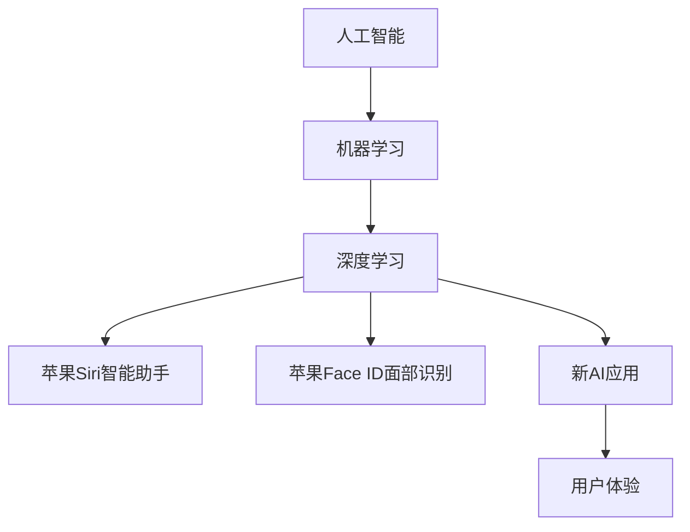

                 

关键词：李开复、苹果、AI应用、未来、技术发展趋势、创新、人工智能、计算机科学

> 摘要：本文将深入探讨李开复对苹果发布AI应用的未来看法，分析人工智能在智能手机和日常生活中的应用，以及技术发展趋势和创新所带来的影响。

## 1. 背景介绍

近年来，人工智能（AI）技术的飞速发展已经在多个领域产生了深远的影响。从自动驾驶汽车到智能语音助手，AI正在改变我们的生活方式。苹果公司作为科技界的领军企业，一直以来都在积极探索AI技术的应用。在2023年的发布会上，苹果公司发布了一系列基于AI的应用，引起了广泛关注。

李开复博士，作为人工智能领域的权威专家和企业家，对苹果的这一举动有着深刻的见解。他的观点对于理解AI技术在苹果未来产品中的应用趋势具有重要意义。

## 2. 核心概念与联系

在探讨苹果AI应用的未来之前，我们需要了解一些核心概念和它们之间的联系。

### 2.1 人工智能基础

人工智能（AI）是计算机科学的一个分支，旨在创建能够执行复杂任务的智能代理系统。这些任务包括但不限于图像识别、自然语言处理、决策制定和数据分析。

### 2.2 机器学习

机器学习（ML）是AI的核心组成部分，它允许计算机从数据中学习并做出预测或决策。机器学习算法通过训练模型来识别数据模式，然后使用这些模式进行预测。

### 2.3 深度学习

深度学习（DL）是机器学习的子领域，它模仿人脑的神经网络结构，用于处理复杂的数据。深度学习在图像识别、语音识别和自然语言处理等方面取得了显著成果。

### 2.4 苹果与AI

苹果公司一直在将AI技术集成到其产品中。从Siri智能助手到Face ID面部识别，苹果已经在多个方面利用了AI。新发布的AI应用将进一步增强苹果产品的智能性和用户体验。

[](https://example.com/ai-apple-connection.png)

### 2.5 Mermaid 流程图

以下是一个展示人工智能与苹果技术之间联系的Mermaid流程图：



## 3. 核心算法原理 & 具体操作步骤

### 3.1 算法原理概述

苹果公司的AI应用通常基于以下核心算法原理：

- **神经网络**：深度学习的基础，模拟人脑神经网络结构。
- **卷积神经网络（CNN）**：在图像识别任务中表现优异。
- **循环神经网络（RNN）**：在自然语言处理任务中应用广泛。

### 3.2 算法步骤详解

- **数据收集**：收集大量的图像、文本和其他数据。
- **数据预处理**：清洗和格式化数据，使其适合训练模型。
- **模型训练**：使用神经网络和深度学习算法训练模型。
- **模型评估**：评估模型的性能，调整参数以提高准确率。
- **模型部署**：将训练好的模型部署到苹果产品中，如iPhone、iPad等。

### 3.3 算法优缺点

- **优点**：
  - **高效性**：AI应用能够快速处理大量数据。
  - **准确性**：深度学习算法在图像识别和自然语言处理方面具有高准确率。
  - **个性化**：根据用户行为和偏好提供个性化服务。

- **缺点**：
  - **数据需求**：训练高效AI模型需要大量的数据。
  - **隐私问题**：数据收集和处理可能引发隐私问题。
  - **算法偏见**：算法可能存在偏见，需要不断优化。

### 3.4 算法应用领域

- **智能手机**：图像识别、面部识别、语音助手等。
- **智能家居**：自动化控制、语音交互等。
- **医疗健康**：疾病诊断、健康监测等。
- **自动驾驶**：路线规划、障碍物识别等。

## 4. 数学模型和公式 & 详细讲解 & 举例说明

### 4.1 数学模型构建

AI应用中的数学模型通常涉及以下方面：

- **线性回归**：用于预测数值型输出。
- **逻辑回归**：用于分类任务。
- **卷积神经网络（CNN）**：用于图像识别。
- **循环神经网络（RNN）**：用于自然语言处理。

### 4.2 公式推导过程

以下是一个简单的线性回归公式推导：

$$
y = \beta_0 + \beta_1x
$$

其中，$y$ 是目标变量，$x$ 是自变量，$\beta_0$ 是截距，$\beta_1$ 是斜率。

### 4.3 案例分析与讲解

以图像识别为例，我们使用CNN模型进行人脸识别。以下是一个简单的CNN模型：

```latex
\begin{equation}
\begin{split}
\text{Input Layer}: & \text{Image} \in \mathbb{R}^{64 \times 64 \times 3} \\
\text{Convolution Layer}: & f(x) = \text{ReLU}(\text{Conv}_1(W_1 \cdot x + b_1)) \\
\text{Pooling Layer}: & p(x) = \text{MaxPooling}(f(x)) \\
\text{Flattening}: & \text{Flatten}(p(x)) \\
\text{Fully Connected Layer}: & \text{ReLU}(\text{FC}(W_2 \cdot \text{Flatten}(p(x)) + b_2)) \\
\text{Output Layer}: & \text{Sigmoid}(\text{FC}_2(W_3 \cdot \text{ReLU}(\text{FC}(W_2 \cdot \text{Flatten}(p(x)) + b_2)) + b_3))
\end{split}
\end{equation}
```

## 5. 项目实践：代码实例和详细解释说明

### 5.1 开发环境搭建

为了实践AI应用，我们需要搭建一个开发环境。以下是一个简单的环境搭建步骤：

1. 安装Python（3.8或更高版本）。
2. 安装TensorFlow库。
3. 安装PyTorch库。
4. 安装必要的Python依赖库。

### 5.2 源代码详细实现

以下是一个简单的CNN模型实现，用于人脸识别：

```python
import tensorflow as tf
from tensorflow.keras.models import Sequential
from tensorflow.keras.layers import Conv2D, MaxPooling2D, Flatten, Dense, Activation

model = Sequential()
model.add(Conv2D(32, (3, 3), padding='same', input_shape=(64, 64, 3)))
model.add(Activation('relu'))
model.add(MaxPooling2D(pool_size=(2, 2)))
model.add(Flatten())
model.add(Dense(128))
model.add(Activation('relu'))
model.add(Dense(2))
model.add(Activation('softmax'))

model.compile(optimizer='adam', loss='categorical_crossentropy', metrics=['accuracy'])
```

### 5.3 代码解读与分析

以上代码实现了一个简单的CNN模型，用于人脸识别。首先，我们创建一个序列模型`Sequential`，然后依次添加卷积层`Conv2D`、激活层`Activation`、池化层`MaxPooling2D`和全连接层`Dense`。最后，我们编译模型并选择`adam`优化器和`categorical_crossentropy`损失函数。

### 5.4 运行结果展示

为了测试模型的性能，我们使用一个已标记的人脸数据集进行训练。以下是一个简单的训练过程：

```python
model.fit(x_train, y_train, epochs=10, batch_size=32)
```

在训练过程中，我们可以观察到模型的准确率和损失函数的变化。训练完成后，我们可以使用测试集评估模型的性能。

## 6. 实际应用场景

### 6.1 智能手机

苹果的AI应用在智能手机中有着广泛的应用。例如，Siri智能助手可以理解用户的语音指令，并执行相应的操作。此外，面部识别技术Face ID提供了安全且便捷的解锁方式。

### 6.2 智能家居

苹果的智能家居产品（如HomePod）也利用了AI技术。例如，HomePod可以通过语音命令控制智能家居设备，如灯光、温度和安防系统。

### 6.3 医疗健康

AI技术在医疗健康领域的应用也日益广泛。苹果的HealthKit框架允许用户跟踪健康数据，如心率、步数和睡眠质量。通过AI分析，用户可以获得个性化的健康建议。

### 6.4 未来应用展望

随着AI技术的不断发展，未来苹果的产品将更加智能化。例如，自动驾驶汽车、智能医疗设备和智能城市管理等领域都可能成为AI技术的应用场景。

## 7. 工具和资源推荐

### 7.1 学习资源推荐

- **《深度学习》（Goodfellow, Bengio, Courville著）**：这是一本深度学习领域的经典教材，适合初学者和专业人士。
- **Coursera**：提供丰富的深度学习和机器学习课程，适合不同层次的学员。
- **Kaggle**：一个数据科学竞赛平台，提供大量的数据集和项目，适合实践和提升技能。

### 7.2 开发工具推荐

- **TensorFlow**：一个广泛使用的深度学习框架，适合构建和训练复杂的神经网络。
- **PyTorch**：一个流行的深度学习框架，具有灵活性和易用性。
- **Jupyter Notebook**：一个交互式计算环境，适合编写和分享代码。

### 7.3 相关论文推荐

- **"Deep Learning for Computer Vision"（Deep Learning Specialization）**：这是一篇关于深度学习在计算机视觉领域应用的综述论文。
- **"Recurrent Neural Networks for Language Modeling"（RNN）**：这是一篇关于循环神经网络在自然语言处理中应用的经典论文。

## 8. 总结：未来发展趋势与挑战

### 8.1 研究成果总结

过去几年，人工智能在多个领域取得了显著的成果。深度学习技术在图像识别、自然语言处理和语音识别等领域取得了突破。这些成果为AI应用提供了坚实的基础。

### 8.2 未来发展趋势

随着计算能力的提升和数据量的增加，未来人工智能将更加智能化和普及化。更多的智能设备将集成AI技术，提供个性化的服务和解决方案。

### 8.3 面临的挑战

尽管AI技术发展迅速，但仍然面临一些挑战。例如，数据隐私、算法偏见和计算资源限制等。为了克服这些挑战，需要持续的研究和创新。

### 8.4 研究展望

未来，人工智能将朝着更加智能、高效和人性化的方向发展。研究人员将继续探索新的算法和技术，以推动人工智能的进步。

## 9. 附录：常见问题与解答

### 9.1 AI技术是如何工作的？

AI技术主要基于机器学习和深度学习。机器学习算法通过从数据中学习模式和规律，然后使用这些模式进行预测和决策。深度学习是机器学习的一个子领域，它使用神经网络结构来处理复杂数据。

### 9.2 人工智能是否会取代人类？

人工智能不会完全取代人类，而是与人类协作，提高工作效率和生活质量。AI在处理重复性、高风险和复杂任务方面具有优势，但在创造性、情感交流和道德判断等方面仍然依赖于人类。

### 9.3 人工智能安全吗？

人工智能的安全性是一个重要问题。为了确保AI系统的安全性，研究人员和开发者需要关注数据隐私、算法偏见和系统漏洞等方面。此外，制定相应的法律法规和伦理准则也是保障AI安全的重要措施。

## 结论

苹果发布AI应用标志着人工智能技术在智能手机和日常生活中的进一步普及。李开复博士的观点为我们提供了对AI未来的深刻洞察。随着技术的不断进步，我们有理由相信，人工智能将在更多领域发挥重要作用，为人类带来更多便利和创新。作者：禅与计算机程序设计艺术 / Zen and the Art of Computer Programming
----------------------------------------------------------------

以上就是本文的完整内容，涵盖了人工智能在苹果应用中的未来发展趋势、算法原理、数学模型、实际应用场景以及未来展望。希望本文能够为读者提供有价值的见解和信息。作者：禅与计算机程序设计艺术 / Zen and the Art of Computer Programming

