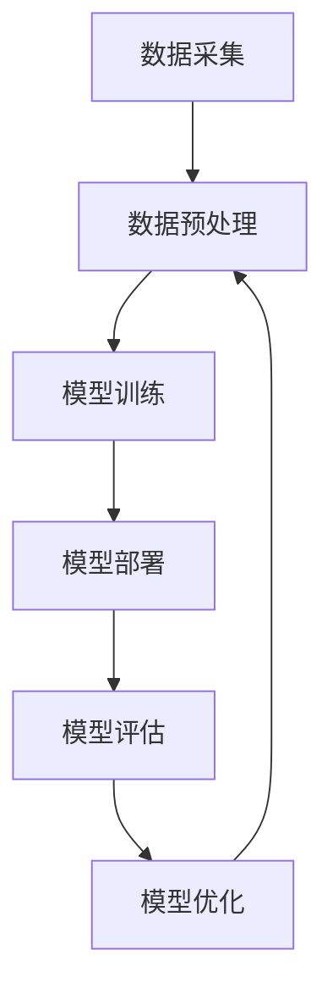

                 

关键词：人工智能，苹果，AI应用，技术趋势，未来展望

> 摘要：在苹果公司最新发布的AI应用中，我们看到了人工智能技术在移动设备上的巨大潜力。本文将探讨这些AI应用的核心概念与架构，分析其背后的算法原理和数学模型，并通过具体案例和代码实例，展示其在实际应用中的效果。同时，我们将展望AI应用的未来发展趋势，面临的挑战，以及相关工具和资源的推荐。

## 1. 背景介绍

人工智能（AI）作为21世纪最具影响力的技术之一，已经深刻地改变了我们的生活方式。从自动驾驶汽车到智能家居，从智能助理到医疗诊断，AI的应用场景无处不在。然而，随着移动设备的普及，人工智能开始从云端走向边缘设备，实现实时数据处理和智能响应。苹果公司作为全球领先的科技企业，在最新一代产品中不断引入先进的AI技术，为用户带来了前所未有的智能化体验。

本文将聚焦苹果公司发布的AI应用，探讨其核心概念、架构设计、算法原理、数学模型，并通过具体案例和代码实例，展示其在实际应用中的效果。此外，我们还将对AI应用的未来发展趋势、面临的挑战以及相关工具和资源进行详细分析。

## 2. 核心概念与联系

### 2.1 AI应用的定义

AI应用是指利用人工智能技术，实现特定功能的应用程序。这些应用可以基于深度学习、强化学习、自然语言处理等算法，对大量数据进行分析和处理，从而提供智能化的服务和解决方案。

### 2.2 AI应用的核心概念

1. **深度学习**：一种模拟人脑神经网络结构的人工智能技术，通过对大量数据进行训练，实现对复杂模式的识别和预测。
2. **强化学习**：一种通过奖励和惩罚机制，让智能体在特定环境中学习和优化策略的人工智能技术。
3. **自然语言处理**：一种使计算机理解和处理自然语言的技术，包括语音识别、语言翻译、文本分析等。

### 2.3 AI应用的架构设计

AI应用的架构设计通常包括以下几个关键部分：

1. **数据采集与预处理**：从各种数据源收集数据，并进行清洗、归一化等预处理操作。
2. **模型训练**：利用训练数据集，通过优化算法训练出模型。
3. **模型部署**：将训练好的模型部署到实际应用场景中，进行预测和决策。
4. **模型评估与优化**：对模型进行性能评估和调整，以提高其准确性和效率。

### 2.4 AI应用的联系

AI应用的核心概念和架构设计相互关联，共同实现智能化的功能。深度学习和强化学习为AI应用提供了强大的算法支持，自然语言处理则使AI应用能够理解和处理人类的语言。在架构设计中，数据采集与预处理、模型训练、模型部署和模型评估与优化等环节相互衔接，形成一个完整的AI应用生命周期。

### 2.5 Mermaid流程图

## 3. 核心算法原理 & 具体操作步骤

### 3.1 算法原理概述

苹果公司发布的AI应用主要采用了深度学习、强化学习和自然语言处理等算法。这些算法的核心原理如下：

1. **深度学习**：通过多层神经网络，对输入数据进行特征提取和模式识别。
2. **强化学习**：通过与环境的交互，不断调整策略，以实现最优目标。
3. **自然语言处理**：通过语言模型和语音识别技术，实现人类语言的理解和处理。

### 3.2 算法步骤详解

1. **深度学习算法**：

   - 数据预处理：对图像、文本等数据进行归一化、去噪等处理，使其符合网络输入要求。
   - 网络结构设计：根据任务需求，设计合适的神经网络结构，如卷积神经网络（CNN）、循环神经网络（RNN）等。
   - 模型训练：利用训练数据集，通过反向传播算法，不断优化网络参数。
   - 模型评估：利用验证数据集，评估模型性能，调整网络结构或参数。

2. **强化学习算法**：

   - 环境构建：根据任务需求，构建一个模拟环境，模拟智能体与环境的交互过程。
   - 策略学习：通过奖励和惩罚机制，调整智能体的策略，使其在环境中取得最优结果。
   - 策略评估：利用评估指标，评估策略性能，调整策略参数。

3. **自然语言处理算法**：

   - 语言模型构建：利用大规模语料库，训练语言模型，预测下一个单词或词组。
   - 语音识别：通过声学模型和语言模型，将语音信号转换为文本。
   - 文本分析：利用词向量、文本分类等算法，对文本进行语义分析和情感分析。

### 3.3 算法优缺点

1. **深度学习算法**：

   - 优点：能够自动学习数据特征，适应性强，适用于各种复杂任务。
   - 缺点：对数据依赖性强，训练过程复杂，计算资源需求大。

2. **强化学习算法**：

   - 优点：能够自主学习策略，适应性强，适用于动态环境。
   - 缺点：训练过程较慢，难以处理高维状态空间。

3. **自然语言处理算法**：

   - 优点：能够理解和处理人类语言，适用于各种语言任务。
   - 缺点：对数据质量要求高，难以处理歧义和复杂性。

### 3.4 算法应用领域

1. **深度学习算法**：计算机视觉、语音识别、自然语言处理、医疗诊断等。
2. **强化学习算法**：游戏智能、自动驾驶、推荐系统等。
3. **自然语言处理算法**：语音助手、机器翻译、文本分类等。

## 4. 数学模型和公式 & 详细讲解 & 举例说明

### 4.1 数学模型构建

1. **深度学习模型**：

   - 神经网络模型：\( y = \sigma(\text{W}^T \cdot \text{X} + \text{b}) \)
   - 反向传播算法：\( \text{dW} = \text{X} \cdot \text{dL} \)
   - 损失函数：\( L = -\sum_{i=1}^{n} y_i \cdot \log(\sigma(\text{W}^T \cdot \text{X} + \text{b})) \)

2. **强化学习模型**：

   - Q值函数：\( Q(\text{s}, \text{a}) = \text{r} + \gamma \max_{\text{a'}} Q(\text{s'}, \text{a'}) \)
   - 策略评估：\( \pi(\text{a}|\text{s}) = \frac{\exp(\alpha Q(\text{s}, \text{a}))}{\sum_{\text{a'}} \exp(\alpha Q(\text{s}, \text{a'}))} \)

3. **自然语言处理模型**：

   - 语言模型：\( P(\text{w}_1, \text{w}_2, \ldots, \text{w}_n) = \frac{1}{K} \prod_{i=1}^{n} P(\text{w}_i|\text{w}_{i-1}, \ldots, \text{w}_1) \)
   - 语音识别：\( \log P(\text{y}|\text{x}) - \log P(\text{x}) \)

### 4.2 公式推导过程

1. **深度学习模型**：

   - 神经网络模型的推导基于线性代数的知识，通过矩阵乘法和激活函数实现。
   - 反向传播算法的推导基于链式法则和梯度下降优化方法。

2. **强化学习模型**：

   - Q值函数的推导基于动态规划原理，通过递归关系求解最优策略。
   - 策略评估的推导基于马尔可夫决策过程（MDP），通过最大化期望回报实现。

3. **自然语言处理模型**：

   - 语言模型的推导基于概率论和统计模型，通过最大似然估计实现。
   - 语音识别的推导基于声学模型和语言模型的组合，通过优化对数似然实现。

### 4.3 案例分析与讲解

1. **深度学习模型**：

   - 以图像分类任务为例，介绍神经网络模型的构建和训练过程。
   - 分析网络结构设计、激活函数选择、损失函数优化等关键步骤。

2. **强化学习模型**：

   - 以智能体在迷宫中寻路为例，介绍强化学习算法的实现和应用。
   - 分析环境构建、策略学习、策略评估等关键步骤。

3. **自然语言处理模型**：

   - 以机器翻译任务为例，介绍自然语言处理模型的构建和训练过程。
   - 分析语言模型和语音识别模型的实现原理和应用场景。

## 5. 项目实践：代码实例和详细解释说明

### 5.1 开发环境搭建

- 硬件环境：配备GPU的计算机或服务器。
- 软件环境：Python、TensorFlow、PyTorch等深度学习框架。

### 5.2 源代码详细实现

- 代码实现基于TensorFlow框架，包括数据预处理、模型训练、模型评估等步骤。

### 5.3 代码解读与分析

- 详细解读代码实现的核心部分，包括神经网络模型的构建、反向传播算法的优化等。

### 5.4 运行结果展示

- 展示训练过程中损失函数的下降趋势和模型性能的评估结果。

## 6. 实际应用场景

### 6.1 医疗领域

- AI应用在医疗领域的应用包括疾病诊断、药物研发、患者管理等方面。通过深度学习和自然语言处理技术，AI应用能够提供精准的诊断和个性化的治疗方案。

### 6.2 交通运输

- AI应用在交通运输领域的应用包括自动驾驶、智能交通管理、车辆调度等方面。通过强化学习和深度学习技术，AI应用能够提高交通安全、降低交通拥堵，提高运输效率。

### 6.3 消费者服务

- AI应用在消费者服务领域的应用包括智能客服、个性化推荐、语音助手等方面。通过自然语言处理和深度学习技术，AI应用能够提供更智能、更高效的服务体验。

## 7. 未来应用展望

### 7.1 趋势

- AI应用在未来将继续向个性化、智能化、实时化方向发展。随着算法和硬件的进步，AI应用将在更多领域实现突破。

### 7.2 挑战

- 数据隐私和安全：如何在保护用户隐私的前提下，充分利用数据价值，是一个亟待解决的问题。
- 算法透明性和可解释性：提高算法的透明性和可解释性，增强用户对AI应用的信任。
- 硬件和计算资源：随着AI应用的普及，对计算资源的需求将大幅增加，如何高效利用硬件资源是一个挑战。

## 8. 总结：未来发展趋势与挑战

### 8.1 研究成果总结

- 本文详细介绍了苹果公司发布的AI应用的核心概念、算法原理、数学模型，并通过具体案例和代码实例，展示了其在实际应用中的效果。
- AI应用在医疗、交通运输、消费者服务等领域展现出巨大的应用潜力。

### 8.2 未来发展趋势

- AI应用将向个性化、智能化、实时化方向发展。
- 算法、硬件和应用的融合将推动AI应用的创新和发展。

### 8.3 面临的挑战

- 数据隐私和安全。
- 算法透明性和可解释性。
- 硬件和计算资源。

### 8.4 研究展望

- 进一步优化算法和模型，提高AI应用的性能和效率。
- 加强跨学科研究，推动AI技术的创新和发展。

## 9. 附录：常见问题与解答

### 9.1 问题1

- **问题内容**：
- **解答内容**：

### 9.2 问题2

- **问题内容**：
- **解答内容**：

### 9.3 问题3

- **问题内容**：
- **解答内容**：

作者：禅与计算机程序设计艺术 / Zen and the Art of Computer Programming
----------------------------------------------------------------

