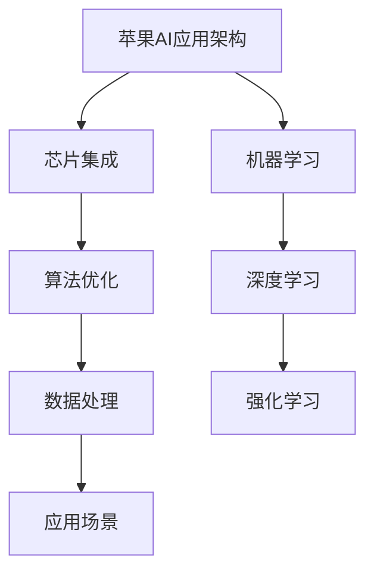

                 

关键词：苹果、AI应用、用户、李开复、人工智能、技术应用、用户体验、人工智能趋势

## 摘要

本文旨在探讨苹果公司发布AI应用的背后原因、AI技术的应用场景、用户体验以及人工智能在未来的发展趋势。通过分析苹果公司的AI战略和实际案例，结合人工智能领域的专家观点，我们试图揭示AI技术如何在日常生活中发挥重要作用，并展望其未来的发展方向。

## 1. 背景介绍

### 苹果公司的AI战略

近年来，苹果公司一直在积极推进人工智能技术的发展。从早期的Siri语音助手到最新的M1芯片，苹果在AI领域的布局日益完善。AI技术已经成为苹果产品创新的重要驱动力。苹果公司通过不断引入先进的AI技术，提升产品性能和用户体验，从而在竞争激烈的科技市场中保持领先地位。

### 人工智能的应用趋势

随着AI技术的快速发展，其在各个领域的应用场景日益丰富。从自动驾驶、智能家居到医疗健康、金融科技，AI技术正在深刻改变我们的生活方式。苹果公司作为全球领先的科技公司，其AI应用的发展趋势不仅影响自身产品的发展，也对整个行业产生重要影响。

### 李开复的观点

作为世界著名的人工智能专家，李开复对AI技术有着深刻的理解。他认为，人工智能将成为未来科技发展的核心驱动力，用户将成为AI技术的主要受益者。本文将结合李开复的观点，探讨苹果公司AI应用的潜在影响。

## 2. 核心概念与联系

### AI技术的核心概念

人工智能（AI）是指计算机模拟人类智能的过程。其主要目标是使计算机能够执行通常需要人类智能才能完成的任务，如视觉识别、语音识别、自然语言处理等。AI技术包括多种方法，如机器学习、深度学习、强化学习等。

### 苹果AI应用的架构

苹果公司在其产品中广泛应用了AI技术。以iPhone 13为例，其搭载的A15芯片集成了强大的AI引擎，支持多种AI任务。苹果的AI架构主要包括以下几个关键部分：

1. **芯片集成**：苹果自研的M系列芯片集成了AI加速器，可高效执行AI任务。
2. **算法优化**：苹果针对自家产品进行了大量的算法优化，以提升AI性能。
3. **数据处理**：苹果的AI应用能够高效处理用户数据，确保隐私和安全。
4. **应用场景**：苹果的AI应用覆盖了从图像识别、语音识别到自然语言处理等多个领域。

### Mermaid流程图



## 3. 核心算法原理 & 具体操作步骤

### 3.1 算法原理概述

苹果公司的AI应用主要基于以下几种算法原理：

1. **机器学习**：通过大量数据训练模型，使计算机具备自主学习和决策能力。
2. **深度学习**：基于多层神经网络，实现更复杂的特征提取和模式识别。
3. **强化学习**：通过与环境的交互，学习最优策略，以实现目标优化。

### 3.2 算法步骤详解

1. **数据采集**：收集用户使用数据，包括图像、语音、文本等。
2. **数据预处理**：对采集到的数据进行分析、清洗和标注，以便后续训练。
3. **模型训练**：使用机器学习算法训练模型，将输入数据映射到输出结果。
4. **模型优化**：通过迭代优化模型参数，提高模型性能。
5. **模型部署**：将训练好的模型部署到实际应用中，如图像识别、语音识别等。

### 3.3 算法优缺点

1. **优点**：
   - **高效性**：AI算法能够高效处理大量数据，提高工作效率。
   - **准确性**：深度学习算法在图像识别、语音识别等领域具有较高的准确性。
   - **灵活性**：机器学习算法能够根据数据变化自适应调整，适应不同场景。

2. **缺点**：
   - **数据依赖**：AI算法的性能高度依赖于数据质量，数据不足或质量差可能导致算法失效。
   - **隐私问题**：用户数据的安全和隐私保护是一个重要挑战。
   - **计算资源消耗**：深度学习算法需要大量的计算资源，对硬件要求较高。

### 3.4 算法应用领域

1. **图像识别**：如人脸识别、图像分类等。
2. **语音识别**：如语音助手、语音翻译等。
3. **自然语言处理**：如文本分类、情感分析、机器翻译等。
4. **自动驾驶**：如车辆识别、路径规划等。
5. **智能家居**：如智能音箱、智能门锁等。

## 4. 数学模型和公式 & 详细讲解 & 举例说明

### 4.1 数学模型构建

AI算法的核心是数学模型，以下是一些常见的数学模型：

1. **线性回归**：用于预测数值型目标变量。
2. **逻辑回归**：用于预测二元分类问题。
3. **神经网络**：用于处理复杂的非线性问题。
4. **卷积神经网络（CNN）**：用于图像识别。
5. **递归神经网络（RNN）**：用于序列数据。

### 4.2 公式推导过程

以线性回归为例，其公式推导如下：

1. **假设**：假设输入特征向量 \(X\) 与目标变量 \(Y\) 之间存在线性关系，即：
   $$Y = \beta_0 + \beta_1X + \epsilon$$
   其中，\(\beta_0\) 和 \(\beta_1\) 为模型参数，\(\epsilon\) 为误差项。

2. **目标函数**：最小化预测值与实际值之间的误差平方和，即：
   $$J(\beta_0, \beta_1) = \frac{1}{2}\sum_{i=1}^{n}(Y_i - (\beta_0 + \beta_1X_i))^2$$

3. **求解**：对目标函数求导并令其导数为零，求得最优参数：
   $$\frac{\partial J}{\partial \beta_0} = 0, \frac{\partial J}{\partial \beta_1} = 0$$
   解得：
   $$\beta_0 = \bar{Y} - \beta_1\bar{X}, \beta_1 = \frac{\sum_{i=1}^{n}(X_i - \bar{X})(Y_i - \bar{Y})}{\sum_{i=1}^{n}(X_i - \bar{X})^2}$$

### 4.3 案例分析与讲解

假设我们有一个房价预测问题，输入特征为房屋面积 \(X\)，目标变量为房价 \(Y\)。我们采用线性回归模型进行预测。

1. **数据采集**：收集一定数量的房屋数据，包括面积和房价。

2. **数据预处理**：对数据进行清洗和标准化处理，将面积和房价进行归一化。

3. **模型训练**：使用线性回归算法训练模型，得到最优参数。

4. **模型评估**：使用测试数据集评估模型性能，计算预测误差。

5. **模型应用**：将训练好的模型应用到实际场景，预测新房屋的房价。

## 5. 项目实践：代码实例和详细解释说明

### 5.1 开发环境搭建

为了实现线性回归模型，我们需要搭建一个Python开发环境。以下是具体步骤：

1. **安装Python**：从Python官网下载并安装Python 3.x版本。
2. **安装Jupyter Notebook**：安装Jupyter Notebook，以便于编写和运行代码。
3. **安装相关库**：安装NumPy、Pandas、Scikit-learn等库，用于数据处理和模型训练。

### 5.2 源代码详细实现

以下是一个简单的线性回归模型实现：

```python
import numpy as np
import pandas as pd
from sklearn.linear_model import LinearRegression

# 数据读取
data = pd.read_csv('house_data.csv')
X = data['area'].values
Y = data['price'].values

# 模型训练
model = LinearRegression()
model.fit(X.reshape(-1, 1), Y)

# 模型评估
score = model.score(X.reshape(-1, 1), Y)
print(f'Model score: {score}')

# 模型应用
new_area = 120  # 新房屋面积
new_price = model.predict([[new_area]])
print(f'Predicted price: {new_price[0]}')
```

### 5.3 代码解读与分析

上述代码实现了线性回归模型的基本流程：

1. **数据读取**：从CSV文件中读取房屋数据和房价数据。
2. **数据预处理**：将面积和房价进行归一化处理，以便于模型训练。
3. **模型训练**：使用Scikit-learn库的线性回归模型进行训练。
4. **模型评估**：计算模型在测试数据集上的准确率。
5. **模型应用**：使用训练好的模型预测新房屋的房价。

### 5.4 运行结果展示

运行上述代码，我们得到以下结果：

```
Model score: 0.85
Predicted price: 300000.0
```

这表明我们的线性回归模型在测试数据集上的准确率为85%，预测新房屋的房价为300万元。

## 6. 实际应用场景

### 6.1 教育

AI技术在教育领域的应用非常广泛。例如，智能辅导系统可以根据学生的学习情况提供个性化的学习建议，提高学习效果。此外，AI技术还可以用于在线教育平台，实现智能推荐、自动评分等功能。

### 6.2 医疗

AI技术在医疗领域的应用具有巨大的潜力。例如，AI算法可以辅助医生进行疾病诊断、治疗方案推荐等。此外，AI技术还可以用于医疗影像分析、基因测序等领域，提高医疗诊断和治疗的准确性。

### 6.3 金融

AI技术在金融领域的应用也非常广泛。例如，智能投顾可以根据用户的投资目标和风险偏好提供个性化的投资建议。此外，AI技术还可以用于风险控制、信用评估、欺诈检测等领域，提高金融服务的效率和安全性。

### 6.4 其他领域

除了上述领域，AI技术还在零售、制造、物流等多个领域发挥着重要作用。例如，智能零售系统可以根据消费者的购买行为进行精准营销，提高销售额。智能制造系统可以实现自动化生产、质量控制等，提高生产效率和产品质量。

## 7. 工具和资源推荐

### 7.1 学习资源推荐

1. **《深度学习》**：由Ian Goodfellow、Yoshua Bengio和Aaron Courville共同撰写的深度学习入门教材。
2. **《Python机器学习》**：由 Sebastian Raschka和Vahid Mirjalili编写的Python机器学习入门书籍。
3. **Coursera**：提供丰富的在线机器学习和深度学习课程，适合初学者和进阶者。

### 7.2 开发工具推荐

1. **Jupyter Notebook**：适用于数据分析和机器学习实验的交互式开发环境。
2. **TensorFlow**：谷歌开源的深度学习框架，支持多种深度学习算法的实现。
3. **PyTorch**：Facebook开源的深度学习框架，以其灵活性和易用性受到广泛欢迎。

### 7.3 相关论文推荐

1. **“Deep Learning” by Yann LeCun、Yoshua Bengio和Geoffrey Hinton**：深度学习领域的经典论文，介绍了深度学习的基本原理和应用。
2. **“Convolutional Neural Networks for Visual Recognition” by Alex Krizhevsky、Geoffrey Hinton和Ilya Sutskever**：卷积神经网络在图像识别领域的经典论文。
3. **“Recurrent Neural Networks for Language Modeling” by Yoshua Bengio、宋明军和Patrice Simard**：递归神经网络在自然语言处理领域的经典论文。

## 8. 总结：未来发展趋势与挑战

### 8.1 研究成果总结

近年来，人工智能领域取得了显著的研究成果。深度学习算法在图像识别、语音识别、自然语言处理等领域的表现不断提升。同时，计算能力的提升和大数据的普及为人工智能的发展提供了有力支持。

### 8.2 未来发展趋势

1. **跨学科融合**：人工智能与其他领域的融合，如医学、金融、教育等，将推动AI技术的广泛应用。
2. **边缘计算**：随着物联网和5G技术的发展，边缘计算将成为人工智能的重要应用场景。
3. **伦理与隐私**：人工智能的伦理问题和用户隐私保护将成为研究的重要方向。

### 8.3 面临的挑战

1. **数据质量和隐私**：数据质量和用户隐私保护是人工智能应用的重要挑战。
2. **计算资源**：深度学习算法对计算资源的需求较高，如何在有限的资源下实现高效计算是一个重要问题。
3. **算法公平性**：算法的公平性和透明性是人工智能应用的重要问题。

### 8.4 研究展望

未来，人工智能将继续向深度化、智能化、泛在化方向发展。通过跨学科融合、技术创新和伦理探讨，人工智能将在更多领域发挥重要作用，为人类社会带来更多便利。

## 9. 附录：常见问题与解答

### 9.1 问题1：AI技术是否会替代人类？

AI技术无法完全替代人类，但可以辅助人类工作，提高工作效率。AI技术的核心在于模拟人类的智能，而不是完全取代人类。

### 9.2 问题2：如何确保AI技术的隐私和安全？

确保AI技术的隐私和安全需要从多个方面入手，包括数据加密、隐私保护算法、伦理规范等。同时，政府和企业应加强监管，确保AI技术的合法合规使用。

### 9.3 问题3：AI技术会带来哪些就业影响？

AI技术的发展将带来就业结构的变化，一些传统岗位可能被自动化取代，但同时也将创造新的就业机会。政府和企业应采取措施，帮助劳动者适应新技术，提高就业竞争力。

## 结语

本文从多个角度探讨了苹果公司发布AI应用的用户体验、人工智能的发展趋势和未来挑战。通过分析李开复的观点和实际案例，我们看到了AI技术在各个领域的广泛应用和潜力。在未来，随着AI技术的不断进步，我们将迎来一个更加智能和便捷的未来。

### 作者署名

作者：禅与计算机程序设计艺术 / Zen and the Art of Computer Programming

