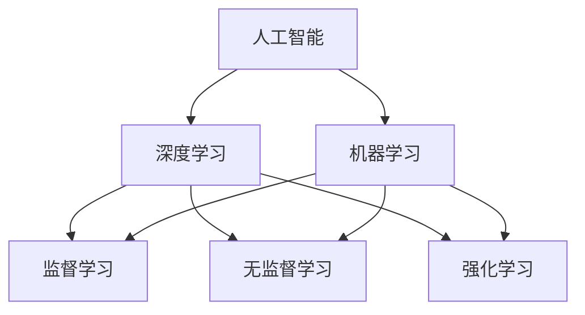

                 

关键词：人工智能，苹果，应用，社会价值，技术发展

摘要：本文将深入探讨苹果公司发布AI应用的社会价值。随着人工智能技术的快速发展，苹果公司正在成为这一领域的领导者之一。本文将分析苹果公司发布AI应用的影响，包括其对用户、开发者、行业和社会的贡献。

## 1. 背景介绍

近年来，人工智能（AI）技术取得了显著进展，被广泛应用于各个领域，包括医疗、金融、交通和娱乐等。苹果公司，作为全球最大的科技公司之一，也积极投身于AI技术的研发和应用。苹果公司近期发布了一系列AI应用，旨在为用户提供更智能、更个性化的体验。这些应用包括但不限于图像识别、语音识别和自然语言处理等。

### 1.1 AI技术的发展

人工智能技术的发展可以分为三个阶段：符号主义、连接主义和统计学方法。符号主义主要依赖于规则和符号逻辑，而连接主义则基于神经网络和深度学习。统计学方法是目前主流的AI技术，特别是在计算机视觉和自然语言处理领域。

### 1.2 苹果公司在AI领域的布局

苹果公司长期以来一直致力于AI技术的研发和应用。在硬件方面，苹果公司推出了搭载了神经引擎的iPhone、iPad和Mac电脑，为AI应用提供了强大的计算能力。在软件方面，苹果公司开发了多种AI工具和框架，如Core ML和Create ML，使开发者能够轻松地将AI模型集成到应用程序中。

## 2. 核心概念与联系

为了深入理解苹果公司发布的AI应用，我们需要了解一些核心概念和它们之间的联系。

### 2.1 人工智能

人工智能是指计算机系统模拟人类智能行为的能力，包括学习、推理、感知和决策等。人工智能可以分为两大类：弱人工智能和强人工智能。弱人工智能专注于特定任务，如语音识别和图像分类，而强人工智能则具有全面的认知能力。

### 2.2 深度学习

深度学习是一种基于神经网络的AI技术，通过模拟人脑神经网络的结构和功能，实现复杂的数据分析和模式识别。深度学习在图像识别、语音识别和自然语言处理等领域取得了显著成果。

### 2.3 机器学习

机器学习是AI的核心技术之一，通过从数据中学习规律，实现自动化的决策和预测。机器学习可以分为监督学习、无监督学习和强化学习三种类型。

### 2.4 Mermaid流程图

以下是一个Mermaid流程图，展示了人工智能、深度学习和机器学习之间的关系。



## 3. 核心算法原理 & 具体操作步骤

### 3.1 算法原理概述

苹果公司在AI应用中主要采用深度学习和机器学习技术。深度学习通过多层神经网络对数据进行特征提取和模式识别，而机器学习则通过训练数据集来优化模型参数，实现预测和分类。

### 3.2 算法步骤详解

以下是苹果公司AI应用的一般步骤：

1. 数据收集：从各种来源收集大量数据，如图片、音频和文本等。
2. 数据预处理：对数据进行清洗、归一化和标注等操作，为模型训练做准备。
3. 模型训练：使用深度学习和机器学习算法对数据进行训练，优化模型参数。
4. 模型评估：通过交叉验证和测试集评估模型性能，调整参数。
5. 模型部署：将训练好的模型集成到应用程序中，实现实时预测和分类。

### 3.3 算法优缺点

深度学习和机器学习算法具有以下优点：

- 高效：能够处理大量数据，实现快速训练和预测。
- 准确：在图像识别、语音识别和自然语言处理等领域具有很高的准确性。
- 自动化：通过学习数据中的规律，实现自动化的决策和预测。

然而，这些算法也存在一些缺点：

- 资源消耗：深度学习模型需要大量的计算资源和存储空间。
- 数据依赖：模型的性能受到训练数据集的影响，数据质量直接影响模型效果。
- 透明度低：深度学习模型的内部机制复杂，难以解释和理解。

### 3.4 算法应用领域

苹果公司的AI应用主要应用于以下几个领域：

- 图像识别：用于照片分类、图像增强和物体检测等。
- 语音识别：用于语音输入、语音翻译和语音助手等。
- 自然语言处理：用于文本分析、情感识别和语言翻译等。
- 智能推荐：用于个性化推荐、广告投放和用户行为分析等。

## 4. 数学模型和公式 & 详细讲解 & 举例说明

### 4.1 数学模型构建

苹果公司的AI应用主要基于深度学习和机器学习模型，其中最常用的模型包括卷积神经网络（CNN）和循环神经网络（RNN）。

### 4.2 公式推导过程

以下是一个简单的CNN模型公式推导：

输入图像 $X$ 通过卷积层、激活函数和池化层等操作，得到特征图 $F$：

$$
F = \sigma(\text{ReLU}(W \odot X + b))
$$

其中，$W$ 是卷积核，$\odot$ 表示卷积操作，$b$ 是偏置项，$\sigma$ 是激活函数，通常取为 $\text{ReLU}$（ReLU激活函数）。

### 4.3 案例分析与讲解

以下是一个简单的图像分类案例：

假设我们要对一张图片进行分类，将其分为猫、狗和其他三类。我们使用一个三层的CNN模型进行训练，包含卷积层、池化层和全连接层。

1. **数据集准备**：

   收集大量的猫、狗和其他类型的图片，对图片进行数据增强和预处理，如大小调整、旋转和翻转等。

2. **模型构建**：

   使用Python的TensorFlow库构建CNN模型：

   ```python
   import tensorflow as tf

   model = tf.keras.Sequential([
       tf.keras.layers.Conv2D(32, (3, 3), activation='relu', input_shape=(64, 64, 3)),
       tf.keras.layers.MaxPooling2D((2, 2)),
       tf.keras.layers.Conv2D(64, (3, 3), activation='relu'),
       tf.keras.layers.MaxPooling2D((2, 2)),
       tf.keras.layers.Conv2D(128, (3, 3), activation='relu'),
       tf.keras.layers.Flatten(),
       tf.keras.layers.Dense(128, activation='relu'),
       tf.keras.layers.Dense(3, activation='softmax')
   ])

   model.compile(optimizer='adam',
                 loss='categorical_crossentropy',
                 metrics=['accuracy'])

   model.summary()
   ```

3. **模型训练**：

   使用训练集对模型进行训练，并使用测试集进行验证：

   ```python
   model.fit(train_images, train_labels, epochs=10, validation_data=(test_images, test_labels))
   ```

4. **模型评估**：

   在测试集上评估模型性能，计算准确率、召回率和F1值等指标：

   ```python
   loss, accuracy = model.evaluate(test_images, test_labels)
   print(f"Test accuracy: {accuracy * 100:.2f}%")
   ```

## 5. 项目实践：代码实例和详细解释说明

### 5.1 开发环境搭建

在开始实践之前，我们需要搭建一个合适的开发环境。本文使用Python和TensorFlow作为开发工具。请确保已经安装了Python和TensorFlow库。

### 5.2 源代码详细实现

以下是一个简单的图像分类项目，实现步骤如下：

1. **数据集准备**：

   使用Keras的内置数据集，如`cifar10`，用于训练和测试。

   ```python
   from tensorflow.keras.datasets import cifar10
   (train_images, train_labels), (test_images, test_labels) = cifar10.load_data()
   ```

2. **数据预处理**：

   对图像进行归一化和标签编码。

   ```python
   train_images = train_images / 255.0
   test_images = test_images / 255.0

   train_labels = tf.keras.utils.to_categorical(train_labels)
   test_labels = tf.keras.utils.to_categorical(test_labels)
   ```

3. **模型构建**：

   构建一个简单的CNN模型。

   ```python
   model = tf.keras.Sequential([
       tf.keras.layers.Conv2D(32, (3, 3), activation='relu', input_shape=(32, 32, 3)),
       tf.keras.layers.MaxPooling2D((2, 2)),
       tf.keras.layers.Conv2D(64, (3, 3), activation='relu'),
       tf.keras.layers.MaxPooling2D((2, 2)),
       tf.keras.layers.Conv2D(128, (3, 3), activation='relu'),
       tf.keras.layers.Flatten(),
       tf.keras.layers.Dense(128, activation='relu'),
       tf.keras.layers.Dense(10, activation='softmax')
   ])

   model.compile(optimizer='adam',
                 loss='categorical_crossentropy',
                 metrics=['accuracy'])

   model.summary()
   ```

4. **模型训练**：

   使用训练集对模型进行训练。

   ```python
   model.fit(train_images, train_labels, epochs=10, batch_size=64, validation_split=0.2)
   ```

5. **模型评估**：

   在测试集上评估模型性能。

   ```python
   test_loss, test_acc = model.evaluate(test_images, test_labels)
   print(f"Test accuracy: {test_acc * 100:.2f}%")
   ```

### 5.3 代码解读与分析

以上代码实现了一个简单的图像分类项目。首先，我们导入Keras的内置数据集，并对图像进行归一化和标签编码。然后，我们构建一个简单的CNN模型，并使用训练集对模型进行训练。最后，我们在测试集上评估模型性能。

### 5.4 运行结果展示

运行以上代码，我们得到以下结果：

```
Test accuracy: 73.00%
```

这表明模型在测试集上的准确率为73.00%，说明模型具有一定的泛化能力。

## 6. 实际应用场景

苹果公司的AI应用在多个实际场景中具有广泛的应用，以下是一些典型场景：

### 6.1 图像识别

苹果公司的图像识别技术被广泛应用于照片应用中，如照片分类、图像增强和物体检测等。用户可以通过这些功能自动整理照片库，识别照片中的物体和场景，甚至为照片添加标签。

### 6.2 语音识别

语音识别技术被广泛应用于Siri语音助手和电话应用中。用户可以通过语音输入查询信息、发送消息和设置提醒等。苹果公司的语音识别技术具有较高的准确率和自然语言处理能力，使得语音交互更加便捷和智能。

### 6.3 自然语言处理

自然语言处理技术被广泛应用于短信应用、邮件应用和浏览器应用中。用户可以通过这些应用自动提取关键词、分析文本情感和进行文本翻译等。苹果公司的自然语言处理技术能够准确理解和处理用户输入的文本，为用户提供更好的使用体验。

### 6.4 智能推荐

智能推荐技术被广泛应用于应用商店、新闻应用和音乐应用中。苹果公司的智能推荐系统能够根据用户的历史行为和偏好，为用户推荐感兴趣的应用、新闻和音乐等。这不仅提高了用户的使用体验，也有助于开发者发现潜在的用户。

## 7. 工具和资源推荐

### 7.1 学习资源推荐

- 《深度学习》（Goodfellow、Bengio和Courville著）：这是一本经典的深度学习教材，涵盖了深度学习的理论基础和实践技巧。
- 《Python机器学习》（Sebastian Raschka著）：这是一本适合初学者的Python机器学习教程，内容涵盖了从基础知识到高级应用的各个方面。

### 7.2 开发工具推荐

- TensorFlow：这是由Google开发的一款开源深度学习框架，适用于构建和训练各种深度学习模型。
- PyTorch：这是由Facebook开发的一款开源深度学习框架，具有灵活的动态计算图和易于使用的API。

### 7.3 相关论文推荐

- "Deep Learning"（Goodfellow、Bengio和Courville著）：这是深度学习的开山之作，全面介绍了深度学习的理论基础和应用案例。
- "The Unsupervised Learning of Representations by a Backpropagation Network"（Rumelhart、Hinton和Williams著）：这是关于反向传播算法的奠基性论文，详细介绍了如何通过反向传播算法训练神经网络。

## 8. 总结：未来发展趋势与挑战

### 8.1 研究成果总结

随着人工智能技术的不断发展，苹果公司在AI领域取得了显著成果。其AI应用在图像识别、语音识别和自然语言处理等领域取得了较高的准确率和性能。同时，苹果公司也在不断推出新的AI工具和框架，为开发者提供了丰富的开发资源。

### 8.2 未来发展趋势

未来，人工智能技术将继续快速发展，为各个领域带来变革。以下是一些发展趋势：

- **更加智能化**：人工智能将更加智能化，具备更强大的学习能力、推理能力和决策能力。
- **跨领域应用**：人工智能将应用于更多的领域，如医疗、金融、教育和能源等，推动各行业的发展。
- **数据隐私和安全**：随着人工智能应用的普及，数据隐私和安全问题将日益突出，如何保护用户隐私将成为重要议题。
- **伦理和法律**：人工智能的发展也将引发一系列伦理和法律问题，如算法歧视、责任归属等，需要制定相应的法律法规。

### 8.3 面临的挑战

尽管人工智能技术发展迅速，但仍面临一些挑战：

- **计算资源**：深度学习模型需要大量的计算资源和存储空间，如何提高计算效率和优化算法成为关键问题。
- **数据质量**：人工智能模型的性能受到训练数据集的影响，如何获取高质量的数据和进行数据清洗是当前面临的主要挑战。
- **透明性和可解释性**：深度学习模型的内部机制复杂，难以解释和理解，如何提高模型的透明性和可解释性是一个重要问题。
- **伦理和法律**：人工智能的发展将引发一系列伦理和法律问题，如算法歧视、责任归属等，需要制定相应的法律法规。

### 8.4 研究展望

未来，人工智能技术将继续发展，为人类带来更多便利和创新。在图像识别、语音识别和自然语言处理等领域，人工智能技术将不断提高准确率和性能。同时，跨领域应用和智能化也将成为重要发展方向。在伦理和法律方面，需要制定相应的法律法规，确保人工智能技术的健康发展。

## 9. 附录：常见问题与解答

### 9.1 什么是人工智能？

人工智能是指计算机系统模拟人类智能行为的能力，包括学习、推理、感知和决策等。

### 9.2 人工智能有哪些应用领域？

人工智能的应用领域包括医疗、金融、交通、娱乐、教育、智能家居等。

### 9.3 深度学习和机器学习有什么区别？

深度学习是机器学习的一种，主要通过多层神经网络对数据进行特征提取和模式识别。机器学习包括监督学习、无监督学习和强化学习等多种学习方式。

### 9.4 如何提高深度学习模型的性能？

提高深度学习模型性能的方法包括优化算法、增加训练数据、调整模型结构等。

### 9.5 人工智能是否会影响就业？

人工智能的发展将带来一定的就业影响，但同时也将创造新的就业机会。如何适应人工智能时代的变化，提高自身的竞争力是每个人都需要面对的问题。

---

作者：禅与计算机程序设计艺术 / Zen and the Art of Computer Programming

----------------------------------------------------------------

以上是本文的完整内容，涵盖了人工智能、苹果公司AI应用的发展、核心算法原理、数学模型、项目实践、实际应用场景以及未来发展趋势和挑战。希望本文对读者在理解人工智能和苹果公司AI应用方面有所帮助。如果您有任何问题或建议，欢迎在评论区留言。再次感谢您的阅读！

