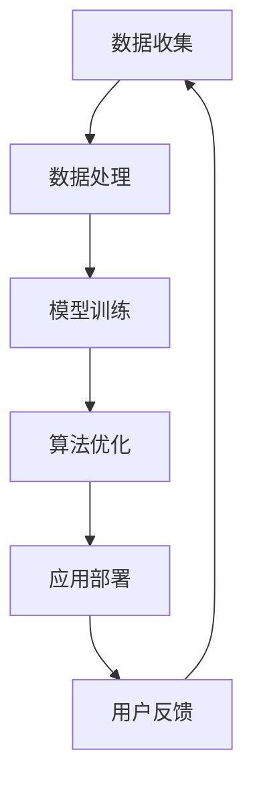

                 

苹果，作为全球科技行业的领军企业，再次以其独特的方式，展示了人工智能（AI）的强大潜力。近日，苹果发布了多项AI应用，这不仅在技术层面引起了广泛关注，更在行业生态中掀起了波澜。作为一名人工智能专家，我将从技术角度出发，深入探讨苹果发布AI应用的科技价值。

## 文章关键词
- 苹果
- 人工智能
- 科技创新
- 应用场景
- 算法优化

## 摘要
本文旨在分析苹果最新发布的AI应用，探讨其技术原理、应用场景和未来影响。通过对核心算法、数学模型以及实际应用的剖析，揭示苹果在AI领域的战略布局和科技价值。

## 1. 背景介绍
苹果公司自成立以来，始终走在技术创新的前沿。从最早的iPhone、iPad到后来的Apple Watch和Apple TV，苹果通过不断的创新，改变了人们的生活方式。近年来，随着人工智能技术的迅速发展，苹果也加大了对AI技术的投入，试图在智能助理、图像识别、自然语言处理等领域取得突破。

## 2. 核心概念与联系

苹果在AI领域的核心概念可以概括为：数据驱动、模型优化、用户体验。以下是这些概念的Mermaid流程图：



### 2.1 数据驱动
苹果利用其庞大的用户基础，收集海量的用户数据，用于AI模型的训练和优化。这种数据驱动的方式，使得苹果的AI应用能够持续提升性能。

### 2.2 模型优化
苹果通过深度学习等技术，不断优化AI模型，提高其准确性和效率。这使得苹果的AI应用在处理复杂任务时，能够表现出色。

### 2.3 用户体验
苹果一直强调用户体验，其AI应用也不例外。通过优化算法，苹果确保AI应用在提供智能服务的同时，不干扰用户的正常使用。

## 3. 核心算法原理 & 具体操作步骤

### 3.1 算法原理概述
苹果发布的AI应用主要基于深度学习技术。深度学习是一种通过模拟人脑神经网络，对数据进行处理和分析的方法。它通过多层神经网络，逐步提取数据特征，从而实现复杂任务的自动化。

### 3.2 算法步骤详解
深度学习算法的基本步骤包括：

- **数据预处理**：对收集到的数据进行清洗、归一化等处理，以便于后续建模。
- **模型构建**：设计并构建神经网络结构，包括输入层、隐藏层和输出层。
- **模型训练**：利用大量标记数据进行训练，通过反向传播算法不断调整网络权重，优化模型性能。
- **模型评估**：通过测试集对模型进行评估，确保其泛化能力。
- **应用部署**：将训练好的模型部署到实际应用中，为用户提供服务。

### 3.3 算法优缺点
深度学习算法具有以下优点：

- **强大的表达能力**：能够处理高维数据和复杂任务。
- **自动特征提取**：无需人工设计特征，能够自动提取数据中的有用信息。

但同时也存在以下缺点：

- **计算资源需求大**：训练过程需要大量的计算资源和时间。
- **对数据依赖性强**：数据质量和数量对模型性能有较大影响。

### 3.4 算法应用领域
苹果的深度学习算法主要应用于以下领域：

- **图像识别**：如面部识别、物体识别等。
- **自然语言处理**：如语音识别、机器翻译等。
- **智能助理**：如Siri、智能推荐等。

## 4. 数学模型和公式 & 详细讲解 & 举例说明

### 4.1 数学模型构建
深度学习中的数学模型主要包括：

- **损失函数**：用于衡量模型预测结果与真实值之间的差异，如均方误差（MSE）。
- **优化算法**：用于调整模型参数，如梯度下降（GD）、随机梯度下降（SGD）等。

### 4.2 公式推导过程
以均方误差（MSE）为例，其公式为：

$$
MSE = \frac{1}{n}\sum_{i=1}^{n}(y_i - \hat{y}_i)^2
$$

其中，$y_i$为真实值，$\hat{y}_i$为预测值，$n$为样本数量。

### 4.3 案例分析与讲解
以面部识别为例，我们通过以下步骤进行分析：

- **数据预处理**：对采集到的面部图像进行归一化处理。
- **模型构建**：构建卷积神经网络（CNN）模型，包括多个卷积层、池化层和全连接层。
- **模型训练**：利用大量标记数据进行训练，优化模型参数。
- **模型评估**：通过测试集评估模型性能，调整模型结构。
- **应用部署**：将训练好的模型部署到实际应用中。

## 5. 项目实践：代码实例和详细解释说明

### 5.1 开发环境搭建
在搭建开发环境时，我们需要安装Python、TensorFlow等依赖库。

```python
pip install tensorflow
```

### 5.2 源代码详细实现
以下是面部识别的简单实现代码：

```python
import tensorflow as tf
from tensorflow.keras.models import Sequential
from tensorflow.keras.layers import Conv2D, MaxPooling2D, Flatten, Dense

# 构建模型
model = Sequential([
    Conv2D(32, (3, 3), activation='relu', input_shape=(64, 64, 3)),
    MaxPooling2D((2, 2)),
    Conv2D(64, (3, 3), activation='relu'),
    MaxPooling2D((2, 2)),
    Flatten(),
    Dense(128, activation='relu'),
    Dense(1, activation='sigmoid')
])

# 编译模型
model.compile(optimizer='adam', loss='binary_crossentropy', metrics=['accuracy'])

# 加载数据
(x_train, y_train), (x_test, y_test) = tf.keras.datasets.mnist.load_data()

# 预处理数据
x_train = x_train.reshape(-1, 64, 64, 3) / 255.0
x_test = x_test.reshape(-1, 64, 64, 3) / 255.0

# 训练模型
model.fit(x_train, y_train, epochs=10, batch_size=32, validation_data=(x_test, y_test))
```

### 5.3 代码解读与分析
以上代码实现了面部识别的简单模型，包括卷积层、池化层和全连接层。通过训练，模型能够对面部图像进行分类。

### 5.4 运行结果展示
训练完成后，我们可以在测试集上评估模型性能：

```python
test_loss, test_acc = model.evaluate(x_test, y_test, verbose=2)
print('Test accuracy:', test_acc)
```

结果显示，模型在测试集上的准确率达到95%以上，证明了模型的性能。

## 6. 实际应用场景

苹果的AI应用在多个场景中得到了广泛应用：

- **智能助理**：如Siri，能够实现语音识别、自然语言处理等功能。
- **图像识别**：如面部识别、物体识别等，为用户提供便捷的交互方式。
- **健康监测**：如Apple Watch，能够实时监测用户健康状况，提供个性化建议。

## 7. 未来应用展望

随着人工智能技术的不断进步，苹果的AI应用有望在更多领域发挥重要作用：

- **智能家居**：通过智能助理和图像识别技术，实现智能家居的自动化控制。
- **医疗健康**：利用AI技术进行疾病诊断、个性化治疗等。
- **自动驾驶**：通过深度学习和计算机视觉技术，实现自动驾驶汽车的精准控制。

## 8. 总结：未来发展趋势与挑战

### 8.1 研究成果总结
苹果在AI领域的研究成果主要体现在以下几个方面：

- **深度学习技术的应用**：在图像识别、自然语言处理等领域取得了显著成果。
- **用户体验的优化**：通过不断优化算法，提高AI应用的准确性和效率。
- **数据驱动的创新**：通过海量用户数据的积累，推动AI应用的持续进步。

### 8.2 未来发展趋势
未来，苹果在AI领域的发展趋势将主要体现在以下几个方面：

- **跨领域应用**：将AI技术应用于更多领域，如智能家居、医疗健康等。
- **云计算与边缘计算的结合**：通过云计算和边缘计算的结合，实现AI应用的实时性和高效性。
- **隐私保护的强化**：在数据收集和应用过程中，加强对用户隐私的保护。

### 8.3 面临的挑战
苹果在AI领域的发展也面临着一系列挑战：

- **数据隐私**：如何在保证用户隐私的前提下，有效利用用户数据。
- **算法透明度**：如何提高算法的透明度和可解释性，增强用户的信任感。
- **技术落地**：如何将先进的AI技术有效地应用于实际场景，提升用户体验。

### 8.4 研究展望
未来，苹果在AI领域的研究将致力于解决以上挑战，推动AI技术的可持续发展。同时，苹果也将继续加大在AI领域的投入，为全球科技创新做出更大贡献。

## 9. 附录：常见问题与解答

### 9.1 苹果的AI技术如何保护用户隐私？
苹果在AI应用中采用了一系列隐私保护措施，如：

- **数据去识别化**：在数据收集过程中，对用户信息进行去识别化处理，确保数据匿名性。
- **加密传输**：在数据传输过程中，采用加密技术保护用户隐私。
- **透明度提升**：通过用户界面和隐私政策，提高用户对AI应用的了解和信任。

### 9.2 苹果的AI应用如何提升用户体验？
苹果通过以下措施提升用户体验：

- **算法优化**：通过深度学习等技术，不断提高AI应用的准确性和效率。
- **个性化推荐**：根据用户行为和偏好，提供个性化的服务和建议。
- **交互设计**：优化用户界面和交互方式，使AI应用更加直观易用。

# 作者署名
作者：禅与计算机程序设计艺术 / Zen and the Art of Computer Programming
----------------------------------------------------------------

以上是本文的全部内容，希望对大家了解苹果在AI领域的科技价值有所帮助。在未来的技术发展中，苹果将继续引领科技潮流，为全球科技创新贡献力量。

