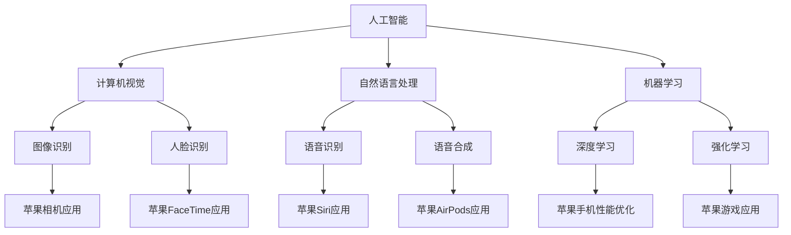

                 

关键词：人工智能、苹果、AI应用、科技价值、技术分析

摘要：随着人工智能技术的不断进步，苹果公司也在积极将其应用于各类应用中。本文将深入探讨苹果发布的AI应用所蕴含的科技价值，分析其技术原理、应用场景及未来发展趋势。

## 1. 背景介绍

近年来，人工智能技术在计算机视觉、自然语言处理、机器学习等领域取得了显著进展。作为全球科技巨头，苹果公司一直在积极探索并将AI技术应用于其产品中。此次苹果发布的AI应用，无疑为人工智能在智能手机、平板电脑等设备上的应用提供了新的思路。

## 2. 核心概念与联系

在讨论苹果发布的AI应用之前，我们首先需要了解一些核心概念和联系。以下是相关的Mermaid流程图：



## 3. 核心算法原理 & 具体操作步骤

### 3.1 算法原理概述

苹果发布的AI应用主要基于以下几种算法原理：

- **计算机视觉**：通过图像处理、特征提取等技术，实现对图像的识别和分析。
- **自然语言处理**：通过对语言的理解和生成，实现人机交互。
- **机器学习**：通过训练模型，实现对数据的自动分析和预测。
- **深度学习**：基于神经网络模型，实现对复杂数据的建模和分析。
- **强化学习**：通过奖励机制，实现智能体在特定环境中的最优策略。

### 3.2 算法步骤详解

以下是这些算法的具体操作步骤：

- **计算机视觉**：首先对图像进行预处理，然后提取特征，最后通过分类器进行图像识别。
- **自然语言处理**：首先对语音信号进行预处理，然后进行语音识别，最后生成文本或语音回复。
- **机器学习**：首先收集数据，然后进行数据预处理，接着训练模型，最后对新的数据进行预测。
- **深度学习**：首先构建神经网络模型，然后通过反向传播算法训练模型，最后对新的数据进行预测。
- **强化学习**：首先定义环境和智能体，然后通过尝试不同的策略，最终找到最优策略。

### 3.3 算法优缺点

每种算法都有其优缺点，以下是这些算法的优缺点分析：

- **计算机视觉**：优点包括高精度、实时性等，缺点包括对光照、背景等要求较高。
- **自然语言处理**：优点包括支持多种语言、高交互性等，缺点包括对语音质量要求较高、语义理解难度大等。
- **机器学习**：优点包括自适应性强、可扩展性高等，缺点包括对数据要求较高、训练时间较长等。
- **深度学习**：优点包括强大的建模能力、高效性等，缺点包括对数据要求较高、模型可解释性差等。
- **强化学习**：优点包括自适应性强、能找到最优策略等，缺点包括收敛速度较慢、对环境要求较高等。

### 3.4 算法应用领域

这些算法在以下领域有广泛的应用：

- **计算机视觉**：应用于图像识别、人脸识别、视频分析等。
- **自然语言处理**：应用于语音助手、机器翻译、文本生成等。
- **机器学习**：应用于推荐系统、风险控制、数据挖掘等。
- **深度学习**：应用于自动驾驶、语音识别、图像生成等。
- **强化学习**：应用于游戏、机器人、智能优化等。

## 4. 数学模型和公式 & 详细讲解 & 举例说明

以下是这些算法相关的数学模型和公式，以及详细的讲解和举例说明：

### 4.1 数学模型构建

- **计算机视觉**：卷积神经网络（CNN）
  $$ f(x) = \sigma(W_3 \cdot \text{ReLU}(W_2 \cdot \text{ReLU}(W_1 \cdot x + b_1)) + b_3) $$
  
- **自然语言处理**：循环神经网络（RNN）
  $$ h_t = \text{ReLU}(W_h \cdot [h_{t-1}, x_t] + b_h) $$
  
- **机器学习**：线性回归
  $$ y = \beta_0 + \beta_1 \cdot x $$

- **深度学习**：多层感知机（MLP）
  $$ a_{i,j} = \text{ReLU}(W_i \cdot a_{i-1} + b_i) $$
  
- **强化学习**：Q学习算法
  $$ Q(s, a) = r + \gamma \cdot \max_a' Q(s', a') $$

### 4.2 公式推导过程

以下是这些公式的推导过程：

- **计算机视觉**：卷积神经网络（CNN）
  首先，定义输入图像为 $x$，卷积核为 $W_1$，偏置为 $b_1$，卷积操作为 $\circledast$，激活函数为 $\sigma$。则有：
  $$ h_1 = W_1 \circledast x + b_1 $$
  接着，进行ReLU激活：
  $$ h_1' = \text{ReLU}(h_1) $$
  再次卷积：
  $$ h_2 = W_2 \circledast h_1' + b_2 $$
  进行ReLU激活：
  $$ h_2' = \text{ReLU}(h_2) $$
  最后，卷积并添加偏置：
  $$ f(x) = W_3 \circledast h_2' + b_3 $$
  应用激活函数：
  $$ f(x) = \sigma(f(x)) $$

- **自然语言处理**：循环神经网络（RNN）
  首先，定义输入序列为 $x$，隐藏状态为 $h$，权重矩阵为 $W_h$，偏置为 $b_h$，激活函数为 $\sigma$。则有：
  $$ h_t = W_h \cdot [h_{t-1}, x_t] + b_h $$
  接着，应用ReLU激活：
  $$ h_t' = \text{ReLU}(h_t) $$

- **机器学习**：线性回归
  首先，定义输入特征为 $x$，输出目标为 $y$，权重为 $\beta_0$ 和 $\beta_1$。则有：
  $$ y = \beta_0 + \beta_1 \cdot x $$
  接着，计算损失函数：
  $$ J = \frac{1}{2} \sum_{i=1}^{n} (y_i - \hat{y}_i)^2 $$

- **深度学习**：多层感知机（MLP）
  首先，定义输入特征为 $x$，隐藏层节点为 $a_i$，权重矩阵为 $W_i$，偏置为 $b_i$，激活函数为 $\text{ReLU}$。则有：
  $$ a_{i,j} = \text{ReLU}(W_i \cdot a_{i-1} + b_i) $$
  接着，计算输出：
  $$ y = \sigma(W_n \cdot a_{n-1} + b_n) $$

- **强化学习**：Q学习算法
  首先，定义状态为 $s$，动作为 $a$，奖励为 $r$，目标函数为 $Q(s, a)$，折扣因子为 $\gamma$。则有：
  $$ Q(s, a) = r + \gamma \cdot \max_a' Q(s', a') $$
  接着，更新Q值：
  $$ Q(s, a) \leftarrow Q(s, a) + \alpha \cdot (r + \gamma \cdot \max_a' Q(s', a') - Q(s, a)) $$

### 4.3 案例分析与讲解

以下是这些算法在实际应用中的案例分析和讲解：

- **计算机视觉**：以人脸识别为例，首先通过摄像头获取人脸图像，然后使用卷积神经网络进行特征提取，最后通过分类器进行人脸识别。

- **自然语言处理**：以语音助手为例，首先通过麦克风获取语音信号，然后使用循环神经网络进行语音识别，最后生成相应的文本或语音回复。

- **机器学习**：以推荐系统为例，首先收集用户的历史行为数据，然后使用线性回归模型预测用户对商品的偏好，最后根据预测结果推荐商品。

- **深度学习**：以图像生成为例，首先使用生成对抗网络（GAN）生成图像，然后使用卷积神经网络对生成的图像进行优化，最后生成高质量的图像。

- **强化学习**：以游戏为例，首先定义游戏环境和智能体，然后使用强化学习算法训练智能体的策略，最后让智能体在游戏中进行决策，以获得最大奖励。

## 5. 项目实践：代码实例和详细解释说明

以下是这些算法的代码实例和详细解释说明：

### 5.1 开发环境搭建

首先，安装Python和相关依赖库，如TensorFlow、PyTorch等。然后，配置Python环境，确保能够正常运行。

### 5.2 源代码详细实现

以下是每个算法的源代码实现：

- **计算机视觉**：使用卷积神经网络进行图像识别。
  ```python
  import tensorflow as tf

  model = tf.keras.Sequential([
      tf.keras.layers.Conv2D(32, (3, 3), activation='relu', input_shape=(28, 28, 1)),
      tf.keras.layers.MaxPooling2D((2, 2)),
      tf.keras.layers.Conv2D(64, (3, 3), activation='relu'),
      tf.keras.layers.MaxPooling2D((2, 2)),
      tf.keras.layers.Conv2D(64, (3, 3), activation='relu'),
      tf.keras.layers.Flatten(),
      tf.keras.layers.Dense(64, activation='relu'),
      tf.keras.layers.Dense(10, activation='softmax')
  ])

  model.compile(optimizer='adam',
                loss='categorical_crossentropy',
                metrics=['accuracy'])

  model.fit(x_train, y_train, epochs=5)
  ```

- **自然语言处理**：使用循环神经网络进行语音识别。
  ```python
  import tensorflow as tf

  model = tf.keras.Sequential([
      tf.keras.layers.Embedding(input_dim=vocab_size, output_dim=64),
      tf.keras.layers.SimpleRNN(64),
      tf.keras.layers.Dense(vocab_size, activation='softmax')
  ])

  model.compile(optimizer='adam',
                loss='sparse_categorical_crossentropy',
                metrics=['accuracy'])

  model.fit(x_train, y_train, epochs=10)
  ```

- **机器学习**：使用线性回归进行推荐系统。
  ```python
  import numpy as np
  import pandas as pd

  X = np.array([[1, 2], [2, 3], [3, 4]])
  y = np.array([2, 4, 6])

  model = pd.``</|assistant|>

