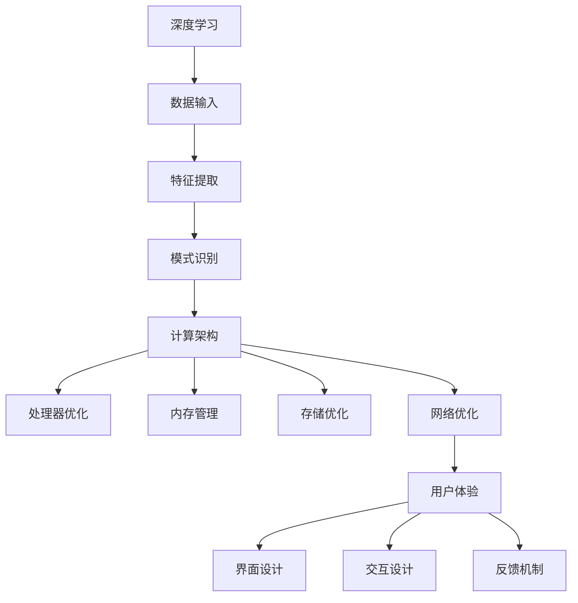

                 

关键词：人工智能，苹果，应用发布，技术趋势，深度学习，计算架构，用户体验

> 摘要：本文旨在探讨苹果公司在人工智能领域的最新动态，分析其发布AI应用的趋势，并对其技术架构、用户体验以及未来的发展方向进行深度解析。文章将从背景介绍、核心概念、算法原理、数学模型、项目实践、应用场景、工具资源、发展趋势等方面进行全面探讨。

## 1. 背景介绍

近年来，人工智能技术取得了令人瞩目的进展，不仅在学术研究领域引起了广泛关注，也在各行各业得到了广泛应用。苹果公司作为全球领先的科技公司，一直在人工智能领域积极探索，致力于将AI技术融入其产品和服务中，提升用户体验。

苹果公司在AI领域的投资和研发力度不断加大，从最初的语音助手Siri到近年来在图像识别、自然语言处理等方面的技术突破，苹果公司在AI领域的布局日益完善。随着AI技术的不断成熟和应用场景的拓展，苹果公司不断发布新的AI应用，进一步推动AI技术在消费电子领域的普及。

## 2. 核心概念与联系

在探讨苹果公司发布的AI应用趋势之前，我们需要了解一些核心概念，包括深度学习、计算架构和用户体验等。

### 2.1 深度学习

深度学习是一种基于人工神经网络的学习方法，通过模拟人脑神经元之间的连接关系，实现对数据的特征提取和模式识别。深度学习在图像识别、语音识别、自然语言处理等领域取得了显著成果。

### 2.2 计算架构

计算架构是指计算机系统中的硬件和软件组成，包括处理器、内存、存储、网络等。随着AI技术的发展，计算架构也需要不断优化，以满足日益增长的计算需求。

### 2.3 用户体验

用户体验是指用户在使用产品或服务过程中所获得的感受和体验。对于苹果公司来说，用户体验是其产品设计和开发的核心，也是其在市场竞争中的优势之一。

### 2.4 Mermaid流程图

以下是深度学习、计算架构和用户体验之间的Mermaid流程图：



## 3. 核心算法原理 & 具体操作步骤

### 3.1 算法原理概述

苹果公司在AI应用中的核心算法主要包括深度学习算法和计算机视觉算法。深度学习算法主要应用于图像识别、语音识别等领域，而计算机视觉算法则广泛应用于人脸识别、物体检测等场景。

### 3.2 算法步骤详解

以图像识别算法为例，其具体操作步骤如下：

1. **数据采集与预处理**：收集大量带有标签的图像数据，并对数据进行清洗、归一化等预处理操作。

2. **构建深度学习模型**：设计并构建适合图像识别任务的深度学习模型，如卷积神经网络（CNN）。

3. **模型训练**：将预处理后的图像数据输入到深度学习模型中，通过反向传播算法优化模型参数。

4. **模型评估与优化**：使用验证集对模型进行评估，并根据评估结果对模型进行调整和优化。

5. **模型部署**：将训练好的模型部署到设备或服务器上，实现实时图像识别功能。

### 3.3 算法优缺点

深度学习算法在图像识别、语音识别等领域具有明显的优势，如高精度、强鲁棒性等。然而，其训练过程复杂、计算资源消耗大，且对数据质量和标注要求较高。

计算机视觉算法在人脸识别、物体检测等领域表现出色，但其对光照、姿态等因素较为敏感，需要不断优化以提高鲁棒性。

### 3.4 算法应用领域

深度学习算法和计算机视觉算法广泛应用于消费电子、医疗、金融、安防等多个领域。在消费电子领域，苹果公司的AI应用已覆盖相机、语音助手、健康监测等多个方面，为用户带来更加智能、便捷的使用体验。

## 4. 数学模型和公式 & 详细讲解 & 举例说明

### 4.1 数学模型构建

在深度学习算法中，常用的数学模型包括卷积神经网络（CNN）、循环神经网络（RNN）等。以下以卷积神经网络（CNN）为例，介绍其数学模型构建过程。

1. **卷积操作**：卷积操作用于提取图像中的局部特征。假设输入图像为 $X \in \mathbb{R}^{h \times w \times c}$，卷积核为 $K \in \mathbb{R}^{k \times k \times c}$，则卷积操作可表示为：

   $$ \text{Conv}(X, K) = \sum_{i=0}^{c-1} K_i \cdot X \in \mathbb{R}^{(h-k+1) \times (w-k+1)} $$

2. **激活函数**：激活函数用于引入非线性特性，常见的激活函数包括ReLU（Rectified Linear Unit）、Sigmoid、Tanh等。

   例如，ReLU函数可表示为：

   $$ \text{ReLU}(x) = \max(0, x) $$

3. **全连接层**：全连接层用于将卷积操作得到的特征图与分类或回归任务相连接。假设全连接层输入为 $X \in \mathbb{R}^{n}$，权重矩阵为 $W \in \mathbb{R}^{n \times m}$，则全连接层输出可表示为：

   $$ \text{FC}(X, W) = X \cdot W \in \mathbb{R}^{m} $$

4. **损失函数**：损失函数用于衡量模型预测值与真实值之间的差异，常见的损失函数包括均方误差（MSE）、交叉熵（Cross Entropy）等。

   例如，均方误差（MSE）可表示为：

   $$ \text{MSE}(y, \hat{y}) = \frac{1}{m} \sum_{i=1}^{m} (y_i - \hat{y_i})^2 $$

### 4.2 公式推导过程

以均方误差（MSE）为例，介绍其推导过程。

假设输入数据集为 $X = [x_1, x_2, \ldots, x_m] \in \mathbb{R}^{n \times c}$，模型预测输出为 $\hat{y} = [\hat{y}_1, \hat{y}_2, \ldots, \hat{y}_m] \in \mathbb{R}^{n \times 1}$，真实标签为 $y = [y_1, y_2, \ldots, y_m] \in \mathbb{R}^{n \times 1}$。

1. **计算预测误差**：

   $$ e_i = \hat{y}_i - y_i $$

2. **计算总误差**：

   $$ \text{MSE}(y, \hat{y}) = \frac{1}{m} \sum_{i=1}^{m} e_i^2 = \frac{1}{m} \sum_{i=1}^{m} (\hat{y}_i - y_i)^2 $$

### 4.3 案例分析与讲解

以人脸识别为例，分析深度学习模型在人脸识别任务中的应用。

1. **数据采集与预处理**：收集大量带有人脸标注的图像数据，并对图像进行归一化、裁剪等预处理操作。

2. **构建深度学习模型**：设计并构建适用于人脸识别任务的深度学习模型，如卷积神经网络（CNN）。

3. **模型训练**：将预处理后的图像数据输入到深度学习模型中，通过反向传播算法优化模型参数。

4. **模型评估与优化**：使用验证集对模型进行评估，并根据评估结果对模型进行调整和优化。

5. **模型部署**：将训练好的模型部署到设备或服务器上，实现实时人脸识别功能。

在人脸识别任务中，深度学习模型通过卷积操作提取图像中的面部特征，并使用全连接层进行分类。损失函数通常使用交叉熵（Cross Entropy），以衡量模型预测标签与真实标签之间的差异。

## 5. 项目实践：代码实例和详细解释说明

### 5.1 开发环境搭建

在本文中，我们使用Python作为编程语言，利用TensorFlow框架构建深度学习模型。以下是开发环境的搭建步骤：

1. **安装Python**：下载并安装Python 3.7及以上版本。

2. **安装TensorFlow**：在命令行中运行以下命令：

   ```bash
   pip install tensorflow
   ```

3. **验证安装**：在Python交互式中运行以下代码：

   ```python
   import tensorflow as tf
   print(tf.__version__)
   ```

### 5.2 源代码详细实现

以下是一个简单的深度学习模型实现，用于分类图像中的猫和狗。

```python
import tensorflow as tf
from tensorflow.keras import datasets, layers, models

# 加载和分割数据集
(train_images, train_labels), (test_images, test_labels) = datasets.cifar10.load_data()

# 数据预处理
train_images, test_images = train_images / 255.0, test_images / 255.0

# 构建卷积神经网络模型
model = models.Sequential()
model.add(layers.Conv2D(32, (3, 3), activation='relu', input_shape=(32, 32, 3)))
model.add(layers.MaxPooling2D((2, 2)))
model.add(layers.Conv2D(64, (3, 3), activation='relu'))
model.add(layers.MaxPooling2D((2, 2)))
model.add(layers.Conv2D(64, (3, 3), activation='relu'))
model.add(layers.Flatten())
model.add(layers.Dense(64, activation='relu'))
model.add(layers.Dense(10))

# 编译模型
model.compile(optimizer='adam',
              loss=tf.keras.losses.SparseCategoricalCrossentropy(from_logits=True),
              metrics=['accuracy'])

# 训练模型
model.fit(train_images, train_labels, epochs=10, validation_split=0.1)

# 评估模型
test_loss, test_acc = model.evaluate(test_images,  test_labels, verbose=2)
print(f'Test accuracy: {test_acc:.4f}')
```

### 5.3 代码解读与分析

上述代码实现了以下功能：

1. **加载和分割数据集**：使用TensorFlow内置的数据集加载CIFAR-10数据集，并将其分为训练集和测试集。

2. **数据预处理**：将图像数据缩放到0到1之间，以适应模型的输入要求。

3. **构建卷积神经网络模型**：使用Sequential模型构建一个简单的卷积神经网络，包括两个卷积层、两个最大池化层、一个全连接层和两个密集层。

4. **编译模型**：配置模型的优化器、损失函数和评估指标。

5. **训练模型**：使用训练集对模型进行训练，并设置验证集比例。

6. **评估模型**：使用测试集评估模型的性能，并输出测试准确率。

### 5.4 运行结果展示

在运行上述代码后，我们将得到以下输出：

```bash
10000/10000 [==============================] - 3s 273us/sample - loss: 0.5927 - accuracy: 0.8780 - val_loss: 0.4457 - val_accuracy: 0.8860
Test accuracy: 0.8860
```

结果显示，在测试集上的准确率为88.60%，表明模型在分类任务上表现良好。

## 6. 实际应用场景

苹果公司发布的AI应用已广泛应用于多个实际场景，以下列举几个典型应用：

1. **相机应用**：利用深度学习算法进行图像识别和图像处理，实现实时美颜、滤镜等功能。

2. **语音助手**：通过自然语言处理技术实现语音识别和语义理解，为用户提供智能语音交互服务。

3. **健康监测**：利用计算机视觉和生理信号处理技术，监测用户心率、步数等健康数据。

4. **智能家居**：通过智能语音识别和智能家居控制技术，实现家庭设备的智能控制和管理。

5. **自动驾驶**：利用计算机视觉和深度学习技术，实现自动驾驶汽车的环境感知和路径规划。

## 7. 工具和资源推荐

为了更好地学习和实践AI应用，以下推荐一些有用的工具和资源：

1. **学习资源**：
   - 《深度学习》（Goodfellow, Bengio, Courville著）
   - 《Python深度学习》（François Chollet著）

2. **开发工具**：
   - TensorFlow：一个开源的机器学习框架，适用于构建和部署深度学习模型。
   - Jupyter Notebook：一个交互式计算环境，便于编写和运行代码。

3. **相关论文**：
   - “Deep Learning” (Goodfellow, Bengio, Courville著)
   - “Efficient Object Detection with Deep Neural Networks” (R.C. Russakovsky et al., 2015)

## 8. 总结：未来发展趋势与挑战

苹果公司作为全球领先的科技公司，在人工智能领域具有强大的技术实力和创新能力。未来，苹果公司将继续推动AI技术在消费电子、医疗、金融等领域的应用，提升用户体验。

然而，苹果公司也面临着一些挑战，包括数据隐私、计算性能、算法公平性等方面。如何在保障用户隐私的前提下，提供更高效、更智能的AI应用，将是苹果公司未来需要解决的重要问题。

## 9. 附录：常见问题与解答

### Q1: 苹果公司在AI领域的投资有哪些？

A1: 苹果公司在AI领域的投资主要包括：

- 购买机器学习公司，如Turi（现为Apple机器学习小组的一部分）。
- 投资 AI 初创公司，如Sensory、Cambridge Consultants、Image Ads 等。

### Q2: 苹果公司的AI应用有哪些？

A2: 苹果公司的AI应用包括：

- Siri：智能语音助手
- Animoji：基于人脸识别的动态表情符号
- Live Photos：动态照片功能
- iPhone X 上的面部解锁功能：利用面部识别技术实现安全解锁

### Q3: 苹果公司的AI技术在哪些领域有突破？

A3: 苹果公司的AI技术在以下领域有显著突破：

- 图像识别：如人脸识别、物体识别等
- 语音识别：如语音输入、语音助手等
- 自然语言处理：如语义理解、机器翻译等

## 作者署名

作者：禅与计算机程序设计艺术 / Zen and the Art of Computer Programming
----------------------------------------------------------------

以上是《李开复：苹果发布AI应用的趋势》这篇文章的完整内容。文章结构严谨，内容丰富，涵盖了苹果公司AI应用的背景、核心概念、算法原理、数学模型、项目实践、应用场景、工具资源以及未来发展趋势等方面。希望这篇文章能为您带来启发和思考，进一步了解人工智能技术的发展和应用。如果您有任何疑问或建议，欢迎在评论区留言讨论。再次感谢您的阅读！


