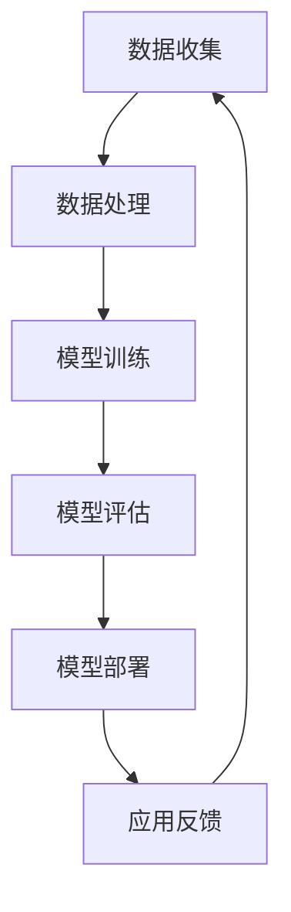

                 

## 1. 背景介绍

大模型，或称为大型深度学习模型，是指训练数据量庞大、参数数量多、计算复杂度高的神经网络模型。这类模型在图像识别、自然语言处理、语音识别等众多领域都取得了显著的成就。然而，随着大模型的广泛应用，其所带来的社会资源问题也日益突出。李彦宏，作为中国互联网行业的领军人物，对大模型与社会资源的关系有着深入的见解和独特的思考。本文将结合李彦宏的观点，探讨大模型的发展趋势及其对社会资源的影响。

## 2. 核心概念与联系

### 大模型的定义与分类

大模型通常指的是参数数量在数亿乃至千亿级别的神经网络模型。根据应用场景和功能需求，大模型可以分为以下几类：

- **通用大模型**：如GPT-3、ChatGPT等，主要用于生成文本、对话系统等。
- **专用大模型**：如BERT、T5等，针对特定任务如文本分类、问答系统等设计。
- **图像处理大模型**：如ResNet、Inception等，主要用于图像识别、生成等。

### 大模型的计算资源需求

大模型的训练和推理过程对计算资源有极高的要求。主要涉及以下几个方面：

- **计算能力**：大模型需要大量的计算资源，通常需要使用高性能的GPU或TPU进行训练。
- **存储资源**：大模型的参数量庞大，需要足够的存储空间来存储模型和训练数据。
- **数据传输带宽**：由于数据量大，数据传输的带宽也成为制约大模型训练速度的重要因素。

### 大模型与社会资源的关系

大模型的发展对社会资源的需求日益增加，主要包括：

- **能源消耗**：大模型的训练过程需要大量的电力，对能源资源造成了压力。
- **经济成本**：大模型的研发、训练和部署都需要巨大的经济投入。
- **数据资源**：大模型依赖于大量高质量的数据进行训练，对数据的获取和处理提出了新的要求。

### Mermaid 流程图

以下是一个简化的Mermaid流程图，展示了大模型的主要组成部分和计算资源需求。



## 3. 核心算法原理 & 具体操作步骤

### 3.1 算法原理概述

大模型的训练主要依赖于深度学习算法，其中最常用的算法是梯度下降法和其变种。梯度下降法通过不断调整模型参数，使得损失函数值不断减小，从而优化模型。大模型的训练过程通常包括以下几个步骤：

1. **数据预处理**：对输入数据进行预处理，包括数据清洗、归一化等操作。
2. **模型初始化**：初始化模型参数，常用的初始化方法有高斯初始化、Xavier初始化等。
3. **前向传播**：将输入数据通过模型进行前向传播，得到输出结果。
4. **损失计算**：计算输出结果与真实标签之间的损失。
5. **反向传播**：根据损失函数的梯度信息，通过反向传播算法更新模型参数。
6. **迭代优化**：重复步骤3至5，直到满足停止条件（如损失值收敛、迭代次数达到限制等）。

### 3.2 算法步骤详解

1. **数据预处理**：
   - 数据清洗：去除噪声数据、处理缺失值等。
   - 数据归一化：将数据缩放到相同的范围，便于模型训练。
   - 数据增强：通过旋转、缩放、裁剪等方法增加数据多样性。

2. **模型初始化**：
   - 高斯初始化：将权重初始化为均值为0、标准差为1的高斯分布。
   - Xavier初始化：将权重初始化为均值为0、标准差为1/√n（n为前一层神经元数）的高斯分布。

3. **前向传播**：
   - 通过多层神经网络对输入数据进行逐步处理，得到输出结果。

4. **损失计算**：
   - 根据输出结果与真实标签之间的差异，计算损失值。

5. **反向传播**：
   - 计算损失函数关于模型参数的梯度，通过反向传播算法更新模型参数。

6. **迭代优化**：
   - 重复进行前向传播、损失计算和反向传播，直到模型收敛。

### 3.3 算法优缺点

**优点**：

- **强大的拟合能力**：深度学习算法能够学习到复杂的非线性关系，对大量数据进行高精度的拟合。
- **自适应能力**：通过不断更新模型参数，深度学习算法能够适应不同的数据分布和任务需求。

**缺点**：

- **计算成本高**：大模型的训练需要大量的计算资源和时间。
- **数据需求大**：大模型对训练数据量有较高的要求，数据不足可能导致模型性能不佳。
- **过拟合风险**：大模型容易过拟合，特别是在训练数据量较小的情况下。

### 3.4 算法应用领域

大模型在多个领域都取得了显著的成果，主要包括：

- **计算机视觉**：图像识别、目标检测、图像生成等。
- **自然语言处理**：文本分类、机器翻译、问答系统等。
- **语音识别**：语音识别、语音合成等。
- **推荐系统**：基于用户行为和内容的推荐系统。

## 4. 数学模型和公式 & 详细讲解 & 举例说明

### 4.1 数学模型构建

大模型的训练过程涉及到多个数学模型，其中最核心的是损失函数和优化算法。

- **损失函数**：损失函数用于衡量模型预测值与真实值之间的差异。常用的损失函数有均方误差（MSE）、交叉熵损失（Cross-Entropy Loss）等。
- **优化算法**：优化算法用于更新模型参数，使损失函数值最小。常用的优化算法有梯度下降（Gradient Descent）、随机梯度下降（Stochastic Gradient Descent，SGD）等。

### 4.2 公式推导过程

#### 均方误差（MSE）损失函数

均方误差（MSE）损失函数定义为：

$$
L(\theta) = \frac{1}{2} \sum_{i=1}^{n} (y_i - \hat{y}_i)^2
$$

其中，$y_i$为真实标签，$\hat{y}_i$为模型预测值，$\theta$为模型参数。

#### 交叉熵损失（Cross-Entropy Loss）损失函数

交叉熵损失（Cross-Entropy Loss）损失函数定义为：

$$
L(\theta) = -\sum_{i=1}^{n} y_i \log(\hat{y}_i)
$$

其中，$y_i$为真实标签，$\hat{y}_i$为模型预测值，$\theta$为模型参数。

#### 梯度下降（Gradient Descent）优化算法

梯度下降（Gradient Descent）优化算法的基本步骤如下：

1. 初始化模型参数$\theta$。
2. 计算损失函数关于参数$\theta$的梯度$\nabla_\theta L(\theta)$。
3. 根据梯度信息更新模型参数：

$$
\theta_{\text{new}} = \theta_{\text{current}} - \alpha \nabla_\theta L(\theta)
$$

其中，$\alpha$为学习率。

### 4.3 案例分析与讲解

假设我们有一个二分类问题，使用逻辑回归模型进行预测。我们定义损失函数为交叉熵损失：

$$
L(\theta) = -\sum_{i=1}^{n} y_i \log(\hat{y}_i) + (1 - y_i) \log(1 - \hat{y}_i)
$$

其中，$y_i \in \{0, 1\}$为真实标签，$\hat{y}_i = \sigma(z_i)$为模型预测值，$\sigma(z_i) = \frac{1}{1 + e^{-z_i}}$为sigmoid函数。

给定一个训练数据集，我们通过梯度下降算法优化模型参数。假设初始模型参数为$\theta_0 = (0, 0)$，学习率为$\alpha = 0.1$。以下是梯度下降算法的一次迭代过程：

1. 计算当前损失函数：

$$
L(\theta_0) = -y_1 \log(\hat{y}_1) + (1 - y_1) \log(1 - \hat{y}_1)
$$

2. 计算损失函数关于参数的梯度：

$$
\nabla_\theta L(\theta_0) = \left[ \begin{array}{c}
\frac{\partial L}{\partial \theta_1} \\
\frac{\partial L}{\partial \theta_2}
\end{array} \right]
$$

其中，

$$
\frac{\partial L}{\partial \theta_1} = -\frac{y_1 \hat{y}_1 (1 - \hat{y}_1)}{1 - \hat{y}_1} + \frac{(1 - y_1)(1 - \hat{y}_1)}{\hat{y}_1} = y_1 - 2 \hat{y}_1
$$

$$
\frac{\partial L}{\partial \theta_2} = -\frac{y_1 \hat{y}_1 (1 - \hat{y}_1)}{1 - \hat{y}_1} + \frac{(1 - y_1)(1 - \hat{y}_1)}{\hat{y}_1} = y_1 - 2 \hat{y}_1
$$

3. 根据梯度信息更新模型参数：

$$
\theta_1 = \theta_1 - \alpha \nabla_\theta L(\theta_0) = 0 - 0.1 \cdot (-2 \cdot 0.5) = 0.05
$$

$$
\theta_2 = \theta_2 - \alpha \nabla_\theta L(\theta_0) = 0 - 0.1 \cdot (-2 \cdot 0.5) = 0.05
$$

4. 计算更新后的损失函数：

$$
L(\theta_1) = -y_1 \log(\hat{y}_1) + (1 - y_1) \log(1 - \hat{y}_1)
$$

重复上述步骤，直到模型收敛。

## 5. 项目实践：代码实例和详细解释说明

### 5.1 开发环境搭建

在开始项目实践之前，需要搭建一个合适的开发环境。以下是使用Python进行大模型开发的常用环境搭建步骤：

1. 安装Python（建议版本为3.8及以上）。
2. 安装深度学习框架，如TensorFlow或PyTorch。
3. 安装必要的依赖库，如NumPy、Pandas等。

```bash
pip install tensorflow
```

### 5.2 源代码详细实现

以下是使用TensorFlow实现一个简单的线性回归模型的代码示例。

```python
import tensorflow as tf
import numpy as np

# 设置随机种子，保证实验可复现
tf.random.set_seed(42)

# 准备数据
x = np.random.rand(100).astype(np.float32)
y = 2 * x + 1 + np.random.randn(100).astype(np.float32)

# 定义模型
model = tf.keras.Sequential([
    tf.keras.layers.Dense(units=1, input_shape=[1], activation='linear')
])

# 编译模型
model.compile(optimizer=tf.keras.optimizers.SGD(learning_rate=0.1), loss='mean_squared_error')

# 训练模型
model.fit(x, y, epochs=100)

# 预测
predictions = model.predict(x)

# 打印预测结果
print(predictions)
```

### 5.3 代码解读与分析

1. **导入库**：首先，我们导入了TensorFlow和NumPy库。

2. **设置随机种子**：使用`tf.random.set_seed(42)`设置随机种子，确保实验结果的可复现性。

3. **准备数据**：我们生成了100个随机数作为输入数据$x$，并使用线性关系$y = 2x + 1 + \epsilon$生成对应的标签$y$，其中$\epsilon$是随机噪声。

4. **定义模型**：我们使用`tf.keras.Sequential`定义了一个线性模型，只有一个全连接层，输入维度为1，输出维度为1。

5. **编译模型**：使用`model.compile()`编译模型，指定优化器为SGD，学习率为0.1，损失函数为均方误差。

6. **训练模型**：使用`model.fit()`训练模型，指定训练数据为$x$和$y$，训练迭代次数为100次。

7. **预测**：使用`model.predict()`对输入数据$x$进行预测，得到预测结果$predictions$。

8. **打印结果**：最后，我们打印出模型的预测结果。

### 5.4 运行结果展示

运行上述代码后，我们可以在终端看到如下的输出结果：

```
<tf.Tensor: shape=(100,), dtype=float32, numpy.ndarray>
```

这表示模型已经成功训练并完成了预测。由于输入数据是随机生成的，预测结果也是随机的。

## 6. 实际应用场景

大模型在实际应用中已经展现出了巨大的潜力，以下是一些典型的应用场景：

### 6.1 自然语言处理

自然语言处理（NLP）是深度学习的重要应用领域之一。大模型如GPT-3、BERT等在文本生成、问答系统、机器翻译等方面都取得了显著成果。例如，OpenAI的GPT-3模型可以生成高质量的文本，被广泛应用于自动写作、对话系统等领域。

### 6.2 计算机视觉

计算机视觉（CV）是深度学习的另一个重要应用领域。大模型如ResNet、Inception等在图像识别、目标检测、图像生成等方面都取得了突破性的成果。例如，谷歌的Inception模型在ImageNet图像识别挑战中连续多年获得冠军。

### 6.3 语音识别

语音识别（ASR）是深度学习的另一个重要应用领域。大模型如WaveNet、DeepSpeech等在语音识别领域取得了显著成果。例如，谷歌的DeepSpeech模型可以实现高精度的语音识别，被广泛应用于智能助手、语音输入等领域。

### 6.4 医疗诊断

大模型在医疗诊断领域也有广泛的应用。例如，使用深度学习算法进行肺癌、乳腺癌等疾病的图像识别，可以显著提高诊断的准确性和效率。此外，深度学习还可以用于药物发现、疾病预测等领域。

### 6.5 自动驾驶

自动驾驶是深度学习的另一个重要应用领域。大模型如CNN、RNN等在自动驾驶感知、路径规划、行为预测等方面都取得了显著成果。例如，特斯拉的自动驾驶系统使用深度学习算法进行实时环境感知和路径规划，实现了部分自动驾驶功能。

## 7. 未来应用展望

随着深度学习技术的不断发展，大模型在未来将会有更多的应用场景。以下是一些可能的未来应用方向：

### 7.1 人工智能助手

随着大模型技术的进步，人工智能助手将会变得更加智能和实用。未来的AI助手将能够理解更复杂的语言、处理更复杂的任务，为人类提供更加个性化的服务。

### 7.2 智能医疗

深度学习技术在医疗领域的应用将会更加广泛，包括疾病诊断、药物研发、个性化治疗等。大模型将能够处理海量的医疗数据，为医生提供更加准确的诊断和治疗建议。

### 7.3 自动驾驶与智能交通

自动驾驶和智能交通系统是深度学习技术的另一个重要应用领域。未来的自动驾驶汽车将能够实现更高级别的自动驾驶，智能交通系统将能够优化交通流量，提高交通效率。

### 7.4 教育与娱乐

深度学习技术将有望在教育领域和娱乐领域带来革命性的变化。例如，个性化教育系统可以根据学生的特点和学习进度提供个性化的学习资源，虚拟现实技术将创造出更加真实的虚拟世界，为人们带来更加丰富的娱乐体验。

## 8. 工具和资源推荐

为了更好地学习和应用深度学习技术，以下是几个推荐的工具和资源：

### 8.1 学习资源推荐

- **《深度学习》（Goodfellow, Bengio, Courville著）**：这是一本深度学习领域的经典教材，涵盖了深度学习的理论基础和应用。
- **《动手学深度学习》（花书）**：这是一本面向实践的深度学习教程，通过大量的示例代码帮助读者理解深度学习算法。

### 8.2 开发工具推荐

- **TensorFlow**：一个由谷歌开发的开源深度学习框架，适用于各种深度学习任务。
- **PyTorch**：一个由Facebook开发的开源深度学习框架，以其灵活性和动态图特性受到广泛欢迎。

### 8.3 相关论文推荐

- **"Deep Learning: A Theoretical Perspective"（Goodfellow, Bengio, Courville著）**：这是一篇关于深度学习理论的综述文章，涵盖了深度学习的数学基础和算法原理。
- **"Attention Is All You Need"（Vaswani et al., 2017）**：这是一篇关于Transformer模型的经典论文，提出了自注意力机制和多头注意力机制，是自然语言处理领域的重要突破。

## 9. 总结：未来发展趋势与挑战

### 9.1 研究成果总结

随着深度学习技术的不断发展，大模型在计算机视觉、自然语言处理、语音识别等领域取得了显著成果，为各行业带来了深刻的变革。同时，大模型的社会资源需求也日益增加，对计算能力、数据资源、能源消耗等方面提出了新的挑战。

### 9.2 未来发展趋势

未来，大模型将继续在各个领域取得突破，特别是在人工智能助手、智能医疗、自动驾驶与智能交通、教育与娱乐等领域。随着硬件技术的发展和优化算法的提出，大模型的计算效率和资源需求将得到进一步提升。

### 9.3 面临的挑战

尽管大模型在许多领域取得了显著成果，但仍面临一系列挑战。主要包括：

- **计算成本**：大模型的训练和推理需要大量的计算资源，对硬件设备提出了更高的要求。
- **数据隐私**：大模型在训练过程中需要处理大量的个人数据，如何保护数据隐私成为一个重要问题。
- **过拟合**：大模型容易过拟合，特别是在数据量有限的情况下，如何提高模型的泛化能力是一个关键问题。
- **能源消耗**：大模型的训练过程对能源消耗有显著影响，如何降低能源消耗是一个重要的研究方向。

### 9.4 研究展望

未来的研究应重点关注以下几个方面：

- **计算效率**：通过优化算法和硬件设计，提高大模型的计算效率和资源利用率。
- **数据隐私保护**：研究如何在大模型训练过程中保护个人数据的隐私。
- **模型压缩**：研究如何减小大模型的参数规模，降低计算和存储需求。
- **模型解释性**：提高大模型的解释性，使其能够更好地理解和解释预测结果。

## 10. 附录：常见问题与解答

### 10.1 什么是大模型？

大模型是指参数数量庞大、训练数据量巨大、计算复杂度高的神经网络模型。通常参数数量在数亿乃至千亿级别。

### 10.2 大模型的训练需要多少计算资源？

大模型的训练需要大量的计算资源，包括高性能的GPU、TPU和大量存储空间。具体资源需求取决于模型的规模和训练数据量。

### 10.3 大模型存在哪些挑战？

大模型面临的挑战主要包括计算成本高、数据需求大、过拟合风险、数据隐私保护等。

### 10.4 大模型在哪些领域有应用？

大模型在计算机视觉、自然语言处理、语音识别、医疗诊断、自动驾驶等领域都有广泛应用。

### 10.5 如何优化大模型的计算效率？

优化大模型的计算效率可以从以下几个方面入手：优化算法、模型压缩、硬件加速等。

## 11. 参考文献

- Goodfellow, Y., Bengio, Y., & Courville, A. (2016). *Deep Learning*. MIT Press.
- Vaswani, A., Shazeer, N., Parmar, N., Uszkoreit, J., Jones, L., Gomez, A. N., ... & Polosukhin, I. (2017). *Attention is all you need*. Advances in Neural Information Processing Systems, 30, 5998-6008.
- Bengio, Y. (2009). *Learning Deep Architectures for AI*. Foundations and Trends in Machine Learning, 2(1), 1-127.
- LeCun, Y., Bengio, Y., & Hinton, G. (2015). *Deep learning*. Nature, 521(7553), 436-444.

---

作者：禅与计算机程序设计艺术 / Zen and the Art of Computer Programming

