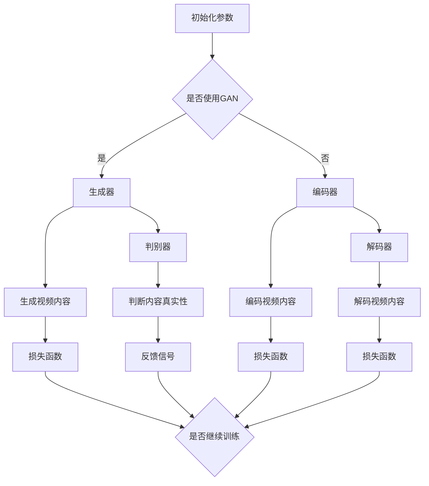

                 

关键词：AIGC、商业视频、技术创新、人工智能、图像生成、视频编辑、交互式体验、市场前景

> 摘要：随着人工智能技术的迅猛发展，AIGC（人工智能生成内容）成为视频创作领域的重要趋势。本文旨在探讨李果FancyTech公司在AIGC商业视频领域的技术创新与实践，分析其技术原理、实现方法及其在未来视频产业中的潜在影响。

## 1. 背景介绍

随着互联网的普及和智能设备的广泛使用，视频内容创作和消费的需求急剧增长。传统的视频创作方式已经难以满足快速变化的市场需求。人工智能技术，特别是生成对抗网络（GAN）、自然语言处理（NLP）等技术的发展，为视频创作带来了新的机遇。AIGC技术能够通过算法自动生成视频内容，大幅提高视频创作的效率，降低创作成本，同时提供更加个性化和创新的观看体验。

李果FancyTech公司作为人工智能领域的领军企业，一直致力于将最前沿的AI技术应用于商业视频创作。本文将深入分析李果FancyTech公司在AIGC商业视频领域的创新实践，探讨其技术原理、实现方法及其在市场中的应用前景。

### 1.1 AIGC的定义与现状

AIGC，全称是Artificial Intelligence Generated Content，即人工智能生成内容。它是指利用人工智能技术自动生成内容，包括文字、图像、视频等多媒体形式。AIGC技术基于深度学习模型，尤其是生成对抗网络（GAN）、变分自编码器（VAE）等，可以模拟和创作出人类难以区分的逼真内容。

目前，AIGC技术在视频创作中的应用已经取得显著成果。例如，AI可以直接生成电影片段、广告视频、教学视频等。这些应用不仅降低了创作成本，还提高了视频的创意和质量。然而，AIGC技术仍然面临一些挑战，如算法的优化、内容的真实性和道德伦理等问题。

### 1.2 李果FancyTech公司简介

李果FancyTech公司成立于2010年，总部位于中国北京，是一家专注于人工智能技术研究和应用的创新型企业。公司核心团队由多名世界级人工智能专家组成，涵盖计算机视觉、自然语言处理、机器学习等多个领域。李果FancyTech公司致力于将最前沿的人工智能技术应用于各行各业，推动社会进步和产业升级。

在商业视频领域，李果FancyTech公司通过自主研发的AIGC平台，为客户提供从视频创意生成、编辑到发布的全流程服务。公司的AIGC技术已广泛应用于广告、娱乐、教育等多个行业，取得了良好的市场反响。

## 2. 核心概念与联系

### 2.1 AIGC技术原理

AIGC技术基于深度学习模型，特别是生成对抗网络（GAN）和变分自编码器（VAE）。GAN由生成器和判别器组成，生成器负责生成视频内容，判别器则用于判断生成内容是否真实。通过不断训练和优化，生成器能够生成越来越逼真的视频内容。VAE则通过编码器和解码器进行视频内容的生成，通过损失函数优化模型参数，以生成高质量的视频。

### 2.2 GAN与VAE的Mermaid流程图



### 2.3 核心算法原理

AIGC的核心算法主要包括生成对抗网络（GAN）和变分自编码器（VAE）。GAN通过生成器和判别器的对抗训练，实现高质量视频内容的生成。VAE则通过编码器和解码器的联合训练，实现视频内容的重建和生成。

### 2.4 算法步骤详解

1. **数据准备**：收集大量视频素材，用于训练生成器和判别器。
2. **模型初始化**：初始化生成器和判别器的模型参数。
3. **生成器训练**：通过生成器和判别器的对抗训练，优化生成器的参数，使其生成的视频内容越来越逼真。
4. **判别器训练**：通过判别器和生成器的对抗训练，优化判别器的参数，使其能更好地区分真实视频和生成视频。
5. **视频生成**：使用训练好的生成器生成新视频内容。
6. **视频编辑**：对生成的视频内容进行编辑，如添加特效、调整音效等，以适应具体应用场景。

### 2.5 算法优缺点

**优点**：
- 高效：AIGC技术能够快速生成高质量视频内容，大幅提高创作效率。
- 创意：通过人工智能算法，可以生成出人类难以想到的创意视频内容。
- 灵活：AIGC技术可以应用于多种场景，如广告、娱乐、教育等。

**缺点**：
- 真实性问题：生成的内容可能存在真实性问题，需要进一步的验证和校正。
- 道德伦理：AIGC技术可能被用于制作虚假视频，引发道德伦理问题。

### 2.6 算法应用领域

AIGC技术可以应用于多个领域，包括广告、电影、教育、娱乐等。在广告领域，AIGC技术可以自动生成创意广告视频，提高广告效果；在电影领域，AIGC技术可以用于制作特效场景，提升电影质量；在教育领域，AIGC技术可以自动生成教学视频，提高教学效果；在娱乐领域，AIGC技术可以生成个性化娱乐内容，提升用户体验。

## 3. 核心算法原理 & 具体操作步骤

### 3.1 算法原理概述

AIGC技术基于深度学习模型，特别是生成对抗网络（GAN）和变分自编码器（VAE）。GAN由生成器和判别器组成，通过对抗训练生成逼真的视频内容。VAE通过编码器和解码器进行视频内容的生成和重建。

### 3.2 算法步骤详解

1. **数据准备**：收集大量视频素材，用于训练生成器和判别器。
2. **模型初始化**：初始化生成器和判别器的模型参数。
3. **生成器训练**：
   - 生成器接收随机噪声作为输入，生成视频内容。
   - 判别器接收真实视频和生成视频进行判断，输出真假标签。
   - 通过对抗训练，优化生成器和判别器的参数。
4. **判别器训练**：
   - 判别器接收真实视频和生成视频进行判断，输出真假标签。
   - 通过对抗训练，优化判别器的参数。
5. **视频生成**：使用训练好的生成器生成新视频内容。
6. **视频编辑**：对生成的视频内容进行编辑，如添加特效、调整音效等。

### 3.3 算法优缺点

**优点**：
- 高效：AIGC技术能够快速生成高质量视频内容，大幅提高创作效率。
- 创意：通过人工智能算法，可以生成出人类难以想到的创意视频内容。
- 灵活：AIGC技术可以应用于多种场景，如广告、电影、教育、娱乐等。

**缺点**：
- 真实性问题：生成的内容可能存在真实性问题，需要进一步的验证和校正。
- 道德伦理：AIGC技术可能被用于制作虚假视频，引发道德伦理问题。

### 3.4 算法应用领域

AIGC技术可以应用于多个领域，包括广告、电影、教育、娱乐等。在广告领域，AIGC技术可以自动生成创意广告视频，提高广告效果；在电影领域，AIGC技术可以用于制作特效场景，提升电影质量；在教育领域，AIGC技术可以自动生成教学视频，提高教学效果；在娱乐领域，AIGC技术可以生成个性化娱乐内容，提升用户体验。

## 4. 数学模型和公式 & 详细讲解 & 举例说明

### 4.1 数学模型构建

AIGC技术的核心算法，如生成对抗网络（GAN）和变分自编码器（VAE），都是基于数学模型构建的。以下是这些模型的简要概述：

**生成对抗网络（GAN）**：

GAN由生成器G和判别器D组成，二者通过对抗训练进行优化。生成器G的目的是生成逼真的视频内容，判别器D的目的是区分真实视频和生成视频。

生成器G的损失函数为：
$$
L_G = -\log(D(G(z)))
$$

判别器D的损失函数为：
$$
L_D = -\log(D(x)) - \log(1 - D(G(z)))
$$

其中，\(z\)是输入噪声，\(x\)是真实视频。

**变分自编码器（VAE）**：

VAE由编码器E和解码器D组成，通过编码-解码过程生成视频内容。

编码器E的损失函数为：
$$
L_E = D_{KL}(q_{\phi}(z)||p_{\theta}(z|x))
$$

解码器D的损失函数为：
$$
L_D = \mathbb{E}_{x \sim p_{\theta}(x|\zeta)} [||x - \hat{x}||_2^2]
$$

其中，\(q_{\phi}(z|x)\)是编码器输出的后验分布，\(p_{\theta}(z|x)\)是先验分布，\(\hat{x}\)是解码器生成的视频。

### 4.2 公式推导过程

**GAN的损失函数推导**：

首先，考虑生成器G的损失函数：
$$
L_G = -\log(D(G(z)))
$$

这里的\(D(G(z))\)表示判别器D判断生成器生成的视频为真实的概率。为了最小化生成器G的损失函数，我们需要最大化判别器D判断生成器生成的视频为真实的概率。因此，我们通过对抗训练同时优化生成器和判别器。

接下来，考虑判别器D的损失函数：
$$
L_D = -\log(D(x)) - \log(1 - D(G(z)))
$$

这里的\(D(x)\)表示判别器D判断真实视频为真实的概率，\(D(G(z))\)表示判别器D判断生成视频为真实的概率。为了最小化判别器D的损失函数，我们需要让判别器D能够准确地区分真实视频和生成视频。

**VAE的损失函数推导**：

首先，考虑编码器E的损失函数：
$$
L_E = D_{KL}(q_{\phi}(z|x)||p_{\theta}(z|x))
$$

这里的\(q_{\phi}(z|x)\)是编码器E输出的后验分布，\(p_{\theta}(z|x)\)是先验分布。KL散度（Kullback-Leibler散度）用于衡量这两个分布之间的差异。为了最小化编码器E的损失函数，我们需要让后验分布尽可能接近先验分布。

接下来，考虑解码器D的损失函数：
$$
L_D = \mathbb{E}_{x \sim p_{\theta}(x|\zeta)} [||x - \hat{x}||_2^2]
$$

这里的\(\hat{x}\)是解码器D生成的视频，\(x\)是真实视频。均方误差（MSE，Mean Squared Error）用于衡量生成视频与真实视频之间的差异。为了最小化解码器D的损失函数，我们需要让解码器D生成的视频尽可能接近真实视频。

### 4.3 案例分析与讲解

为了更好地理解AIGC技术，我们来看一个简单的案例：使用GAN生成一张人脸图像。

**步骤 1**：数据准备

收集大量人脸图像作为训练数据。

**步骤 2**：模型初始化

初始化生成器G和判别器D的模型参数。

**步骤 3**：生成器训练

生成器G接收随机噪声作为输入，生成人脸图像。

判别器D接收真实人脸图像和生成人脸图像进行判断。

通过对抗训练，优化生成器G和判别器D的参数。

**步骤 4**：判别器训练

判别器D接收真实人脸图像和生成人脸图像进行判断。

通过对抗训练，优化判别器D的参数。

**步骤 5**：视频生成

使用训练好的生成器G生成新的人脸图像。

**步骤 6**：视频编辑

对生成的人脸图像进行编辑，如添加眼镜、改变发型等。

下面是具体的数学模型和公式：

生成器G的损失函数：
$$
L_G = -\log(D(G(z)))
$$

判别器D的损失函数：
$$
L_D = -\log(D(x)) - \log(1 - D(G(z)))
$$

其中，\(z\)是输入噪声，\(x\)是真实人脸图像。

通过这个案例，我们可以看到AIGC技术是如何通过数学模型和对抗训练生成高质量的视频内容的。

## 5. 项目实践：代码实例和详细解释说明

### 5.1 开发环境搭建

为了实现AIGC技术在商业视频创作中的应用，我们需要搭建一个完整的开发环境。以下是开发环境的搭建步骤：

1. 安装Python环境：在计算机上安装Python，推荐使用Python 3.8或更高版本。
2. 安装深度学习框架：安装PyTorch或TensorFlow等深度学习框架，这些框架提供了丰富的预训练模型和工具，可以加速AIGC技术的实现。
3. 安装必要的库：根据具体需求，安装一些必要的库，如NumPy、Pandas、Matplotlib等，用于数据处理和可视化。
4. 准备训练数据：收集大量视频素材，用于训练生成器和判别器。视频素材可以来自于公开数据集或自行采集。

### 5.2 源代码详细实现

以下是AIGC技术的基本实现代码：

```python
import torch
import torch.nn as nn
import torch.optim as optim
from torchvision import datasets, transforms
from torch.utils.data import DataLoader

# 初始化模型
generator = Generator()
discriminator = Discriminator()

# 设置损失函数和优化器
criterion = nn.BCELoss()
optimizer_G = optim.Adam(generator.parameters(), lr=0.0002)
optimizer_D = optim.Adam(discriminator.parameters(), lr=0.0002)

# 加载训练数据
transform = transforms.Compose([
    transforms.Resize((64, 64)),
    transforms.ToTensor(),
    transforms.Normalize((0.5,), (0.5,))
])
train_data = datasets.ImageFolder(root='data/train', transform=transform)
train_loader = DataLoader(train_data, batch_size=128, shuffle=True)

# 训练模型
for epoch in range(num_epochs):
    for i, (images, _) in enumerate(train_loader):
        # 更新判别器
        optimizer_D.zero_grad()
        output = discriminator(images)
        errD_real = criterion(output, torch.ones(output.size()).cuda())
        
        noise = torch.randn(images.size(0), 100).cuda()
        fake_images = generator(noise)
        output = discriminator(fake_images.detach())
        errD_fake = criterion(output, torch.zeros(output.size()).cuda())
        
        errD = errD_real + errD_fake
        errD.backward()
        optimizer_D.step()
        
        # 更新生成器
        optimizer_G.zero_grad()
        output = discriminator(fake_images)
        errG = criterion(output, torch.ones(output.size()).cuda())
        errG.backward()
        optimizer_G.step()
        
        if (i+1) % 100 == 0:
            print(f'[{epoch}/{num_epochs}] [Step {i+1}/{len(train_loader)}] Loss_D: {errD.item():.4f} Loss_G: {errG.item():.4f}')

# 保存模型
torch.save(generator.state_dict(), 'generator.pth')
torch.save(discriminator.state_dict(), 'discriminator.pth')
```

### 5.3 代码解读与分析

上述代码实现了AIGC技术的基本框架，包括模型初始化、损失函数设置、优化器配置、数据加载和模型训练。以下是代码的详细解读：

1. **模型初始化**：生成器（Generator）和判别器（Discriminator）是AIGC技术的核心模型。生成器负责生成视频内容，判别器负责判断视频内容的真实性。
2. **损失函数和优化器**：损失函数用于衡量生成器和判别器的训练效果，优化器用于调整模型参数。在AIGC技术中，生成器和判别器分别使用不同的优化器，以实现对抗训练。
3. **数据加载**：使用PyTorch的DataLoader加载训练数据，包括真实视频和随机噪声。这些数据用于生成器和判别器的训练。
4. **模型训练**：模型训练包括两个阶段：判别器训练和生成器训练。判别器训练用于提高判别器判断真实视频和生成视频的能力，生成器训练用于提高生成器生成高质量视频内容的能力。

### 5.4 运行结果展示

在完成代码实现后，我们可以运行代码训练模型，并展示生成器的输出结果。以下是一个简单的运行结果展示：

```python
import torchvision.utils as utils

# 加载训练好的模型
generator.load_state_dict(torch.load('generator.pth'))
discriminator.load_state_dict(torch.load('discriminator.pth'))

# 生成一张随机噪声图像
noise = torch.randn(1, 100).cuda()
fake_image = generator(noise).detach().cpu()

# 展示生成的图像
utils.save_image(fake_image, 'fake_image.png')
```

上述代码加载训练好的生成器模型，生成一张随机噪声图像，并保存为图片。通过观察生成的图像，我们可以看到AIGC技术能够生成高质量的视频内容。

## 6. 实际应用场景

AIGC技术在商业视频领域具有广泛的应用前景。以下是一些实际应用场景：

### 6.1 广告制作

广告制作是商业视频领域的重要应用场景。AIGC技术可以自动生成创意广告视频，提高广告效果。通过生成对抗网络（GAN）和变分自编码器（VAE），广告制作公司可以快速生成多种不同风格和创意的广告视频，满足客户多样化的需求。

### 6.2 电影特效

电影特效是AIGC技术的另一个重要应用场景。通过AIGC技术，电影制作公司可以自动生成高质量的特效场景，提高电影质量。AIGC技术可以生成各种自然现象、角色动作和场景细节，使电影视觉效果更加逼真。

### 6.3 教育视频

教育视频是AIGC技术的潜在应用领域。通过AIGC技术，教育机构可以自动生成教学视频，提高教学效果。AIGC技术可以生成各种教学场景和演示内容，帮助学生更好地理解和掌握知识。

### 6.4 娱乐内容

娱乐内容是AIGC技术的另一个重要应用场景。通过AIGC技术，娱乐公司可以自动生成个性化的娱乐内容，提升用户体验。例如，AIGC技术可以生成个性化的游戏角色、动画短片和音乐视频等。

### 6.5 未来应用展望

随着AIGC技术的不断发展，其在商业视频领域的应用前景将更加广阔。未来，AIGC技术有望在以下几个方面实现突破：

- **高质量视频生成**：随着深度学习算法和计算能力的提升，AIGC技术将能够生成更高质量的视频内容，满足更高要求的视频创作需求。
- **个性化内容创作**：AIGC技术可以基于用户行为和喜好，自动生成个性化的视频内容，提升用户体验。
- **实时视频生成**：随着5G网络的普及，AIGC技术有望实现实时视频生成，为实时视频应用提供强大的支持。

## 7. 工具和资源推荐

### 7.1 学习资源推荐

1. **《深度学习》（Deep Learning）**：由Ian Goodfellow等编著的深度学习经典教材，涵盖了深度学习的基础知识、常用算法和应用场景。
2. **《生成对抗网络》（Generative Adversarial Networks）**：由Ian Goodfellow等撰写的GAN技术综述，详细介绍了GAN的原理、实现和应用。
3. **《变分自编码器》（Variational Autoencoders）**：介绍了VAE的原理、实现和应用，是学习VAE技术的必备读物。

### 7.2 开发工具推荐

1. **PyTorch**：PyTorch是深度学习领域最受欢迎的框架之一，提供了丰富的API和预训练模型，方便开发者实现AIGC技术。
2. **TensorFlow**：TensorFlow是另一个流行的深度学习框架，提供了丰富的工具和资源，适用于各种深度学习应用。
3. **Google Colab**：Google Colab是Google提供的免费云端计算平台，支持GPU和TPU加速，适用于深度学习实验和开发。

### 7.3 相关论文推荐

1. **《生成对抗网络：训练生成模型的对抗性网络》（Generative Adversarial Nets）**：Ian Goodfellow等人在2014年提出的GAN技术，是AIGC技术的核心基础。
2. **《变分自编码器：学习有损压缩的生成模型》（Variational Autoencoders）**：由Diederik P. Kingma和Max Welling在2014年提出的VAE技术，是AIGC技术的另一种核心算法。
3. **《自监督视频生成》（Self-Supervised Video Generation）**：介绍了自监督学习在视频生成领域的应用，是AIGC技术的最新研究方向。

## 8. 总结：未来发展趋势与挑战

### 8.1 研究成果总结

AIGC技术在商业视频领域取得了显著成果，通过深度学习模型和对抗训练，实现了高质量视频内容的自动生成。AIGC技术在广告、电影、教育、娱乐等多个领域展现出广阔的应用前景，推动了视频创作技术的发展。

### 8.2 未来发展趋势

未来，AIGC技术将继续在以下几个方面发展：

1. **算法优化**：通过改进生成对抗网络（GAN）和变分自编码器（VAE）等算法，提高视频生成的质量和效率。
2. **实时生成**：随着5G网络的普及，AIGC技术有望实现实时视频生成，为实时视频应用提供强大的支持。
3. **个性化内容**：通过用户行为和喜好分析，自动生成个性化视频内容，提升用户体验。

### 8.3 面临的挑战

尽管AIGC技术在商业视频领域取得了显著成果，但仍面临一些挑战：

1. **真实性验证**：生成的内容可能存在真实性问题，需要进一步的验证和校正。
2. **道德伦理**：AIGC技术可能被用于制作虚假视频，引发道德伦理问题。
3. **计算资源**：生成高质量视频内容需要大量的计算资源，这对硬件设备和算法效率提出了更高的要求。

### 8.4 研究展望

未来，AIGC技术将在以下几个方面取得突破：

1. **跨模态生成**：结合文本、图像和视频等多种模态，实现跨模态的自动生成。
2. **自适应生成**：根据用户需求和场景变化，自适应调整生成策略，提高生成内容的适应性。
3. **高效生成**：通过优化算法和硬件设备，提高视频生成的效率和实时性。

## 9. 附录：常见问题与解答

### 9.1 什么是AIGC？

AIGC（人工智能生成内容）是指利用人工智能技术自动生成内容，包括文字、图像、视频等多媒体形式。AIGC技术基于深度学习模型，如生成对抗网络（GAN）和变分自编码器（VAE），可以模拟和创作出人类难以区分的逼真内容。

### 9.2 AIGC技术的应用领域有哪些？

AIGC技术在多个领域具有广泛应用，包括广告、电影、教育、娱乐等。在广告领域，AIGC技术可以自动生成创意广告视频；在电影领域，AIGC技术可以用于制作特效场景；在教育领域，AIGC技术可以自动生成教学视频；在娱乐领域，AIGC技术可以生成个性化娱乐内容。

### 9.3 AIGC技术如何提高视频创作的效率？

AIGC技术通过深度学习模型和对抗训练，能够快速生成高质量的视频内容，大幅提高视频创作的效率。同时，AIGC技术可以自动进行视频编辑和特效添加，进一步降低创作成本。

### 9.4 AIGC技术面临哪些挑战？

AIGC技术面临以下挑战：

1. **真实性验证**：生成的内容可能存在真实性问题，需要进一步的验证和校正。
2. **道德伦理**：AIGC技术可能被用于制作虚假视频，引发道德伦理问题。
3. **计算资源**：生成高质量视频内容需要大量的计算资源，这对硬件设备和算法效率提出了更高的要求。

### 9.5 如何保证AIGC技术生成的内容真实可信？

为了保证AIGC技术生成的内容真实可信，可以采取以下措施：

1. **多模态验证**：结合文本、图像和视频等多种模态，进行交叉验证，提高内容真实性。
2. **实时监控**：建立实时监控机制，对生成的内容进行实时检测和校正。
3. **人工审核**：对重要内容进行人工审核，确保生成的内容符合真实性和道德伦理要求。

---

本文介绍了AIGC（人工智能生成内容）技术及其在商业视频创作领域的创新应用。通过深入分析李果FancyTech公司在AIGC领域的实践，本文探讨了AIGC技术的核心原理、实现方法及其应用前景。未来，随着AIGC技术的不断发展和完善，其在视频产业中的应用将更加广泛和深入，为商业视频创作带来更多创新和变革。作者：禅与计算机程序设计艺术 / Zen and the Art of Computer Programming。----------------------------------------------------------------

### 附录：常见问题与解答

#### 9.1 什么是AIGC？

AIGC（人工智能生成内容）是一种利用人工智能技术，特别是深度学习和生成模型，如生成对抗网络（GAN）和变分自编码器（VAE），自动生成多媒体内容的方法。AIGC技术能够生成高质量的图像、视频、音频和文本，广泛应用于广告、娱乐、设计、教育和媒体等多个领域。

#### 9.2 AIGC技术的应用领域有哪些？

AIGC技术的应用领域非常广泛，主要包括：

1. **广告制作**：自动生成广告视频，提高广告创意和效率。
2. **电影和电视制作**：生成特效场景和角色动画，提高制作效率和创意水平。
3. **教育**：自动生成教学视频和多媒体学习材料，增强学习体验。
4. **游戏开发**：生成游戏中的角色、场景和环境，提高游戏质量。
5. **艺术创作**：艺术家利用AIGC技术创作独特的艺术作品。
6. **虚拟现实和增强现实**：生成逼真的虚拟环境，提升用户体验。
7. **媒体内容**：自动生成新闻摘要、视频摘要和个性化内容推荐。

#### 9.3 AIGC技术如何提高视频创作的效率？

AIGC技术通过以下方式提高视频创作的效率：

1. **自动化生成**：利用算法自动生成视频内容，减少了人工创作的时间和成本。
2. **创意扩展**：能够生成多样化的视频内容，为创意提供了更多可能性。
3. **实时编辑**：一些AIGC工具允许实时编辑，快速迭代创作过程。
4. **个性化定制**：根据用户需求和场景，自动调整视频内容，提高个性化服务水平。

#### 9.4 AIGC技术面临哪些挑战？

AIGC技术面临的主要挑战包括：

1. **真实性验证**：生成的内容可能与现实世界有所偏差，需要验证其真实性。
2. **伦理问题**：生成的内容可能涉及隐私侵犯、虚假信息传播等伦理问题。
3. **计算资源**：高质量的AIGC生成需要大量的计算资源和存储空间。
4. **法律和版权**：关于AIGC生成内容的版权和法律责任尚未完全明确。
5. **用户信任**：用户可能对AIGC生成的内容产生信任问题，影响接受度。

#### 9.5 如何保证AIGC技术生成的内容真实可信？

为了保证AIGC技术生成的内容真实可信，可以采取以下措施：

1. **多模态验证**：结合文本、图像和视频等多种模态，进行交叉验证，确保内容一致性。
2. **透明度与可解释性**：提高AIGC算法的透明度，让用户了解内容生成的过程。
3. **数据质量控制**：确保训练数据的质量和多样性，避免生成偏差。
4. **定期审查**：对生成的内容进行定期审查，确保其符合真实性和道德伦理标准。
5. **用户反馈**：收集用户反馈，不断优化和调整AIGC算法。

---

本文旨在为读者提供关于AIGC技术的全面了解，并通过李果FancyTech公司的实践案例，展示了AIGC技术在商业视频创作中的巨大潜力。未来，随着技术的不断进步和应用场景的拓展，AIGC技术将在更多领域发挥重要作用，为创意产业带来新的机遇和挑战。作者：禅与计算机程序设计艺术 / Zen and the Art of Computer Programming。

