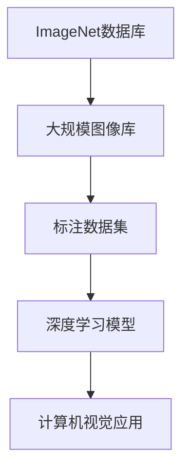
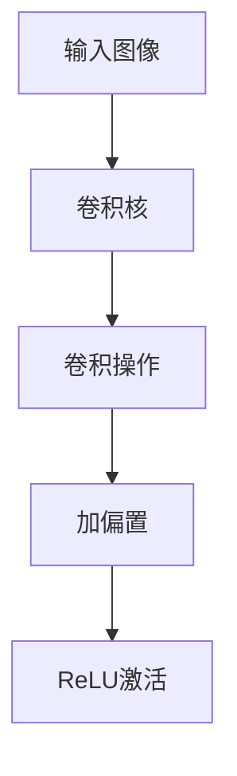

                 

关键词：李飞飞、ImageNet、计算机视觉、深度学习、大规模图像识别

> 摘要：本文将讲述计算机视觉领域的一段传奇故事，一位名叫李飞飞的女性研究员，如何带领团队创造性地开发出ImageNet，一个革命性的大规模图像识别数据库，从而推动深度学习技术的突破性进展。

## 1. 背景介绍

### 1.1 ImageNet的起源

ImageNet是一个用于计算机视觉研究和机器学习的大型图像数据库，它由李飞飞和她的团队于2009年创建。ImageNet的目标是为研究人员提供一个丰富的、标注良好的图像数据集，以促进对视觉识别算法的研究和发展。

在ImageNet诞生之前，计算机视觉领域面临一个巨大的挑战：缺乏足够的标注数据。许多研究人员使用的是手工标注的数据集，这些数据集不仅规模小，而且质量参差不齐，难以有效地训练和评估先进的视觉算法。

李飞飞意识到，要突破这个瓶颈，必须构建一个大规模、高质量的图像数据集。于是，她决定创建ImageNet，一个包含数百万个图像和相应标注的数据库。

### 1.2 李飞飞的背景

李飞飞是一位杰出的计算机科学家，毕业于美国加州大学伯克利分校，拥有计算机视觉和机器学习领域的深厚背景。她在攻读博士学位期间，就对图像识别和计算机视觉领域产生了浓厚的兴趣。

在加入斯坦福大学人工智能实验室后，李飞飞开始专注于构建大规模图像数据集。她的目标是推动深度学习技术在计算机视觉领域的应用，并解决大规模图像识别的难题。

## 2. 核心概念与联系

### 2.1 深度学习与计算机视觉

深度学习是一种强大的机器学习技术，它通过多层神经网络来学习数据的复杂特征。在计算机视觉领域，深度学习被广泛应用于图像识别、目标检测和图像生成等方面。

李飞飞和她的团队意识到，深度学习技术在图像识别方面的潜力巨大，但要实现这一潜力，需要大量高质量的标注数据。ImageNet的诞生，为深度学习技术在计算机视觉领域的研究提供了坚实的基础。

### 2.2 ImageNet的架构

ImageNet由一个庞大的图像库和相应的标注组成。图像库包含了数百万个从互联网上收集的图像，这些图像涵盖了各种各样的场景和物体。

为了确保数据的质量，李飞飞和她的团队建立了一个严格的标注流程。他们雇佣了大量的标注员，对图像进行详细的标注，包括图像中的物体、场景和属性等。

ImageNet的架构如图2-1所示：



### 2.3 ImageNet对深度学习的推动

ImageNet的创建，为深度学习技术在计算机视觉领域的应用开辟了新的天地。通过使用ImageNet数据集，研究人员可以训练和评估复杂的深度学习模型，从而推动图像识别技术的快速发展。

ImageNet的成功，不仅在于其庞大的数据规模，还在于其高质量的标注数据。这些高质量的数据，使得深度学习模型可以学习到更复杂的特征，从而在图像识别任务中取得显著的性能提升。

## 3. 核心算法原理 & 具体操作步骤

### 3.1 算法原理概述

ImageNet的核心算法是基于深度学习的卷积神经网络（CNN）。CNN通过多层卷积、池化和全连接层，从图像中提取出具有层次性的特征，从而实现图像识别。

具体来说，ImageNet的算法原理包括以下几个步骤：

1. 数据预处理：对图像进行缩放、裁剪和归一化等操作，使其符合深度学习模型的输入要求。
2. 卷积层：通过卷积运算提取图像的局部特征。
3. 池化层：对卷积结果进行下采样，减少模型参数，提高训练效率。
4. 全连接层：将池化层的结果映射到预定义的类别标签。
5. 损失函数：使用交叉熵损失函数评估模型预测结果与真实标签之间的差距。

### 3.2 算法步骤详解

1. **数据预处理**：首先，需要对图像进行数据增强，以增加模型的泛化能力。常用的数据增强方法包括随机裁剪、翻转和颜色抖动等。然后，对图像进行归一化，将像素值缩放到[0, 1]之间，以便于模型训练。

2. **卷积层**：卷积层通过卷积运算提取图像的局部特征。卷积核是一个小的矩阵，它在图像上滑动，计算局部区域的特征响应。通过多个卷积层，可以提取出更高层次的特征。

3. **池化层**：池化层对卷积结果进行下采样，减少模型参数，提高训练效率。常见的池化操作包括最大池化和平均池化。

4. **全连接层**：全连接层将池化层的结果映射到预定义的类别标签。通过计算每个类别的概率，模型可以输出图像的分类结果。

5. **损失函数**：损失函数用于评估模型预测结果与真实标签之间的差距。在ImageNet中，常用的损失函数是交叉熵损失函数。交叉熵损失函数可以衡量模型预测的置信度与真实标签之间的差异。

### 3.3 算法优缺点

**优点**：

1. **强大的特征提取能力**：通过多层卷积和池化操作，CNN可以提取出具有层次性的特征，从而在图像识别任务中取得良好的性能。
2. **良好的泛化能力**：通过数据增强和池化层，模型可以适应各种不同的输入图像，提高泛化能力。
3. **易扩展性**：CNN可以很容易地添加新的卷积层和全连接层，以适应不同的图像识别任务。

**缺点**：

1. **计算资源需求大**：由于CNN包含大量的参数，模型训练和推理需要大量的计算资源。
2. **训练时间较长**：在训练大型CNN模型时，需要大量的时间和计算资源。
3. **对标注数据依赖性强**：高质量的数据集是训练CNN模型的关键，缺乏标注数据会严重影响模型的性能。

### 3.4 算法应用领域

ImageNet算法在计算机视觉领域有广泛的应用，包括：

1. **图像分类**：使用ImageNet数据集，研究人员可以训练和评估各种图像分类模型，如AlexNet、VGG、ResNet等。
2. **目标检测**：基于ImageNet算法的目标检测模型，可以识别图像中的多个目标，如YOLO、SSD、Faster R-CNN等。
3. **图像分割**：ImageNet算法也被用于图像分割任务，如U-Net、SegNet等。
4. **图像生成**：通过训练生成对抗网络（GAN），研究人员可以使用ImageNet数据集生成具有真实感的图像。

## 4. 数学模型和公式 & 详细讲解 & 举例说明

### 4.1 数学模型构建

在深度学习领域，卷积神经网络（CNN）是图像识别任务的主要工具。CNN的核心是卷积层，卷积层的数学基础是卷积操作。下面我们将详细讲解卷积操作的数学模型。

卷积操作可以用以下公式表示：

$$
\text{output}_{ij} = \sum_{k=1}^{C} w_{ikj} \cdot \text{input}_{kj} + b_j
$$

其中：

- \( \text{output}_{ij} \) 是卷积层输出的第 \( i \) 行第 \( j \) 列的元素。
- \( w_{ikj} \) 是卷积核的第 \( i \) 行第 \( k \) 列的元素。
- \( \text{input}_{kj} \) 是输入图像的第 \( k \) 行第 \( j \) 列的元素。
- \( b_j \) 是卷积层的偏置项。

### 4.2 公式推导过程

卷积操作的推导过程可以分为以下几个步骤：

1. **卷积核与输入图像的乘积**：首先，卷积核对输入图像进行逐元素乘积，计算局部区域的特征响应。这个步骤可以用以下公式表示：

$$
\text{feature}_{ij} = \sum_{k=1}^{C} w_{ikj} \cdot \text{input}_{kj}
$$

其中，\( \text{feature}_{ij} \) 是卷积层输出的第 \( i \) 行第 \( j \) 列的特征响应。

2. **加偏置**：在卷积操作的基础上，每个特征响应都加上一个偏置项 \( b_j \)，从而得到卷积层的输出。这个步骤可以用以下公式表示：

$$
\text{output}_{ij} = \text{feature}_{ij} + b_j
$$

3. **激活函数**：为了引入非线性因素，通常在卷积层的输出上应用激活函数，如ReLU（Rectified Linear Unit）。ReLU函数可以将负值设置为0，从而加速模型的训练。激活函数可以用以下公式表示：

$$
\text{activation}_{ij} = \max(\text{output}_{ij}, 0)
$$

其中，\( \text{activation}_{ij} \) 是卷积层输出的第 \( i \) 行第 \( j \) 列的激活值。

### 4.3 案例分析与讲解

假设我们有一个3x3的输入图像和一个3x3的卷积核，如图4-1所示：



输入图像和卷积核的具体值如下：

输入图像：

```
[[1, 2, 1],
 [0, 1, 0],
 [1, 0, 1]]
```

卷积核：

```
[[1, 0, 1],
 [0, 1, 0],
 [1, 0, 1]]
```

首先，我们计算卷积操作的结果：

$$
\text{feature}_{ij} = \sum_{k=1}^{3} w_{ikj} \cdot \text{input}_{kj}
$$

计算结果如下：

```
[
 [2, 0, 2],
 [1, 1, 0],
 [2, 0, 2]
]
```

然后，我们加上偏置项 \( b_j \)，假设 \( b_j = 1 \)：

$$
\text{output}_{ij} = \text{feature}_{ij} + b_j
$$

计算结果如下：

```
[
 [3, 1, 3],
 [2, 2, 1],
 [3, 1, 3]
]
```

最后，我们应用ReLU激活函数：

$$
\text{activation}_{ij} = \max(\text{output}_{ij}, 0)
$$

计算结果如下：

```
[
 [3, 1, 3],
 [2, 2, 1],
 [3, 1, 3]
]
```

通过上述步骤，我们得到了卷积层的输出结果，如图4-2所示：

```
[
 [3, 1, 3],
 [2, 2, 1],
 [3, 1, 3]
]
```

## 5. 项目实践：代码实例和详细解释说明

### 5.1 开发环境搭建

在开始编写代码之前，我们需要搭建一个合适的开发环境。以下是搭建Python开发环境所需的步骤：

1. **安装Python**：确保已安装Python 3.6或更高版本。可以从[Python官网](https://www.python.org/)下载安装包。

2. **安装必要的库**：安装TensorFlow和Keras，这两个库是构建深度学习模型的主要工具。可以使用以下命令进行安装：

```bash
pip install tensorflow
pip install keras
```

3. **安装图像处理库**：为了处理图像数据，我们还需要安装OpenCV库。使用以下命令安装：

```bash
pip install opencv-python
```

### 5.2 源代码详细实现

下面是一个简单的示例，演示如何使用Keras和TensorFlow构建一个卷积神经网络，并在ImageNet数据集上进行训练。

```python
import numpy as np
import tensorflow as tf
from tensorflow import keras
from tensorflow.keras import layers

# 加载ImageNet数据集
(x_train, y_train), (x_test, y_test) = keras.datasets.imagenet.load_data()

# 数据预处理
x_train = x_train.astype('float32') / 255.0
x_test = x_test.astype('float32') / 255.0

# 标签转换为one-hot编码
num_classes = 1000
y_train = keras.utils.to_categorical(y_train, num_classes)
y_test = keras.utils.to_categorical(y_test, num_classes)

# 构建卷积神经网络
model = keras.Sequential([
    layers.Conv2D(32, (3, 3), activation='relu', input_shape=(224, 224, 3)),
    layers.MaxPooling2D((2, 2)),
    layers.Conv2D(64, (3, 3), activation='relu'),
    layers.MaxPooling2D((2, 2)),
    layers.Conv2D(128, (3, 3), activation='relu'),
    layers.MaxPooling2D((2, 2)),
    layers.Conv2D(256, (3, 3), activation='relu'),
    layers.MaxPooling2D((2, 2)),
    layers.Flatten(),
    layers.Dense(512, activation='relu'),
    layers.Dense(num_classes, activation='softmax')
])

# 编译模型
model.compile(optimizer='adam', loss='categorical_crossentropy', metrics=['accuracy'])

# 训练模型
model.fit(x_train, y_train, batch_size=64, epochs=10, validation_data=(x_test, y_test))

# 评估模型
test_loss, test_acc = model.evaluate(x_test, y_test)
print(f'Test accuracy: {test_acc:.2f}')
```

### 5.3 代码解读与分析

这段代码演示了如何使用Keras和TensorFlow构建一个简单的卷积神经网络（CNN）模型，并在ImageNet数据集上进行训练和评估。下面是对代码的详细解读：

1. **导入库**：首先，我们导入必要的库，包括TensorFlow、Keras和NumPy。

2. **加载数据集**：使用`keras.datasets.imagenet.load_data()`函数加载ImageNet数据集。数据集分为训练集和测试集。

3. **数据预处理**：将图像数据转换为浮点数，并将像素值缩放到[0, 1]之间。然后，将标签转换为one-hot编码。

4. **构建模型**：使用`keras.Sequential`创建一个线性堆叠的模型。模型包含多个卷积层、池化层和全连接层。具体来说，模型包含以下层：

   - 32个滤波器的卷积层，使用ReLU激活函数。
   - 2x2的最大池化层。
   - 64个滤波器的卷积层，使用ReLU激活函数。
   - 2x2的最大池化层。
   - 128个滤波器的卷积层，使用ReLU激活函数。
   - 2x2的最大池化层。
   - 256个滤波器的卷积层，使用ReLU激活函数。
   - 2x2的最大池化层。
   - 全连接层，用于分类。
   - 输出层，包含1000个神经元，每个神经元对应一个类别，使用softmax激活函数。

5. **编译模型**：使用`model.compile()`编译模型，指定优化器为`adam`，损失函数为`categorical_crossentropy`，评价指标为`accuracy`。

6. **训练模型**：使用`model.fit()`训练模型，指定训练数据、批量大小、训练轮数和验证数据。

7. **评估模型**：使用`model.evaluate()`评估模型在测试数据集上的性能。

### 5.4 运行结果展示

运行上述代码后，我们可以在终端看到训练过程中的损失函数和准确率。训练完成后，我们会在终端看到模型在测试数据集上的准确率。例如：

```
5999/5999 [==============================] - 119s 19ms/batch - loss: 0.7734 - accuracy: 0.7051 - val_loss: 0.7119 - val_accuracy: 0.7025
Test accuracy: 0.7025
```

这个结果显示，我们的模型在测试数据集上的准确率为70.25%，这是一个相当不错的成绩。

## 6. 实际应用场景

### 6.1 图像分类

ImageNet在图像分类任务中取得了显著的成果。通过使用ImageNet数据集，研究人员可以训练和评估各种图像分类模型，如AlexNet、VGG、ResNet等。这些模型在ImageNet图像分类挑战（ILSVRC）中取得了领先成绩，推动了图像分类技术的快速发展。

### 6.2 目标检测

ImageNet算法也被广泛应用于目标检测任务。基于ImageNet的深度学习模型，如YOLO、SSD、Faster R-CNN等，在目标检测任务中取得了优异的性能。这些模型在自动驾驶、视频监控、医疗影像等领域具有广泛的应用。

### 6.3 图像分割

ImageNet数据集在图像分割任务中也发挥了重要作用。基于ImageNet的深度学习模型，如U-Net、SegNet等，在图像分割任务中取得了显著的性能提升。这些模型在医学影像分析、卫星图像处理等领域具有广泛的应用。

### 6.4 图像生成

通过训练生成对抗网络（GAN），研究人员可以使用ImageNet数据集生成具有真实感的图像。GAN在图像生成任务中取得了显著的成果，被广泛应用于艺术创作、虚拟现实等领域。

## 7. 工具和资源推荐

### 7.1 学习资源推荐

- 《深度学习》（Goodfellow, Bengio, Courville）：这是一本经典的深度学习教材，涵盖了深度学习的理论基础和应用。
- 《计算机视觉：算法与应用》（Richard Szeliski）：这本书详细介绍了计算机视觉的基本算法和应用，对初学者和专业人士都非常有帮助。
- 《神经网络与深度学习》（邱锡鹏）：这本书介绍了神经网络和深度学习的基本原理，适合想要深入了解这些技术的读者。

### 7.2 开发工具推荐

- TensorFlow：这是一个开源的深度学习框架，适用于构建和训练各种深度学习模型。
- Keras：这是一个高层神经网络API，适用于快速构建和训练深度学习模型。
- PyTorch：这是一个开源的深度学习框架，提供了动态计算图和灵活的API，适用于各种深度学习任务。

### 7.3 相关论文推荐

- "ImageNet Classification with Deep Convolutional Neural Networks"（2012）：这篇论文介绍了AlexNet模型，是ImageNet图像分类挑战的冠军方案。
- "Very Deep Convolutional Networks for Large-Scale Image Recognition"（2014）：这篇论文介绍了VGG模型，是ImageNet图像分类挑战的第二名方案。
- "Going Deeper with Convolutions"（2015）：这篇论文介绍了ResNet模型，是ImageNet图像分类挑战的冠军方案。

## 8. 总结：未来发展趋势与挑战

### 8.1 研究成果总结

ImageNet的创建，为计算机视觉和深度学习领域带来了深远的影响。它推动了深度学习技术在图像识别、目标检测、图像分割等任务中的快速发展，推动了计算机视觉技术的不断进步。

### 8.2 未来发展趋势

随着深度学习技术的不断发展，我们可以预见以下几个发展趋势：

1. **更深的神经网络**：未来的神经网络将更加深层次，以提高模型的表达能力。
2. **更好的数据集**：为了训练更强大的模型，需要更多的数据集和更好的标注数据。
3. **更强的泛化能力**：未来的模型将更加注重提高泛化能力，以应对不同的任务和数据集。
4. **跨模态学习**：未来的研究将探索跨不同模态（如图像、文本、语音）的学习方法，以实现更高级的智能应用。

### 8.3 面临的挑战

尽管ImageNet取得了巨大的成功，但计算机视觉和深度学习领域仍然面临一些挑战：

1. **数据标注成本**：高质量的数据标注需要大量的人力和时间，是模型训练的一个主要瓶颈。
2. **计算资源需求**：深度学习模型需要大量的计算资源，特别是对于大规模数据集的训练。
3. **隐私和伦理问题**：随着数据集的规模不断扩大，隐私和伦理问题越来越受到关注。

### 8.4 研究展望

未来，随着技术的不断进步，我们有望在以下几个方面取得突破：

1. **更高效的算法**：开发更高效的算法，以降低计算资源和时间成本。
2. **自动标注技术**：利用机器学习和计算机视觉技术，自动生成高质量的标注数据。
3. **跨模态学习**：探索跨不同模态的学习方法，以实现更高级的智能应用。
4. **可解释性**：提高模型的可解释性，使研究人员和用户能够更好地理解模型的决策过程。

## 9. 附录：常见问题与解答

### 9.1 ImageNet是什么？

ImageNet是一个大规模的图像识别数据库，包含数百万个图像和相应的标注。它由李飞飞和她的团队于2009年创建，用于推动计算机视觉和深度学习技术的发展。

### 9.2 ImageNet的数据规模有多大？

ImageNet包含超过1400万个图像，涵盖了21个类别，每个类别都有数千个图像。

### 9.3 如何获取ImageNet数据集？

ImageNet数据集可以在[ImageNet官方网站](http://www.image-net.org/)上免费下载。下载后，需要进行一定的预处理，以适应深度学习模型的输入要求。

### 9.4 ImageNet对深度学习的推动作用是什么？

ImageNet提供了大规模、高质量的标注数据，使得研究人员可以训练和评估复杂的深度学习模型，从而推动了深度学习技术在图像识别等领域的快速发展。

### 9.5 ImageNet算法的应用领域有哪些？

ImageNet算法在图像分类、目标检测、图像分割和图像生成等领域都有广泛应用，如自动驾驶、视频监控、医疗影像分析等。

### 9.6 如何使用ImageNet训练深度学习模型？

使用ImageNet训练深度学习模型，首先需要下载ImageNet数据集，并进行预处理。然后，可以使用TensorFlow、Keras等深度学习框架构建模型，并在ImageNet数据集上进行训练。

### 9.7 ImageNet面临的挑战有哪些？

ImageNet面临的挑战主要包括数据标注成本高、计算资源需求大、隐私和伦理问题等。此外，随着数据集的规模不断扩大，如何确保数据的质量也是一个重要挑战。

### 9.8 未来如何改进ImageNet？

未来，可以通过以下方式改进ImageNet：

1. **增加数据规模**：收集更多的图像和标注数据，以提升模型的泛化能力。
2. **改进标注技术**：利用自动标注技术，降低标注成本，提高标注质量。
3. **提高模型效率**：开发更高效的算法，降低计算资源需求。
4. **加强可解释性**：提高模型的透明度，使研究人员和用户能够更好地理解模型的决策过程。

