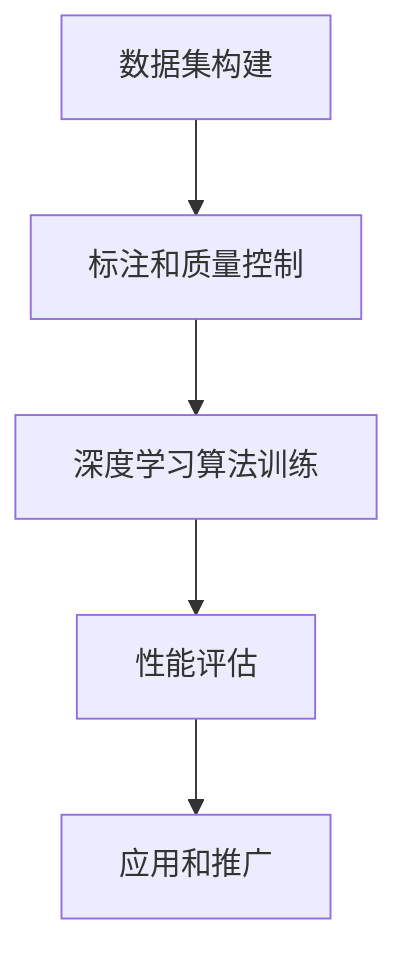

                 

关键词：李飞飞，ImageNet，计算机视觉，深度学习，图像识别，大规模数据集，人工智能，技术突破

摘要：本文将探讨李飞飞在计算机视觉领域的杰出贡献，特别是她对ImageNet项目的领导和推动。ImageNet不仅改变了计算机视觉的研究范式，还为深度学习的发展奠定了坚实基础。通过分析ImageNet的数据集构建、评估方法和应用效果，我们将深入理解李飞飞及其团队如何推动人工智能领域的前进。

## 1. 背景介绍

李飞飞（Fei-Fei Li）是一位在计算机视觉和人工智能领域享有盛誉的学者。她现任斯坦福大学计算机科学系的教授，并在人工智能公司Google Brain担任领导角色。李飞飞在计算机视觉领域的贡献不可估量，而ImageNet项目无疑是其中的里程碑。

ImageNet是由李飞飞和她的同事于2009年发起的一个大规模图像识别数据集。这个项目旨在构建一个包含1000个类别的图像库，每种类别有数千张图片，用于推动计算机视觉技术的发展。在此之前，大多数计算机视觉研究依赖于小规模的数据集，如MIT的Caltech-256和PASCAL VOC，这些数据集限制了算法的性能和应用范围。

### 1.1 项目动机

李飞飞和她的团队认为，要真正实现计算机视觉的突破，需要一个大规模、多样化和结构化的数据集。他们希望通过ImageNet来挑战当时的计算机视觉算法，并推动深度学习技术在图像识别领域的应用。ImageNet的愿景是成为计算机视觉研究的基准数据集，类似于物理学中的标准粒子物理实验。

### 1.2 数据集构建

ImageNet的构建是一个庞大的工程，涉及了数以千计的标注者和数百万小时的标注工作。李飞飞和她的团队设计了一套详细的标注流程和质量控制机制，以确保图像的准确性和一致性。他们还创建了一个在线平台，允许用户参与数据集的构建和评估。

### 1.3 项目影响

ImageNet的发布不仅改变了计算机视觉的研究范式，还为深度学习的发展奠定了基础。深度学习算法在大规模数据集上的训练使得计算机视觉任务的性能大幅提升，从简单的图像分类到复杂的场景理解。ImageNet的成功也激励了更多的研究人员和公司投入计算机视觉和人工智能领域。

## 2. 核心概念与联系

为了深入理解ImageNet项目的核心概念和联系，我们需要首先了解计算机视觉和深度学习的基础知识。

### 2.1 计算机视觉

计算机视觉是一门研究如何使计算机“看懂”图像和视频的学科。它涉及到图像处理、模式识别和机器学习等多个领域。在计算机视觉中，图像识别是一个核心问题，即给定一个图像，判断它包含的内容。

### 2.2 深度学习

深度学习是机器学习中的一个分支，它通过多层神经网络来学习数据的表示。深度学习在图像识别、自然语言处理和语音识别等领域取得了显著的成功。在图像识别中，深度学习算法可以自动学习图像的特征，从而实现高效的分类和识别。

### 2.3 ImageNet与深度学习的联系

ImageNet的发布为深度学习提供了大规模的数据集，使得深度学习算法可以在实际场景中应用并取得突破性的成果。ImageNet的图像库包含了广泛的场景和物体，为深度学习算法提供了丰富的训练数据，从而提高了算法的泛化能力。

### 2.4 Mermaid 流程图



在这个流程图中，A表示数据集的构建，B表示标注和质量控制，C表示深度学习算法的训练，D表示性能评估，E表示应用和推广。这个流程图清晰地展示了ImageNet项目从数据集构建到应用的全过程。

## 3. 核心算法原理 & 具体操作步骤

### 3.1 算法原理概述

ImageNet项目的核心算法是基于深度学习的卷积神经网络（CNN）。CNN通过多层卷积和池化操作来提取图像的特征，从而实现图像分类。ImageNet项目使用了大量的训练数据来训练CNN，从而提高了分类的准确性。

### 3.2 算法步骤详解

#### 3.2.1 数据集准备

首先，需要准备一个包含大量图像的数据集。ImageNet项目使用了数百万张图像来构建数据集，这些图像来自互联网上的多个来源。

#### 3.2.2 标注

对图像进行标注是构建数据集的重要步骤。ImageNet项目使用了人工标注和自动化标注相结合的方法。标注员对图像进行分类标注，标注结果经过质量控制后用于训练数据集。

#### 3.2.3 数据预处理

在训练模型之前，需要对图像进行预处理。这包括图像缩放、裁剪、翻转等操作，以增加数据集的多样性。

#### 3.2.4 模型训练

使用预处理后的数据集训练CNN模型。训练过程包括前向传播、反向传播和权重更新。通过不断迭代训练，模型会逐渐学习到图像的特征。

#### 3.2.5 性能评估

在训练完成后，需要评估模型的性能。通常使用交叉验证和测试集来评估模型的准确性、召回率和F1分数等指标。

### 3.3 算法优缺点

#### 优点：

1. 高准确性：通过大规模数据集训练，CNN模型在图像分类任务中取得了极高的准确性。
2. 泛化能力强：ImageNet项目的数据集包含广泛的场景和物体，使得模型具有更强的泛化能力。
3. 推动深度学习发展：ImageNet的成功推动了深度学习在计算机视觉领域的发展，激发了更多研究者和公司的投入。

#### 缺点：

1. 计算资源消耗大：训练大规模CNN模型需要大量的计算资源和时间。
2. 数据集构建成本高：ImageNet项目的数据集构建需要大量的人工标注和审核工作，成本较高。

### 3.4 算法应用领域

ImageNet算法在多个领域取得了显著的应用成果，包括：

1. 图像分类：在大型图像库中进行图像分类，用于图像搜索、内容审核等应用。
2. 物体检测：在图像中检测和定位物体，用于自动驾驶、安全监控等应用。
3. 图像生成：通过深度学习模型生成新的图像，用于艺术创作、虚拟现实等应用。

## 4. 数学模型和公式 & 详细讲解 & 举例说明

### 4.1 数学模型构建

ImageNet项目的数学模型是基于深度学习的卷积神经网络（CNN）。CNN的核心是卷积层、池化层和全连接层。

#### 4.1.1 卷积层

卷积层通过卷积运算提取图像的特征。卷积运算的公式如下：

$$
\text{output}(i,j) = \sum_{k} \text{weight}(i,j,k) \times \text{input}(i,j,k)
$$

其中，output(i,j)表示输出特征值，weight(i,j,k)表示卷积核的权重，input(i,j,k)表示输入图像的特征值。

#### 4.1.2 池化层

池化层用于降低特征图的维度，常用的池化操作有最大池化和平均池化。最大池化的公式如下：

$$
\text{output}(i,j) = \max \{ \text{input}(i',j') | i' \in [i-\frac{F}{2}, i+\frac{F}{2}], j' \in [j-\frac{F}{2}, j+\frac{F}{2}] \}
$$

其中，output(i,j)表示输出特征值，input(i',j')表示输入特征值，F表示池化窗口的大小。

#### 4.1.3 全连接层

全连接层将特征图映射到类别标签。全连接层的公式如下：

$$
\text{output}(i) = \sum_{j} \text{weight}(i,j) \times \text{input}(j) + \text{bias}(i)
$$

其中，output(i)表示输出类别概率，weight(i,j)表示权重，input(j)表示输入特征值，bias(i)表示偏置。

### 4.2 公式推导过程

#### 4.2.1 卷积运算

卷积运算的过程如下：

1. 初始化卷积核的权重和偏置。
2. 对输入图像进行卷积操作，得到输出特征图。
3. 对输出特征图进行激活函数处理，常用的激活函数有ReLU、Sigmoid和Tanh。
4. 重复上述过程，直到达到预定的层数。

#### 4.2.2 池化运算

池化运算的过程如下：

1. 初始化池化窗口的大小。
2. 对输入特征图进行池化操作，得到输出特征图。
3. 重复上述过程，直到达到预定的层数。

#### 4.2.3 全连接运算

全连接运算的过程如下：

1. 初始化权重和偏置。
2. 对输入特征图进行全连接运算，得到输出类别概率。
3. 对输出类别概率进行softmax处理，得到每个类别的概率分布。

### 4.3 案例分析与讲解

#### 4.3.1 图像分类

假设我们要对一张图像进行分类，图像的尺寸为\(28 \times 28\)像素。首先，我们需要对图像进行预处理，例如缩放到\(32 \times 32\)像素，然后进行灰度转换。接下来，我们可以使用卷积神经网络进行分类。

1. 初始化卷积核的权重和偏置，卷积核的大小为\(3 \times 3\)。
2. 对输入图像进行卷积操作，得到输出特征图。
3. 对输出特征图进行ReLU激活函数处理。
4. 对特征图进行最大池化操作。
5. 重复上述过程，直到达到预定的层数。
6. 对最后一个全连接层的输出进行softmax处理，得到每个类别的概率分布。
7. 根据概率分布选择最高概率的类别作为分类结果。

#### 4.3.2 物体检测

物体检测是计算机视觉中的一个重要任务，它要求在图像中检测和定位多个物体。物体检测通常采用卷积神经网络和区域提议网络（Region Proposal Network，RPN）结合的方法。

1. 对输入图像进行卷积操作，得到多个特征图。
2. 对特征图进行RPN操作，生成物体区域提议。
3. 对物体区域提议进行分类和回归操作，分类用于判断物体类别，回归用于预测物体的位置和尺寸。
4. 对分类和回归结果进行NMS（Non-Maximum Suppression）处理，得到最终的物体检测结果。

## 5. 项目实践：代码实例和详细解释说明

### 5.1 开发环境搭建

要在本地计算机上运行ImageNet项目的代码，需要搭建一个合适的开发环境。以下是一个基本的步骤：

1. 安装Python 3.6或更高版本。
2. 安装TensorFlow 2.x或更高版本。
3. 安装其他必要的依赖库，如NumPy、Pandas、Matplotlib等。

### 5.2 源代码详细实现

下面是一个简单的卷积神经网络实现的代码示例：

```python
import tensorflow as tf
from tensorflow.keras import layers

def create_model():
    inputs = tf.keras.Input(shape=(32, 32, 3))
    x = layers.Conv2D(32, (3, 3), activation='relu')(inputs)
    x = layers.MaxPooling2D((2, 2))(x)
    x = layers.Conv2D(64, (3, 3), activation='relu')(x)
    x = layers.MaxPooling2D((2, 2))(x)
    x = layers.Conv2D(64, (3, 3), activation='relu')(x)
    x = layers.Flatten()(x)
    x = layers.Dense(64, activation='relu')(x)
    outputs = layers.Dense(10, activation='softmax')(x)
    model = tf.keras.Model(inputs=inputs, outputs=outputs)
    return model

model = create_model()
model.compile(optimizer='adam', loss='categorical_crossentropy', metrics=['accuracy'])
```

这段代码定义了一个简单的卷积神经网络模型，包括卷积层、池化层和全连接层。模型的输入为\(32 \times 32 \times 3\)的图像，输出为10个类别的概率分布。

### 5.3 代码解读与分析

1. **模型定义**：使用`tf.keras.Input`定义模型的输入层，输入层的形状为\(32 \times 32 \times 3\)，表示图像的尺寸和颜色通道。
2. **卷积层**：使用`layers.Conv2D`定义卷积层，卷积核的大小为\(3 \times 3\)，激活函数为ReLU。
3. **池化层**：使用`layers.MaxPooling2D`定义最大池化层，窗口大小为\(2 \times 2\)。
4. **全连接层**：使用`layers.Dense`定义全连接层，第一个全连接层的神经元数为64，激活函数为ReLU。
5. **输出层**：使用`layers.Dense`定义输出层，神经元数为10，激活函数为softmax。

### 5.4 运行结果展示

在训练完成后，可以使用测试集来评估模型的性能。以下是一个简单的评估示例：

```python
test_loss, test_accuracy = model.evaluate(test_images, test_labels)
print(f"Test accuracy: {test_accuracy:.2f}")
```

这段代码将计算模型在测试集上的损失和准确率，并打印出来。

## 6. 实际应用场景

### 6.1 图像搜索

ImageNet算法在图像搜索领域有着广泛的应用。通过训练深度学习模型，可以将图像与标签进行关联，从而实现高效的图像搜索。用户可以上传一张图片，系统会返回与该图片相关的一系列标签，用户可以根据这些标签进行更精确的搜索。

### 6.2 物体检测

物体检测是计算机视觉领域的一个重要应用。ImageNet算法可以用于检测图像中的物体，并在图像中标注出物体的位置和类别。物体检测技术广泛应用于自动驾驶、安全监控、医疗影像分析等领域。

### 6.3 艺术创作

ImageNet算法还可以用于艺术创作，例如图像生成和风格迁移。通过训练深度学习模型，可以将一幅图像转换为另一种风格，或者生成新的图像。这些技术为艺术家提供了新的创作工具，激发了更多的创意。

## 7. 工具和资源推荐

### 7.1 学习资源推荐

- 《深度学习》（Goodfellow, Bengio, Courville著）：深度学习的经典教材，适合初学者和高级研究人员。
- Coursera上的《神经网络与深度学习》课程：由李飞飞教授主讲，系统讲解了深度学习的基本概念和技术。

### 7.2 开发工具推荐

- TensorFlow：谷歌开发的深度学习框架，支持多种深度学习模型的训练和部署。
- Keras：基于TensorFlow的高级API，提供了简洁的接口，适合快速构建和训练深度学习模型。

### 7.3 相关论文推荐

- Krizhevsky, A., Sutskever, I., & Hinton, G. E. (2012). ImageNet classification with deep convolutional neural networks. *Advances in Neural Information Processing Systems*, 25.
- Simonyan, K., & Zisserman, A. (2014). Very deep convolutional networks for large-scale image recognition. *International Conference on Learning Representations*.

## 8. 总结：未来发展趋势与挑战

### 8.1 研究成果总结

ImageNet项目无疑是计算机视觉领域的一个重要里程碑。它不仅推动了深度学习技术的发展，还为人工智能领域带来了深远的影响。通过大规模的数据集和先进的算法，ImageNet项目实现了图像识别任务的重大突破。

### 8.2 未来发展趋势

随着人工智能技术的不断发展，计算机视觉领域将继续取得重大突破。未来的发展趋势包括：

1. 大规模数据集的构建：更多的数据集将不断涌现，为深度学习算法提供更丰富的训练数据。
2. 多模态学习：结合图像、文本、语音等多种数据类型，实现更复杂的任务。
3. 自动化标注：利用自然语言处理和计算机视觉技术，实现自动化标注，降低数据集构建的成本。

### 8.3 面临的挑战

尽管计算机视觉领域取得了显著进展，但仍然面临一些挑战：

1. 数据隐私：如何保护用户隐私，确保数据的安全和隐私。
2. 可解释性：如何提高深度学习模型的可解释性，使其更好地与人类理解和解释相匹配。
3. 适应性：如何使模型能够在不同场景和应用中快速适应，提高其泛化能力。

### 8.4 研究展望

未来，计算机视觉领域的研究将继续深入，探索更多复杂和实用的任务。随着人工智能技术的不断进步，计算机视觉将在更多领域发挥作用，为人类社会带来更多创新和变革。

## 9. 附录：常见问题与解答

### 9.1 什么是ImageNet？

ImageNet是一个由李飞飞和她的同事发起的大型图像识别数据集，包含了1000个类别和数百万张图像，用于推动计算机视觉技术的发展。

### 9.2 ImageNet如何改变计算机视觉领域？

ImageNet提供了大规模、多样化和结构化的数据集，使得深度学习算法可以在图像识别任务中取得突破性的成果。它改变了计算机视觉的研究范式，推动了深度学习在图像识别领域的应用。

### 9.3 ImageNet的数据集是如何构建的？

ImageNet的数据集是通过人工标注和自动化标注相结合的方法构建的。标注员对图像进行分类标注，标注结果经过质量控制后用于训练数据集。

### 9.4 如何使用ImageNet数据进行深度学习模型训练？

可以使用深度学习框架（如TensorFlow或PyTorch）加载ImageNet数据集，并进行预处理后用于模型训练。在训练过程中，可以使用交叉验证和测试集来评估模型的性能。

### 9.5 ImageNet算法有哪些应用领域？

ImageNet算法在图像分类、物体检测、图像生成等多个领域取得了显著的应用成果，包括图像搜索、自动驾驶、安全监控和艺术创作等。

### 9.6 未来ImageNet项目有哪些发展方向？

未来，ImageNet项目将继续探索大规模数据集的构建、多模态学习和自动化标注等技术，推动计算机视觉领域的发展。同时，将关注数据隐私、可解释性和适应性等关键挑战。

