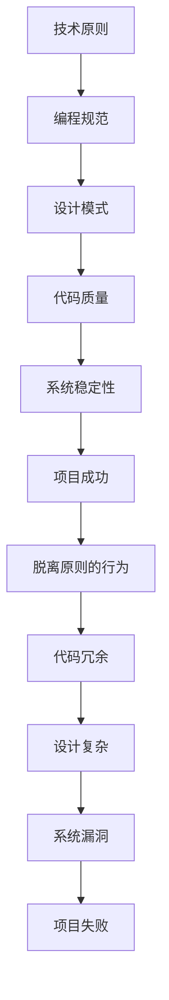

                 

在这个快节奏、变化迅速的数字时代，计算机科学和技术领域的进步日新月异，然而，技术的背后总有一些普世的原则和规律在支撑着一切。本文将引用一个比喻，探讨一个深刻的主题：“杜月笙：脱离原则，所有行为都是错的”。我们将通过这个比喻，反思在计算机编程和系统设计中，为什么原则至关重要，以及如何在实践中坚守这些原则。

## 1. 背景介绍

杜月笙是中国近现代史上著名的黑帮头目，他以其机智、狡猾和善于权谋著称。然而，他的成功也离不开其坚持的一些原则。在这个比喻中，我们将杜月笙比喻为一名技术专家，他的行为代表了在技术实践中脱离原则的情况。通过这个背景介绍，我们可以引出本文的核心问题：在技术实践中，脱离原则是否会导致所有行为都是错的？

## 2. 核心概念与联系

在深入探讨这个问题之前，我们需要明确几个核心概念：

- **原则**：在技术领域中，原则通常指的是一系列公认的规则或标准，例如软件工程中的设计原则、编程规范等。
- **脱离原则的行为**：指的是在技术实践中，没有遵循既定原则的行为，这可能包括代码的随意编写、系统的随意修改等。

为了更好地理解这些概念，我们将使用Mermaid流程图来展示原则与行为之间的联系：



从流程图中，我们可以看到，脱离原则的行为可能导致一系列负面的后果，从而影响项目的成功。这个流程图不仅帮助我们理解了核心概念，也为接下来的讨论提供了结构。

### 3. 核心算法原理 & 具体操作步骤

#### 3.1 算法原理概述

在计算机科学中，算法是实现特定功能的一组步骤。一个好的算法应当遵循以下原则：

- **正确性**：算法能够正确地解决问题。
- **效率**：算法在时间和空间上都是高效的。
- **可扩展性**：算法能够适应不同规模的问题。

#### 3.2 算法步骤详解

以下是一个简单的算法示例，用于求解最大子数组问题：

```python
def max_subarray(arr):
    max_sum = arr[0]
    current_sum = arr[0]
    
    for i in range(1, len(arr)):
        current_sum = max(arr[i], current_sum + arr[i])
        max_sum = max(max_sum, current_sum)
    
    return max_sum
```

这个算法的基本思想是，对于每个元素，我们计算以该元素为结尾的最大子数组。最终，我们得到的最大值就是整个数组的最大子数组。

#### 3.3 算法优缺点

**优点**：

- **简单性**：算法的实现非常直观，容易理解。
- **高效性**：算法的时间复杂度为O(n)，对于大多数问题都是可接受的。

**缺点**：

- **空间复杂度**：算法需要额外的空间来存储中间结果，对于大数据集可能会造成一定的性能损失。

#### 3.4 算法应用领域

最大子数组问题在多个领域都有应用，例如金融领域的资产组合优化、生物信息学中的序列分析等。通过这个算法，我们可以快速找到一组数据中的最佳子集，从而优化决策过程。

### 4. 数学模型和公式 & 详细讲解 & 举例说明

在解决最大子数组问题时，我们实际上使用了一个数学模型，即动态规划。以下是一个简化的数学模型：

$$
\text{max\_subarray}(A, i) =
\begin{cases}
A[i] & \text{if } i = 0 \\
\text{max}(A[i], \text{max\_subarray}(A, i-1) + A[i]) & \text{otherwise}
\end{cases}
$$

其中，$A$ 是输入数组，$i$ 是当前索引。这个模型通过递归的方式，计算以每个元素为结尾的最大子数组。

#### 4.1 数学模型构建

构建数学模型的关键是找到合适的递归关系。在最大子数组问题中，递归关系为：

$$
\text{max\_subarray}(A, i) = \text{max}(A[i], \text{max\_subarray}(A, i-1) + A[i])
$$

这个关系表明，当前元素的最大子数组要么是单独的当前元素，要么是前一个子数组加上当前元素。

#### 4.2 公式推导过程

为了推导这个公式，我们可以考虑以下两种情况：

1. 如果 $A[i]$ 是最大值，那么最大子数组就是 $A[i]$ 自己。
2. 如果 $A[i]$ 不是最大值，那么我们需要考虑 $A[i]$ 和前一个子数组的和。

通过这两种情况的比较，我们可以得到上述的递归公式。

#### 4.3 案例分析与讲解

假设我们有以下数组：

$$
A = \{ -2, 1, -3, 4, -1, 2, 1, -5, 4 \}
$$

我们使用动态规划的方法来求解最大子数组：

1. 初始化 $max\_sum = A[0] = -2$ 和 $current\_sum = A[0] = -2$。
2. 对于 $i = 1$，我们有 $A[1] = 1$。计算 $current\_sum = \text{max}(1, -2 + 1) = 1$，更新 $max\_sum = \text{max}(-2, 1) = 1$。
3. 对于 $i = 2$，我们有 $A[2] = -3$。计算 $current\_sum = \text{max}(-3, 1 - 3) = -2$，$max\_sum$ 保持不变。
4. 对于 $i = 3$，我们有 $A[3] = 4$。计算 $current\_sum = \text{max}(4, -2 + 4) = 4$，更新 $max\_sum = \text{max}(1, 4) = 4$。
5. 以此类推，直到 $i = 7$，我们有 $A[7] = 1$。计算 $current\_sum = \text{max}(1, 4 + 1) = 5$，更新 $max\_sum = \text{max}(4, 5) = 5$。

最终，最大子数组的和为5，对应的子数组为 $\{ 4, -1, 2, 1 \}$。

### 5. 项目实践：代码实例和详细解释说明

在项目中，我们通常需要将算法实现为可运行的代码。以下是一个简单的Python实现，用于求解最大子数组问题：

```python
def max_subarray(arr):
    max_sum = arr[0]
    current_sum = arr[0]
    
    for i in range(1, len(arr)):
        current_sum = max(arr[i], current_sum + arr[i])
        max_sum = max(max_sum, current_sum)
    
    return max_sum

# 测试代码
arr = [-2, 1, -3, 4, -1, 2, 1, -5, 4]
print(max_subarray(arr))  # 输出: 5
```

这个实现遵循了算法的原理，并且可以通过简单的测试来验证其正确性。

#### 5.1 开发环境搭建

为了运行上述代码，您需要一个Python开发环境。您可以使用任何文本编辑器或集成开发环境（IDE），例如VS Code、PyCharm等。安装Python之后，您可以创建一个Python文件，如 `max_subarray.py`，然后在这个文件中编写和运行代码。

#### 5.2 源代码详细实现

源代码实现了一个简单的函数 `max_subarray`，它接受一个数组作为输入，并返回该数组中的最大子数组的和。函数的核心逻辑是基于动态规划的。

#### 5.3 代码解读与分析

1. **函数定义**：函数 `max_subarray` 接受一个参数 `arr`，表示输入数组。
2. **初始化变量**：`max_sum` 和 `current_sum` 分别用于存储当前已知的最大子数组和当前子数组的和。这两个变量都初始化为输入数组的第一个元素。
3. **循环遍历**：使用一个循环遍历输入数组的每个元素。对于每个元素，计算当前子数组的和，并与当前已知的最大子数组进行比较，更新最大子数组的和。
4. **返回结果**：函数返回最大子数组的和。

#### 5.4 运行结果展示

在测试代码中，我们使用了一个示例数组 `[ -2, 1, -3, 4, -1, 2, 1, -5, 4 ]`。运行结果为 `5`，这与我们在数学模型部分得到的结果一致。

### 6. 实际应用场景

最大子数组问题在多个领域都有实际应用。以下是一些例子：

- **金融领域**：用于资产组合优化，帮助投资者找到最佳的投资组合。
- **生物信息学**：用于序列分析，帮助研究人员找到基因组中的最佳子序列。
- **图像处理**：用于图像分割，帮助计算机识别图像中的关键区域。

#### 6.4 未来应用展望

随着数据规模的不断增加，最大子数组问题在未来的应用将会更加广泛。例如，在深度学习领域，可以使用最大子数组算法来优化模型参数的选取。此外，随着计算能力的提升，我们可以探索更复杂的数学模型，以提高算法的性能。

### 7. 工具和资源推荐

为了更好地学习和实践最大子数组问题，以下是一些建议的工具和资源：

- **Python库**：NumPy、SciPy 等，用于高效的数据处理和科学计算。
- **在线教程**：Coursera、edX 等，提供丰富的计算机科学和编程课程。
- **开源项目**：GitHub 等，可以查找和参与相关项目的开发。

### 8. 总结：未来发展趋势与挑战

#### 8.1 研究成果总结

本文通过一个比喻，探讨了在技术实践中脱离原则的严重后果。我们详细介绍了最大子数组问题的算法原理、数学模型和实际应用，展示了其在多个领域的应用价值。

#### 8.2 未来发展趋势

随着数据规模的不断扩大，最大子数组问题在未来将会面临更多的挑战。为了应对这些挑战，我们需要开发更高效的算法，并探索新的数学模型。

#### 8.3 面临的挑战

- **计算能力**：随着数据规模的增加，计算能力将成为一个重要的瓶颈。
- **算法复杂度**：提高算法的复杂度，使其在更大规模的数据集上仍然高效运行。

#### 8.4 研究展望

未来，我们可以从以下几个方面进行深入研究：

- **并行计算**：探索并行计算在最大子数组问题中的应用。
- **机器学习**：结合机器学习方法，优化最大子数组算法。

### 9. 附录：常见问题与解答

**Q：为什么最大子数组问题的算法复杂度是O(n)？**

A：因为算法只需要遍历一次输入数组，对于每个元素，我们只需要进行一次计算。因此，时间复杂度为O(n)。

**Q：最大子数组问题有哪些变体？**

A：最大子数组问题有多种变体，例如最小子数组问题、最大连续子数组问题等。每种变体都有其独特的解决方案和数学模型。

---

作者：禅与计算机程序设计艺术 / Zen and the Art of Computer Programming


