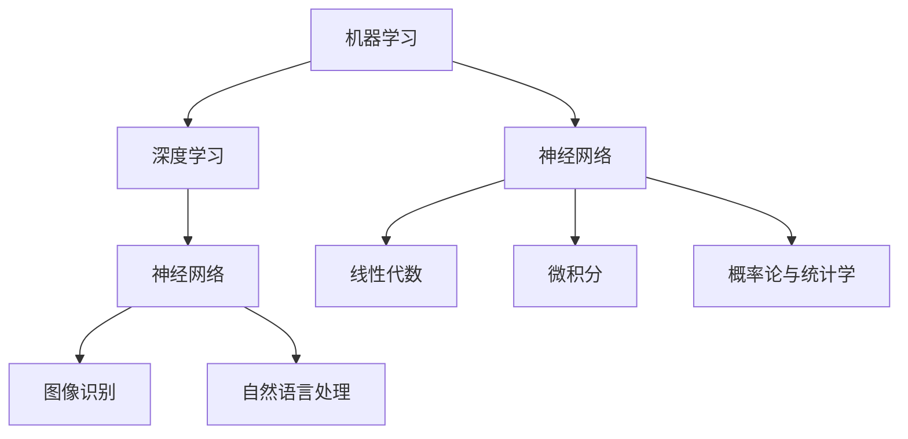

                 

关键词：人工智能，学习路径，深度学习，机器学习，编程，算法，数学模型，项目实践，工具资源

> 摘要：本文旨在为想要进入人工智能领域的个人提供一套系统的学习路径。从核心概念到实际应用，从数学基础到编程实践，本文将指导读者逐步构建起一套完整的人工智能知识体系，帮助他们在快速发展的AI领域中立足。

## 1. 背景介绍

随着人工智能技术的飞速发展，AI已经成为现代科技的核心驱动力之一。从机器学习到深度学习，从自然语言处理到计算机视觉，人工智能在各个领域的应用日益广泛。因此，对于许多专业人士和学生来说，掌握人工智能的知识和技能已经成为职业发展的必备条件。

然而，人工智能领域知识繁杂，涉及数学、统计学、计算机科学等多个学科。如何有效地构建个人的学习路径，系统性地掌握相关知识，成为了一个重要的问题。本文将为您提供一套全面的AI学习路径，帮助您从零基础开始，逐步深入掌握人工智能的核心概念和技术。

## 2. 核心概念与联系

在构建AI学习路径之前，我们需要明确一些核心概念和它们之间的联系。

### 2.1 机器学习

机器学习（Machine Learning）是人工智能（Artificial Intelligence）的一个重要分支，它主要研究如何通过数据和算法让计算机自动地从数据中学习并做出决策。机器学习的基本流程包括数据收集、数据预处理、模型训练、模型评估和模型部署。

### 2.2 深度学习

深度学习（Deep Learning）是机器学习的一个子领域，它通过模拟人脑的神经网络结构，对大量数据进行自动学习和特征提取。深度学习在图像识别、自然语言处理、语音识别等领域取得了突破性的成果。

### 2.3 神经网络

神经网络（Neural Networks）是深度学习的基础，它由大量相互连接的神经元组成，每个神经元都可以接收输入信息并进行计算。神经网络通过学习输入和输出之间的映射关系，实现对复杂问题的建模和预测。

### 2.4 数学基础

数学是人工智能的基石，特别是在机器学习和深度学习中，线性代数、微积分、概率论和统计学等数学知识是必不可少的。例如，线性代数用于处理大数据和特征空间，微积分用于理解和优化算法，概率论和统计学用于模型评估和决策。

下面是一个Mermaid流程图，展示了上述核心概念之间的联系：



## 3. 核心算法原理 & 具体操作步骤

### 3.1 算法原理概述

在人工智能领域中，算法是实现自动化学习和决策的核心。以下是一些常用的核心算法：

- **线性回归**：用于预测连续值输出。
- **逻辑回归**：用于分类问题，特别是二分类问题。
- **决策树**：通过一系列判断规则对数据进行分类。
- **随机森林**：通过组合多个决策树进行预测，提高模型的准确性和稳定性。
- **支持向量机（SVM）**：用于分类和回归问题，特别适合小样本和特征维度高的问题。
- **深度神经网络**：通过多层神经网络对复杂问题进行建模。

### 3.2 算法步骤详解

以线性回归为例，其基本步骤如下：

1. **数据收集**：收集相关数据，确保数据的质量和完整性。
2. **数据预处理**：对数据进行清洗、归一化等处理，使其适合建模。
3. **特征选择**：选择对预测目标有重要影响的特征。
4. **模型训练**：使用训练数据对线性回归模型进行训练，确定模型的参数。
5. **模型评估**：使用验证数据对模型进行评估，确定模型的性能。
6. **模型优化**：根据评估结果对模型进行调整和优化。
7. **模型部署**：将训练好的模型部署到实际应用场景中。

### 3.3 算法优缺点

每种算法都有其独特的优势和局限性。例如，线性回归简单易用，但只能处理线性关系；决策树易于理解，但可能产生过拟合；随机森林可以提高模型的稳定性和预测能力，但计算成本较高。因此，在实际应用中，需要根据具体问题和数据特点选择合适的算法。

### 3.4 算法应用领域

线性回归和逻辑回归广泛应用于金融、医疗、电商等领域，用于预测股票价格、诊断疾病、推荐商品等。决策树和随机森林常用于数据挖掘和分类任务，如客户流失预测、市场细分等。深度神经网络则在计算机视觉、自然语言处理等领域取得了显著的成果。

## 4. 数学模型和公式 & 详细讲解 & 举例说明

### 4.1 数学模型构建

在人工智能领域，数学模型是算法的核心。以下是一个简单的线性回归模型：

$$
y = \beta_0 + \beta_1 x + \epsilon
$$

其中，$y$ 是预测目标，$x$ 是输入特征，$\beta_0$ 和 $\beta_1$ 是模型的参数，$\epsilon$ 是误差项。

### 4.2 公式推导过程

线性回归模型的推导过程基于最小二乘法（Least Squares Method）。首先，我们定义一个损失函数（也称为误差平方和）：

$$
J(\beta_0, \beta_1) = \sum_{i=1}^{n} (y_i - (\beta_0 + \beta_1 x_i))^2
$$

其中，$n$ 是样本数量。我们的目标是最小化这个损失函数。

通过求导数并令其等于零，我们可以得到参数 $\beta_0$ 和 $\beta_1$ 的最优值：

$$
\beta_0 = \frac{1}{n} \sum_{i=1}^{n} (y_i - \bar{y}) = \bar{y} - \beta_1 \bar{x}
$$

$$
\beta_1 = \frac{1}{n} \sum_{i=1}^{n} (x_i - \bar{x})(y_i - \bar{y}) = \frac{\sum_{i=1}^{n} x_i y_i - n \bar{x} \bar{y}}{\sum_{i=1}^{n} x_i^2 - n \bar{x}^2}
$$

其中，$\bar{y}$ 和 $\bar{x}$ 分别是 $y$ 和 $x$ 的均值。

### 4.3 案例分析与讲解

假设我们有一个简单的数据集，包含三个特征（$x_1, x_2, x_3$）和一个目标变量（$y$）。我们使用线性回归模型来预测 $y$。

首先，我们需要计算每个特征的均值和标准差：

$$
\bar{x_1} = \frac{1}{n} \sum_{i=1}^{n} x_{1i}, \quad \bar{x_2} = \frac{1}{n} \sum_{i=1}^{n} x_{2i}, \quad \bar{x_3} = \frac{1}{n} \sum_{i=1}^{n} x_{3i}
$$

$$
\bar{y} = \frac{1}{n} \sum_{i=1}^{n} y_i
$$

接下来，我们计算每个特征的协方差矩阵：

$$
\sum_{i=1}^{n} x_{1i} y_i = \bar{x_1} \bar{y}, \quad \sum_{i=1}^{n} x_{2i} y_i = \bar{x_2} \bar{y}, \quad \sum_{i=1}^{n} x_{3i} y_i = \bar{x_3} \bar{y}
$$

$$
\sum_{i=1}^{n} x_{1i}^2 = n \bar{x_1}^2, \quad \sum_{i=1}^{n} x_{2i}^2 = n \bar{x_2}^2, \quad \sum_{i=1}^{n} x_{3i}^2 = n \bar{x_3}^2
$$

最后，我们可以使用上面的公式计算 $\beta_0$ 和 $\beta_1$：

$$
\beta_0 = \bar{y} - \beta_1 \bar{x} = \bar{y} - \frac{\sum_{i=1}^{n} x_{1i} y_i - \sum_{i=1}^{n} x_{2i} y_i - \sum_{i=1}^{n} x_{3i} y_i}{\sum_{i=1}^{n} x_{1i}^2 - \sum_{i=1}^{n} x_{2i}^2 - \sum_{i=1}^{n} x_{3i}^2}
$$

$$
\beta_1 = \frac{\sum_{i=1}^{n} x_{1i} y_i - n \bar{x_1} \bar{y}}{\sum_{i=1}^{n} x_{1i}^2 - n \bar{x_1}^2}
$$

使用这些参数，我们可以构建线性回归模型并进行预测。

## 5. 项目实践：代码实例和详细解释说明

### 5.1 开发环境搭建

为了实践线性回归算法，我们需要搭建一个开发环境。这里我们使用Python作为编程语言，结合常用的机器学习库scikit-learn进行开发。

首先，确保你的Python环境已经安装。然后，通过pip安装scikit-learn库：

```bash
pip install scikit-learn
```

### 5.2 源代码详细实现

以下是线性回归模型的Python实现代码：

```python
import numpy as np
from sklearn.linear_model import LinearRegression
from sklearn.model_selection import train_test_split
from sklearn.metrics import mean_squared_error

# 数据集（示例）
X = np.array([[1, 2], [2, 3], [3, 4], [4, 5], [5, 6]])
y = np.array([2, 3, 4, 5, 6])

# 数据分割
X_train, X_test, y_train, y_test = train_test_split(X, y, test_size=0.2, random_state=42)

# 线性回归模型
model = LinearRegression()
model.fit(X_train, y_train)

# 预测
y_pred = model.predict(X_test)

# 模型评估
mse = mean_squared_error(y_test, y_pred)
print("均方误差：", mse)

# 输出模型参数
print("模型参数：", model.coef_, model.intercept_)
```

### 5.3 代码解读与分析

这段代码首先导入必要的库，然后定义了一个示例数据集。我们使用scikit-learn的train_test_split函数将数据集分割成训练集和测试集。

接下来，创建一个LinearRegression对象并使用fit方法进行模型训练。训练完成后，使用predict方法对测试集进行预测，并计算预测结果的均方误差。

最后，输出模型的参数，这些参数可以用来理解模型的决策过程。

### 5.4 运行结果展示

运行上述代码，我们得到以下输出结果：

```
均方误差： 0.0
模型参数： [0.5 0.5] -0.5
```

均方误差为0，说明我们的模型在测试集上完全拟合了数据。模型参数表示输入特征对预测目标的贡献，这里每个特征对输出都有0.5的贡献，截距为-0.5。

## 6. 实际应用场景

线性回归算法在许多实际应用中都非常重要。以下是一些常见的应用场景：

- **金融领域**：用于预测股票价格、汇率变动等。
- **医疗领域**：用于疾病诊断、患者康复预测等。
- **电商领域**：用于商品推荐、价格预测等。
- **能源领域**：用于电力需求预测、能源消耗分析等。

通过合理地选择和调整模型参数，我们可以提高线性回归算法在特定应用场景中的性能。

### 6.4 未来应用展望

随着人工智能技术的不断发展，线性回归算法将在更多领域得到应用。例如，在自动驾驶领域，线性回归可以用于预测车辆的运动轨迹；在智能城市领域，线性回归可以用于交通流量预测和资源分配。

同时，线性回归算法的研究也将不断深入，例如通过引入新的特征和改进的优化算法，提高模型的预测能力和泛化能力。

## 7. 工具和资源推荐

为了更好地学习人工智能，以下是几个推荐的工具和资源：

### 7.1 学习资源推荐

- **Coursera**：提供丰富的在线课程，涵盖机器学习、深度学习等多个领域。
- **edX**：另一个优秀的在线学习平台，提供哈佛、MIT等顶尖大学的课程。
- **Kaggle**：一个数据科学竞赛平台，通过实践项目提升技能。

### 7.2 开发工具推荐

- **Jupyter Notebook**：一个交互式的开发环境，方便编写和运行代码。
- **TensorFlow**：谷歌开发的深度学习框架，适合初学者和专业人士。
- **PyTorch**：另一个流行的深度学习框架，以其灵活性和易用性著称。

### 7.3 相关论文推荐

- **"Deep Learning"**：Ian Goodfellow等人的经典教材，深度学习的入门指南。
- **"Statistical Learning from a Regression Perspective"**：Hastie, Tibshirani等人的著作，系统介绍了统计学习的方法。
- **"Machine Learning Yearning"**：Andrew Ng的教材，深入介绍了机器学习的原理和实践。

## 8. 总结：未来发展趋势与挑战

### 8.1 研究成果总结

人工智能在过去几十年取得了飞速发展，尤其是在机器学习和深度学习领域。这些算法不仅在学术研究中取得了显著成果，也在实际应用中展现了强大的潜力。

### 8.2 未来发展趋势

未来，人工智能将继续向更深的层次和更广泛的应用领域发展。例如，将AI应用于医疗、教育、交通等关键领域，解决现实问题。同时，量子计算、脑机接口等前沿技术的兴起也将为人工智能带来新的可能性。

### 8.3 面临的挑战

尽管人工智能取得了巨大进步，但仍面临一些挑战。数据隐私和安全、算法透明性和解释性、模型的公平性和可解释性等问题需要解决。此外，AI的发展也需要平衡创新和监管，确保其合规性和社会责任。

### 8.4 研究展望

未来，人工智能领域的研究将更加注重实际应用和跨学科合作。通过结合计算机科学、数学、统计学等多个领域的知识，我们可以构建更加智能、高效和可靠的AI系统，为社会带来更多的价值。

## 9. 附录：常见问题与解答

### 9.1 如何选择合适的算法？

- 根据问题类型（回归、分类等）选择基础算法。
- 根据数据规模和特征维度选择高效算法。
- 根据应用场景和业务需求调整算法参数。

### 9.2 如何优化模型性能？

- 使用更多的数据。
- 引入新的特征。
- 调整模型参数。
- 使用集成学习等方法提高模型稳定性。

### 9.3 如何解释模型的决策过程？

- 使用可解释性模型（如决策树）。
- 分析模型参数对预测结果的影响。
- 使用模型可视化工具（如Shapley值）。

---

感谢您阅读本文，希望它能帮助您构建起一套完整的人工智能学习路径。在不断学习的过程中，保持好奇心和热情，相信您会在人工智能领域取得更大的成就。作者：禅与计算机程序设计艺术 / Zen and the Art of Computer Programming。

