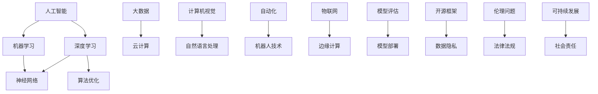

                 

关键词：人工智能，社会发展，AI 驱动，未来趋势，技术挑战，深度学习，神经网络，机器学习，算法优化，应用场景，算法原理，数学模型，代码实例，资源推荐

> 摘要：本文旨在探讨人工智能（AI）在未来社会中的重要作用，以及AI如何驱动社会发展的各个方面。我们将深入探讨核心概念、算法原理、数学模型、应用场景、代码实例和未来展望，为读者提供一个全面的技术视角，了解AI如何为构建一个更加智能的未来社会贡献力量。

## 1. 背景介绍

人工智能（Artificial Intelligence，简称AI）是计算机科学的一个分支，旨在使计算机具备类似人类的智能。从20世纪50年代的初步探索，到21世纪初的深度学习革命，人工智能经历了飞速发展。近年来，随着大数据、云计算和高速计算技术的进步，AI在各个领域取得了显著的成果，逐渐成为推动社会发展的重要力量。

### 1.1 人工智能的发展历程

人工智能的发展可以大致分为以下几个阶段：

- **初始阶段（1950-1969年）**：这一阶段以图灵测试的提出为标志，人工智能的概念开始逐渐形成。

- **知识表示和推理阶段（1970-1989年）**：专家系统和知识表示成为研究热点，但受限于硬件和算法的局限性，进展较为缓慢。

- **符号人工智能阶段（1990-2009年）**：这一阶段以自然语言处理和机器视觉等应用为代表，虽然取得了一定进展，但仍然面临很多挑战。

- **深度学习阶段（2010年至今）**：深度学习的兴起使得AI在图像识别、语音识别、自然语言处理等领域取得了突破性进展。

### 1.2 人工智能的重要性

人工智能在社会发展中的作用日益显著，主要体现在以下几个方面：

- **经济贡献**：AI技术的应用可以提高生产效率，降低成本，推动经济增长。

- **医疗健康**：人工智能在医学影像分析、疾病诊断和药物研发等方面发挥了重要作用，有助于提高医疗服务质量。

- **教育**：智能教育系统可以根据学生的个性化需求提供定制化的学习内容，提升教育质量。

- **交通**：自动驾驶技术的发展有望减少交通事故，提高交通效率。

- **环境监测**：人工智能可以帮助我们更好地监测和管理环境问题，如气候变化和资源浪费。

## 2. 核心概念与联系

在讨论AI如何驱动社会发展之前，我们需要理解一些核心概念和它们之间的联系。以下是一个用Mermaid绘制的流程图，展示了这些核心概念和架构：



### 2.1 深度学习与机器学习

深度学习（Deep Learning）是机器学习（Machine Learning）的一个子领域，它通过模拟人脑神经网络的结构和功能来处理数据。深度学习在图像识别、语音识别和自然语言处理等领域取得了巨大成功。

### 2.2 大数据与云计算

大数据（Big Data）是指无法用常规数据处理工具在合理时间内进行捕获、管理和处理的数据集。云计算（Cloud Computing）提供了弹性计算和存储资源，使得大数据的处理和分析变得更加高效。

### 2.3 计算机视觉与自然语言处理

计算机视觉（Computer Vision）致力于使计算机能够从图像和视频中提取有用信息。自然语言处理（Natural Language Processing，NLP）则关注于使计算机理解和处理人类语言。

### 2.4 自动化与机器人技术

自动化（Automation）和机器人技术（Robotics）通过使用AI技术来减少人工干预，提高生产效率和质量。这些技术已经在制造业、服务业和医疗等领域得到广泛应用。

### 2.5 物联网与边缘计算

物联网（Internet of Things，IoT）是指通过互联网连接的物理设备。边缘计算（Edge Computing）则是在靠近数据源的设备上进行数据处理，以减少延迟和提高响应速度。

### 2.6 算法优化、模型评估与模型部署

算法优化（Algorithm Optimization）是提高算法性能的重要手段。模型评估（Model Evaluation）用于评估模型的性能，而模型部署（Model Deployment）是将模型应用到实际场景中。

### 2.7 开源框架、数据隐私与伦理问题

开源框架（Open Source Framework）提供了丰富的工具和资源，促进了AI技术的发展。数据隐私（Data Privacy）和数据安全（Data Security）是AI应用中不可忽视的问题。伦理问题（Ethical Issues）涉及到AI技术的道德和社会影响，需要我们深入思考和应对。

### 2.8 法律法规与可持续发展

法律法规（Legal Regulations）是确保AI技术合规和安全的重要手段。可持续发展（Sustainable Development）关注于在满足当前需求的同时，不损害子孙后代满足其需求的能力。

## 3. 核心算法原理 & 具体操作步骤

### 3.1 算法原理概述

核心算法是人工智能技术的基石，下面我们简要介绍一些核心算法的原理：

- **深度学习**：深度学习通过多层神经网络进行特征学习和模式识别。它使用反向传播算法（Backpropagation Algorithm）来更新网络权重，以提高模型的准确性。

- **机器学习**：机器学习是一种让计算机从数据中学习的方法。它包括监督学习、非监督学习和强化学习等不同类型，每种类型都有其特定的应用场景。

- **神经网络**：神经网络是由大量相互连接的简单计算单元组成的复杂网络。它通过学习输入和输出之间的映射关系来解决问题。

- **算法优化**：算法优化是通过改进算法设计、数据结构和算法策略来提高算法性能的过程。

- **模型评估**：模型评估是通过评估指标（如准确率、召回率、F1分数等）来衡量模型性能的过程。

- **模型部署**：模型部署是将训练好的模型应用到实际场景中，以提供预测或决策的过程。

### 3.2 算法步骤详解

下面我们详细解释深度学习的具体操作步骤：

#### 3.2.1 数据预处理

在训练深度学习模型之前，需要对数据进行预处理。预处理步骤包括数据清洗、数据归一化和数据增强等。数据清洗的目的是去除噪声和异常值，数据归一化的目的是使数据的特征范围一致，数据增强的目的是增加数据的多样性。

#### 3.2.2 模型设计

模型设计是构建深度学习模型的核心步骤。我们需要选择合适的网络结构、激活函数、损失函数和优化器等。常见的网络结构包括卷积神经网络（CNN）、循环神经网络（RNN）和变换器（Transformer）等。

#### 3.2.3 模型训练

模型训练是通过迭代更新网络权重来最小化损失函数的过程。训练过程中，我们需要调整学习率、批次大小等超参数，以优化模型性能。

#### 3.2.4 模型评估

在模型训练完成后，我们需要对模型进行评估。评估步骤包括验证集和测试集的划分，以及评估指标的计算。常见的评估指标包括准确率、召回率、F1分数和交叉熵等。

#### 3.2.5 模型部署

模型部署是将训练好的模型应用到实际场景中的过程。部署过程中，我们需要考虑模型的性能、可扩展性和可靠性等因素。

### 3.3 算法优缺点

深度学习算法具有以下优点：

- **强大的特征学习能力**：深度学习可以通过多层网络结构学习复杂的数据特征。
- **适应性强**：深度学习可以应用于各种类型的任务，如图像识别、语音识别和自然语言处理等。
- **自动化**：深度学习模型可以自动学习数据和特征，减少了人工干预。

然而，深度学习也存在一些缺点：

- **计算资源需求大**：深度学习模型通常需要大量的计算资源和时间来训练。
- **数据依赖性强**：深度学习模型的性能很大程度上依赖于训练数据的数量和质量。
- **解释性较差**：深度学习模型的内部结构和决策过程较为复杂，难以解释。

### 3.4 算法应用领域

深度学习算法在以下领域具有广泛的应用：

- **计算机视觉**：用于图像分类、目标检测和语义分割等任务。
- **语音识别**：用于语音识别和语音合成等任务。
- **自然语言处理**：用于文本分类、机器翻译和情感分析等任务。
- **游戏AI**：用于游戏策略和决策等任务。

## 4. 数学模型和公式 & 详细讲解 & 举例说明

### 4.1 数学模型构建

深度学习算法的核心是神经网络，而神经网络的基础是数学模型。下面我们将介绍一些常用的数学模型和公式。

#### 4.1.1 神经元模型

神经元的数学模型可以表示为：

$$
y = \sigma(\sum_{i=1}^{n} w_i \cdot x_i + b)
$$

其中，$y$ 是输出，$\sigma$ 是激活函数，$w_i$ 和 $x_i$ 是权重和输入，$b$ 是偏置。

#### 4.1.2 损失函数

损失函数是评估模型性能的重要指标。常用的损失函数包括：

- **均方误差（MSE）**：

$$
MSE = \frac{1}{m} \sum_{i=1}^{m} (\hat{y}_i - y_i)^2
$$

其中，$\hat{y}_i$ 是预测值，$y_i$ 是真实值，$m$ 是样本数量。

- **交叉熵（Cross-Entropy）**：

$$
CE = -\frac{1}{m} \sum_{i=1}^{m} y_i \cdot \log(\hat{y}_i)
$$

其中，$y_i$ 是真实值，$\hat{y}_i$ 是预测概率。

#### 4.1.3 优化器

优化器用于更新网络权重，以最小化损失函数。常用的优化器包括：

- **随机梯度下降（SGD）**：

$$
w_{t+1} = w_t - \alpha \cdot \nabla_w J(w_t)
$$

其中，$w_t$ 是当前权重，$\alpha$ 是学习率，$J(w_t)$ 是损失函数。

- **Adam优化器**：

$$
m_t = \beta_1 m_{t-1} + (1 - \beta_1) \nabla_w J(w_t)
$$
$$
v_t = \beta_2 v_{t-1} + (1 - \beta_2) (\nabla_w J(w_t))^2
$$
$$
\hat{m}_t = \frac{m_t}{1 - \beta_1^t}
$$
$$
\hat{v}_t = \frac{v_t}{1 - \beta_2^t}
$$
$$
w_{t+1} = w_t - \alpha \cdot \frac{\hat{m}_t}{\sqrt{\hat{v}_t} + \epsilon}
$$

其中，$\beta_1$ 和 $\beta_2$ 是衰减率，$\epsilon$ 是一个小常数。

### 4.2 公式推导过程

下面我们以均方误差（MSE）为例，介绍其推导过程。

假设我们有一个线性回归模型，其预测值为 $\hat{y} = \beta_0 + \beta_1 x$，真实值为 $y$。我们希望最小化预测值和真实值之间的误差平方和。

首先，定义误差为：

$$
\epsilon = y - \hat{y}
$$

然后，计算误差的平方和：

$$
J(\beta_0, \beta_1) = \frac{1}{m} \sum_{i=1}^{m} (\epsilon_i)^2
$$

为了最小化损失函数 $J(\beta_0, \beta_1)$，我们对 $\beta_0$ 和 $\beta_1$ 求导数，并令导数为零：

$$
\nabla_{\beta_0} J(\beta_0, \beta_1) = 0
$$
$$
\nabla_{\beta_1} J(\beta_0, \beta_1) = 0
$$

解这个方程组，我们得到：

$$
\beta_0 = \bar{y} - \beta_1 \bar{x}
$$
$$
\beta_1 = \frac{\sum_{i=1}^{m} (x_i - \bar{x})(y_i - \bar{y})}{\sum_{i=1}^{m} (x_i - \bar{x})^2}
$$

其中，$\bar{y}$ 和 $\bar{x}$ 分别是 $y$ 和 $x$ 的均值。

### 4.3 案例分析与讲解

为了更好地理解深度学习的数学模型和公式，我们来看一个简单的案例：使用梯度下降法训练一个线性回归模型。

假设我们有一个数据集，包含 $m$ 个样本，每个样本由特征 $x$ 和标签 $y$ 组成。我们的目标是训练一个线性回归模型，其预测值为 $\hat{y} = \beta_0 + \beta_1 x$。

首先，我们定义损失函数为均方误差（MSE）：

$$
J(\beta_0, \beta_1) = \frac{1}{m} \sum_{i=1}^{m} (\hat{y}_i - y_i)^2
$$

然后，我们使用梯度下降法来更新模型参数 $\beta_0$ 和 $\beta_1$：

$$
\beta_0 := \beta_0 - \alpha \cdot \nabla_{\beta_0} J(\beta_0, \beta_1)
$$
$$
\beta_1 := \beta_1 - \alpha \cdot \nabla_{\beta_1} J(\beta_0, \beta_1)
$$

其中，$\alpha$ 是学习率。

每次迭代，我们计算损失函数的梯度，并根据梯度更新模型参数。通过多次迭代，模型参数将逐渐收敛到最优值。

## 5. 项目实践：代码实例和详细解释说明

### 5.1 开发环境搭建

在进行深度学习项目开发之前，我们需要搭建一个合适的开发环境。以下是使用Python和TensorFlow构建深度学习项目的步骤：

1. 安装Python（版本3.6或以上）。

2. 安装Anaconda，用于创建和管理虚拟环境。

3. 创建一个名为“deep_learning_project”的虚拟环境，并激活它。

4. 安装TensorFlow：

```
pip install tensorflow
```

5. 安装其他必要的库，如NumPy、Pandas等。

### 5.2 源代码详细实现

下面是一个简单的线性回归模型的实现，用于预测房价。

```python
import tensorflow as tf
import numpy as np
import matplotlib.pyplot as plt

# 数据准备
x = np.random.normal(size=100)
y = 2 * x + 1 + np.random.normal(size=100)

# 模型定义
model = tf.keras.Sequential([
    tf.keras.layers.Dense(units=1, input_shape=[1])
])

# 模型编译
model.compile(optimizer='sgd', loss='mse')

# 模型训练
model.fit(x, y, epochs=100)

# 模型评估
loss = model.evaluate(x, y)
print("损失函数值：", loss)

# 模型预测
predictions = model.predict(x)

# 绘制结果
plt.scatter(x, y)
plt.plot(x, predictions, color='red')
plt.show()
```

### 5.3 代码解读与分析

1. **数据准备**：我们生成一组包含100个样本的随机数据，其中 $x$ 为特征，$y$ 为标签。

2. **模型定义**：我们使用 `tf.keras.Sequential` 来构建一个线性回归模型，它包含一个全连接层（`Dense`），输出维度为1。

3. **模型编译**：我们选择 `sgd` 作为优化器，使用 `mse` 作为损失函数。

4. **模型训练**：我们使用 `model.fit` 来训练模型，指定训练数据、迭代次数（`epochs`）和批量大小（`batch_size`）。

5. **模型评估**：我们使用 `model.evaluate` 来评估模型的性能，输出损失函数值。

6. **模型预测**：我们使用 `model.predict` 来预测新数据的结果。

7. **绘制结果**：我们使用 `matplotlib` 来绘制训练数据和预测结果。

### 5.4 运行结果展示

运行上述代码后，我们将看到以下结果：

- **损失函数值**：每次迭代后，损失函数值将逐渐减小，表明模型性能在提高。

- **散点图**：原始数据和预测结果的散点图，其中红色线表示预测结果。

## 6. 实际应用场景

深度学习技术在许多实际应用场景中取得了显著成果，以下是几个典型的应用场景：

### 6.1 图像识别

图像识别是深度学习的一个重要应用领域。通过卷积神经网络（CNN），深度学习模型可以自动学习图像中的特征，从而实现图像分类、目标检测和图像分割等任务。例如，人脸识别技术已经广泛应用于安全监控、身份验证和社交媒体等领域。

### 6.2 语音识别

语音识别技术使得计算机能够理解人类语音，从而实现语音输入和语音合成。深度学习在语音识别中发挥了重要作用，通过循环神经网络（RNN）和变换器（Transformer）等模型，语音识别的准确率不断提高。语音识别广泛应用于智能助手、电话客服和语音翻译等领域。

### 6.3 自然语言处理

自然语言处理（NLP）是深度学习的另一个重要应用领域。深度学习模型可以自动学习语言中的特征，从而实现文本分类、机器翻译、情感分析和问答系统等任务。例如，深度学习在搜索引擎、聊天机器人和智能客服等领域得到了广泛应用。

### 6.4 自动驾驶

自动驾驶是深度学习的又一个重要应用领域。通过深度学习模型，自动驾驶系统能够理解道路场景、识别交通标志和预测其他车辆的行为。深度学习在自动驾驶技术中发挥着关键作用，有望推动交通领域的革命。

### 6.5 健康医疗

深度学习在健康医疗领域也有广泛的应用。通过深度学习模型，医生可以更准确地诊断疾病、设计个性化治疗方案和优化医疗资源分配。例如，深度学习在医学影像分析、基因测序和药物研发等领域发挥了重要作用。

## 7. 工具和资源推荐

为了更好地学习和应用深度学习技术，以下是几个推荐的工具和资源：

### 7.1 学习资源推荐

- **《深度学习》（Deep Learning）**：由Ian Goodfellow、Yoshua Bengio和Aaron Courville合著的经典教材，涵盖了深度学习的理论基础和实践应用。

- **吴恩达的深度学习课程**：Coursera上的深度学习课程，由吴恩达教授主讲，适合初学者和进阶者。

- **GitHub**：GitHub上有大量的深度学习项目和实践案例，可以供学习者和开发者参考。

### 7.2 开发工具推荐

- **TensorFlow**：Google开发的开源深度学习框架，功能强大，适用于各种应用场景。

- **PyTorch**：Facebook开发的开源深度学习框架，易于使用和扩展，适合研究和开发。

- **Keras**：Python深度学习库，用于快速构建和训练深度学习模型，基于TensorFlow和Theano。

### 7.3 相关论文推荐

- **《AlexNet：Image Classification with Deep Convolutional Neural Networks》**：AlexNet是深度学习的里程碑之作，提出了卷积神经网络在图像识别中的强大能力。

- **《Recurrent Neural Networks for Language Modeling》**：RNN在语言建模中取得了突破性进展，为自然语言处理领域带来了新的希望。

- **《Attention is All You Need》**：Transformer模型的提出，彻底改变了自然语言处理领域的研究方向。

## 8. 总结：未来发展趋势与挑战

### 8.1 研究成果总结

在过去几十年里，人工智能取得了显著的进展，深度学习、大数据和云计算等技术为AI的发展提供了强大的动力。AI技术在图像识别、语音识别、自然语言处理和自动驾驶等领域取得了突破性成果，为社会带来了巨大的价值。

### 8.2 未来发展趋势

未来，人工智能将继续快速发展，以下趋势值得关注：

- **跨学科融合**：人工智能与其他学科（如生物学、心理学和社会学等）的融合，将为AI带来新的突破。

- **边缘计算与云计算的融合**：边缘计算与云计算的结合，将实现更高效的数据处理和智能服务。

- **量子计算与人工智能的结合**：量子计算与人工智能的结合，有望实现更高效的算法和更强大的计算能力。

- **可持续发展和社会责任**：人工智能在推动社会发展的同时，也需要关注可持续发展和社会责任，确保技术发展的正面影响。

### 8.3 面临的挑战

尽管人工智能在许多领域取得了显著成果，但仍面临以下挑战：

- **计算资源需求**：深度学习模型通常需要大量的计算资源和时间来训练，这对硬件设施提出了更高的要求。

- **数据隐私和安全**：AI技术对大量数据的需求引发了数据隐私和安全问题，如何保护用户隐私成为重要议题。

- **算法可解释性**：深度学习模型的内部结构复杂，决策过程难以解释，如何提高算法的可解释性是一个挑战。

- **伦理和社会影响**：人工智能在医疗、法律和军事等领域的应用引发了伦理和社会影响，如何确保AI技术的伦理和社会责任是一个重要课题。

### 8.4 研究展望

未来，人工智能研究应重点关注以下方向：

- **算法优化**：研究更高效的算法和优化方法，以降低计算资源需求。

- **数据隐私保护**：开发隐私保护算法和数据加密技术，保护用户隐私。

- **模型解释性**：研究可解释性模型和解释性方法，提高算法的可解释性。

- **跨学科合作**：促进人工智能与其他学科的交叉研究，推动AI技术的全面发展。

- **可持续发展和社会责任**：关注AI技术的可持续发展和社会责任，确保技术发展的正面影响。

## 9. 附录：常见问题与解答

### 9.1 什么是深度学习？

深度学习是一种机器学习技术，通过多层神经网络进行特征学习和模式识别。它通过模拟人脑神经网络的结构和功能来处理数据，具有强大的特征学习能力。

### 9.2 深度学习算法有哪些优缺点？

深度学习算法的优点包括强大的特征学习能力、适应性强和自动化。缺点包括计算资源需求大、数据依赖性强和解释性较差。

### 9.3 深度学习算法有哪些应用领域？

深度学习算法在图像识别、语音识别、自然语言处理、游戏AI和健康医疗等领域具有广泛的应用。

### 9.4 如何搭建深度学习项目开发环境？

可以使用Python和TensorFlow搭建深度学习项目开发环境，包括安装Python、Anaconda、创建虚拟环境、安装TensorFlow和其他必要的库。

### 9.5 深度学习模型如何训练和评估？

深度学习模型通过梯度下降法进行训练，使用损失函数评估模型性能。评估指标包括准确率、召回率、F1分数和交叉熵等。

### 9.6 人工智能在医疗领域有哪些应用？

人工智能在医疗领域有广泛的应用，包括医学影像分析、疾病诊断、药物研发和智能诊疗等。

### 9.7 人工智能在交通领域有哪些应用？

人工智能在交通领域有广泛的应用，包括自动驾驶、智能交通管理和交通流量预测等。

### 9.8 人工智能对社会的影响是什么？

人工智能对社会的影响包括经济、医疗、教育和环境等方面，可以推动社会的发展，但也需要关注可持续发展和社会责任。

---

作者：禅与计算机程序设计艺术 / Zen and the Art of Computer Programming

本文旨在探讨人工智能在未来社会中的重要作用，以及AI如何驱动社会发展的各个方面。通过介绍核心概念、算法原理、数学模型、应用场景、代码实例和未来展望，本文为读者提供了一个全面的技术视角，了解AI如何为构建一个更加智能的未来社会贡献力量。希望本文能激发读者对人工智能技术的兴趣和思考。

