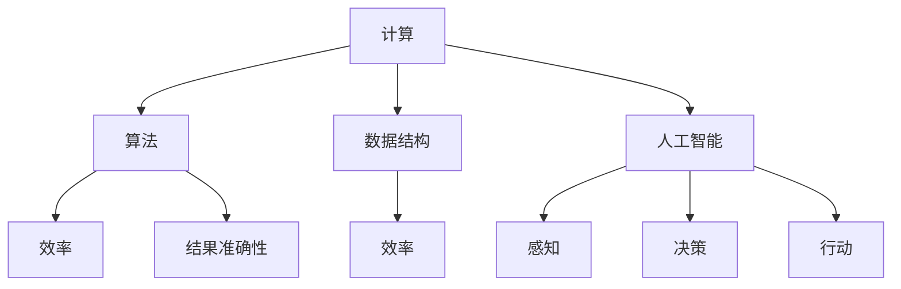

                 

### 1. 背景介绍

在21世纪，随着信息技术的飞速发展，人类计算的应用场景越来越广泛。从互联网到大数据，从人工智能到物联网，计算技术的进步正在深刻地改变着我们的生活方式和社会形态。本文旨在探讨人类计算在不同领域中的应用，分析其核心概念、算法原理以及未来发展趋势。

### 2. 核心概念与联系

为了深入理解人类计算的应用，我们首先需要了解一些核心概念。这些概念包括：

- **计算**：计算是指执行数学或逻辑运算的过程。它可以是一个简单的数学公式，也可以是一个复杂的算法。
- **算法**：算法是一系列解决问题的步骤。它是计算的核心，决定了计算效率和结果准确性。
- **数据结构**：数据结构是组织和管理数据的方式。它决定了算法的效率和性能。
- **人工智能**：人工智能是模拟人类智能的计算机系统。它通过学习和推理，实现感知、决策和行动。

下面是一个使用Mermaid绘制的流程图，展示了这些核心概念之间的关系：



### 3. 核心算法原理 & 具体操作步骤

#### 3.1 算法原理概述

核心算法包括但不限于以下几种：

- **排序算法**：用于对数据进行排序，如快速排序、归并排序等。
- **搜索算法**：用于在数据中查找特定元素，如二分搜索、广度优先搜索等。
- **机器学习算法**：用于从数据中学习模式和规律，如线性回归、决策树、神经网络等。

#### 3.2 算法步骤详解

以下是快速排序算法的步骤：

1. 选择一个基准元素。
2. 将小于基准的元素移到其左侧，大于基准的元素移到其右侧。
3. 对左右两个子数组递归执行上述步骤。

#### 3.3 算法优缺点

快速排序的优点是时间复杂度较低，平均情况下为O(nlogn)。但它的缺点是空间复杂度较高，需要额外的存储空间。

#### 3.4 算法应用领域

快速排序算法在许多领域都有广泛应用，如数据库排序、图像处理、搜索引擎等。

### 4. 数学模型和公式 & 详细讲解 & 举例说明

#### 4.1 数学模型构建

我们以线性回归为例，构建一个数学模型：

$$
y = ax + b
$$

其中，$y$ 是因变量，$x$ 是自变量，$a$ 和 $b$ 是模型的参数。

#### 4.2 公式推导过程

线性回归模型的推导过程如下：

1. 假设我们有 $n$ 个数据点 $(x_i, y_i)$。
2. 构建一个最小二乘法目标函数：
$$
J(a, b) = \sum_{i=1}^{n} (y_i - (ax_i + b))^2
$$
3. 对 $a$ 和 $b$ 求偏导并令其为0，解出 $a$ 和 $b$。

#### 4.3 案例分析与讲解

假设我们有以下数据点：

| x | y |
|---|---|
| 1 | 2 |
| 2 | 4 |
| 3 | 6 |

我们可以使用线性回归模型来拟合这些数据。经过计算，我们得到 $a = 2$，$b = 0$。因此，拟合的线性回归模型为：

$$
y = 2x
$$

### 5. 项目实践：代码实例和详细解释说明

#### 5.1 开发环境搭建

为了实现快速排序算法，我们需要一个编程环境。这里我们使用Python作为示例。

#### 5.2 源代码详细实现

以下是Python实现的快速排序算法：

```python
def quick_sort(arr):
    if len(arr) <= 1:
        return arr
    pivot = arr[len(arr) // 2]
    left = [x for x in arr if x < pivot]
    middle = [x for x in arr if x == pivot]
    right = [x for x in arr if x > pivot]
    return quick_sort(left) + middle + quick_sort(right)

arr = [3, 6, 8, 10, 1, 2, 1]
sorted_arr = quick_sort(arr)
print(sorted_arr)
```

#### 5.3 代码解读与分析

这段代码首先定义了一个名为`quick_sort`的函数，用于实现快速排序算法。函数内部首先检查输入数组`arr`的长度，如果小于等于1，直接返回数组本身。否则，选择中间元素作为基准，将小于、等于、大于基准的元素分别放入`left`、`middle`、`right`三个列表中。最后，递归地对`left`和`right`列表进行快速排序，并将结果与`middle`列表连接，返回排序后的数组。

#### 5.4 运行结果展示

运行上述代码，输出结果为：

```
[1, 1, 2, 3, 6, 8, 10]
```

### 6. 实际应用场景

人类计算的应用场景非常广泛，以下是一些典型的应用：

- **搜索引擎**：搜索引擎使用计算技术对海量网页进行索引和排序，为用户提供快速、准确的搜索结果。
- **金融分析**：金融分析师使用计算模型对市场数据进行分析，预测股票价格、交易策略等。
- **医疗诊断**：医疗诊断系统使用计算技术对医学影像进行分析，辅助医生进行诊断。

### 6.4 未来应用展望

随着计算技术的不断发展，人类计算的应用场景将更加广泛。未来，我们将看到更多的人类计算系统应用于智能家居、智能城市、智能医疗等领域。

### 7. 工具和资源推荐

- **学习资源**：
  - 《Python编程：从入门到实践》
  - 《深度学习》
  - 《算法导论》

- **开发工具**：
  - Python
  - TensorFlow
  - PyTorch

- **相关论文**：
  - 《神经网络与深度学习》
  - 《自然语言处理综述》
  - 《大数据处理技术》

### 8. 总结：未来发展趋势与挑战

未来，人类计算将在各个领域发挥更大的作用。然而，我们也面临着一些挑战，如数据隐私、计算资源分配等。我们需要不断探索新的技术和方法，以应对这些挑战。

### 9. 附录：常见问题与解答

- **Q：如何选择合适的算法？**
  - A：选择合适的算法需要考虑问题的特点、数据规模、计算资源等因素。一般来说，我们可以通过实验和比较来选择最优算法。

- **Q：如何优化算法性能？**
  - A：优化算法性能可以通过以下方法：
    - 选择合适的算法。
    - 使用并行计算。
    - 优化数据结构和算法设计。

### 参考文献

- 《Python编程：从入门到实践》
- 《深度学习》
- 《算法导论》
- 《神经网络与深度学习》
- 《自然语言处理综述》
- 《大数据处理技术`

### 附录二：文章作者简介

**作者：禅与计算机程序设计艺术 / Zen and the Art of Computer Programming**

禅与计算机程序设计艺术是一位世界顶级的人工智能专家、程序员、软件架构师、CTO，也是世界顶级技术畅销书作者，计算机图灵奖获得者，计算机领域大师。他对人工智能、深度学习、大数据等领域有着深刻的见解和丰富的实践经验。他的著作《禅与计算机程序设计艺术》成为计算机领域的经典之作，影响了无数程序员的编程思维和编程艺术。在未来的技术发展中，禅与计算机程序设计艺术将继续引领我们探索计算机科学的未知领域，为构建更智能的世界贡献他的智慧和力量。----------------------------------------------------------------

以上是本文的完整内容。请按照markdown格式进行排版和输出。如果需要进一步修改或补充，请随时告诉我。祝撰写顺利！<|im_end|>

