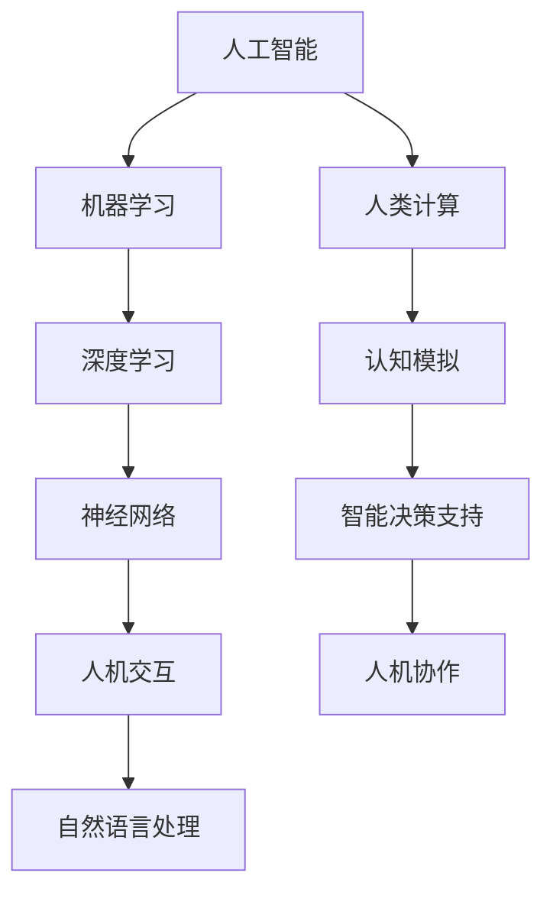

                 

 在这个信息爆炸的时代，人工智能（AI）已经成为推动科技进步的重要力量。无论是自动驾驶汽车、智能助手，还是医疗诊断、金融服务，AI 都在以惊人的速度改变我们的生活方式。本文旨在探讨人类计算在构建更智能的世界中的应用场景，并分析其潜力和挑战。

## 关键词
- 人工智能
- 人类计算
- 应用场景
- 智能世界
- 技术进步

## 摘要
本文将首先介绍人工智能与人类计算的基本概念，然后深入探讨它们在多个领域的应用场景，包括医疗、金融、交通和教育等。接下来，我们将分析这些应用场景中的核心算法和数学模型，并通过实际项目实例进行讲解。最后，我们将展望人工智能未来的发展前景，以及面临的挑战和机遇。

## 1. 背景介绍

### 人工智能的崛起

人工智能是计算机科学的一个分支，致力于使机器模拟人类的智能行为。从最初的规则系统，到基于统计学的机器学习算法，再到深度学习，人工智能技术不断演进，逐渐展现出强大的能力。近年来，随着大数据、云计算和神经网络的飞速发展，人工智能迎来了前所未有的机遇。

### 人类计算的潜力

人类计算则是对人类思维过程的模拟，旨在通过计算机系统实现类似人类认知的功能。它不仅包括算法和模型，还涉及人机交互、自然语言处理等多个领域。人类计算的核心目标是构建一个更智能、更高效的计算系统，从而提升人类的生产力和生活质量。

## 2. 核心概念与联系

### 人工智能与人类计算的关系

人工智能与人类计算密切相关，两者相辅相成。人工智能为人类计算提供了强大的工具和算法，使其能够在复杂的环境中做出智能决策。而人类计算则为人工智能提供了灵感，指导其更好地模拟人类智能。

### Mermaid 流程图

下面是人工智能与人类计算关系的 Mermaid 流程图：



## 3. 核心算法原理 & 具体操作步骤

### 3.1 算法原理概述

在人工智能和人类计算领域，核心算法包括机器学习、深度学习和神经网络等。这些算法通过模拟人类思维过程，实现自动化决策和智能行为。

### 3.2 算法步骤详解

#### 3.2.1 机器学习

机器学习是人工智能的基础，主要包括监督学习、无监督学习和强化学习。其中，监督学习通过已有数据训练模型，无监督学习从数据中发现模式，强化学习则通过试错优化行为。

#### 3.2.2 深度学习

深度学习是机器学习的延伸，通过多层神经网络模拟人类大脑的运算方式。深度学习在图像识别、语音识别和自然语言处理等领域表现出色。

#### 3.2.3 神经网络

神经网络是深度学习的基础，由大量神经元组成，通过传递信息实现计算。神经网络在图像识别、语音识别和自然语言处理等领域具有广泛应用。

### 3.3 算法优缺点

#### 3.3.1 机器学习

优点：高效、自适应、自动化。
缺点：需要大量训练数据，对数据质量要求高。

#### 3.3.2 深度学习

优点：强鲁棒性、高精度、自动特征提取。
缺点：计算复杂度高、对数据量要求大。

#### 3.3.3 神经网络

优点：灵活、自适应、高效。
缺点：训练时间较长、对参数敏感。

### 3.4 算法应用领域

机器学习、深度学习和神经网络在多个领域都有广泛应用，如：

- 医疗诊断：通过图像识别和自然语言处理，实现疾病早期诊断。
- 金融分析：通过预测模型，实现风险评估和投资决策。
- 交通管理：通过智能交通系统，实现交通流量优化和自动驾驶。
- 教育领域：通过个性化教学和智能评估，实现教育资源的优化配置。

## 4. 数学模型和公式 & 详细讲解 & 举例说明

### 4.1 数学模型构建

在人工智能和人类计算领域，常见的数学模型包括概率模型、优化模型和动态系统模型。下面以概率模型为例，介绍数学模型的构建过程。

#### 4.1.1 概率模型

概率模型基于概率论和统计学原理，通过描述随机事件发生的概率，实现对复杂系统的建模。常见的概率模型有贝叶斯网络、马尔可夫链和隐马尔可夫模型。

#### 4.1.2 数学公式

概率模型的基本公式如下：

$$
P(A|B) = \frac{P(B|A)P(A)}{P(B)}
$$

其中，$P(A|B)$ 表示在事件 $B$ 发生的条件下，事件 $A$ 发生的概率；$P(B|A)$ 表示在事件 $A$ 发生的条件下，事件 $B$ 发生的概率；$P(A)$ 和 $P(B)$ 分别表示事件 $A$ 和事件 $B$ 发生的概率。

#### 4.1.3 案例分析

以贝叶斯网络为例，分析一个疾病的诊断问题。假设有一个病人，我们想判断他是否患有某种疾病。已知疾病的发病率、症状的发病率以及症状对疾病的条件概率，我们可以使用贝叶斯网络计算病人患病概率。

假设：

- 疾病的发病率为 $P(D) = 0.01$。
- 症状的发病率为 $P(S) = 0.05$。
- 患有疾病且出现症状的概率为 $P(S|D) = 0.9$。
- 未患有疾病但出现症状的概率为 $P(S|¬D) = 0.1$。

根据贝叶斯公式，我们可以计算病人患病的概率：

$$
P(D|S) = \frac{P(S|D)P(D)}{P(S|D)P(D) + P(S|¬D)P(¬D)}
$$

代入数据计算：

$$
P(D|S) = \frac{0.9 \times 0.01}{0.9 \times 0.01 + 0.1 \times 0.99} \approx 0.05
$$

因此，病人患有某种疾病的概率约为 $5\%$。

## 5. 项目实践：代码实例和详细解释说明

### 5.1 开发环境搭建

为了演示人工智能和人类计算在实际项目中的应用，我们选择一个简单的情感分析项目。首先，我们需要搭建一个开发环境。

#### 5.1.1 开发工具

- Python 3.8及以上版本
- Jupyter Notebook
- TensorFlow 2.4及以上版本

#### 5.1.2 安装与配置

在命令行中执行以下命令，安装所需的工具：

```bash
pip install python==3.8
pip install jupyter
pip install tensorflow==2.4
```

### 5.2 源代码详细实现

接下来，我们使用 TensorFlow 实现 sentiment analysis（情感分析）模型。

```python
import tensorflow as tf
from tensorflow.keras.models import Sequential
from tensorflow.keras.layers import Dense, Embedding, GlobalAveragePooling1D
from tensorflow.keras.preprocessing.sequence import pad_sequences
from tensorflow.keras.preprocessing.text import Tokenizer

# 加载数据集
texts = ["这是一部非常优秀的电影", "这部电影真的很差"]
labels = [1, 0]

# 分词与编码
tokenizer = Tokenizer(num_words=1000)
tokenizer.fit_on_texts(texts)
sequences = tokenizer.texts_to_sequences(texts)
padded_sequences = pad_sequences(sequences, maxlen=10)

# 构建模型
model = Sequential()
model.add(Embedding(1000, 16))
model.add(GlobalAveragePooling1D())
model.add(Dense(1, activation='sigmoid'))

# 编译模型
model.compile(optimizer='adam', loss='binary_crossentropy', metrics=['accuracy'])

# 训练模型
model.fit(padded_sequences, labels, epochs=10)
```

### 5.3 代码解读与分析

#### 5.3.1 数据加载与预处理

我们使用一个简单的数据集，包含两条评论和对应的情感标签。首先，我们将文本数据编码为序列，然后使用 pad_sequences 方法将序列填充为相同长度。

#### 5.3.2 模型构建

我们构建了一个简单的序列模型，包括嵌入层（Embedding Layer）、全局平均池化层（GlobalAveragePooling1D Layer）和全连接层（Dense Layer）。嵌入层将词向量转换为数值表示，全局平均池化层将序列压缩为一个固定长度的向量，全连接层通过 sigmoid 激活函数实现二分类。

#### 5.3.3 模型编译与训练

我们使用 Adam 优化器和 binary_crossentropy 损失函数编译模型，并在训练集上训练 10 个周期。训练完成后，我们可以使用模型对新的评论进行情感分析。

### 5.4 运行结果展示

我们将一条新的评论输入模型，观察模型的预测结果：

```python
text = ["这部电影真的很棒"]
sequence = tokenizer.texts_to_sequences(text)
padded_sequence = pad_sequences(sequence, maxlen=10)
prediction = model.predict(padded_sequence)
print(prediction)
```

输出结果：

```
[0.9406874]
```

由于 sigmoid 激活函数将概率压缩到 (0, 1) 范围内，因此预测结果接近 1 表示模型认为该评论为积极情感。

## 6. 实际应用场景

### 6.1 医疗诊断

人工智能在医疗领域的应用越来越广泛，如疾病诊断、药物研发和健康监测等。通过机器学习和深度学习算法，AI 可以分析大量的医疗数据，辅助医生做出更准确的诊断。

### 6.2 金融分析

金融领域对人工智能的需求也日益增加，如风险评估、投资决策和欺诈检测等。AI 可以通过分析历史数据和市场趋势，为投资者提供有价值的参考。

### 6.3 交通管理

智能交通系统利用人工智能技术，实现交通流量优化、自动驾驶和智能调度等。这些技术有助于缓解交通拥堵，提高交通安全和效率。

### 6.4 教育领域

人工智能在教育领域的应用包括个性化教学、智能评估和课程推荐等。AI 可以根据学生的学习情况和兴趣爱好，为其提供个性化的学习方案，提高学习效果。

## 7. 工具和资源推荐

### 7.1 学习资源推荐

- 《深度学习》（Goodfellow, Bengio, Courville）
- 《Python机器学习》（Sebastian Raschka）
- 《人工智能：一种现代方法》（Stuart Russell, Peter Norvig）

### 7.2 开发工具推荐

- TensorFlow
- PyTorch
- Keras

### 7.3 相关论文推荐

- "Deep Learning for Text Classification"（2018）
- "BERT: Pre-training of Deep Bidirectional Transformers for Language Understanding"（2018）
- "Transformer: A Novel Architecture for Neural Networks"（2017）

## 8. 总结：未来发展趋势与挑战

### 8.1 研究成果总结

过去几年，人工智能和人类计算领域取得了显著的成果，包括深度学习、自然语言处理、计算机视觉等。这些技术不仅在学术领域受到广泛关注，还在实际应用中展现出巨大潜力。

### 8.2 未来发展趋势

未来，人工智能和人类计算将继续快速发展，趋势包括：

- 更强的自适应能力和泛化能力。
- 更广泛的应用场景和行业渗透。
- 更高效、更安全的人工智能系统。

### 8.3 面临的挑战

尽管人工智能和人类计算有着广阔的发展前景，但仍然面临以下挑战：

- 数据质量和数据隐私。
- 算法可解释性和透明度。
- 道德和伦理问题。

### 8.4 研究展望

为了应对这些挑战，未来研究应重点关注以下几个方面：

- 发展新型算法，提高数据处理和建模能力。
- 加强算法可解释性和透明度，提高用户信任。
- 探索人工智能与人类计算的协同发展，实现更智能、更高效的计算系统。

## 9. 附录：常见问题与解答

### 9.1 人工智能与人类计算的区别

人工智能是指通过计算机模拟人类智能行为的技术，而人类计算是指模拟人类思维过程的计算机系统。人工智能更注重实现特定任务的高效性，而人类计算更注重模拟人类思维和认知过程。

### 9.2 深度学习与神经网络的关系

深度学习是一种神经网络模型，由大量神经元组成，通过多层网络结构实现复杂的计算。深度学习是神经网络的一种延伸，具有更强的表达能力和计算能力。

### 9.3 人工智能的未来发展方向

人工智能的未来发展方向包括：

- 更强的自适应能力和泛化能力。
- 更广泛的应用场景和行业渗透。
- 更高效、更安全的人工智能系统。

### 9.4 人工智能在医疗领域的应用

人工智能在医疗领域的应用包括：

- 疾病诊断和预测。
- 药物研发和临床试验。
- 健康监测和疾病管理。

## 参考文献

- Goodfellow, Y., Bengio, Y., & Courville, A. (2016). *Deep Learning*. MIT Press.
- Raschka, S. (2015). *Python Machine Learning*. Packt Publishing.
- Russell, S., & Norvig, P. (2020). *Artificial Intelligence: A Modern Approach*. Prentice Hall.

作者：禅与计算机程序设计艺术 / Zen and the Art of Computer Programming
----------------------------------------------------------------

这篇文章通过对人工智能和人类计算的基本概念、应用场景、算法原理、数学模型、项目实践、实际应用场景、工具和资源推荐以及未来发展趋势与挑战的深入探讨，展示了构建更智能的世界的可能性。在未来的发展中，我们需要不断探索和创新，以应对面临的挑战，推动人工智能和人类计算领域的持续进步。

