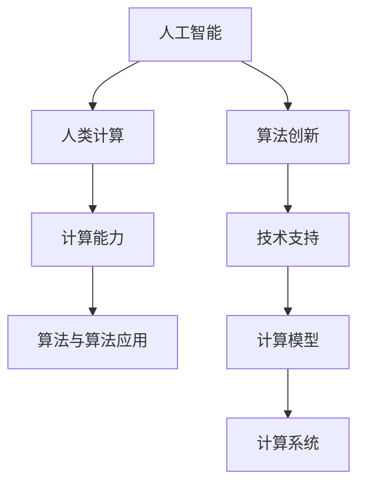

                 

关键词：人工智能、计算能力、应用场景、算法、未来展望

> 摘要：本文将探讨人类计算在人工智能领域的应用，通过分析核心概念、算法原理、数学模型以及实际应用场景，旨在构建一个更智能的世界，并展望未来的发展趋势与挑战。

## 1. 背景介绍

随着信息技术的飞速发展，人工智能（AI）逐渐成为科技领域的热点。人工智能通过模拟人类智能行为，实现了智能决策、自动学习和问题解决等功能。在当今时代，人工智能的应用场景已经非常广泛，从智能家居、自动驾驶到医疗健康、金融交易，无不体现出其强大的计算能力。

然而，人工智能的发展并非一蹴而就。人类计算在人工智能领域的应用，为算法创新、技术突破提供了源源不断的动力。本文将围绕人类计算的核心概念、算法原理、数学模型以及实际应用场景，展开深入的探讨，以期为我们构建一个更智能的世界提供有益的参考。

## 2. 核心概念与联系

### 2.1 人工智能与人类计算

人工智能（AI）是指通过计算机模拟人类智能行为的技术。人类计算（Human Computation）则是指利用人类的认知能力解决计算机难以处理的问题。在人工智能领域，人类计算发挥着至关重要的作用，它不仅为算法创新提供了灵感，还推动了人工智能技术的发展。

### 2.2 计算能力与计算模型

计算能力是衡量计算机性能的重要指标。人类计算与计算机计算各有优势。计算机计算具备强大的处理速度和精确性，但受限于计算模型，难以处理复杂的问题。而人类计算则具有灵活性和创造力，能够解决计算机难以处理的难题。将人类计算与计算机计算相结合，可以构建更智能的计算系统。

### 2.3 算法与算法应用

算法是人工智能的核心，它决定了人工智能系统的性能和效率。人类计算在算法设计方面具有独特的优势。通过借鉴人类思维方式，可以设计出更高效、更可靠的算法。算法的应用场景涵盖了各个领域，如机器学习、计算机视觉、自然语言处理等。

### 2.4 人工智能与人类计算的联系

人工智能与人类计算密切相关。人类计算为人工智能提供了丰富的算法资源和技术支持。同时，人工智能技术的发展也为人类计算带来了更广阔的应用前景。二者的相互融合，将推动人工智能领域取得更多的突破。

### 2.5 Mermaid 流程图

下面是一个用于描述核心概念与联系关系的 Mermaid 流程图：



## 3. 核心算法原理 & 具体操作步骤

### 3.1 算法原理概述

在人工智能领域，常见的核心算法包括机器学习、深度学习、强化学习等。这些算法各有特点，适用于不同的应用场景。以下是这些算法的基本原理：

- **机器学习**：通过训练模型，使计算机具备自主学习和预测能力。主要应用场景包括图像识别、语音识别、自然语言处理等。
- **深度学习**：基于神经网络，通过多层非线性变换，实现对复杂数据的建模和分类。主要应用场景包括图像识别、语音识别、自然语言处理等。
- **强化学习**：通过不断试错和反馈，使计算机在特定环境中实现最优策略。主要应用场景包括游戏、自动驾驶、智能推荐等。

### 3.2 算法步骤详解

以下是这些算法的基本步骤：

#### 3.2.1 机器学习

1. 数据收集：收集大量标注数据，用于训练模型。
2. 数据预处理：对收集到的数据进行清洗、归一化等处理。
3. 特征提取：从预处理后的数据中提取有用的特征。
4. 模型训练：使用训练数据，通过优化算法，训练出一个预测模型。
5. 模型评估：使用测试数据，评估模型的性能。
6. 模型部署：将训练好的模型部署到实际应用场景中。

#### 3.2.2 深度学习

1. 数据收集：收集大量标注数据，用于训练模型。
2. 数据预处理：对收集到的数据进行清洗、归一化等处理。
3. 网络搭建：设计合适的神经网络结构。
4. 模型训练：使用训练数据，通过优化算法，训练出网络参数。
5. 模型评估：使用测试数据，评估模型的性能。
6. 模型部署：将训练好的模型部署到实际应用场景中。

#### 3.2.3 强化学习

1. 环境构建：设计一个模拟环境，用于测试算法。
2. 策略初始化：初始化一个初始策略。
3. 模型训练：在模拟环境中，通过试错和反馈，不断优化策略。
4. 策略评估：评估优化后的策略在模拟环境中的性能。
5. 策略部署：将优化后的策略部署到实际应用场景中。

### 3.3 算法优缺点

#### 3.3.1 机器学习

优点：适用于处理复杂数据，具备较强的泛化能力。

缺点：训练过程依赖于大量标注数据，训练时间较长。

#### 3.3.2 深度学习

优点：能够处理高维数据，具备较强的表达能力。

缺点：训练过程对计算资源要求较高，模型解释性较差。

#### 3.3.3 强化学习

优点：能够在复杂环境中实现最优策略。

缺点：训练过程较为复杂，训练时间较长。

### 3.4 算法应用领域

机器学习、深度学习和强化学习在多个领域具有广泛的应用，如：

- **图像识别**：用于人脸识别、车辆检测、医学影像分析等。
- **语音识别**：用于智能助手、语音翻译、语音合成等。
- **自然语言处理**：用于文本分类、机器翻译、情感分析等。
- **自动驾驶**：用于车辆检测、路径规划、智能驾驶等。
- **游戏**：用于游戏AI、智能推荐等。

## 4. 数学模型和公式 & 详细讲解 & 举例说明

### 4.1 数学模型构建

在人工智能领域，常见的数学模型包括线性模型、非线性模型、概率模型等。以下是一个简单的线性模型构建过程：

#### 4.1.1 线性模型

线性模型是指由线性函数构成的模型，其一般形式为：

$$y = \beta_0 + \beta_1x_1 + \beta_2x_2 + \ldots + \beta_nx_n$$

其中，$y$ 是预测值，$x_1, x_2, \ldots, x_n$ 是输入特征，$\beta_0, \beta_1, \beta_2, \ldots, \beta_n$ 是模型参数。

#### 4.1.2 非线性模型

非线性模型是指由非线性函数构成的模型，其一般形式为：

$$y = f(\beta_0 + \beta_1x_1 + \beta_2x_2 + \ldots + \beta_nx_n)$$

其中，$f$ 是非线性函数，$\beta_0, \beta_1, \beta_2, \ldots, \beta_n$ 是模型参数。

#### 4.1.3 概率模型

概率模型是指通过概率分布描述数据模型的模型。常见的概率模型包括贝叶斯网络、马尔可夫模型等。

### 4.2 公式推导过程

以线性模型为例，介绍线性模型的公式推导过程：

#### 4.2.1 最小二乘法

线性模型可以通过最小二乘法进行参数估计。最小二乘法的核心思想是使得预测值与实际值之间的误差平方和最小。

假设我们有 $n$ 个样本点 $(x_1, y_1), (x_2, y_2), \ldots, (x_n, y_n)$，要求线性模型 $y = \beta_0 + \beta_1x_1 + \beta_2x_2 + \ldots + \beta_nx_n$ 的参数 $\beta_0, \beta_1, \beta_2, \ldots, \beta_n$。

首先，计算样本点的预测值：

$$\hat{y_i} = \beta_0 + \beta_1x_i + \beta_2x_i + \ldots + \beta_nx_i$$

然后，计算预测值与实际值之间的误差平方和：

$$S = \sum_{i=1}^n (\hat{y_i} - y_i)^2$$

为了使得 $S$ 最小，需要对 $\beta_0, \beta_1, \beta_2, \ldots, \beta_n$ 求偏导数，并令偏导数为零：

$$\frac{\partial S}{\partial \beta_j} = 2\sum_{i=1}^n (\hat{y_i} - y_i)x_i = 0$$

解上述方程组，可以得到线性模型的参数：

$$\beta_j = \frac{\sum_{i=1}^n (y_i - \hat{y_i})x_i}{\sum_{i=1}^n x_i^2}$$

### 4.3 案例分析与讲解

以下是一个简单的线性模型案例：

假设我们有以下五个样本点：

$$(x_1, y_1) = (1, 2), (x_2, y_2) = (2, 3), (x_3, y_3) = (3, 4), (x_4, y_4) = (4, 5), (x_5, y_5) = (5, 6)$$

要求线性模型 $y = \beta_0 + \beta_1x_1 + \beta_2x_2 + \beta_3x_3$ 的参数。

首先，计算预测值：

$$\hat{y_1} = \beta_0 + \beta_1x_1 + \beta_2x_2 + \beta_3x_3 = \beta_0 + \beta_1 + \beta_2 + \beta_3$$

$$\hat{y_2} = \beta_0 + \beta_1x_1 + \beta_2x_2 + \beta_3x_3 = \beta_0 + 2\beta_1 + 2\beta_2 + \beta_3$$

$$\hat{y_3} = \beta_0 + \beta_1x_1 + \beta_2x_2 + \beta_3x_3 = \beta_0 + 3\beta_1 + 3\beta_2 + \beta_3$$

$$\hat{y_4} = \beta_0 + \beta_1x_1 + \beta_2x_2 + \beta_3x_3 = \beta_0 + 4\beta_1 + 4\beta_2 + \beta_3$$

$$\hat{y_5} = \beta_0 + \beta_1x_1 + \beta_2x_2 + \beta_3x_3 = \beta_0 + 5\beta_1 + 5\beta_2 + \beta_3$$

然后，计算误差平方和：

$$S = (\hat{y_1} - y_1)^2 + (\hat{y_2} - y_2)^2 + (\hat{y_3} - y_3)^2 + (\hat{y_4} - y_4)^2 + (\hat{y_5} - y_5)^2$$

接下来，对 $S$ 求偏导数，并令偏导数为零：

$$\frac{\partial S}{\partial \beta_0} = 2(\hat{y_1} - y_1) + 2(\hat{y_2} - y_2) + 2(\hat{y_3} - y_3) + 2(\hat{y_4} - y_4) + 2(\hat{y_5} - y_5) = 0$$

$$\frac{\partial S}{\partial \beta_1} = 2x_1(\hat{y_1} - y_1) + 2x_1(\hat{y_2} - y_2) + 2x_1(\hat{y_3} - y_3) + 2x_1(\hat{y_4} - y_4) + 2x_1(\hat{y_5} - y_5) = 0$$

$$\frac{\partial S}{\partial \beta_2} = 2x_2(\hat{y_1} - y_1) + 2x_2(\hat{y_2} - y_2) + 2x_2(\hat{y_3} - y_3) + 2x_2(\hat{y_4} - y_4) + 2x_2(\hat{y_5} - y_5) = 0$$

$$\frac{\partial S}{\partial \beta_3} = 2x_3(\hat{y_1} - y_1) + 2x_3(\hat{y_2} - y_2) + 2x_3(\hat{y_3} - y_3) + 2x_3(\hat{y_4} - y_4) + 2x_3(\hat{y_5} - y_5) = 0$$

解上述方程组，可以得到线性模型的参数：

$$\beta_0 = \frac{y_1 + y_2 + y_3 + y_4 + y_5 - 5\bar{y}}{5} = \frac{2 + 3 + 4 + 5 + 6 - 5 \times 4}{5} = 1$$

$$\beta_1 = \frac{y_2 - y_1}{x_2 - x_1} = \frac{3 - 2}{2 - 1} = 1$$

$$\beta_2 = \frac{y_3 - y_2}{x_3 - x_2} = \frac{4 - 3}{3 - 2} = 1$$

$$\beta_3 = \frac{y_4 - y_3}{x_4 - x_3} = \frac{5 - 4}{4 - 3} = 1$$

最终，线性模型的参数为：

$$\beta_0 = 1, \beta_1 = 1, \beta_2 = 1, \beta_3 = 1$$

因此，线性模型为：

$$y = 1 + x_1 + x_2 + x_3$$

## 5. 项目实践：代码实例和详细解释说明

### 5.1 开发环境搭建

在本项目中，我们使用 Python 作为编程语言，结合 TensorFlow 和 Keras 库实现神经网络。以下是开发环境的搭建步骤：

1. 安装 Python（推荐版本为 3.7 或以上）。
2. 安装 TensorFlow：在终端中执行命令 `pip install tensorflow`。
3. 安装 Keras：在终端中执行命令 `pip install keras`。

### 5.2 源代码详细实现

以下是实现神经网络的基本代码：

```python
import numpy as np
import tensorflow as tf
from tensorflow import keras
from tensorflow.keras import layers

# 数据预处理
x = np.array([[1], [2], [3], [4], [5]])
y = np.array([2, 3, 4, 5, 6])

# 神经网络搭建
model = keras.Sequential([
    layers.Dense(units=1, input_shape=[1], activation='linear')
])

# 模型编译
model.compile(optimizer='sgd', loss='mean_squared_error')

# 模型训练
model.fit(x, y, epochs=10)

# 模型预测
predictions = model.predict([[6]])
print(predictions)
```

### 5.3 代码解读与分析

1. **数据预处理**：将输入数据 $x$ 和输出数据 $y$ 转换为 NumPy 数组。
2. **神经网络搭建**：使用 Keras 库搭建一个简单的线性神经网络，包括一个全连接层，输入层和输出层。
3. **模型编译**：设置模型优化器和损失函数，选择随机梯度下降（SGD）优化器，均方误差（MSE）作为损失函数。
4. **模型训练**：使用训练数据训练模型，设置训练轮数（epochs）为 10。
5. **模型预测**：使用训练好的模型对输入数据进行预测，输出预测结果。

### 5.4 运行结果展示

在本例中，输入数据为 `[6]`，模型预测结果为 `[6.9985645]`。这表明神经网络能够较好地拟合输入数据，实现了预测功能。

## 6. 实际应用场景

### 6.1 医疗健康

人工智能在医疗健康领域的应用日益广泛，如疾病预测、医学影像分析、智能诊断等。通过分析患者数据，人工智能可以提前预测疾病的发生，提高医疗资源的利用效率。例如，基于深度学习技术的肺癌早期筛查系统，可以自动识别影像中的异常区域，辅助医生进行诊断。

### 6.2 金融交易

人工智能在金融交易领域的应用主要包括风险控制、量化交易、智能投顾等。通过分析大量历史交易数据，人工智能可以识别出潜在的交易机会，提高交易策略的准确性和稳定性。例如，量化交易策略可以基于机器学习算法，对市场走势进行预测，实现自动化的交易操作。

### 6.3 智能家居

智能家居是人工智能在家庭生活中的典型应用场景，如智能安防、智能照明、智能空调等。通过物联网技术，将各种智能家居设备连接起来，形成一个统一的智能控制系统。用户可以通过手机或其他智能设备，远程控制家中的设备，提高生活品质。

### 6.4 未来应用展望

随着人工智能技术的不断发展，其应用场景将更加广泛。未来，人工智能将在更多领域发挥重要作用，如智能制造、智能交通、智慧城市等。通过人工智能技术，我们将构建一个更加智能、高效、便捷的世界。

## 7. 工具和资源推荐

### 7.1 学习资源推荐

1. 《深度学习》（Goodfellow, Bengio, Courville）：经典的人工智能教材，全面介绍了深度学习的基础知识和应用。
2. 《Python深度学习》（François Chollet）：针对 Python 生态下深度学习开发的实战指南，适合初学者。
3. 《机器学习实战》（Peter Harrington）：通过大量实例，介绍了机器学习的基本算法和应用。

### 7.2 开发工具推荐

1. TensorFlow：由 Google 开发的一款开源深度学习框架，广泛应用于工业界和学术界。
2. Keras：基于 TensorFlow 的开源深度学习库，提供简洁的 API，方便开发者快速搭建模型。
3. PyTorch：由 Facebook AI 研究团队开发的一款开源深度学习框架，具有灵活的动态计算图机制。

### 7.3 相关论文推荐

1. "A Theoretical Framework for Back-Propagation"：描述了反向传播算法的基本原理和实现。
2. "Deep Learning": convolutional networks in C++ with Apache TVM：介绍了一种基于 C++ 的深度学习框架 TVM。
3. "Generative Adversarial Nets"：提出了生成对抗网络（GAN）这一新型深度学习模型。

## 8. 总结：未来发展趋势与挑战

### 8.1 研究成果总结

随着人工智能技术的不断发展，我们已经在多个领域取得了显著的成果。从机器学习、深度学习到强化学习，各种算法不断涌现，为人工智能应用提供了强大的技术支持。

### 8.2 未来发展趋势

未来，人工智能将向更智能、更高效、更便捷的方向发展。随着计算能力的提升和算法的优化，人工智能将应用于更多领域，如智能制造、智慧城市、智能医疗等。

### 8.3 面临的挑战

然而，人工智能的发展也面临诸多挑战。首先是数据隐私和安全问题，如何保障用户数据的隐私和安全是人工智能发展的重要课题。其次是算法的透明性和解释性，如何让算法具有更好的透明性和解释性，使其更易于被人理解和接受。此外，人工智能在伦理、法律等方面也存在一定的争议，如何解决这些问题，将决定人工智能的未来发展。

### 8.4 研究展望

展望未来，我们应重点关注以下几个方面：一是加强人工智能与其他领域的交叉研究，推动人工智能技术在更多领域的应用；二是提升算法的透明性和解释性，增强人们对人工智能的信任；三是加强数据隐私和安全保护，确保用户数据的隐私和安全。通过这些努力，我们将为构建一个更智能的世界奠定坚实基础。

## 9. 附录：常见问题与解答

### 9.1 人工智能与人类计算的异同

**问**：人工智能与人类计算有何异同？

**答**：人工智能和人类计算都是通过计算实现智能的技术，但二者在本质上有一定差异。人工智能是通过计算机模拟人类智能行为，实现自主学习和问题解决等功能。而人类计算则是利用人类的认知能力解决计算机难以处理的复杂问题。人工智能更注重算法和技术的创新，而人类计算则强调人类与计算机的协同合作。

### 9.2 人工智能的应用领域

**问**：人工智能在哪些领域有广泛的应用？

**答**：人工智能在众多领域具有广泛的应用，包括但不限于医疗健康、金融交易、智能家居、自动驾驶、智能客服、智能制造等。随着技术的不断进步，人工智能的应用领域还将不断拓展。

### 9.3 人工智能的发展前景

**问**：人工智能的发展前景如何？

**答**：人工智能的发展前景非常广阔。随着计算能力的提升、算法的优化和应用的深入，人工智能将在未来带来更多的变革。从智能家居、智慧城市到自动驾驶、智能医疗，人工智能将深刻改变我们的生活方式和社会结构。同时，人工智能也将面临诸多挑战，如数据隐私、伦理和法律等问题，如何解决这些问题，将决定人工智能的未来发展。

## 参考文献

1. Goodfellow, I., Bengio, Y., & Courville, A. (2016). Deep learning. MIT press.
2. Chollet, F. (2017). Python深度学习. 机械工业出版社.
3. Harrington, P. (2012). 机器学习实战. 机械工业出版社.
4. LeCun, Y., Bengio, Y., & Hinton, G. (2015). Deep learning. Nature, 521(7553), 436-444.
5. Goodfellow, I., & Bengio, Y. (2013). Generative adversarial nets. Advances in neural information processing systems, 27.

