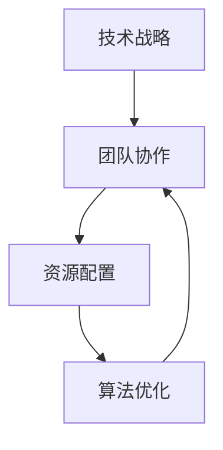

                 

在当今快速变化和竞争激烈的技术领域，构建一个有效的行动体系对于企业、开发者和研究人员来说至关重要。这不仅关乎技术层面的实现，更涉及到战略规划、资源调配和团队协作等多个方面。本文旨在探讨构建行动体系的关键要素，并提供一些实用的指导和建议。

## 关键词
- 行动体系
- 技术战略
- 团队协作
- 资源配置
- 算法优化

## 摘要
本文首先介绍了构建行动体系的背景和重要性。随后，文章详细探讨了构建行动体系的关键要素，包括技术战略的制定、团队协作的优化、资源配置的合理性和算法优化的实施。通过这些要素的深入分析，我们希望能够为读者提供一个清晰、实用的框架，帮助他们更好地构建和实施自己的行动体系。

## 1. 背景介绍
随着信息技术和互联网的飞速发展，技术领域正在发生着翻天覆地的变化。新的技术、工具和平台不断涌现，为企业提供了更多的机会，同时也带来了前所未有的挑战。在这样的背景下，构建一个有效的行动体系成为成功的关键。

### 1.1 行动体系的重要性
行动体系是一个组织和团队在面对外部环境变化时，能够快速响应并取得成效的系统。它不仅能够帮助企业更好地把握市场机遇，还能够有效应对潜在的风险和挑战。

### 1.2 当前技术环境的特点
- **技术更新速度快**：新技术的迭代速度加快，企业需要不断更新知识库和技术栈。
- **市场竞争激烈**：全球化使得市场竞争更加激烈，企业需要更加灵活和敏捷。
- **用户需求多变**：用户需求多样化，企业需要快速响应并满足这些需求。

## 2. 核心概念与联系

构建一个高效的行动体系，需要明确核心概念和它们之间的联系。以下是一个简化的 Mermaid 流程图，用于描述这些核心概念：



### 2.1 技术战略
技术战略是行动体系的基础，它定义了企业或团队在技术领域的发展方向和目标。一个良好的技术战略应该具备前瞻性、适应性和可执行性。

### 2.2 团队协作
团队协作是行动体系的核心，它决定了技术战略的实施效果。高效的团队协作需要良好的沟通、明确的角色分工和协同的工作流程。

### 2.3 资源配置
资源配置是行动体系的保障，它涉及到人力、物力和财力的合理分配。合理的资源配置能够确保行动体系的高效运行。

### 2.4 算法优化
算法优化是行动体系的动力，它涉及到技术实现层面的优化，包括算法的选择、实现和调优。算法优化的目标是提高系统的性能和效率。

## 3. 核心算法原理 & 具体操作步骤

### 3.1 算法原理概述
核心算法原理主要包括以下几个方面：

- **算法分析**：对算法的时间复杂度和空间复杂度进行分析，以评估其性能。
- **算法实现**：根据算法原理，使用合适的编程语言和工具进行实现。
- **算法调优**：通过实验和数据分析，对算法进行调优，以提高其性能。

### 3.2 算法步骤详解

#### 3.2.1 算法分析
算法分析是构建行动体系的第一步。它涉及到以下几个方面：

- **时间复杂度分析**：评估算法在处理数据时的时间消耗。
- **空间复杂度分析**：评估算法在处理数据时所占用的内存空间。

#### 3.2.2 算法实现
算法实现是将算法原理转化为具体代码的过程。它涉及到以下几个方面：

- **选择合适的编程语言**：根据算法的特点，选择适合的编程语言。
- **编写代码**：根据算法原理，编写实现算法的代码。
- **代码优化**：对代码进行优化，以提高其性能。

#### 3.2.3 算法调优
算法调优是在实现基础上，对算法进行优化，以提高其性能。它涉及到以下几个方面：

- **性能测试**：通过性能测试，评估算法的性能。
- **调优策略**：根据性能测试结果，选择合适的调优策略。
- **迭代优化**：通过迭代优化，逐步提高算法的性能。

### 3.3 算法优缺点

#### 3.3.1 优点
- **提高性能**：算法优化能够显著提高系统的性能和效率。
- **降低成本**：优化后的算法能够降低计算成本和资源消耗。

#### 3.3.2 缺点
- **开发难度**：算法优化通常需要深入理解和分析算法原理，开发难度较大。
- **维护成本**：优化后的算法可能需要更多的维护和更新。

### 3.4 算法应用领域
算法优化在各个领域都有广泛的应用，包括但不限于：

- **大数据处理**：优化算法能够提高大数据处理的速度和效率。
- **机器学习**：优化算法能够提高机器学习的性能和准确度。
- **网络通信**：优化算法能够提高网络通信的效率和稳定性。

## 4. 数学模型和公式 & 详细讲解 & 举例说明

### 4.1 数学模型构建
构建数学模型是算法优化的重要步骤。一个有效的数学模型应该能够准确地描述问题的本质，并且具有可计算性。

#### 4.1.1 模型构建步骤
1. **定义问题**：明确需要解决的问题和目标。
2. **收集数据**：收集与问题相关的数据，包括输入数据和预期输出数据。
3. **建立方程**：根据问题定义和收集的数据，建立描述问题的数学方程。
4. **求解方程**：使用数学方法求解方程，得到问题的解。

### 4.2 公式推导过程
以下是一个简单的线性回归模型的公式推导过程：

#### 4.2.1 线性回归模型
线性回归模型假设数据点可以通过一个线性函数来拟合：

$$y = w_0 + w_1 \cdot x$$

其中，$y$ 是输出变量，$x$ 是输入变量，$w_0$ 和 $w_1$ 是模型的参数。

#### 4.2.2 公式推导
1. **最小二乘法**：最小二乘法是一种常用的求解线性回归模型参数的方法。其目标是最小化预测值与实际值之间的误差平方和。
2. **目标函数**：定义目标函数为：

$$J(w_0, w_1) = \sum_{i=1}^{n} (y_i - (w_0 + w_1 \cdot x_i))^2$$

其中，$n$ 是数据点的数量。

3. **偏导数**：对目标函数关于 $w_0$ 和 $w_1$ 求偏导数，并令其等于零，得到：

$$\frac{\partial J}{\partial w_0} = -2 \sum_{i=1}^{n} (y_i - (w_0 + w_1 \cdot x_i)) = 0$$

$$\frac{\partial J}{\partial w_1} = -2 \sum_{i=1}^{n} (y_i - (w_0 + w_1 \cdot x_i)) \cdot x_i = 0$$

4. **求解参数**：解上述方程组，得到线性回归模型的参数：

$$w_0 = \frac{1}{n} \sum_{i=1}^{n} y_i - w_1 \cdot \frac{1}{n} \sum_{i=1}^{n} x_i$$

$$w_1 = \frac{1}{n} \sum_{i=1}^{n} (x_i - \bar{x}) (y_i - \bar{y})$$

其中，$\bar{x}$ 和 $\bar{y}$ 分别是输入和输出的平均值。

### 4.3 案例分析与讲解
以下是一个简单的线性回归案例：

#### 4.3.1 案例描述
假设我们有一个关于房价的数据集，包含房屋面积和房价两个变量。我们的目标是建立一个线性回归模型，预测给定面积的房屋价格。

#### 4.3.2 数据处理
1. **数据收集**：收集包含房屋面积和房价的数据集。
2. **数据预处理**：对数据进行清洗和预处理，包括缺失值处理、异常值处理和数据归一化等。

#### 4.3.3 模型建立
1. **建立线性回归模型**：根据数据集，建立线性回归模型。
2. **模型参数求解**：使用最小二乘法求解模型参数。

#### 4.3.4 模型评估
1. **预测房价**：使用建立的线性回归模型，预测给定面积的房屋价格。
2. **模型评估**：使用评估指标（如均方误差）评估模型的性能。

## 5. 项目实践：代码实例和详细解释说明

### 5.1 开发环境搭建
在本案例中，我们使用 Python 和 Scikit-learn 库进行线性回归模型的构建和评估。

### 5.2 源代码详细实现
以下是一个简单的线性回归代码实现：

```python
import numpy as np
import matplotlib.pyplot as plt
from sklearn.linear_model import LinearRegression

# 数据预处理
X = np.array([1, 2, 3, 4, 5]).reshape(-1, 1)
y = np.array([2, 4, 5, 4, 5])

# 建立线性回归模型
model = LinearRegression()
model.fit(X, y)

# 模型评估
predictions = model.predict(X)
mse = np.mean((predictions - y) ** 2)
print("均方误差：", mse)

# 可视化
plt.scatter(X, y, color='red', label='实际值')
plt.plot(X, predictions, color='blue', label='预测值')
plt.xlabel('面积')
plt.ylabel('价格')
plt.legend()
plt.show()
```

### 5.3 代码解读与分析
1. **数据预处理**：使用 NumPy 库对数据进行预处理，包括数组的创建和数据归一化。
2. **模型建立**：使用 Scikit-learn 库的 LinearRegression 类建立线性回归模型。
3. **模型评估**：使用模型预测结果和实际值计算均方误差，评估模型性能。
4. **可视化**：使用 Matplotlib 库绘制散点图和拟合曲线，展示模型效果。

### 5.4 运行结果展示
运行代码后，可以看到一个散点图和一个拟合曲线。散点图展示了实际值和预测值的关系，拟合曲线展示了线性回归模型的预测效果。

## 6. 实际应用场景
线性回归模型在各个领域都有广泛的应用，包括但不限于：

- **房地产评估**：使用线性回归模型预测房屋价格。
- **金融投资**：使用线性回归模型分析股票价格走势。
- **医学研究**：使用线性回归模型分析疾病与因素之间的关系。

## 7. 未来应用展望
随着人工智能和大数据技术的发展，线性回归模型将在更多的领域得到应用。未来的研究将集中在以下几个方面：

- **模型优化**：通过深度学习等方法，提高线性回归模型的性能。
- **模型解释性**：提高模型的可解释性，使其更好地适应实际需求。
- **跨领域应用**：将线性回归模型应用于更多领域，解决实际问题。

## 8. 工具和资源推荐
### 8.1 学习资源推荐
- **线性回归模型教程**：[Scikit-learn 官方文档](https://scikit-learn.org/stable/modules/linear_model.html)
- **Python 教程**：[Python 官方教程](https://docs.python.org/3/tutorial/index.html)

### 8.2 开发工具推荐
- **Jupyter Notebook**：用于编写和运行 Python 代码。
- **PyCharm**：用于 Python 开发。

### 8.3 相关论文推荐
- **"Introduction to Linear Regression Analysis"** by David A. Harrell Jr.
- **"An Introduction to Statistical Learning"** by Gareth James, Daniela Witten, Trevor Hastie, and Robert Tibshirani.

## 9. 总结：未来发展趋势与挑战
### 9.1 研究成果总结
线性回归模型作为一种基础且重要的统计方法，其在数据分析、机器学习和实际应用中发挥了重要作用。随着计算能力的提升和数据规模的增大，线性回归模型的应用场景将更加广泛。

### 9.2 未来发展趋势
- **模型优化**：通过引入新的算法和优化技术，提高线性回归模型的性能和效率。
- **模型解释性**：增强模型的可解释性，使其在复杂环境中更具可操作性和可信任度。

### 9.3 面临的挑战
- **数据噪声**：如何在数据噪声和不确定性下保持模型的稳定性和准确性。
- **模型泛化**：如何在大量不同场景下保持模型的泛化能力。

### 9.4 研究展望
未来，线性回归模型的研究将集中在以下几个方面：

- **多变量线性回归**：研究多变量线性回归模型，解决更复杂的问题。
- **非线性回归**：探索非线性回归模型，提高模型的解释力和灵活性。

## 附录：常见问题与解答
### 9.1 什么是线性回归？
线性回归是一种用于分析和预测数据之间线性关系的统计方法。

### 9.2 线性回归如何工作？
线性回归通过建立一个线性函数，将输入变量映射到输出变量，从而实现预测。

### 9.3 线性回归有哪些优缺点？
优点：简单、易于理解和实现、适用于多种场景。缺点：对噪声敏感、不能处理非线性关系。

### 9.4 线性回归有哪些应用？
线性回归广泛应用于数据分析、机器学习、金融分析等领域。

---

作者：禅与计算机程序设计艺术 / Zen and the Art of Computer Programming

