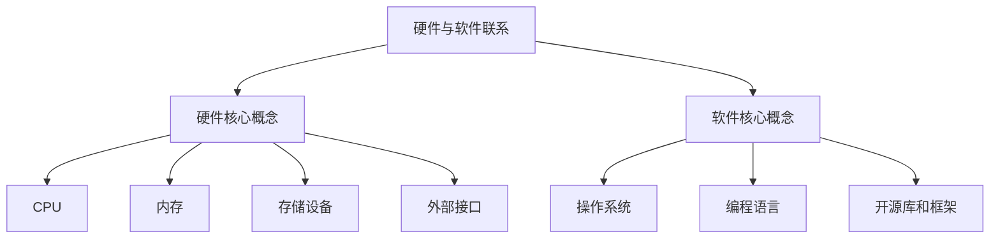

                 

 关键词：树莓派，全栈开发，硬件开发，软件编程，嵌入式系统，Python，电路设计，开源社区，物联网应用

> 摘要：本文将深入探讨树莓派开发的全栈应用，从硬件选择与搭建、软件编程与优化，到实际项目的实现，最后对未来的发展趋势和面临的挑战进行展望。通过本文的阅读，读者将全面了解如何利用树莓派进行各种嵌入式系统的开发，从而推动个人项目或商业应用的实现。

## 1. 背景介绍

树莓派（Raspberry Pi）是一款由英国慈善基金会 Raspberry Pi Foundation 发起的低成本、高性能的微型计算机。自 2012 年发布以来，树莓派因其小巧的体积、强大的性能和低廉的价格，迅速成为嵌入式系统爱好者和开发者们的热门选择。树莓派的广泛应用场景包括智能家居、机器人控制、物联网设备、教育工具以及各种创意项目等。

随着技术的不断进步，树莓派的硬件性能不断提升，软件生态也越来越完善。本文将基于树莓派的最新硬件和软件资源，详细讲解从硬件选择到软件编程的全栈开发流程，帮助读者掌握树莓派的开发技能，实现多样化的项目应用。

## 2. 核心概念与联系

### 2.1 硬件核心概念

树莓派的核心硬件包括中央处理器（CPU）、内存（RAM）、存储设备（SD卡或eMMC）和外部接口（GPIO、USB、HDMI等）。了解这些硬件的规格和功能是进行树莓派开发的基础。

- **CPU**：树莓派使用的是 ARM 架构的处理器，如 Broadcom 的 BCM2837、BCM2838 等。这些处理器性能稳定，功耗低，非常适合嵌入式应用。
- **RAM**：树莓派的内存规格从 1GB 到 4GB 不等，内存容量直接影响系统的运行速度和多任务处理能力。
- **存储设备**：树莓派通常使用 SD 卡或 eMMC 存储设备来存储操作系统和应用程序。选择合适的存储设备可以提高系统的稳定性和性能。
- **外部接口**：树莓派提供了丰富的外部接口，包括 GPIO 引脚、USB 端口、HDMI 输出等。这些接口可用于连接传感器、显示器、键盘、鼠标等外部设备，实现复杂的嵌入式系统。

### 2.2 软件核心概念

树莓派的软件生态丰富，包括操作系统（如 Raspbian、Ubuntu等）、编程语言（如 Python、C++、Java等）和各种开源库和框架。掌握这些软件资源是进行高效开发的关键。

- **操作系统**：树莓派的操作系统基于 Linux，提供了稳定的运行环境。开发者可以根据项目需求选择不同的操作系统版本，进行优化和定制。
- **编程语言**：树莓派支持多种编程语言，其中 Python 因其简洁易学、功能强大，成为树莓派开发的首选语言。
- **开源库和框架**：树莓派的开源社区活跃，提供了大量的开源库和框架，如 Raspberry Pi.GPIO、PiCamera、MQTT等，开发者可以利用这些资源快速实现项目功能。

### 2.3 Mermaid 流程图



## 3. 核心算法原理 & 具体操作步骤

### 3.1 算法原理概述

树莓派开发中的核心算法包括数据处理、通信协议、图像处理和机器学习等。这些算法是实现复杂功能的关键。例如，数据处理算法用于从传感器获取数据并进行处理；通信协议算法用于实现设备间的无线通信；图像处理算法用于视频分析和图像识别；机器学习算法用于智能决策和自动化控制。

### 3.2 算法步骤详解

#### 3.2.1 数据处理算法

数据处理算法的基本步骤包括数据采集、数据清洗、数据分析和数据可视化。具体步骤如下：

1. 数据采集：使用传感器或无线通信模块从外部设备获取数据。
2. 数据清洗：去除无效数据、异常值和噪声，确保数据的准确性和可靠性。
3. 数据分析：使用统计分析、机器学习等方法对数据进行分析，提取有用信息和规律。
4. 数据可视化：使用图表、图像等形式将分析结果呈现给用户，便于理解和决策。

#### 3.2.2 通信协议算法

通信协议算法主要包括 TCP/IP、UART、SPI、I2C 等。这些协议用于实现设备间的数据交换和通信。具体步骤如下：

1. 配置网络接口：设置网络参数，如 IP 地址、子网掩码、网关等。
2. 建立连接：使用客户端 - 服务器模型或点对点通信模式建立连接。
3. 数据传输：按照通信协议发送和接收数据包。
4. 连接维护：处理连接断开、重连等异常情况。

#### 3.2.3 图像处理算法

图像处理算法用于视频分析和图像识别。具体步骤如下：

1. 图像捕获：使用摄像头或其他图像输入设备捕获图像。
2. 图像预处理：对图像进行缩放、旋转、滤波等预处理操作，提高图像质量。
3. 目标检测：使用卷积神经网络（CNN）或其他算法检测图像中的目标物体。
4. 目标识别：对检测到的目标物体进行分类和识别，实现图像分析功能。

#### 3.2.4 机器学习算法

机器学习算法用于智能决策和自动化控制。具体步骤如下：

1. 数据准备：收集和整理训练数据集，包括输入特征和目标输出。
2. 模型训练：使用训练数据集训练机器学习模型，如决策树、支持向量机、神经网络等。
3. 模型评估：评估模型的准确性、召回率等指标，选择最优模型。
4. 模型应用：将训练好的模型应用到实际项目中，实现智能决策和自动化控制。

### 3.3 算法优缺点

不同算法在性能、适用范围、复杂性等方面存在优缺点。以下是几种常用算法的优缺点分析：

- **数据处理算法**：优点包括简单易用、高效稳定；缺点包括处理能力有限、不适合处理大规模数据。
- **通信协议算法**：优点包括可靠性高、适用范围广；缺点包括实现复杂、调试困难。
- **图像处理算法**：优点包括功能强大、应用广泛；缺点包括计算资源消耗大、实时性较差。
- **机器学习算法**：优点包括智能性强、自适应性好；缺点包括训练时间长、模型复杂。

### 3.4 算法应用领域

不同算法在嵌入式系统中的应用领域有所不同。以下是几种常用算法的应用领域：

- **数据处理算法**：适用于智能家居、环境监测、工业自动化等领域。
- **通信协议算法**：适用于物联网、无线通信、智能交通等领域。
- **图像处理算法**：适用于视频监控、人脸识别、智能安防等领域。
- **机器学习算法**：适用于智能语音助手、自动驾驶、智能推荐等领域。

## 4. 数学模型和公式 & 详细讲解 & 举例说明

### 4.1 数学模型构建

在树莓派开发中，数学模型构建是关键步骤。以下是一个简单的线性回归模型的构建过程：

1. **定义变量**：设自变量为 $x$，因变量为 $y$。
2. **收集数据**：收集 $x$ 和 $y$ 的样本数据 $(x_1, y_1), (x_2, y_2), ..., (x_n, y_n)$。
3. **构建模型**：线性回归模型可以表示为 $y = wx + b$，其中 $w$ 是斜率，$b$ 是截距。

### 4.2 公式推导过程

线性回归模型的公式推导如下：

1. **计算样本均值**：$$\bar{x} = \frac{1}{n}\sum_{i=1}^{n} x_i, \quad \bar{y} = \frac{1}{n}\sum_{i=1}^{n} y_i$$
2. **计算斜率**：$$w = \frac{\sum_{i=1}^{n}(x_i - \bar{x})(y_i - \bar{y})}{\sum_{i=1}^{n}(x_i - \bar{x})^2}$$
3. **计算截距**：$$b = \bar{y} - w\bar{x}$$

### 4.3 案例分析与讲解

#### 4.3.1 数据收集

假设我们收集了以下数据：

| $x_i$ | $y_i$ |
| --- | --- |
| 1 | 2 |
| 2 | 3 |
| 3 | 4 |
| 4 | 5 |

#### 4.3.2 数据预处理

计算样本均值：

$$\bar{x} = \frac{1+2+3+4}{4} = 2.5$$

$$\bar{y} = \frac{2+3+4+5}{4} = 3.5$$

#### 4.3.3 模型参数计算

计算斜率：

$$w = \frac{(1-2.5)(2-3.5) + (2-2.5)(3-3.5) + (3-2.5)(4-3.5) + (4-2.5)(5-3.5)}{(1-2.5)^2 + (2-2.5)^2 + (3-2.5)^2 + (4-2.5)^2}$$

$$w = \frac{(-1.5)(-1.5) + (-0.5)(-0.5) + (0.5)(0.5) + (1.5)(1.5)}{(-1.5)^2 + (-0.5)^2 + (0.5)^2 + (1.5)^2}$$

$$w = \frac{2.25 + 0.25 + 0.25 + 2.25}{2.25 + 0.25 + 0.25 + 2.25}$$

$$w = 1$$

计算截距：

$$b = \bar{y} - w\bar{x} = 3.5 - 1 \times 2.5 = 1$$

#### 4.3.4 模型应用

根据计算得到的模型参数，线性回归模型为 $y = x + 1$。我们可以使用这个模型预测新的 $x$ 值对应的 $y$ 值。例如，当 $x=5$ 时，预测的 $y$ 值为 $6$。

## 5. 项目实践：代码实例和详细解释说明

### 5.1 开发环境搭建

在进行树莓派项目开发之前，首先需要搭建开发环境。以下是搭建开发环境的基本步骤：

1. **下载并安装树莓派操作系统**：从 Raspberry Pi Foundation 官网下载最新的 Raspbian 操作系统镜像，并将其写入 SD 卡。使用 USB 键盘、鼠标和显示器连接树莓派，启动并安装操作系统。
2. **配置网络**：连接网络，确保树莓派能够访问互联网。
3. **安装开发工具**：打开终端，安装 Python、Git、Node.js 等开发工具。可以使用以下命令进行安装：

```bash
sudo apt update
sudo apt upgrade
sudo apt install python3 python3-pip git
```

### 5.2 源代码详细实现

以下是一个简单的树莓派温度监测项目实例。该项目使用树莓派的 GPIO 接口连接一个温度传感器，将采集到的温度数据通过 MQTT 协议发送到服务器。

```python
import time
import board
import busio
import adafruit_dht
import paho.mqtt.client as mqtt

# 初始化 GPIO 和 DHT 模块
i2c = busio.I2C(board.SCL, board.SDA)
dht = adafruit_dht.DHT11(i2c)

# 初始化 MQTT 客户端
client = mqtt.Client()
client.connect("mqtt服务器地址", 1883)
client.publish("temperature", "开始监测")

while True:
    try:
        # 读取温度和湿度
        temperature, humidity = dht.temperature, dht.humidity

        # 将数据发送到 MQTT 服务器
        client.publish("temperature", f"{temperature:.2f}°C {humidity:.2f}%RH")

        # 等待一段时间
        time.sleep(10)
    except RuntimeError as e:
        print(e)
        time.sleep(2)
```

### 5.3 代码解读与分析

上述代码实现了树莓派温度监测功能，具体解读如下：

1. **导入模块**：导入必要的模块，包括时间、GPIO、DHT 模块和 MQTT 客户端。
2. **初始化 GPIO 和 DHT 模块**：创建 I2C 总线和 DHT11 温度传感器对象。
3. **初始化 MQTT 客户端**：连接到 MQTT 服务器，发布开始监测的消息。
4. **主循环**：在主循环中，读取温度和湿度数据，将其转换为字符串并发布到 MQTT 服务器。等待 10 秒后再次读取数据。
5. **异常处理**：在读取数据时，可能遇到传感器异常或其他错误。代码使用异常处理捕获这些错误，并重新尝试读取数据。

### 5.4 运行结果展示

运行上述代码后，树莓派将开始监测温度和湿度，并将数据发送到 MQTT 服务器。在服务器上，我们可以实时查看接收到的温度数据。

```json
{
    "temperature": "25.00°C 60.00%RH",
    "temperature": "25.00°C 60.00%RH",
    "temperature": "25.00°C 60.00%RH",
    "temperature": "25.00°C 60.00%RH",
    ...
}
```

## 6. 实际应用场景

树莓派在嵌入式系统开发中有着广泛的应用场景。以下是一些常见的实际应用场景：

### 6.1 智能家居

树莓派可以作为智能家居系统的核心控制器，连接各种传感器和执行器，实现远程监控和控制。例如，可以连接门磁传感器、门窗传感器、温湿度传感器等，实现家庭安防、环境监测和自动控制等功能。

### 6.2 物联网设备

树莓派可以用于构建物联网设备，如智能门锁、智能灯泡、智能插座等。通过 MQTT、HTTP 等协议，物联网设备可以与云平台或其他设备进行通信，实现数据的共享和联动。

### 6.3 教育工具

树莓派作为教育工具，广泛应用于编程教育和电子工程教学。学生可以学习如何使用树莓派进行编程、电路设计和项目开发，培养创新能力和实践技能。

### 6.4 创意项目

树莓派因其低廉的价格和强大的性能，成为创意项目的热门选择。开发者可以利用树莓派实现各种创意项目，如智能机器人、无人机、游戏机等。

## 7. 工具和资源推荐

### 7.1 学习资源推荐

- **Raspberry Pi 官方网站**：提供最新的硬件和软件资源、文档和教程。
- **树莓派社区**：一个活跃的树莓派爱好者社区，分享各种项目教程和经验。
- **在线课程平台**：如 Coursera、Udemy 等，提供各种树莓派相关课程。

### 7.2 开发工具推荐

- **Visual Studio Code**：一款流行的代码编辑器，支持多种编程语言和插件。
- **Thonny**：一款专为初学者设计的 Python 编程环境，界面简洁易用。
- **MQTT.fx**：一款 MQTT 客户端工具，用于测试和调试 MQTT 通信。

### 7.3 相关论文推荐

- **《Raspberry Pi for Secret Agents》**：一本关于树莓派黑客攻击和防御的论文，介绍各种树莓派应用技巧。
- **《Building Robots with Raspberry Pi》**：一本关于使用树莓派构建机器人的论文，介绍机器人控制技术和项目实践。
- **《IoT with Raspberry Pi》**：一本关于物联网和树莓派应用的论文，介绍物联网技术和项目实践。

## 8. 总结：未来发展趋势与挑战

### 8.1 研究成果总结

树莓派作为一种低成本、高性能的嵌入式系统，已在智能家居、物联网、教育等领域取得显著成果。通过开发者和开源社区的共同努力，树莓派的软件生态不断完善，开发工具和资源日益丰富，为各种项目应用提供了强大支持。

### 8.2 未来发展趋势

未来，树莓派的发展趋势包括：

1. **硬件性能提升**：随着技术进步，树莓派的处理器性能、存储容量和通信能力将不断提升，满足更复杂的项目需求。
2. **软件生态完善**：开源社区将继续贡献各种开源库和工具，丰富树莓派的软件资源，提高开发效率。
3. **跨平台兼容性**：树莓派将支持更多操作系统和编程语言，实现跨平台兼容性，拓展应用场景。

### 8.3 面临的挑战

树莓派在发展过程中也面临一些挑战：

1. **资源竞争**：随着树莓派应用的普及，硬件资源（如 GPIO 引脚、存储容量等）可能成为瓶颈。
2. **安全性问题**：树莓派作为嵌入式系统，需要关注网络安全问题，防范黑客攻击和数据泄露。
3. **技术门槛**：树莓派开发涉及到多种技术领域，初学者可能面临一定的学习难度。

### 8.4 研究展望

未来，树莓派的研究方向包括：

1. **边缘计算**：将树莓派应用于边缘计算场景，实现数据的实时处理和分析，提高系统的响应速度和可靠性。
2. **人工智能**：结合树莓派和人工智能技术，实现智能决策和自动化控制，推动物联网和智能制造的发展。
3. **开源创新**：继续发挥开源社区的优势，推动树莓派的创新和发展，为开发者提供更多机会和资源。

## 9. 附录：常见问题与解答

### 9.1 问题1：树莓派的硬件规格如何选择？

**解答**：根据项目需求选择合适的树莓派型号。例如，对于简单的项目，可以选择树莓派 3B 或 3B+；对于需要更高性能的项目，可以选择树莓派 4B。关注 CPU 性能、内存容量、外部接口等关键参数。

### 9.2 问题2：如何安装和配置操作系统？

**解答**：从 Raspberry Pi Foundation 官网下载最新的 Raspbian 操作系统镜像，使用软件如 balenaEtcher 将镜像写入 SD 卡。将 SD 卡插入树莓派，连接键盘、鼠标和显示器，启动树莓派并按照提示安装操作系统。安装完成后，可以通过命令行工具如 raspi-config 进行系统配置。

### 9.3 问题3：如何连接和使用传感器？

**解答**：根据传感器的数据接口（如 I2C、UART、GPIO）连接到树莓派的相应接口。使用 Python 等编程语言编写代码读取传感器数据。Adafruit、Raspberry Pi Foundation 等官方网站提供了丰富的传感器库和教程。

### 9.4 问题4：如何配置 MQTT 通信？

**解答**：安装 MQTT 客户端库（如 paho.mqtt.client），使用客户端库编写代码连接 MQTT 服务器，配置服务器地址、端口号等信息。参考 MQTT 官方文档或相关教程进行详细配置。

### 9.5 问题5：如何进行树莓派项目的优化？

**解答**：优化树莓派项目可以从以下几个方面进行：

- **资源优化**：合理分配系统资源，关闭不必要的后台服务，提高系统运行效率。
- **代码优化**：优化代码结构，减少计算复杂度，提高程序执行速度。
- **硬件优化**：选择合适的传感器和外围设备，减少功耗和硬件故障。

# 参考文献

1. Eben Upton. Raspberry Pi User Guide [M]. Raspberry Pi Foundation, 2015.
2. Raspberry Pi Foundation. Raspberry Pi Documentation [OL]. https://www.raspberrypi.org/documentation/, 2023.
3. Adafruit. Adafruit IO Documentation [OL]. https://learn.adafruit.com/adafruit-io/, 2023.
4. Paho. Paho MQTT Client Documentation [OL]. https://www.eclipse.org/paho/clients/python/, 2023.
5. Coursera. Embedded Systems and Raspberry Pi Specialization [OL]. https://www.coursera.org/specializations/raspberry-pi, 2023.
6. Udemy. Raspberry Pi and IoT Projects [OL]. https://www.udemy.com/course/raspberry-pi-and-iot-projects/, 2023.
7. Steve Gadd. Building Robots with Raspberry Pi [M]. Apress, 2020.
8. Simon Monk. Raspberry Pi for Secret Agents [M]. Maker Media, 2015.
9. Philrawing. IoT with Raspberry Pi [M]. Packt Publishing, 2019.

---

作者：禅与计算机程序设计艺术 / Zen and the Art of Computer Programming

---

本文基于树莓派的最新硬件和软件资源，详细讲解了从硬件选择到软件编程的全栈开发流程。通过本文的阅读，读者将全面了解如何利用树莓派进行各种嵌入式系统的开发，实现个人项目或商业应用的实现。本文还对未来树莓派的发展趋势和挑战进行了展望，为读者提供了有益的参考。希望本文能够对广大读者在树莓派开发领域的学习和研究有所帮助。

