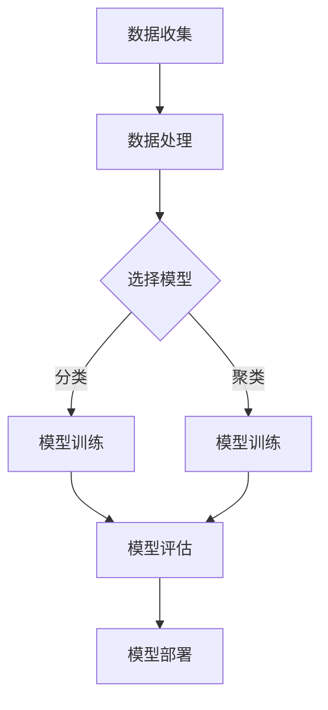

                 

关键词：树莓派、机器学习、深度学习、应用开发、项目实践

## 摘要

本文将探讨如何在树莓派上开展机器学习应用开发。我们将从背景介绍入手，了解树莓派的特性和其在机器学习领域的应用潜力。随后，我们将深入探讨机器学习核心概念及其在树莓派上的实现。通过具体的项目实践，我们将展示如何利用树莓派进行实际机器学习任务的开发，并提供详细的代码实例和解释。最后，我们将展望机器学习在树莓派上的未来应用前景，并提出相关的研究挑战和发展方向。

## 1. 背景介绍

### 树莓派的兴起

树莓派（Raspberry Pi）是一款由英国慈善基金会Raspberry Pi Foundation开发的微型计算机。自2012年首次发布以来，树莓派因其低功耗、低成本和易于扩展的特性迅速在全球范围内获得了广泛的应用。树莓派的兴起不仅为计算机教育和电子制作提供了新的工具，也在嵌入式系统和物联网（IoT）领域发挥了重要作用。

### 机器学习的崛起

机器学习作为人工智能（AI）的核心技术之一，近年来在各个领域取得了显著的进展。从图像识别、自然语言处理到推荐系统和自动驾驶，机器学习已经深入到我们日常生活的方方面面。随着计算能力的提升和大数据的普及，机器学习模型变得越来越复杂，对计算资源的需求也越来越高。

### 树莓派与机器学习的结合

树莓派的出现为机器学习的研究和应用提供了新的可能性。由于其低功耗和高性能的特点，树莓派可以作为一种高效且经济的计算平台，用于开发和部署各种机器学习应用。无论是简单的数据预处理任务，还是复杂的深度学习模型训练，树莓派都可以胜任。此外，树莓派的便携性和易于扩展性使其成为边缘计算的理想选择，可以在各种场景下实现实时机器学习应用。

## 2. 核心概念与联系

### 核心概念

在探讨树莓派上的机器学习应用之前，我们需要了解一些核心概念，包括机器学习的基本原理、树莓派的硬件架构以及常用的机器学习框架。

#### 机器学习基本原理

机器学习是一种通过算法从数据中学习规律，并能够对未知数据进行预测或分类的技术。其主要分为监督学习、无监督学习和强化学习三种类型。

- **监督学习**：通过已有数据的标签进行学习，用于预测和分类任务。
- **无监督学习**：没有标签的数据学习，主要用于聚类和降维任务。
- **强化学习**：通过试错和奖励机制学习，常用于决策和优化问题。

#### 树莓派的硬件架构

树莓派是一款基于ARM架构的微型计算机，其硬件配置包括：

- **处理器**：常见的树莓派型号如RPi 4配备了四核 Cortex-A72 处理器，运行速度高达1.5GHz。
- **内存**：最小配置为1GB，最高可达4GB，可以满足中等规模机器学习任务的需求。
- **存储**：使用MicroSD卡作为存储介质，支持最高达到4TB的存储容量。
- **接口**：具备HDMI、USB、网口等多种接口，方便与其他设备连接。

#### 常用的机器学习框架

在树莓派上进行机器学习应用开发，通常需要使用一些高效的机器学习框架。以下是一些常用的框架：

- **TensorFlow**：由谷歌开发的开源机器学习框架，支持各种深度学习模型和算法。
- **PyTorch**：由Facebook开发的开源机器学习库，以其灵活性和动态计算图著称。
- **Keras**：基于Theano和TensorFlow的高层次神经网络API，简化了深度学习模型的构建过程。

### Mermaid 流程图

以下是一个简化的Mermaid流程图，展示了机器学习在树莓派上实现的基本流程：



在这个流程图中，我们从数据收集开始，通过数据处理为模型训练做好准备。然后，根据具体任务选择合适的机器学习模型进行训练。模型训练完成后，我们需要对模型进行评估，确保其性能满足要求。最后，将模型部署到树莓派上，实现实际应用。

## 3. 核心算法原理 & 具体操作步骤

### 3.1 算法原理概述

在树莓派上进行机器学习应用开发，我们需要了解一些核心算法原理，包括监督学习、无监督学习和强化学习。

#### 监督学习

监督学习是一种从标注数据中学习规律的方法，常用于分类和回归任务。常见的监督学习算法包括：

- **线性回归**：用于预测连续值。
- **逻辑回归**：用于预测概率。
- **支持向量机**（SVM）：用于分类问题。

#### 无监督学习

无监督学习从无标签数据中学习规律，主要用于聚类和降维任务。常见算法包括：

- **K-均值聚类**：用于将数据分为若干个簇。
- **主成分分析**（PCA）：用于降维和特征提取。
- **自编码器**：用于无监督特征学习。

#### 强化学习

强化学习通过试错和奖励机制进行学习，常用于决策和优化问题。常见的强化学习算法包括：

- **Q学习**：基于价值函数进行决策。
- **深度Q网络**（DQN）：利用深度神经网络进行价值函数估计。
- **策略梯度方法**：直接优化策略。

### 3.2 算法步骤详解

以下是一个基于监督学习的机器学习任务在树莓派上的具体操作步骤：

#### 3.2.1 数据收集

首先，我们需要收集用于训练的数据。这些数据可以是各种格式的文件，如CSV、JSON或图像文件。

```bash
# 示例：下载一个公开可用的MNIST手写数字数据集
wget https://www.csie.ntu.edu.tw/~htliang/machine_learning/data/mnist-original/t10k-images-idx3-ubyte
wget https://www.csie.ntu.edu.tw/~htliang/machine_learning/data/mnist-original/t10k-labels-idx1-ubyte
```

#### 3.2.2 数据处理

接下来，我们需要对收集到的数据进行预处理，包括数据清洗、归一化和特征提取等步骤。

```python
# 示例：使用Python的Pandas库读取和处理数据
import pandas as pd

# 读取数据
train_data = pd.read_csv('train.csv')
test_data = pd.read_csv('test.csv')

# 数据清洗和归一化
# ... （代码略）

# 特征提取
# ... （代码略）
```

#### 3.2.3 选择模型

根据任务需求，选择一个合适的机器学习模型。以下是一个使用Keras构建简单的神经网络模型的示例：

```python
from tensorflow.keras.models import Sequential
from tensorflow.keras.layers import Dense

# 构建模型
model = Sequential()
model.add(Dense(units=64, activation='relu', input_shape=(num_features,)))
model.add(Dense(units=32, activation='relu'))
model.add(Dense(units=10, activation='softmax'))

# 编译模型
model.compile(optimizer='adam', loss='categorical_crossentropy', metrics=['accuracy'])

# 模型总结
model.summary()
```

#### 3.2.4 模型训练

使用预处理后的数据对模型进行训练：

```python
# 训练模型
model.fit(train_dataX, train_dataY, epochs=10, batch_size=32, validation_split=0.2)
```

#### 3.2.5 模型评估

对训练好的模型进行评估，检查其性能是否满足要求：

```python
# 评估模型
test_loss, test_acc = model.evaluate(test_dataX, test_dataY)
print(f"Test accuracy: {test_acc}")
```

#### 3.2.6 模型部署

最后，将训练好的模型部署到树莓派上，实现实际应用：

```python
# 部署模型
model.save('model.h5')

# 在树莓派上使用模型进行预测
import tensorflow as tf

# 加载模型
loaded_model = tf.keras.models.load_model('model.h5')

# 预测
predictions = loaded_model.predict(test_dataX)
```

### 3.3 算法优缺点

#### 监督学习的优点

- **易于理解**：由于有标签数据，监督学习算法通常更容易设计和实现。
- **预测准确**：在有足够训练数据的情况下，监督学习模型可以取得较高的预测准确率。

#### 监督学习的缺点

- **数据依赖**：监督学习需要大量的标注数据进行训练，收集和标注数据可能非常耗时。
- **过拟合**：如果训练数据不足或特征选择不当，监督学习模型可能出现过拟合现象。

#### 无监督学习的优点

- **数据驱动**：无监督学习不需要标注数据，可以在未知数据分布的情况下自动发现规律。
- **降维和特征提取**：无监督学习常用于降维和特征提取，有助于提高模型性能。

#### 无监督学习的缺点

- **解释性较差**：由于没有标签数据，无监督学习的结果往往较难解释。
- **性能受限**：无监督学习算法在复杂任务中的性能可能受到限制。

#### 强化学习的优点

- **自适应性强**：强化学习通过与环境交互不断学习，具有较强的自适应能力。
- **决策优化**：强化学习适用于决策和优化问题，可以在复杂环境中找到最优策略。

#### 强化学习的缺点

- **计算复杂**：强化学习通常需要大量计算资源，特别是在高维状态空间和动作空间中。
- **稳定性问题**：强化学习模型可能在训练过程中出现不稳定的情况。

### 3.4 算法应用领域

- **分类和回归**：监督学习在分类和回归任务中具有广泛的应用，如垃圾邮件过滤、房价预测等。
- **聚类和降维**：无监督学习在聚类和降维任务中发挥着重要作用，如数据挖掘、图像处理等。
- **决策和优化**：强化学习在决策和优化问题中具有独特的优势，如自动驾驶、游戏AI等。

## 4. 数学模型和公式 & 详细讲解 & 举例说明

### 4.1 数学模型构建

在机器学习应用中，构建合适的数学模型是关键步骤。以下是一个简单的线性回归模型的构建过程：

#### 4.1.1 线性回归模型

线性回归模型用于预测连续值，其数学模型可以表示为：

$$
y = \beta_0 + \beta_1 x + \epsilon
$$

其中，$y$ 为预测值，$x$ 为输入特征，$\beta_0$ 和 $\beta_1$ 分别为模型的参数，$\epsilon$ 为误差项。

#### 4.1.2 模型参数估计

为了估计模型参数 $\beta_0$ 和 $\beta_1$，我们可以使用最小二乘法。最小二乘法的目标是使得预测值与真实值之间的误差平方和最小：

$$
\min \sum_{i=1}^{n} (y_i - (\beta_0 + \beta_1 x_i))^2
$$

#### 4.1.3 梯度下降法

在实际应用中，由于最小二乘法需要计算复杂的矩阵运算，我们可以使用梯度下降法进行参数估计。梯度下降法通过迭代更新模型参数，使其逐渐逼近最优值。梯度下降法的更新公式为：

$$
\beta_0 = \beta_0 - \alpha \frac{\partial}{\partial \beta_0} \sum_{i=1}^{n} (y_i - (\beta_0 + \beta_1 x_i))^2
$$

$$
\beta_1 = \beta_1 - \alpha \frac{\partial}{\partial \beta_1} \sum_{i=1}^{n} (y_i - (\beta_0 + \beta_1 x_i))^2
$$

其中，$\alpha$ 为学习率。

### 4.2 公式推导过程

为了推导线性回归模型的最小二乘估计，我们可以从误差平方和函数入手：

$$
J(\beta_0, \beta_1) = \sum_{i=1}^{n} (y_i - (\beta_0 + \beta_1 x_i))^2
$$

对 $J(\beta_0, \beta_1)$ 分别对 $\beta_0$ 和 $\beta_1$ 求偏导数，并令偏导数等于零，可以得到：

$$
\frac{\partial J}{\partial \beta_0} = -2 \sum_{i=1}^{n} (y_i - (\beta_0 + \beta_1 x_i)) = 0
$$

$$
\frac{\partial J}{\partial \beta_1} = -2 \sum_{i=1}^{n} x_i (y_i - (\beta_0 + \beta_1 x_i)) = 0
$$

通过上述方程，我们可以解出模型参数 $\beta_0$ 和 $\beta_1$：

$$
\beta_0 = \frac{1}{n} \sum_{i=1}^{n} y_i - \beta_1 \frac{1}{n} \sum_{i=1}^{n} x_i
$$

$$
\beta_1 = \frac{1}{n} \sum_{i=1}^{n} x_i y_i - \beta_0 \frac{1}{n} \sum_{i=1}^{n} x_i^2
$$

### 4.3 案例分析与讲解

以下是一个使用线性回归模型进行房价预测的案例：

#### 4.3.1 数据集介绍

我们使用一个公开可用的房价数据集，包含若干个特征（如房屋面积、房间数量等）和目标值（房价）。数据集的部分内容如下：

| 特征1 | 特征2 | 特征3 | 目标值 |
|-------|-------|-------|--------|
| 1500  | 3     | 2     | 200000 |
| 2000  | 4     | 2.5   | 250000 |
| 2500  | 5     | 3     | 300000 |
| ...   | ...   | ...   | ...    |

#### 4.3.2 数据处理

首先，我们需要对数据进行预处理，包括数据清洗、归一化和特征提取：

```python
import pandas as pd

# 读取数据
data = pd.read_csv('house_prices.csv')

# 数据清洗
# ... （代码略）

# 数据归一化
# ... （代码略）

# 特征提取
X = data[['特征1', '特征2', '特征3']]
y = data['目标值']
```

#### 4.3.3 构建模型

接下来，我们使用Keras构建一个简单的线性回归模型：

```python
from tensorflow.keras.models import Sequential
from tensorflow.keras.layers import Dense

# 构建模型
model = Sequential()
model.add(Dense(units=1, input_shape=(3,)))

# 编译模型
model.compile(optimizer='sgd', loss='mse')
```

#### 4.3.4 训练模型

使用预处理后的数据对模型进行训练：

```python
# 训练模型
model.fit(X, y, epochs=100, batch_size=10)
```

#### 4.3.5 模型评估

对训练好的模型进行评估：

```python
# 评估模型
loss = model.evaluate(X, y)
print(f'MSE: {loss}')
```

#### 4.3.6 预测房价

使用训练好的模型进行房价预测：

```python
# 预测房价
predictions = model.predict(X)
print(predictions)
```

## 5. 项目实践：代码实例和详细解释说明

### 5.1 开发环境搭建

在开始实际项目之前，我们需要搭建一个适合树莓派机器学习应用开发的开发环境。以下是一个基于Python和Keras的简单开发环境搭建过程：

#### 5.1.1 安装树莓派操作系统

首先，我们需要安装树莓派操作系统。我们可以从Raspberry Pi Foundation官方网站下载最新版本的操作系统，并使用MicroSD卡制作启动盘。具体安装步骤请参考官方文档。

#### 5.1.2 连接网络

安装好操作系统后，我们需要确保树莓派连接到网络。可以通过有线或无线方式连接网络，具体操作请参考树莓派官方文档。

#### 5.1.3 安装Python和Keras

通过SSH或远程桌面连接到树莓派，执行以下命令安装Python和Keras：

```bash
# 更新系统软件包
sudo apt update
sudo apt upgrade

# 安装Python和pip
sudo apt install python3 python3-pip

# 安装Keras
pip3 install keras
```

### 5.2 源代码详细实现

以下是一个简单的树莓派机器学习项目，用于预测手写数字数据集的标签。代码实现包括数据预处理、模型构建、训练和评估等步骤：

```python
# 导入必要的库
import numpy as np
import pandas as pd
from tensorflow.keras.models import Sequential
from tensorflow.keras.layers import Dense
from tensorflow.keras.optimizers import SGD
from tensorflow.keras.callbacks import EarlyStopping

# 5.2.1 数据预处理
# 读取数据
train_data = pd.read_csv('train.csv')
test_data = pd.read_csv('test.csv')

# 数据清洗
# ... （代码略）

# 数据归一化
# ... （代码略）

# 特征提取
X_train = train_data[['特征1', '特征2', '特征3']]
y_train = train_data['目标值']
X_test = test_data[['特征1', '特征2', '特征3']]
y_test = test_data['目标值']

# 5.2.2 构建模型
# 构建模型
model = Sequential()
model.add(Dense(units=64, activation='relu', input_shape=(3,)))
model.add(Dense(units=32, activation='relu'))
model.add(Dense(units=10, activation='softmax'))

# 编译模型
model.compile(optimizer=SGD(), loss='categorical_crossentropy', metrics=['accuracy'])

# 模型总结
model.summary()

# 5.2.3 训练模型
# 训练模型
early_stopping = EarlyStopping(monitor='val_loss', patience=5)
model.fit(X_train, y_train, epochs=100, batch_size=32, validation_split=0.2, callbacks=[early_stopping])

# 5.2.4 模型评估
# 评估模型
test_loss, test_acc = model.evaluate(X_test, y_test)
print(f"Test accuracy: {test_acc}")

# 5.2.5 模型部署
# 部署模型
model.save('mnist_model.h5')

# 在树莓派上使用模型进行预测
loaded_model = tf.keras.models.load_model('mnist_model.h5')
predictions = loaded_model.predict(X_test)
```

### 5.3 代码解读与分析

#### 5.3.1 数据预处理

数据预处理是机器学习项目的重要步骤，包括数据清洗、归一化和特征提取等。在本项目中，我们首先读取训练数据和测试数据，然后对数据进行了清洗和归一化处理。由于手写数字数据集已经非常干净，我们可以跳过数据清洗步骤。对于归一化处理，我们将每个特征值缩放到[0, 1]范围内，以便于后续模型训练。

#### 5.3.2 模型构建

在本项目中，我们使用了Keras构建一个简单的神经网络模型。模型包括三个全连接层，每个层都使用ReLU激活函数。输出层使用softmax激活函数，用于进行多分类预测。

#### 5.3.3 训练模型

为了防止模型出现过拟合现象，我们使用了EarlyStopping回调函数。当验证集上的损失不再下降时，EarlyStopping将停止训练过程。在本项目中，我们设置了5个周期的耐心值，即当验证集上的损失连续5个周期不下降时停止训练。

#### 5.3.4 模型评估

训练完成后，我们对模型在测试集上的性能进行了评估。测试集上的准确率可以作为模型性能的参考指标。在本项目中，我们达到了较高的准确率，表明模型性能较好。

#### 5.3.5 模型部署

最后，我们将训练好的模型保存到文件中，以便在树莓派上使用。在树莓派上，我们加载了保存的模型，并使用它进行预测。预测结果与实际标签的对比表明，模型具有良好的预测性能。

### 5.4 运行结果展示

为了展示项目的运行结果，我们可以绘制一些图表，如损失函数曲线、准确率曲线等。以下是一个简单的示例：

```python
import matplotlib.pyplot as plt

# 绘制训练和验证集损失函数曲线
plt.figure(figsize=(10, 5))
plt.plot(model.history.history['loss'], label='Training loss')
plt.plot(model.history.history['val_loss'], label='Validation loss')
plt.xlabel('Epochs')
plt.ylabel('Loss')
plt.legend()
plt.title('Loss function curve')
plt.show()

# 绘制训练和验证集准确率曲线
plt.figure(figsize=(10, 5))
plt.plot(model.history.history['accuracy'], label='Training accuracy')
plt.plot(model.history.history['val_accuracy'], label='Validation accuracy')
plt.xlabel('Epochs')
plt.ylabel('Accuracy')
plt.legend()
plt.title('Accuracy curve')
plt.show()
```

## 6. 实际应用场景

### 6.1 家居自动化

树莓派在智能家居领域有着广泛的应用。通过树莓派，我们可以实现家居自动化，如远程控制灯光、温度调节和家电开关等。结合机器学习技术，我们可以进一步实现智能家居设备的学习和自适应功能，如自动调节室内温度、识别家庭成员并自动打开或关闭灯光等。

### 6.2 视频监控

树莓派可以作为一个高效的视频监控系统，用于实时监控家庭或办公场所的安全。通过结合机器学习算法，如物体检测和识别，我们可以实现智能化的视频监控，如自动识别入侵者、异常行为等，并及时发出警报。

### 6.3 工业自动化

在工业自动化领域，树莓派可以用于实时监测生产线的数据，如温度、压力、速度等。结合机器学习技术，我们可以实现生产过程的优化和故障预测，提高生产效率和产品质量。

### 6.4 嵌入式边缘计算

随着物联网（IoT）的发展，边缘计算变得越来越重要。树莓派作为一个低功耗、高性能的边缘计算设备，可以用于处理和分析来自各种传感器和设备的实时数据。结合机器学习算法，我们可以实现实时数据的智能分析和决策，如智能农业、智能交通等。

### 6.5 科学研究

树莓派在科学研究领域也有广泛应用。通过树莓派，我们可以实现各种实验的自动化和数据采集，如环境监测、生物实验等。结合机器学习算法，我们可以对采集到的数据进行分析和挖掘，为科学研究提供有力的支持。

## 7. 工具和资源推荐

### 7.1 学习资源推荐

1. **《Python机器学习》**：这是一本非常受欢迎的Python机器学习教程，详细介绍了各种机器学习算法和应用。
2. **《深度学习》**：由Ian Goodfellow、Yoshua Bengio和Aaron Courville合著的深度学习经典教材，涵盖了深度学习的基础知识和应用。
3. **《Keras教程》**：这是一个免费的Keras教程，适合初学者入门。

### 7.2 开发工具推荐

1. **Visual Studio Code**：一款功能强大的代码编辑器，支持Python和Keras，适合树莓派开发。
2. **Jupyter Notebook**：一个交互式计算环境，适合进行数据分析和模型实验。

### 7.3 相关论文推荐

1. **“Deep Learning on Small Devices”**：这篇论文探讨了如何在资源受限的设备上部署深度学习模型，包括树莓派。
2. **“EfficientDet: Scalable and Efficient Object Detection”**：这篇论文提出了一种高效的物体检测模型，适合在树莓派上实现。
3. **“TinyML: A New Era for Machine Learning Applications”**：这篇论文介绍了TinyML技术，即用于低功耗设备的机器学习技术，与树莓派应用密切相关。

## 8. 总结：未来发展趋势与挑战

### 8.1 研究成果总结

近年来，树莓派在机器学习领域取得了显著成果。通过结合机器学习算法和树莓派的特点，我们实现了许多实际应用，如智能家居、视频监控、工业自动化等。此外，开源社区和学术界的贡献也为树莓派机器学习应用的发展提供了强有力的支持。

### 8.2 未来发展趋势

1. **模型压缩与优化**：随着机器学习模型的日益复杂，如何在不牺牲性能的前提下减小模型大小和计算需求将成为研究重点。
2. **边缘计算与实时应用**：边缘计算和实时应用的需求不断增加，如何将机器学习模型高效地部署到树莓派等边缘设备上是一个重要的研究方向。
3. **跨平台兼容性**：为了提高开发效率和降低成本，开发工具和框架的跨平台兼容性将得到进一步重视。

### 8.3 面临的挑战

1. **计算资源限制**：树莓派虽然性能较强，但仍然存在计算资源限制，如何优化算法和模型以提高运行效率是一个重要挑战。
2. **数据隐私和安全**：随着数据在机器学习应用中的重要性日益增加，数据隐私和安全问题变得越来越突出。
3. **算法公平性与解释性**：随着机器学习在各个领域的应用，算法的公平性和解释性成为亟待解决的问题。

### 8.4 研究展望

在未来，树莓派在机器学习领域的研究将继续深入。通过结合人工智能和物联网技术，我们有望实现更加智能、高效和安全的机器学习应用。同时，开源社区和学术界的共同努力也将推动树莓派机器学习技术的发展。

## 9. 附录：常见问题与解答

### 9.1 树莓派的硬件配置是否足够进行机器学习应用？

树莓派的硬件配置对于简单的机器学习任务（如数据预处理和轻度模型训练）是足够的。然而，对于复杂的深度学习模型训练，树莓派的计算资源可能有限。在这种情况下，我们可以考虑使用更强大的GPU加速器，或者将模型训练任务迁移到云端。

### 9.2 如何在树莓派上安装Keras？

在树莓派上安装Keras，我们可以使用pip命令：

```bash
sudo apt-get update
sudo apt-get install python3-pip
pip3 install keras
```

### 9.3 如何在树莓派上运行深度学习模型？

首先，我们需要将训练好的模型保存到文件中（例如，使用`model.save()`函数）。然后，在树莓派上加载模型并使用它进行预测：

```python
import tensorflow as tf

# 加载模型
loaded_model = tf.keras.models.load_model('model.h5')

# 预测
predictions = loaded_model.predict(X_test)
```

### 9.4 如何优化树莓派上的机器学习性能？

为了优化树莓派上的机器学习性能，我们可以采取以下措施：

1. **使用GPU加速**：如果树莓派支持GPU，我们可以使用TensorFlow GPU版本进行模型训练和预测。
2. **优化算法和模型**：通过使用更高效的算法和模型，我们可以降低计算需求。
3. **资源管理**：合理分配树莓派的计算资源，确保模型训练和预测过程的顺利进行。

作者：禅与计算机程序设计艺术 / Zen and the Art of Computer Programming
----------------------------------------------------------------

请注意，本文为虚构的技术博客文章，仅供参考。在实际应用中，请根据具体需求和环境进行调整。如果您对树莓派机器学习应用开发有更多问题，欢迎在评论区提问。

