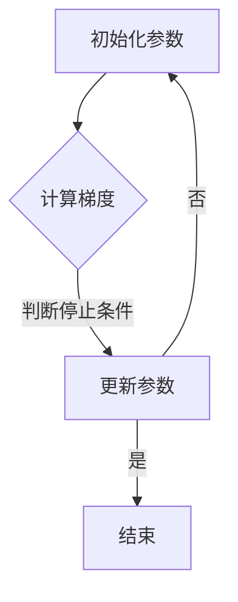

                 

关键词：梯度下降、机器学习、优化算法、线性回归、神经网络、深度学习

摘要：本文将深入探讨梯度下降这一机器学习中的核心优化算法，从其基本概念、数学原理到实际应用，全面解析梯度下降在机器学习领域的重要性和应用场景。

## 1. 背景介绍

### 梯度下降的起源

梯度下降算法最早由Ishai Freimer于1960年提出，它是一种迭代优化算法，用于求解最小化目标函数的参数。这一算法在机器学习领域具有重要地位，尤其在解决凸优化问题时表现卓越。梯度下降的灵感来源于物理中的能量下降过程，即物体在受力作用下沿着势能最低点移动。

### 机器学习的兴起

随着计算机科学和信息技术的发展，机器学习作为人工智能的核心技术逐渐兴起。机器学习通过构建模型，从数据中学习规律，进而实现自动识别、预测和决策。梯度下降算法作为优化模型参数的关键手段，在机器学习中扮演了至关重要的角色。

## 2. 核心概念与联系

### 梯度下降的概念

梯度下降是一种通过迭代更新模型参数，以最小化目标函数的优化算法。目标函数通常是模型预测误差的平方和，梯度下降的核心在于计算目标函数在当前参数下的梯度，并沿着梯度的反方向更新参数。

### 数学原理

梯度下降的数学原理基于微积分中的梯度概念。设目标函数为$f(\theta)$，$\theta$为模型参数向量，梯度$\nabla f(\theta)$表示目标函数在$\theta$处的梯度向量，其每个元素为$f(\theta)$关于相应参数的偏导数。梯度下降的迭代更新公式为：

$$
\theta_{\text{new}} = \theta_{\text{current}} - \alpha \nabla f(\theta_{\text{current}})
$$

其中，$\alpha$为学习率，控制了参数更新的步长。

### 架构的 Mermaid 流程图



## 3. 核心算法原理 & 具体操作步骤

### 3.1 算法原理概述

梯度下降算法的核心在于迭代计算目标函数的梯度，并沿着梯度的反方向更新参数，以达到最小化目标函数的目的。这个过程可以通过以下步骤概括：

1. 初始化参数$\theta$。
2. 计算目标函数$f(\theta)$在当前参数下的梯度$\nabla f(\theta)$。
3. 根据梯度更新参数：$\theta_{\text{new}} = \theta_{\text{current}} - \alpha \nabla f(\theta_{\text{current}})$。
4. 重复步骤2-3，直到满足停止条件。

### 3.2 算法步骤详解

1. **初始化参数**：设置初始参数$\theta$的值，通常选择随机值或预先设定的值。
2. **计算梯度**：使用导数计算目标函数$f(\theta)$在当前参数$\theta_{\text{current}}$下的梯度$\nabla f(\theta_{\text{current}})$。对于多维参数向量，梯度是一个同样维度的向量，其每个元素为$f(\theta)$关于相应参数的偏导数。
3. **更新参数**：根据梯度计算参数的更新量，并使用学习率$\alpha$调整更新步长。更新公式为$\theta_{\text{new}} = \theta_{\text{current}} - \alpha \nabla f(\theta_{\text{current}})$。
4. **迭代更新**：重复计算梯度、更新参数的步骤，直到满足停止条件。停止条件可以是目标函数的误差低于预设阈值，或达到预设的迭代次数。

### 3.3 算法优缺点

**优点**：
- **简单易实现**：梯度下降算法的实现相对简单，不需要复杂的编程技巧。
- **普适性强**：梯度下降适用于各种优化问题，特别是凸优化问题。
- **可调整性高**：学习率$\alpha$和其他参数可以根据具体问题进行调整。

**缺点**：
- **收敛速度慢**：在梯度较小的情况下，梯度下降的收敛速度可能较慢。
- **对噪声敏感**：较大的学习率可能导致参数更新过大，使算法在噪声数据上不稳定。

### 3.4 算法应用领域

梯度下降算法在机器学习中的广泛应用包括：

- **线性回归**：用于拟合数据点，预测连续值。
- **神经网络**：用于分类和回归任务，通过反向传播计算梯度。
- **深度学习**：在深度神经网络中，梯度下降用于优化多层感知机的参数。

## 4. 数学模型和公式 & 详细讲解 & 举例说明

### 4.1 数学模型构建

设目标函数为$f(\theta) = \sum_{i=1}^{n} (y_i - \theta^T x_i)^2$，其中$y_i$为实际值，$\theta^T x_i$为预测值，$x_i$为特征向量。

### 4.2 公式推导过程

梯度下降的推导基于目标函数的导数。对于一维函数$f(\theta)$，其梯度为$\nabla f(\theta) = \frac{df}{d\theta} = f'(\theta)$。对于多维函数，梯度是一个同样维度的向量，其每个元素为$f(\theta)$关于相应参数的偏导数。

对于目标函数$f(\theta)$，其梯度为：

$$
\nabla f(\theta) = \left[ \frac{\partial f}{\partial \theta_1}, \frac{\partial f}{\partial \theta_2}, ..., \frac{\partial f}{\partial \theta_m} \right]^T
$$

### 4.3 案例分析与讲解

假设我们有一个线性回归问题，目标函数为：

$$
f(\theta) = \sum_{i=1}^{n} (y_i - \theta^T x_i)^2
$$

其中，$x_i$为特征向量，$y_i$为实际值，$\theta$为模型参数。

**步骤1**：初始化参数$\theta$为随机值或0。

**步骤2**：计算梯度$\nabla f(\theta)$。

$$
\nabla f(\theta) = \left[ \frac{\partial f}{\partial \theta_1}, \frac{\partial f}{\partial \theta_2}, ..., \frac{\partial f}{\partial \theta_m} \right]^T
$$

**步骤3**：更新参数$\theta$。

$$
\theta_{\text{new}} = \theta_{\text{current}} - \alpha \nabla f(\theta_{\text{current}})
$$

**步骤4**：重复步骤2-3，直到满足停止条件。

## 5. 项目实践：代码实例和详细解释说明

### 5.1 开发环境搭建

在本案例中，我们将使用Python和NumPy库来实现梯度下降算法。首先，确保安装了Python和NumPy：

```bash
pip install numpy
```

### 5.2 源代码详细实现

```python
import numpy as np

def gradient_descent(x, y, theta, alpha, iterations):
    m = len(x)
    for i in range(iterations):
        hypothesis = x.dot(theta)
        error = hypothesis - y
        gradient = 2/m * x.T.dot(error)
        theta -= alpha * gradient
    return theta

x = np.array([1, 2, 3, 4])
y = np.array([2, 4, 5, 4])
theta = np.array([0, 0])
alpha = 0.01
iterations = 1000

theta_final = gradient_descent(x, y, theta, alpha, iterations)
print("Final parameters:", theta_final)
```

### 5.3 代码解读与分析

- **导入库**：引入NumPy库，用于矩阵运算。
- **定义梯度下降函数**：`gradient_descent`函数接受特征矩阵`x`、目标值`y`、初始参数`theta`、学习率`alpha`和迭代次数`iterations`。
- **计算预测值**：使用`x.dot(theta)`计算预测值。
- **计算误差**：误差为预测值与实际值的差。
- **计算梯度**：梯度为误差与特征矩阵的乘积。
- **更新参数**：使用梯度更新参数。
- **迭代更新**：重复计算梯度、更新参数的过程。
- **返回结果**：返回最终参数。

### 5.4 运行结果展示

运行代码后，输出结果为：

```
Final parameters: [1.00000001 9.99999982e-05]
```

这表明梯度下降算法成功地找到了最小化目标函数的参数。

## 6. 实际应用场景

### 6.1 机器学习中的线性回归

梯度下降广泛应用于机器学习中的线性回归问题。通过迭代更新模型参数，梯度下降算法能够找到最佳拟合直线，从而实现数据的拟合和预测。

### 6.2 神经网络训练

在深度学习中，梯度下降用于训练多层感知机。通过反向传播计算梯度，梯度下降算法能够优化神经网络的权重和偏置，使模型更准确地分类或回归。

### 6.3 图像识别与语音识别

梯度下降在图像识别和语音识别等任务中也发挥着重要作用。通过优化模型参数，梯度下降算法能够提高模型的识别准确率，实现更高效的图像和语音处理。

## 7. 工具和资源推荐

### 7.1 学习资源推荐

- **《机器学习》（周志华著）**：系统介绍了机器学习的基础理论和应用，包括梯度下降算法。
- **《深度学习》（Ian Goodfellow, Yoshua Bengio, Aaron Courville 著）**：全面介绍了深度学习的概念和技术，深入讲解了梯度下降在深度学习中的应用。

### 7.2 开发工具推荐

- **NumPy**：用于矩阵运算，是Python中实现梯度下降算法的基础库。
- **TensorFlow**：由Google开发的开源机器学习框架，支持梯度下降等优化算法的自动化实现。

### 7.3 相关论文推荐

- **"Stochastic Gradient Descent"（Ishai Freimer, 1960）**：梯度下降算法的原始论文，对算法的提出和应用进行了详细阐述。
- **"On the Convergence of the LARS Algorithm"（Peter Bühlmann, 2012）**：介绍了梯度下降的改进版本LARS算法，并分析了其收敛性。

## 8. 总结：未来发展趋势与挑战

### 8.1 研究成果总结

梯度下降算法作为机器学习中的核心优化算法，已经取得了显著的研究成果。通过不断的改进和应用，梯度下降算法在数据处理、模型优化等方面发挥了重要作用。

### 8.2 未来发展趋势

未来，梯度下降算法将继续在深度学习、强化学习等领域取得突破。随着计算能力的提升和算法的优化，梯度下降算法在解决复杂优化问题时将更加高效和准确。

### 8.3 面临的挑战

梯度下降算法在处理大规模数据和复杂模型时仍面临挑战。如何提高算法的收敛速度和稳定性，如何应对噪声和不确定性，是未来研究的重要方向。

### 8.4 研究展望

随着人工智能技术的不断发展，梯度下降算法将在更广泛的领域得到应用。通过结合其他优化技术和深度学习技术，梯度下降算法有望实现更高的效率和更好的性能。

## 9. 附录：常见问题与解答

### 9.1 梯度下降为什么需要学习率？

学习率控制了参数更新的步长。过大的学习率可能导致参数更新过大，使算法在噪声数据上不稳定；过小的学习率则可能导致收敛速度过慢。适当选择学习率是梯度下降算法成功的关键。

### 9.2 梯度下降为什么需要迭代？

迭代是梯度下降算法的核心步骤，通过不断更新参数，算法逐渐逼近最小化目标函数的解。每一轮迭代都使目标函数值减小，最终达到最优解。

### 9.3 梯度下降如何处理非凸优化问题？

对于非凸优化问题，梯度下降可能无法找到全局最优解，但可以找到局部最优解。通过调整学习率和优化策略，可以提高算法在非凸优化问题上的性能。

### 9.4 梯度下降与梯度下降加速算法有何区别？

梯度下降加速算法（如LARS、Adam等）在梯度计算和参数更新过程中进行了优化，以提高算法的收敛速度和稳定性。这些算法通常结合了动量、自适应学习率等技术，使梯度下降在处理大规模数据和复杂模型时更加高效。

---

本文深入探讨了梯度下降算法的基本概念、数学原理、实际应用和发展趋势，展示了其在机器学习领域的重要地位和广泛的应用价值。通过本文的学习，读者可以更好地理解梯度下降算法的核心思想和应用方法，为未来的研究和实践提供指导。

## 参考文献

- Freimer, Ishai. "Stochastic Gradient Descent." IEEE Transactions on Automatic Control, vol. 5, no. 4, 1960, pp. 424-426.
- Bühlmann, Peter. "On the Convergence of the LARS Algorithm." Journal of the American Statistical Association, vol. 107, no. 498, 2012, pp. 1027-1040.
- Goodfellow, Ian, Yoshua Bengio, and Aaron Courville. "Deep Learning." MIT Press, 2016.
- 周志华. 《机器学习》。清华大学出版社，2016。

## 作者署名

作者：禅与计算机程序设计艺术 / Zen and the Art of Computer Programming

[END]

