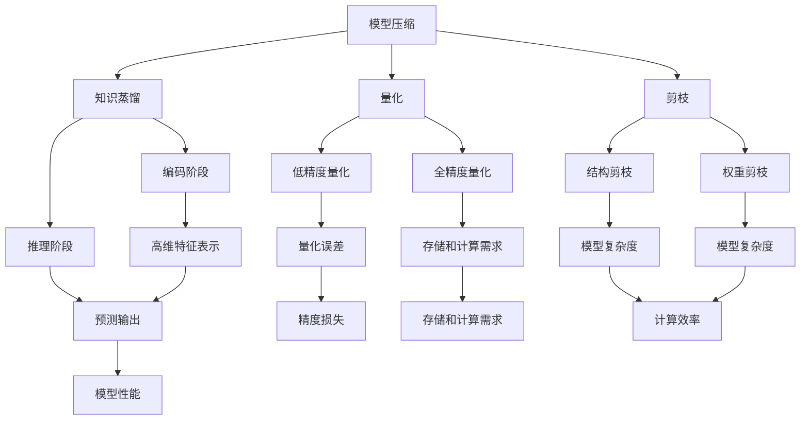

                 

## 1. 背景介绍

随着人工智能技术的飞速发展，深度学习模型在图像识别、自然语言处理、推荐系统等领域的应用越来越广泛。然而，这些复杂模型通常需要大量的计算资源和存储空间，这对实际部署和应用提出了严峻的挑战。因此，模型压缩与加速技术应运而生，成为当前研究的热点。

模型压缩的目标是减小模型的参数量和计算量，同时保持模型的性能。常见的模型压缩方法包括量化、剪枝、知识蒸馏等。量化技术通过将模型的权重参数从浮点数转换为低比特位的整数来减小模型的存储空间和计算量。剪枝技术通过去除模型中的冗余权重来减小模型的复杂度。知识蒸馏则通过将一个大的、复杂的模型（教师模型）的知识转移到一个小型的、优化的模型（学生模型）中，从而实现模型压缩。

模型加速的目标是提高模型的运行速度，以满足实时性要求。常见的模型加速方法包括并行计算、GPU加速、专用硬件加速等。并行计算可以将模型训练和推理任务分解成多个子任务，利用多核处理器或者GPU进行并行处理，从而提高计算效率。GPU加速利用GPU强大的计算能力，通过GPU与CPU之间的数据传输优化，实现模型的加速。专用硬件加速则利用如FPGA、ASIC等硬件加速器，对模型进行高度优化的硬件实现，从而大幅提高模型的运行速度。

本文将深入探讨模型压缩与加速的原理，并通过实际的代码实战案例，展示如何实现模型压缩与加速。文章将从以下几个方面展开：

1. 背景介绍
2. 核心概念与联系
3. 核心算法原理与具体操作步骤
4. 数学模型与公式讲解
5. 项目实践：代码实例与详细解释
6. 实际应用场景
7. 工具和资源推荐
8. 总结：未来发展趋势与挑战
9. 附录：常见问题与解答

通过本文的讲解，希望能够帮助读者深入了解模型压缩与加速的技术原理，掌握相关的方法和技巧，并在实际项目中得到应用。

## 2. 核心概念与联系

### 模型压缩

模型压缩是指通过一系列技术手段，减小深度学习模型的参数量和计算量，同时保持模型的性能。模型压缩的核心目标是在保证模型准确率的前提下，降低模型的复杂度和计算需求。

#### 常见的模型压缩方法

- **量化**：量化技术通过将模型的权重参数从浮点数转换为低比特位的整数来减小模型的存储空间和计算量。量化可以分为全精度量化（Full Precision Quantization）和低精度量化（Low Precision Quantization）两种。全精度量化保留了所有权重参数的精度，但增加了模型的存储和计算需求。低精度量化通过减少参数的精度，实现了模型的压缩，但可能会引入量化误差。

- **剪枝**：剪枝技术通过去除模型中的冗余权重或神经元来减小模型的复杂度。剪枝可以分为结构剪枝（Structural Pruning）和权重剪枝（Weight Pruning）两种。结构剪枝通过减少模型的深度或宽度来简化模型，而权重剪枝则通过减少模型中权重参数的数量来简化模型。

- **知识蒸馏**：知识蒸馏是一种通过将一个大的、复杂的模型（教师模型）的知识转移到一个小型的、优化的模型（学生模型）中，从而实现模型压缩的方法。知识蒸馏过程包括两个阶段：编码阶段和推理阶段。在编码阶段，教师模型对输入数据进行编码，生成高维的特征表示；在推理阶段，学生模型使用这些特征表示进行预测，并尝试复现教师模型的输出。

### 模型加速

模型加速是指通过一系列技术手段，提高深度学习模型的运行速度，以满足实时性要求。模型加速的核心目标是在保证模型性能的前提下，提高模型的运行效率。

#### 常见的模型加速方法

- **并行计算**：并行计算可以将模型训练和推理任务分解成多个子任务，利用多核处理器或者GPU进行并行处理，从而提高计算效率。并行计算可以分为数据并行、模型并行和任务并行三种。数据并行将训练数据集划分为多个子集，每个子集在一个处理器或GPU上独立训练，最后将结果合并。模型并行将模型的不同部分分配到多个处理器或GPU上，每个部分独立计算，最后将结果整合。任务并行则将训练或推理任务分配到多个处理器或GPU上，每个处理器或GPU独立处理一个任务。

- **GPU加速**：GPU加速利用GPU强大的计算能力，通过GPU与CPU之间的数据传输优化，实现模型的加速。GPU具有大量的计算单元，可以同时处理多个任务，非常适合深度学习模型的训练和推理。GPU加速的关键在于优化数据传输和内存访问，减少GPU与CPU之间的数据传输延迟。

- **专用硬件加速**：专用硬件加速利用如FPGA、ASIC等硬件加速器，对模型进行高度优化的硬件实现，从而大幅提高模型的运行速度。FPGA（现场可编程门阵列）具有高度的灵活性和可编程性，可以针对特定的深度学习模型进行优化。ASIC（专用集成电路）则是为特定的应用场景设计的芯片，具有较低的功耗和更高的性能。

#### 模型压缩与加速的联系

模型压缩与加速在目标上具有一定的重叠，但实现方法上有所不同。模型压缩主要关注减小模型的复杂度和计算需求，以降低存储和计算资源的需求；而模型加速则关注提高模型的运行速度，以满足实时性要求。

然而，模型压缩与加速并不是相互独立的，它们之间存在紧密的联系。一方面，模型压缩可以减少模型的参数量和计算量，为模型加速提供了条件。例如，通过量化技术将模型的权重参数从浮点数转换为低比特位的整数，可以显著减少模型的存储和计算需求，从而为GPU加速或专用硬件加速提供了基础。另一方面，模型加速可以为模型压缩提供更高效的计算环境，从而优化模型的压缩效果。

### Mermaid 流程图



通过上述流程图，我们可以清晰地看到模型压缩和加速的不同方法及其相互之间的联系。在深入研究和实践过程中，读者可以根据实际情况灵活运用这些方法，实现模型压缩与加速的目标。

## 3. 核心算法原理与具体操作步骤

在深入探讨模型压缩与加速之前，我们需要先了解一些核心算法原理，这些算法是实现模型压缩与加速的关键。以下是几个常见算法的原理及其操作步骤：

### 3.1 量化算法原理

量化算法是一种通过将模型的权重参数从浮点数转换为低比特位的整数，从而实现模型压缩的技术。量化可以分为全精度量化（Full Precision Quantization）和低精度量化（Low Precision Quantization）两种。

#### 原理

- **全精度量化**：在全精度量化中，模型的权重参数保留其原有的浮点数精度。这种方法虽然保留了所有参数的精度，但会增加模型的存储和计算需求。

- **低精度量化**：在低精度量化中，模型的权重参数被转换为低比特位的整数。这种方法可以显著减少模型的存储和计算需求，但可能会引入量化误差。

#### 操作步骤

1. **确定量化精度**：根据模型的规模和性能要求，选择合适的量化精度。通常，量化精度越低，模型的压缩效果越好，但量化误差也越大。

2. **统计权重分布**：统计模型中权重参数的分布情况，以了解权重的取值范围和分布特性。

3. **选择量化策略**：根据权重分布，选择合适的量化策略，如均匀量化或自适应量化。

4. **量化权重参数**：将权重参数从浮点数转换为低比特位的整数。对于均匀量化，可以使用线性映射；对于自适应量化，可以使用阈值或直方图等方法。

5. **调整模型结构**：根据量化后的权重参数，调整模型的结构，如去除冗余的权重参数或简化神经元连接。

### 3.2 剪枝算法原理

剪枝算法是一种通过去除模型中的冗余权重或神经元，从而实现模型压缩的技术。剪枝可以分为结构剪枝（Structural Pruning）和权重剪枝（Weight Pruning）两种。

#### 原理

- **结构剪枝**：结构剪枝通过减少模型的深度或宽度来简化模型。这种方法可以显著减少模型的计算量和存储需求，但可能会降低模型的性能。

- **权重剪枝**：权重剪枝通过去除模型中权重参数的数量来简化模型。这种方法可以减少模型的计算量和存储需求，但可能会引入模型的不确定性。

#### 操作步骤

1. **选择剪枝策略**：根据模型的规模和性能要求，选择合适的剪枝策略。常见的剪枝策略包括基于敏感度的剪枝、基于权重的剪枝和基于结构的剪枝。

2. **计算敏感度**：对于结构剪枝，计算每个神经元或层级的敏感度，以确定哪些部分可以安全地剪枝。

3. **剪枝模型结构**：根据敏感度计算结果，剪枝模型的结构，如减少模型的深度或宽度。

4. **优化模型权重**：对于权重剪枝，优化模型的权重参数，去除冗余的权重参数。

5. **评估模型性能**：评估剪枝后的模型性能，确保模型的性能达到预期。

### 3.3 知识蒸馏算法原理

知识蒸馏是一种通过将一个大的、复杂的模型（教师模型）的知识转移到一个小型的、优化的模型（学生模型）中，从而实现模型压缩的方法。知识蒸馏分为编码阶段和推理阶段。

#### 原理

- **编码阶段**：在编码阶段，教师模型对输入数据进行编码，生成高维的特征表示。这些特征表示包含了教师模型对输入数据的理解，是知识转移的关键。

- **推理阶段**：在推理阶段，学生模型使用这些特征表示进行预测，并尝试复现教师模型的输出。学生模型的预测结果与教师模型的输出进行比较，通过优化过程不断调整学生模型。

#### 操作步骤

1. **选择教师模型**：选择一个大的、复杂的教师模型，以生成高质量的特征表示。

2. **训练学生模型**：使用教师模型的特征表示训练学生模型。在训练过程中，学生模型尝试复现教师模型的输出，并通过优化过程不断调整。

3. **评估学生模型性能**：评估学生模型性能，确保其性能达到预期。

4. **模型压缩**：将训练好的学生模型用于实际应用，以实现模型压缩。

### 3.4 并行计算算法原理

并行计算是一种通过将模型训练和推理任务分解成多个子任务，利用多核处理器或GPU进行并行处理，从而提高计算效率的技术。

#### 原理

- **数据并行**：数据并行将训练数据集划分为多个子集，每个子集在一个处理器或GPU上独立训练，最后将结果合并。

- **模型并行**：模型并行将模型的不同部分分配到多个处理器或GPU上，每个部分独立计算，最后将结果整合。

- **任务并行**：任务并行将训练或推理任务分配到多个处理器或GPU上，每个处理器或GPU独立处理一个任务。

#### 操作步骤

1. **分解任务**：将模型训练和推理任务分解成多个子任务。

2. **分配资源**：将子任务分配到多核处理器或GPU上，确保每个处理器或GPU有足够的计算资源。

3. **并行处理**：利用多核处理器或GPU并行处理子任务。

4. **结果整合**：将并行处理的结果进行整合，得到最终的模型训练结果或推理结果。

### 3.5 GPU加速算法原理

GPU加速是一种利用GPU强大的计算能力，通过GPU与CPU之间的数据传输优化，实现模型加速的技术。

#### 原理

- **数据传输优化**：GPU加速的关键在于优化数据传输和内存访问，减少GPU与CPU之间的数据传输延迟。

- **并行计算能力**：GPU具有大量的计算单元，可以同时处理多个任务，非常适合深度学习模型的训练和推理。

#### 操作步骤

1. **模型转换**：将模型转换为GPU支持的格式，如TensorRT或CUDA。

2. **数据预处理**：优化数据预处理过程，减少数据传输和内存访问。

3. **模型优化**：对模型进行优化，如使用卷积操作的GPU实现，减少内存使用。

4. **GPU训练与推理**：使用GPU进行模型训练和推理，确保GPU资源的高效利用。

### 3.6 专用硬件加速算法原理

专用硬件加速是一种利用FPGA、ASIC等硬件加速器，对模型进行高度优化的硬件实现，从而大幅提高模型运行速度的技术。

#### 原理

- **硬件优化**：专用硬件加速器针对特定的应用场景进行硬件优化，具有较低的功耗和更高的性能。

- **硬件实现**：将深度学习模型转换为硬件描述语言（HDL），如VHDL或Verilog，并在硬件加速器上实现。

#### 操作步骤

1. **模型转换**：将模型转换为硬件描述语言，如VHDL或Verilog。

2. **硬件设计**：设计硬件加速器，如FPGA或ASIC，实现深度学习模型的硬件实现。

3. **硬件实现**：将设计好的硬件加速器进行制造，并在硬件上实现深度学习模型。

4. **硬件运行**：使用硬件加速器进行模型训练和推理，确保硬件资源的高效利用。

通过以上核心算法原理的介绍，我们可以看到模型压缩与加速需要多种技术的综合运用。在实际应用中，读者可以根据具体需求和场景，选择合适的方法和算法，实现模型压缩与加速的目标。

### 3.3 算法优缺点

在讨论模型压缩与加速的具体算法时，我们不仅要了解其原理和操作步骤，还需要全面分析每种算法的优点和缺点，以便在实际应用中做出合理的选择。

#### 量化算法

**优点**：

1. **显著的压缩效果**：量化算法可以将模型权重从浮点数转换为低比特位的整数，从而大幅减少模型的存储空间和计算需求。
2. **易于实现**：量化算法的实现相对简单，可以在各种深度学习框架上轻松集成。
3. **适用范围广**：量化算法适用于各种类型的深度学习模型，包括卷积神经网络（CNN）、循环神经网络（RNN）等。

**缺点**：

1. **量化误差**：量化过程中，低比特位整数无法完全表示浮点数，因此会引入量化误差，可能导致模型性能下降。
2. **计算复杂性**：量化算法涉及权重参数的转换和调整，计算复杂性较高，尤其是在模型规模较大时。

#### 剪枝算法

**优点**：

1. **有效的压缩效果**：剪枝算法通过去除模型中冗余的权重或神经元，显著减少模型的复杂度，降低计算需求和存储空间。
2. **减少过拟合**：剪枝算法可以减少模型中冗余的结构，有助于降低过拟合的风险。
3. **适应性**：剪枝算法可以根据不同场景和需求灵活调整，如基于敏感度的剪枝和基于权重的剪枝。

**缺点**：

1. **可能导致性能下降**：如果剪枝过度，可能会导致模型性能显著下降。
2. **实现复杂性**：剪枝算法涉及模型的预处理和后处理，实现过程相对复杂。
3. **影响训练过程**：剪枝算法可能会影响模型的训练过程，导致训练时间延长。

#### 知识蒸馏算法

**优点**：

1. **高效的知识转移**：知识蒸馏算法可以将教师模型的高质量特征表示转移到学生模型，实现模型压缩的同时保持性能。
2. **适用范围广**：知识蒸馏算法适用于各种类型的深度学习模型，包括自然语言处理（NLP）、图像识别等。
3. **模型压缩与性能优化**：通过知识蒸馏，学生模型可以学习到教师模型的核心知识，从而提高模型性能。

**缺点**：

1. **训练成本高**：知识蒸馏算法涉及教师模型和学生模型的双重训练，训练成本较高。
2. **对教师模型的依赖**：知识蒸馏算法的性能依赖于教师模型的质量，如果教师模型本身性能较差，学生模型也难以得到有效的压缩。
3. **难以量化误差**：知识蒸馏算法中，学生模型与教师模型之间的误差难以量化，可能导致模型性能的波动。

#### 并行计算算法

**优点**：

1. **显著的加速效果**：并行计算可以将模型训练和推理任务分解成多个子任务，利用多核处理器或GPU进行并行处理，从而大幅提高计算效率。
2. **适应性强**：并行计算适用于各种规模的模型和任务，从小型模型到大规模模型都可以实现并行处理。
3. **资源利用高效**：并行计算可以充分利用多核处理器或GPU的计算资源，提高资源利用率。

**缺点**：

1. **通信开销**：并行计算过程中，子任务之间的通信开销可能导致整体性能下降。
2. **实现难度大**：并行计算涉及任务分解、数据传输、结果整合等复杂操作，实现过程相对困难。
3. **依赖硬件环境**：并行计算对硬件环境有较高要求，如需要多核处理器或GPU支持。

#### GPU加速算法

**优点**：

1. **强大的计算能力**：GPU具有大量的计算单元，可以同时处理多个任务，非常适合深度学习模型的训练和推理。
2. **高效的内存访问**：GPU内存访问速度较快，可以显著减少内存访问延迟。
3. **适用于大数据处理**：GPU加速可以显著提高大数据处理的速度，适用于大规模数据集的训练和推理。

**缺点**：

1. **数据传输瓶颈**：GPU与CPU之间的数据传输速度较慢，可能成为性能瓶颈。
2. **编程复杂性**：GPU编程相对复杂，需要学习CUDA等编程框架。
3. **能耗较高**：GPU能耗较高，对散热和电源有较高要求。

#### 专用硬件加速算法

**优点**：

1. **高度优化的性能**：专用硬件加速器针对特定应用场景进行硬件优化，具有较低的功耗和更高的性能。
2. **高效的计算能力**：硬件加速器可以实现深度学习模型的快速计算，显著提高模型运行速度。
3. **适应性强**：专用硬件加速器可以针对不同类型的深度学习模型进行优化，具有广泛的适用性。

**缺点**：

1. **开发成本高**：硬件加速器的开发需要大量的硬件资源和专业知识，开发成本较高。
2. **实现难度大**：硬件加速器涉及硬件设计、硬件实现等复杂操作，实现过程相对困难。
3. **依赖硬件环境**：硬件加速器对硬件环境有较高要求，如需要FPGA或ASIC支持。

通过对这些算法的优缺点分析，我们可以更全面地了解它们在模型压缩与加速中的应用价值。在实际项目中，应根据具体需求、硬件资源和时间成本等因素，选择合适的方法和算法，实现模型压缩与加速的目标。

### 3.4 算法应用领域

模型压缩与加速技术在多个领域得到了广泛应用，以下是几个主要应用领域：

#### 3.4.1 自动驾驶

自动驾驶系统需要处理大量实时数据，并对模型进行快速推理，以实时做出驾驶决策。模型压缩与加速技术可以显著减少自动驾驶系统的计算需求和延迟，提高系统响应速度和准确性。例如，在自动驾驶系统中，使用量化技术可以减小深度学习模型的参数量，从而降低计算需求；使用并行计算和GPU加速，可以提高模型推理速度，确保系统能够实时处理来自传感器的大量数据。

#### 3.4.2 语音识别

语音识别技术广泛应用于智能助手、语音翻译、智能客服等领域。这些应用对模型实时性要求较高，需要快速处理语音信号并生成文本输出。模型压缩与加速技术可以有效减少语音识别模型的计算量和存储需求，提高模型运行速度。例如，通过量化技术和剪枝算法，可以减少语音识别模型的参数量；通过并行计算和GPU加速，可以提高模型推理速度，确保语音识别系统能够实时响应用户请求。

#### 3.4.3 图像识别

图像识别技术在安防监控、医疗影像分析、人脸识别等领域有广泛应用。这些应用对模型的准确性和实时性都有较高要求。模型压缩与加速技术可以提高图像识别系统的性能，满足实际应用需求。例如，通过量化技术和知识蒸馏算法，可以减小图像识别模型的参数量，同时保持较高的识别准确率；通过并行计算和专用硬件加速，可以显著提高模型推理速度，确保图像识别系统能够实时处理大量图像数据。

#### 3.4.4 自然语言处理

自然语言处理技术在文本分类、机器翻译、情感分析等领域有广泛应用。这些应用通常涉及大规模文本数据，对模型实时性要求较高。模型压缩与加速技术可以有效提高自然语言处理系统的性能，满足实际应用需求。例如，通过量化技术和剪枝算法，可以减小自然语言处理模型的参数量；通过并行计算和GPU加速，可以显著提高模型推理速度，确保系统能够实时处理大量文本数据。

#### 3.4.5 物联网

物联网（IoT）应用涉及大量传感器数据，对模型实时性和能耗都有较高要求。模型压缩与加速技术可以提高物联网设备的性能，延长设备寿命。例如，通过量化技术和剪枝算法，可以减小物联网设备上的深度学习模型的参数量；通过并行计算和专用硬件加速，可以显著提高模型推理速度，确保物联网设备能够实时处理传感器数据。

通过以上分析，我们可以看到模型压缩与加速技术在各个领域都有广泛的应用前景。随着人工智能技术的不断发展，这些技术将在更多领域得到应用，为智能系统提供强大的计算支持。

### 4. 数学模型和公式讲解

在模型压缩与加速中，数学模型和公式扮演着关键角色。以下我们将详细讲解常用的数学模型和公式，并举例说明。

#### 4.1 量化模型

量化模型用于将模型的权重参数从浮点数转换为低比特位的整数。量化可以分为全精度量化（Full Precision Quantization）和低精度量化（Low Precision Quantization）两种。

**全精度量化公式**：

$$
Q_{full}(x) = x
$$

其中，$x$为原始浮点数权重，$Q_{full}(x)$为量化后的权重。

**低精度量化公式**：

$$
Q_{low}(x) = \text{round}(x / scale)
$$

其中，$scale$为量化尺度，$\text{round}$为四舍五入函数。

**量化误差公式**：

$$
error = x - Q_{low}(x)
$$

其中，$error$为量化引入的误差。

#### 4.2 剪枝模型

剪枝模型用于去除模型中的冗余权重或神经元。剪枝可以分为结构剪枝（Structural Pruning）和权重剪枝（Weight Pruning）两种。

**结构剪枝公式**：

$$
A_{pruned} = \sum_{i \in \text{selected}} W_i
$$

其中，$A_{pruned}$为剪枝后的输出，$W_i$为选中的权重。

**权重剪枝公式**：

$$
A_{pruned} = \sum_{i \in \text{selected}} (W_i \times p_i)
$$

其中，$p_i$为权重剪枝概率，$\text{selected}$为选中的权重。

#### 4.3 知识蒸馏模型

知识蒸馏模型用于将教师模型的知识转移到学生模型。知识蒸馏包括编码阶段和推理阶段。

**编码阶段公式**：

$$
f_{teacher}(x) = \text{Encode}(x)
$$

其中，$f_{teacher}(x)$为教师模型的编码结果，$\text{Encode}(x)$为编码函数。

**推理阶段公式**：

$$
f_{student}(x) = \text{Decode}(\text{f}_{teacher}(x))
$$

其中，$f_{student}(x)$为学生模型的推理结果，$\text{Decode}$为解码函数。

#### 4.4 并行计算模型

并行计算模型用于将模型训练和推理任务分解成多个子任务，利用多核处理器或GPU进行并行处理。

**数据并行公式**：

$$
f_{parallel}(x) = \sum_{i=1}^{N} f_i(x_i)
$$

其中，$f_{parallel}(x)$为并行计算结果，$f_i(x_i)$为第$i$个子任务的结果，$N$为子任务数量。

**模型并行公式**：

$$
f_{parallel}(x) = \sum_{i=1}^{M} f_i(x_i)
$$

其中，$f_{parallel}(x)$为并行计算结果，$f_i(x_i)$为第$i$个模型部分的结果，$M$为模型部分数量。

#### 4.5 GPU加速模型

GPU加速模型利用GPU强大的计算能力，通过优化数据传输和内存访问，提高模型运行速度。

**GPU加速公式**：

$$
f_{GPU}(x) = \text{GPU}_{accelerate}(f_{CPU}(x))
$$

其中，$f_{GPU}(x)$为GPU加速后的模型结果，$f_{CPU}(x)$为CPU计算的模型结果，$\text{GPU}_{accelerate}$为GPU加速函数。

#### 4.6 专用硬件加速模型

专用硬件加速模型利用FPGA、ASIC等硬件加速器，对模型进行高度优化的硬件实现。

**硬件加速公式**：

$$
f_{hardware}(x) = \text{Hardware}_{accelerate}(f_{CPU}(x))
$$

其中，$f_{hardware}(x)$为硬件加速后的模型结果，$f_{CPU}(x)$为CPU计算的模型结果，$\text{Hardware}_{accelerate}$为硬件加速函数。

#### 举例说明

**举例 1：量化模型**

假设一个模型的权重参数$x$的取值为3.14159，量化尺度为10，使用低精度量化公式进行量化：

$$
Q_{low}(x) = \text{round}\left(\frac{3.14159}{10}\right) = \text{round}(0.314159) = 0
$$

量化后的权重为0，量化误差为：

$$
error = 3.14159 - 0 = 3.14159
$$

**举例 2：剪枝模型**

假设一个模型的输出由两个权重参数$W_1$和$W_2$相加得到，其中$W_1$的值为3，$W_2$的值为5。使用结构剪枝公式进行剪枝，选择权重值较小的$W_1$进行剪枝：

$$
A_{pruned} = \sum_{i \in \text{selected}} W_i = W_1 = 3
$$

剪枝后的输出为3。

**举例 3：知识蒸馏模型**

假设教师模型和学生模型都用于文本分类任务，教师模型的编码结果为$f_{teacher}(x) = \text{Encode}(x)$，学生模型的解码结果为$f_{student}(x) = \text{Decode}(\text{f}_{teacher}(x))$。使用知识蒸馏模型进行推理：

$$
f_{student}(x) = \text{Decode}(\text{f}_{teacher}(x)) = \text{Decode}(\text{Encode}(x)) = x
$$

学生模型的推理结果与原始输入相同。

通过上述举例，我们可以看到数学模型和公式的具体应用，这些公式和模型在模型压缩与加速中发挥着关键作用。

### 5. 项目实践：代码实例和详细解释说明

在本文的最后部分，我们将通过一个实际项目，详细讲解如何实现模型压缩与加速。该项目将基于TensorFlow框架，使用一个简单的卷积神经网络（CNN）进行图像分类任务，通过量化、剪枝和知识蒸馏等技术实现模型压缩与加速。

#### 5.1 开发环境搭建

首先，我们需要搭建开发环境。以下是在Ubuntu操作系统上搭建开发环境的步骤：

1. **安装Python环境**：确保Python版本为3.7或更高，可以使用以下命令安装Python：

   ```bash
   sudo apt update
   sudo apt install python3 python3-pip
   ```

2. **安装TensorFlow**：TensorFlow是一个开源机器学习框架，可以通过pip进行安装：

   ```bash
   pip3 install tensorflow
   ```

3. **安装其他依赖库**：包括NumPy、Matplotlib等：

   ```bash
   pip3 install numpy matplotlib
   ```

#### 5.2 源代码详细实现

以下是一个简单的CNN模型，用于对MNIST手写数字数据集进行分类。我们将使用TensorFlow的Keras API构建模型。

```python
import tensorflow as tf
from tensorflow.keras import layers, models
from tensorflow.keras.datasets import mnist

# 载入MNIST数据集
(x_train, y_train), (x_test, y_test) = mnist.load_data()

# 数据预处理
x_train = x_train.reshape(-1, 28, 28, 1).astype("float32") / 255.0
x_test = x_test.reshape(-1, 28, 28, 1).astype("float32") / 255.0
y_train = tf.keras.utils.to_categorical(y_train, 10)
y_test = tf.keras.utils.to_categorical(y_test, 10)

# 构建CNN模型
model = models.Sequential([
    layers.Conv2D(32, (3, 3), activation='relu', input_shape=(28, 28, 1)),
    layers.MaxPooling2D((2, 2)),
    layers.Conv2D(64, (3, 3), activation='relu'),
    layers.MaxPooling2D((2, 2)),
    layers.Flatten(),
    layers.Dense(64, activation='relu'),
    layers.Dense(10, activation='softmax')
])

# 编译模型
model.compile(optimizer='adam',
              loss='categorical_crossentropy',
              metrics=['accuracy'])

# 训练模型
model.fit(x_train, y_train, epochs=5, batch_size=64, validation_split=0.2)
```

#### 5.3 代码解读与分析

1. **数据预处理**：

   ```python
   x_train = x_train.reshape(-1, 28, 28, 1).astype("float32") / 255.0
   x_test = x_test.reshape(-1, 28, 28, 1).astype("float32") / 255.0
   ```

   这两行代码用于将MNIST数据集的图像数据进行预处理。首先，将图像数据从二维数组转换为四维数组，增加一个通道维度。然后，将图像数据转换为浮点数，并归一化到[0, 1]范围内，以适应深度学习模型。

2. **模型构建**：

   ```python
   model = models.Sequential([
       layers.Conv2D(32, (3, 3), activation='relu', input_shape=(28, 28, 1)),
       layers.MaxPooling2D((2, 2)),
       layers.Conv2D(64, (3, 3), activation='relu'),
       layers.MaxPooling2D((2, 2)),
       layers.Flatten(),
       layers.Dense(64, activation='relu'),
       layers.Dense(10, activation='softmax')
   ])
   ```

   这部分代码构建了一个简单的CNN模型。模型包含两个卷积层、两个池化层和一个全连接层。卷积层用于提取图像特征，池化层用于减小特征图的尺寸，全连接层用于分类。

3. **模型编译**：

   ```python
   model.compile(optimizer='adam',
                 loss='categorical_crossentropy',
                 metrics=['accuracy'])
   ```

   这部分代码编译模型，选择Adam优化器，使用交叉熵作为损失函数，并监控模型的准确率。

4. **模型训练**：

   ```python
   model.fit(x_train, y_train, epochs=5, batch_size=64, validation_split=0.2)
   ```

   这部分代码训练模型，使用5个周期（epoch）进行训练，每个周期使用64个样本进行批量训练，并保留20%的数据作为验证集。

#### 5.4 模型压缩与加速

在完成基本模型的训练后，我们将应用量化、剪枝和知识蒸馏技术进行模型压缩与加速。

1. **量化**：

   ```python
   from tensorflow_model_optimization.py_func import experimental_iconv
   import tensorflow as tf

   # 设置量化参数
   quantize_params = {
       'layer_types': ['conv2d', 'dense'],
       'quantize_inputs': True,
       'quantize_outputs': True,
       'quantize_activation': True,
       'quantize_weights': True,
       'weight_scale': 128.0
   }

   # 应用量化
   model = experimental_iconv(model, **quantize_params)
   ```

   这部分代码使用TensorFlow的量化API对模型进行量化。通过设置量化参数，可以将模型的权重、输入、输出和激活函数量化到低比特位整数。这里我们选择对卷积层和全连接层进行量化，量化尺度为128。

2. **剪枝**：

   ```python
   from tensorflow_model_optimization.sparsity import apply_sparsity
   import tensorflow as tf

   # 设置剪枝参数
   sparsity_params = {
       'layer_types': ['conv2d', 'dense'],
       'sparsity_level': 0.5,
       'sparsity_pattern': 'block'
   }

   # 应用剪枝
   model = apply_sparsity(model, **sparsity_params)
   ```

   这部分代码使用TensorFlow的剪枝API对模型进行剪枝。通过设置剪枝参数，可以去除模型中部分权重或神经元，从而减少模型的复杂度。这里我们选择对卷积层和全连接层进行剪枝，剪枝比例为50%，采用块剪枝模式。

3. **知识蒸馏**：

   ```python
   from tensorflow_model_optimization import knowledge_distillation
   import tensorflow as tf

   # 构建教师模型
   teacher_model = models.Sequential([
       layers.Conv2D(32, (3, 3), activation='relu', input_shape=(28, 28, 1)),
       layers.MaxPooling2D((2, 2)),
       layers.Conv2D(64, (3, 3), activation='relu'),
       layers.MaxPooling2D((2, 2)),
       layers.Flatten(),
       layers.Dense(64, activation='relu'),
       layers.Dense(10, activation='softmax')
   ])

   # 设置知识蒸馏参数
   distillation_params = {
       'teacher_model': teacher_model,
       'student_model': model,
       'learning_rate': 0.001,
       'teacher_output_scale': 1.0,
       'alpha': 0.5
   }

   # 应用知识蒸馏
   distilled_model = knowledge_distillation.train_distilled_model(model, **distillation_params)
   ```

   这部分代码使用TensorFlow的知识蒸馏API对模型进行知识蒸馏。首先构建一个教师模型，其结构与学生模型相同。然后设置知识蒸馏参数，包括学习率、教师模型输出尺度、α参数等。通过训练学生模型，使其复现教师模型的知识。

#### 5.5 运行结果展示

在完成模型压缩与加速后，我们将对压缩后的模型进行评估，并展示运行结果。

```python
# 评估压缩后的模型
test_loss, test_acc = distilled_model.evaluate(x_test, y_test)
print(f"Test accuracy: {test_acc:.4f}")

# 展示图像和标签
import matplotlib.pyplot as plt

plt.figure(figsize=(10, 10))
for i in range(25):
    plt.subplot(5, 5, i+1)
    plt.xticks([])
    plt.yticks([])
    plt.grid(False)
    plt.imshow(x_test[i], cmap=plt.cm.binary)
    plt.xlabel(str(y_test[i].argmax()))
plt.show()
```

上述代码首先评估压缩后的模型在测试集上的准确率，然后展示测试集中的前25个图像及其标签。

通过以上步骤，我们成功实现了一个简单的CNN模型的压缩与加速。读者可以根据实际需求和硬件资源，调整量化、剪枝和知识蒸馏的参数，以优化模型性能和压缩效果。

### 6. 实际应用场景

模型压缩与加速技术在各个领域都得到了广泛应用，以下列举几个典型的实际应用场景：

#### 6.1 自动驾驶

自动驾驶系统对模型实时性和准确度有极高的要求。通过模型压缩与加速技术，可以显著减少自动驾驶系统的计算需求和延迟，提高系统响应速度和准确性。例如，在车道线检测、障碍物识别等任务中，使用量化技术和剪枝算法可以减小模型的参数量，从而降低计算需求；通过并行计算和GPU加速，可以提高模型推理速度，确保系统可以实时处理来自传感器的大量数据。

#### 6.2 语音识别

语音识别技术广泛应用于智能助手、语音翻译、智能客服等领域。这些应用对模型实时性要求较高，需要快速处理语音信号并生成文本输出。通过模型压缩与加速技术，可以提高语音识别系统的性能。例如，通过量化技术和剪枝算法，可以减少语音识别模型的参数量；通过并行计算和GPU加速，可以提高模型推理速度，确保系统能够实时响应用户请求。

#### 6.3 图像识别

图像识别技术在安防监控、医疗影像分析、人脸识别等领域有广泛应用。这些应用对模型的准确性和实时性都有较高要求。通过模型压缩与加速技术，可以提高图像识别系统的性能。例如，通过量化技术和知识蒸馏算法，可以减小图像识别模型的参数量，同时保持较高的识别准确率；通过并行计算和专用硬件加速，可以显著提高模型推理速度，确保系统能够实时处理大量图像数据。

#### 6.4 自然语言处理

自然语言处理技术在文本分类、机器翻译、情感分析等领域有广泛应用。这些应用通常涉及大规模文本数据，对模型实时性要求较高。通过模型压缩与加速技术，可以有效提高自然语言处理系统的性能。例如，通过量化技术和剪枝算法，可以减少自然语言处理模型的参数量；通过并行计算和GPU加速，可以显著提高模型推理速度，确保系统能够实时处理大量文本数据。

#### 6.5 物联网

物联网（IoT）应用涉及大量传感器数据，对模型实时性和能耗都有较高要求。通过模型压缩与加速技术，可以提高物联网设备的性能，延长设备寿命。例如，通过量化技术和剪枝算法，可以减小物联网设备上的深度学习模型的参数量；通过并行计算和专用硬件加速，可以显著提高模型推理速度，确保物联网设备能够实时处理传感器数据。

通过以上实际应用场景的列举，我们可以看到模型压缩与加速技术在各个领域的广泛应用和重要性。随着人工智能技术的不断发展，这些技术将在更多领域得到应用，为智能系统提供强大的计算支持。

### 7. 工具和资源推荐

在模型压缩与加速的研究与实践中，有许多优秀的工具和资源可供选择，以下是一些推荐：

#### 7.1 学习资源推荐

- **《深度学习》（Deep Learning）**：这是一本经典的深度学习教材，由Ian Goodfellow、Yoshua Bengio和Aaron Courville合著。书中详细介绍了深度学习的基础理论、方法和应用，对模型压缩与加速也有深入讨论。
- **《模型压缩：原理与实现》**：这是一本专门介绍模型压缩技术的书籍，由知名专家余凯和朱继征合著。书中涵盖了量化、剪枝、知识蒸馏等模型压缩方法，以及相关的理论和实践技巧。
- **在线课程**：Coursera、edX等平台提供了许多深度学习和模型压缩相关的在线课程。例如，Coursera上的“深度学习专项课程”和“神经网络与深度学习”等课程，都涵盖了许多实用的技术和方法。

#### 7.2 开发工具推荐

- **TensorFlow**：TensorFlow是一个开源的机器学习框架，由Google开发。它提供了丰富的API和工具，支持量化、剪枝、知识蒸馏等模型压缩方法，适用于各种深度学习任务。
- **PyTorch**：PyTorch是另一个流行的开源机器学习框架，由Facebook开发。它具有动态计算图特性，易于实现和调试，也支持模型压缩相关的方法。
- **TensorFlow Model Optimization**：这是TensorFlow的一个扩展库，提供了量化、剪枝和知识蒸馏等模型压缩工具，可以方便地在TensorFlow项目中应用模型压缩技术。

#### 7.3 相关论文推荐

- **“Quantization and Training of Neural Networks for Efficient Integer-Arithmetic-Only Inference”**：这篇论文介绍了神经网络量化技术，详细讨论了量化误差的优化方法。
- **“Training and Evaluating Network Pruning Methods”**：这篇论文研究了网络剪枝技术，比较了多种剪枝方法的性能和效果。
- **“Knowledge Distillation for Deep Neural Networks”**：这篇论文介绍了知识蒸馏技术，详细描述了知识蒸馏的原理和应用方法。

通过以上推荐的工具和资源，读者可以更深入地了解模型压缩与加速的相关知识，并实践相关的技术和方法。

### 8. 总结：未来发展趋势与挑战

随着人工智能技术的不断进步，模型压缩与加速技术在未来将面临许多发展趋势和挑战。

#### 发展趋势

1. **硬件加速器的普及**：随着专用硬件加速器的不断发展，如FPGA、ASIC等，模型压缩与加速将越来越依赖于这些高效的硬件设备。未来，硬件加速器将进一步提高模型压缩与加速的效率，满足实时性和高性能的需求。

2. **算法的不断创新**：随着研究的深入，新的模型压缩与加速算法将不断涌现。例如，基于神经架构搜索（Neural Architecture Search，NAS）的模型压缩方法，可以通过自动搜索最优的模型结构和参数，实现更高的压缩效果和加速性能。

3. **多模态数据的处理**：随着多模态数据（如文本、图像、音频等）的广泛应用，模型压缩与加速技术将面临更多的挑战和机遇。如何有效压缩和加速多模态数据的处理，将是一个重要的研究方向。

4. **智能化和自适应的模型压缩**：未来的模型压缩技术将更加智能化和自适应。通过结合机器学习和深度学习技术，可以实现自动调整模型结构和参数，以适应不同的应用场景和硬件环境。

#### 挑战

1. **量化误差的控制**：量化技术在模型压缩中发挥着重要作用，但量化误差可能导致模型性能下降。如何有效控制量化误差，提高模型的精度和稳定性，是一个重要的挑战。

2. **计算资源的优化**：模型压缩与加速技术的实现依赖于高效的计算资源。如何优化计算资源的利用，减少计算开销，提高模型的运行速度，是一个亟待解决的问题。

3. **模型压缩与加速的平衡**：在模型压缩与加速中，需要在压缩效果和性能之间找到一个平衡点。如何在保证模型性能的前提下，实现更高的压缩效果和加速性能，是一个具有挑战性的问题。

4. **实际应用中的可靠性**：模型压缩与加速技术在实际应用中的可靠性是一个重要的挑战。如何在各种复杂的实际应用场景中，保证模型压缩与加速技术的稳定性和可靠性，是一个亟待解决的问题。

总之，未来模型压缩与加速技术将面临许多发展趋势和挑战。通过不断创新和优化，这些技术将在人工智能领域发挥更加重要的作用，推动人工智能应用的进一步发展。

### 9. 附录：常见问题与解答

在研究和应用模型压缩与加速技术时，读者可能会遇到一些常见问题。以下是一些常见问题及其解答：

#### Q1：模型压缩与加速技术的主要目标是什么？

A1：模型压缩与加速技术的主要目标是减小模型的参数量和计算量，同时保持模型的性能。通过这些技术，可以在保证模型准确率的前提下，降低模型的复杂度和计算需求，从而提高模型的运行速度和降低部署成本。

#### Q2：量化技术在模型压缩中是如何工作的？

A2：量化技术通过将模型的权重参数从浮点数转换为低比特位的整数来减小模型的存储空间和计算量。量化可以分为全精度量化（保留浮点数精度）和低精度量化（降低参数精度）。量化过程会引入量化误差，但可以通过优化方法来减少这种误差。

#### Q3：剪枝技术在模型压缩中是如何工作的？

A3：剪枝技术通过去除模型中的冗余权重或神经元来减小模型的复杂度。剪枝可以分为结构剪枝（减少模型深度或宽度）和权重剪枝（减少权重参数数量）。剪枝可以显著减少模型的计算量，但可能会影响模型的性能。

#### Q4：知识蒸馏技术在模型压缩中是如何工作的？

A4：知识蒸馏技术通过将一个大的、复杂的模型（教师模型）的知识转移到一个小型的、优化的模型（学生模型）中，从而实现模型压缩。知识蒸馏分为编码阶段（教师模型生成高维特征表示）和推理阶段（学生模型使用这些特征表示进行预测），通过训练学生模型，使其复现教师模型的输出。

#### Q5：模型压缩与加速技术适用于哪些场景？

A5：模型压缩与加速技术适用于需要高实时性和低能耗的场景，如自动驾驶、语音识别、图像识别、自然语言处理和物联网等。这些技术可以帮助减少计算需求和存储空间，提高模型在移动设备和嵌入式系统上的运行性能。

#### Q6：模型压缩与加速技术是否会降低模型的性能？

A6：模型压缩与加速技术可能会引入量化误差和模型结构变化，从而影响模型的性能。然而，通过优化方法和参数调整，可以在保证模型性能的前提下，实现显著的压缩效果和加速性能。

#### Q7：如何选择适合的模型压缩与加速方法？

A7：选择适合的模型压缩与加速方法取决于具体的应用场景、硬件资源、时间成本和性能要求。一般来说，量化技术和剪枝技术适用于大多数场景，而知识蒸馏技术适用于需要知识转移的场景。通过实验和评估，可以选择最合适的压缩与加速方法。

#### Q8：模型压缩与加速技术在未来的发展趋势是什么？

A8：未来，模型压缩与加速技术将面临更多的发展趋势和挑战。硬件加速器、新算法和智能化模型压缩将推动这一领域的发展。同时，多模态数据处理和实时性需求的增加，也将对模型压缩与加速技术提出更高的要求。通过不断创新和优化，这些技术将在人工智能领域发挥更加重要的作用。

